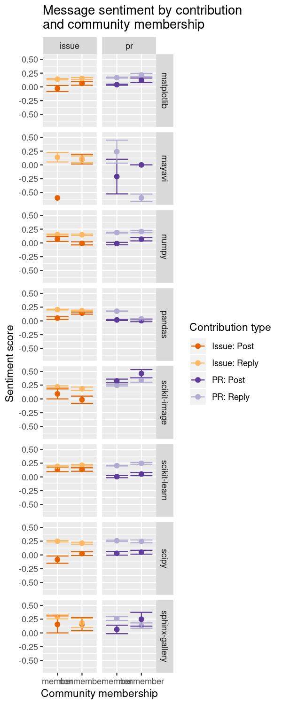

This R markdown provides the data preparation for our forthcoming manuscript
(Paxton, Varoquaux, Geiger, & Holdgraf, *in preparation*).

This file relies on the same dependencies than the analysis on the whole
dataset. In fact, it is the same analysis, just on 2019 data.

**Date last compiled** 2019-10-15 16:15:20


***

# Preliminaries


```r
# clear everything
rm(list=ls())

# load libraries and add new functions
source('./utils/ossc-libraries_and_functions.r')
source("./utils/data-loading.R")
```


```r
# We are now going to select the dataset we'll be working on.
library(dplyr)
tickets_frame = loading_tickets_data(dataset="2019")
comments_frame = loading_comments_data(dataset="2019")
```


## Basic summary stats

The data has been largely cleaned. Let's take a look at some basic
patterns.


|    project     | unique_tickets | unique_comments |
|:--------------:|:--------------:|:---------------:|
|   matplotlib   |      1351      |      4915       |
|     mayavi     |       43       |       96        |
|     numpy      |      1075      |      8062       |
|     pandas     |      2300      |      14935      |
|  scikit-image  |      283       |      2312       |
|  scikit-learn  |      1061      |      8496       |
|     scipy      |      596       |      3937       |
| sphinx-gallery |       71       |       430       |

Our dataset includes 8 unique projects with a
total of 6780 unique tickets, with a
mean of 847.5 tickets per project.

On these tickets, the dataset includes
43183 unique comments, with
5397.875 average comments per project.

In total, we have 3386 unique commenters,
2330 unique ticket-creators, and
4115 overall unique users.

***

# Data analysis

***

## Model Series 1: Sentiment analysis

### Data preparation

Before we can run Model Series 1, we need to combine `tickets_frame` and
`comments_frame` into a single dataframe. We do this using the
`combine_tickets_and_comments` function, `defined in utils/data-loading.R`


```r
sentiment_frame = combine_tickets_and_comments(tickets_frame, comments_frame)
```

```
## Warning in bind_rows_(x, .id): Unequal factor levels: coercing to character
```

```
## Warning in bind_rows_(x, .id): binding character and factor vector,
## coercing into character vector

## Warning in bind_rows_(x, .id): binding character and factor vector,
## coercing into character vector
```

```
## Warning in bind_rows_(x, .id): Unequal factor levels: coercing to character
```

```
## Warning in bind_rows_(x, .id): binding character and factor vector,
## coercing into character vector

## Warning in bind_rows_(x, .id): binding character and factor vector,
## coercing into character vector
```

```
## Warning in bind_rows_(x, .id): Unequal factor levels: coercing to character
```

```
## Warning in bind_rows_(x, .id): binding character and factor vector,
## coercing into character vector

## Warning in bind_rows_(x, .id): binding character and factor vector,
## coercing into character vector
```

```
## Warning in bind_rows_(x, .id): Unequal factor levels: coercing to character
```

```
## Warning in bind_rows_(x, .id): binding character and factor vector,
## coercing into character vector

## Warning in bind_rows_(x, .id): binding character and factor vector,
## coercing into character vector
```

### Model 1.1: Do different kinds of user contributions materially differ in emotion?

Now we begin the actual modeling. Our first general question is whether users'
patterns of sentiment differ materially by whether they are a member of the
community versus a nonmember of the community and by their different kinds of
possible contributions (i.e., a posted pull request, a reply to a pull request,
a posted issue, or a reply to an issue).

#### Model 1.1a: Overall effects with linear mixed-effects models

This model presents the analyses in a way that is typical of psychological
analyses. We predict the changes in emotion by community membership and 
contribution type, including random effects for project and for author. This
allows us to explore the general patterns of the main and interaction terms,
rather than focusing in on the project-specific variability.


```r
# do tickets and comments materially differ in emotion?
creators_v_commenters_emotion_by_project = lmer(compound_emotion ~ type * author_group  +
                                                  (1 | project) + (1 | author_name),
                                                data = sentiment_frame,
                                                REML = FALSE)
```


|                  &nbsp;                   |  Estimate  | Std..Error |  df   | t.value  |   p    | p_adj  | sig |
|:-----------------------------------------:|:----------:|:----------:|:-----:|:--------:|:------:|:------:|:---:|
|              **(Intercept)**              |  0.07142   |  0.01817   | 125.7 |  3.929   | 0.0001 | 0.0004 | *** |
|            **typeissue_reply**            |   0.1282   |  0.01469   | 48644 |  8.727   | 0.0001 | 0.0001 | *** |
|              **typepr_post**              | -0.0001829 |  0.01636   | 48724 | -0.01118 |  0.99  |  0.99  |     |
|             **typepr_reply**              |   0.1373   |  0.01459   | 48970 |  9.413   | 0.0001 | 0.0001 | *** |
|         **author_groupnonmember**         |  0.01147   |  0.01874   | 21293 |  0.6118  |  0.54  |  0.81  |     |
| **typeissue_reply:author_groupnonmember** |  -0.02268  |  0.01845   | 49474 |  -1.229  | 0.219  |  0.44  |     |
|   **typepr_post:author_groupnonmember**   | -0.009386  |  0.02379   | 45957 | -0.3945  |  0.69  |  0.81  |     |
|  **typepr_reply:author_groupnonmember**   | -0.007409  |  0.01982   | 38667 | -0.3738  |  0.71  |  0.81  |     |

While we see significant differences in the model, interpreting the results is
difficult because of the way that `lmer` handles factor comparisons. All 
factors are compared against a "reference level," the first level in the model.
This makes intepreting models with factors that include more than two levels
incredibly difficult, because the intercept is essentially an interaction term
among all reference levels of all factors.

As a result, we turn to the biostatistics approach of multiple *t*-tests 
(corrected for comparisons) of the model estimates to better understand the 
effects.

#### Model 1.1b: In-depth investigation through *t*-tests of model estimates

First, we build a series of linear mixed-effects models with one term included
in each model (either main term or interaction term). We then use the estimates
from those models to perform *t*-tests to investigate how different levels of
the effects differ from one another (and not just from the model-level 
intercept).

Projects here are random effects, but the rest of the model is the same as 
before. This allows us to do pairwise testing of main and interaction terms,
along with better exploring inter-project variability.

##### Model 1.1b.1: Does sentiment vary significantly by community membership?

First, look at whether there are differences in sentiment between author 
groups.


```r
# do members and nonmembers materially differ in emotion?
fixed_creators_v_commenters_emotion = lmer(
  compound_emotion ~ 0 + author_group + (1 | author_name) + (1 | project),
  data=sentiment_frame,
  REML=FALSE)
```

Run *t*-tests among levels and prepare for the Model 1.1b table later.


```r
# convert Model 1.1b1 output to dataframe
coefficients_and_se = data.frame(
  summary(fixed_creators_v_commenters_emotion)$coefficients)

# get comparison names as rownames
row_names = gsub("author_group", "", 
                 gsub("type", "", row.names(coefficients_and_se)))

# convert model estimates to a dataframe
means = coefficients_and_se$Estimate
names(means) = row_names

# convert standard error to dataframe
se = coefficients_and_se$Std..Error
names(se) = row_names

# compute t-statistics and p-values for desired contrasts
contrasts = c("member-nonmember")
author_groups_tests = compute_t_statistics(
  means, se,
  contrasts)
author_groups_tests[, "p_value"] = compute_p_value_from_t_stats(
  author_groups_tests$t_stats)
```

##### Model 1.1b.2: Does sentiment vary significantly across contribution types?

Now, look at whether there are differences in sentiment between contribution
types.


```r
# do tickets and comments materially differ in emotion?
fixed_types_emotion = lmer(
  compound_emotion ~ 0 + type + (1 | author_name) + (1 | project),
  data=sentiment_frame,
  REML=FALSE)
```

Run *t*-tests among levels and prepare for the Model 1.1b table later.


```r
# convert Model 1.1b2 output to dataframe
coefficients_and_se = data.frame(
  summary(fixed_types_emotion)$coefficients)

# get comparison names as rownames
row_names = gsub("author_group", "", 
                 gsub("type", "", row.names(coefficients_and_se)))

# convert model estimates to a dataframe
means = coefficients_and_se$Estimate
names(means) = row_names

# convert standard error to dataframe
se = coefficients_and_se$Std..Error
names(se) = row_names

# compute t-statistics and p-values for desired contrasts
contrasts = c("issue_post-issue_reply", # issues: posts vs. replies
              "pr_post-pr_reply",       # PRs: posts vs. replies
              "issue_post-pr_post",     # posts: issues vs. PRs
              "issue_reply-pr_reply")   # replies: issues vs. PRs
types_tests = compute_t_statistics(
  means, se,
  contrasts)
types_tests[, "p_value"] = compute_p_value_from_t_stats(types_tests$t_stats)
```

##### Model 1.1b.3: Does sentiment vary significantly across community memberships and contribution types?

Finally, let's look at the interaction between membership and contribution.


```r
# does emotion differ by the interaction between contribution and authorship group?
community_contribution_emotion = lmer(
  compound_emotion ~ 0 + type:author_group + (1 | author_name) + (1 | project),
  data=sentiment_frame,
  REML=FALSE)
```

Run *t*-tests among levels and prepare for the Model 1.1b table later.


```r
# convert Model 1.1b3 output to dataframe
coefficients_and_se = data.frame(
  summary(community_contribution_emotion)$coefficients)

# get comparison names as rownames
row_names = gsub("author_group", "", gsub("type", "", row.names(coefficients_and_se)))

# convert model estimates to a dataframe
means = coefficients_and_se$Estimate
names(means) = row_names

# convert standard error to dataframe
se = coefficients_and_se$Std..Error
names(se) = row_names

# compute t-statistics and p-values for desired contrasts
contrasts = c(
  "issue_post:member-issue_post:nonmember",     # contribution static (issue posts); membership varies (members v. nonmembers)
  "issue_reply:member-issue_reply:nonmember",   # contribution static (issue replies); membership varies (members v. nonmembers)
  "pr_post:member-pr_post:nonmember",           # contribution static (PR posts); membership varies (members v. nonmembers)
  "pr_reply:member-pr_reply:nonmember",         # contribution static (PR replies); membership varies (members v. nonmembers)
  "issue_post:member-issue_reply:member",       # contribution varies (issue posts vs. issue replies); membership static (members)
  "issue_post:nonmember-issue_reply:nonmember", # contribution varies (issue posts vs. issue replies); membership static (nonmembers)
  "pr_post:member-pr_reply:member",             # contribution varies (PR posts vs. PR replies); membership static (members)
  "pr_post:nonmember-pr_reply:nonmember",       # contribution varies (PR posts vs. PR replies); membership static (nonmembers)
  "issue_post:member-pr_post:member",           # contribution varies (issue posts vs. PR posts); membership static (members)
  "issue_post:nonmember-pr_post:nonmember",     # contribution varies (issue posts vs. PR posts); membership static (nonmembers)
  "issue_reply:member-pr_reply:member",         # contribution varies (issue replies vs. PR replies); membership static (members)
  "issue_reply:nonmember-pr_reply:nonmember")   # contribution varies (issue replies vs. PR replies); membership static (nonmembers)
types_author_groups_tests = compute_t_statistics(
  means, se,
  contrasts)
types_author_groups_tests[, "p_value"] = compute_p_value_from_t_stats(
  types_author_groups_tests$"t_stats")
```

##### Model 1.1b.4 : Do different kinds of user contributions differ in emotion by projects?

Now adding projects into the mix to understand how the previous analysis
varies across projects.


```r
# do tickets and comments materially differ in emotion by projects?
creators_v_commenters_emotion_by_project = lmer(
  compound_emotion ~ 0 + project:type:author_group + (1 | author_name),
  data = sentiment_frame,
  REML = FALSE)
```

Run *t*-tests among levels and prepare for the Model 1.1b table later.


```r
# convert Model 1.1c output to dataframe
coefficients_and_se = data.frame(
  summary(creators_v_commenters_emotion_by_project)$coefficients)

# get comparison names as rownames
row_names = gsub(
  "project", "", gsub(
    "author_group", "", gsub(
      "type", "", row.names(coefficients_and_se))))

# replace hyphens in project names with periods
row_names = gsub(
  "scikit-", "scikit.", gsub(
    "sphinx-", "sphinx.", row_names))

# convert model estimates to a dataframe
means = coefficients_and_se$Estimate
names(means) = row_names

# convert standard error to dataframe
se = coefficients_and_se$Std..Error
names(se) = row_names

# compute t-statistics and p-values for desired contrasts
# (note: ordering of contrasts within each project is identical to Model 1.1b.3)
contrasts = c(
  
  # scikit-learn
  "scikit.learn:issue_post:member-scikit.learn:issue_post:nonmember",   
  "scikit.learn:issue_reply:member-scikit.learn:issue_reply:nonmember",
  "scikit.learn:pr_post:member-scikit.learn:pr_post:nonmember",
  "scikit.learn:pr_reply:member-scikit.learn:pr_reply:nonmember",
  "scikit.learn:issue_post:member-scikit.learn:issue_reply:member",
  "scikit.learn:issue_post:nonmember-scikit.learn:issue_reply:nonmember",
  "scikit.learn:pr_post:member-scikit.learn:pr_reply:member",
  "scikit.learn:pr_post:nonmember-scikit.learn:pr_reply:nonmember",
  "scikit.learn:issue_post:member-scikit.learn:pr_post:member",
  "scikit.learn:issue_post:nonmember-scikit.learn:pr_post:nonmember",    
  "scikit.learn:issue_reply:member-scikit.learn:pr_reply:member",  
  "scikit.learn:issue_reply:nonmember-scikit.learn:pr_reply:nonmember",
  
  # scikit-image
  "scikit.image:issue_post:member-scikit.image:issue_post:nonmember", 
  "scikit.image:issue_reply:member-scikit.image:issue_reply:nonmember",
  "scikit.image:pr_post:member-scikit.image:pr_post:nonmember",       
  "scikit.image:pr_reply:member-scikit.image:pr_reply:nonmember",     
  "scikit.image:issue_post:member-scikit.image:issue_reply:member",
  "scikit.image:issue_post:nonmember-scikit.image:issue_reply:nonmember",
  "scikit.image:pr_post:member-scikit.image:pr_reply:member",     
  "scikit.image:pr_post:nonmember-scikit.image:pr_reply:nonmember",    
  "scikit.image:issue_post:member-scikit.image:pr_post:member",   
  "scikit.image:issue_post:nonmember-scikit.image:pr_post:nonmember",    
  "scikit.image:issue_reply:member-scikit.image:pr_reply:member",  
  "scikit.image:issue_reply:nonmember-scikit.image:pr_reply:nonmember",
  
  # matplotlib
  "matplotlib:issue_post:member-matplotlib:issue_post:nonmember", 
  "matplotlib:issue_reply:member-matplotlib:issue_reply:nonmember",
  "matplotlib:pr_post:member-matplotlib:pr_post:nonmember",       
  "matplotlib:pr_reply:member-matplotlib:pr_reply:nonmember",     
  "matplotlib:issue_post:member-matplotlib:issue_reply:member",
  "matplotlib:issue_post:nonmember-matplotlib:issue_reply:nonmember",
  "matplotlib:pr_post:member-matplotlib:pr_reply:member",     
  "matplotlib:pr_post:nonmember-matplotlib:pr_reply:nonmember",    
  "matplotlib:issue_post:member-matplotlib:pr_post:member",   
  "matplotlib:issue_post:nonmember-matplotlib:pr_post:nonmember",    
  "matplotlib:issue_reply:member-matplotlib:pr_reply:member",  
  "matplotlib:issue_reply:nonmember-matplotlib:pr_reply:nonmember",
  
  # mayavi
  "mayavi:issue_post:member-mayavi:issue_post:nonmember", 
  "mayavi:issue_reply:member-mayavi:issue_reply:nonmember",
  "mayavi:pr_post:member-mayavi:pr_post:nonmember",       
  "mayavi:pr_reply:member-mayavi:pr_reply:nonmember",     
  "mayavi:issue_post:member-mayavi:issue_reply:member",
  "mayavi:issue_post:nonmember-mayavi:issue_reply:nonmember",
  "mayavi:pr_post:member-mayavi:pr_reply:member",     
  "mayavi:pr_post:nonmember-mayavi:pr_reply:nonmember",    
  "mayavi:issue_post:member-mayavi:pr_post:member",   
  "mayavi:issue_post:nonmember-mayavi:pr_post:nonmember",    
  "mayavi:issue_reply:member-mayavi:pr_reply:member",  
  "mayavi:issue_reply:nonmember-mayavi:pr_reply:nonmember",
  
  # pandas
  "pandas:issue_post:member-pandas:issue_post:nonmember", 
  "pandas:issue_reply:member-pandas:issue_reply:nonmember",
  "pandas:pr_post:member-pandas:pr_post:nonmember",       
  "pandas:pr_reply:member-pandas:pr_reply:nonmember",     
  "pandas:issue_post:member-pandas:issue_reply:member",
  "pandas:issue_post:nonmember-pandas:issue_reply:nonmember",
  "pandas:pr_post:member-pandas:pr_reply:member",     
  "pandas:pr_post:nonmember-pandas:pr_reply:nonmember",    
  "pandas:issue_post:member-pandas:pr_post:member",   
  "pandas:issue_post:nonmember-pandas:pr_post:nonmember",    
  "pandas:issue_reply:member-pandas:pr_reply:member",  
  "pandas:issue_reply:nonmember-pandas:pr_reply:nonmember",
  
  # scipy
  "scipy:issue_post:member-scipy:issue_post:nonmember", 
  "scipy:issue_reply:member-scipy:issue_reply:nonmember",
  "scipy:pr_post:member-scipy:pr_post:nonmember",       
  "scipy:pr_reply:member-scipy:pr_reply:nonmember",     
  "scipy:issue_post:member-scipy:issue_reply:member",
  "scipy:issue_post:nonmember-scipy:issue_reply:nonmember",
  "scipy:pr_post:member-scipy:pr_reply:member",     
  "scipy:pr_post:nonmember-scipy:pr_reply:nonmember",    
  "scipy:issue_post:member-scipy:pr_post:member",   
  "scipy:issue_post:nonmember-scipy:pr_post:nonmember",    
  "scipy:issue_reply:member-scipy:pr_reply:member",  
  "scipy:issue_reply:nonmember-scipy:pr_reply:nonmember",
  
  # numpy
  "numpy:issue_post:member-numpy:issue_post:nonmember", 
  "numpy:issue_reply:member-numpy:issue_reply:nonmember",
  "numpy:pr_post:member-numpy:pr_post:nonmember",       
  "numpy:pr_reply:member-numpy:pr_reply:nonmember",     
  "numpy:issue_post:member-numpy:issue_reply:member",
  "numpy:issue_post:nonmember-numpy:issue_reply:nonmember",
  "numpy:pr_post:member-numpy:pr_reply:member",     
  "numpy:pr_post:nonmember-numpy:pr_reply:nonmember",    
  "numpy:issue_post:member-numpy:pr_post:member",   
  "numpy:issue_post:nonmember-numpy:pr_post:nonmember",    
  "numpy:issue_reply:member-numpy:pr_reply:member",  
  "numpy:issue_reply:nonmember-numpy:pr_reply:nonmember",
  
  # sphinx-gallery
  "sphinx.gallery:issue_post:member-sphinx.gallery:issue_post:nonmember", 
  "sphinx.gallery:issue_reply:member-sphinx.gallery:issue_reply:nonmember",
  "sphinx.gallery:pr_post:member-sphinx.gallery:pr_post:nonmember",       
  "sphinx.gallery:pr_reply:member-sphinx.gallery:pr_reply:nonmember",     
  "sphinx.gallery:issue_post:member-sphinx.gallery:issue_reply:member",
  "sphinx.gallery:issue_post:nonmember-sphinx.gallery:issue_reply:nonmember",
  "sphinx.gallery:pr_post:member-sphinx.gallery:pr_reply:member",     
  "sphinx.gallery:pr_post:nonmember-sphinx.gallery:pr_reply:nonmember",    
  "sphinx.gallery:issue_post:member-sphinx.gallery:pr_post:member",   
  "sphinx.gallery:issue_post:nonmember-sphinx.gallery:pr_post:nonmember",    
  "sphinx.gallery:issue_reply:member-sphinx.gallery:pr_reply:member",  
  "sphinx.gallery:issue_reply:nonmember-sphinx.gallery:pr_reply:nonmember"
)
project_types_author_group_tests = compute_t_statistics(
  means, se,
  contrasts)
project_types_author_group_tests[, "p_value"] = compute_p_value_from_t_stats(
  project_types_author_group_tests$t_stats) 
```

#### Model 1.1b: Overall results

Now we bring together all analyses from Model 1.1b.


```r
# specify main terms
author_groups_tests["contrast"] = row.names(author_groups_tests)
types_tests["contrast"] = row.names(types_tests)
all_tests = merge(author_groups_tests, types_tests, all=TRUE, sort=FALSE)
all_tests["model"] = "Main Terms"

# specify 2-way interactions
types_author_groups_tests["contrast"] = row.names(types_author_groups_tests)
types_author_groups_tests["model"] = "2W: Types x Author Groups"
all_tests = merge(all_tests, types_author_groups_tests, all=TRUE, sort=FALSE)

# specify 3-way interactions
project_types_author_group_tests["contrast"] = row.names(project_types_author_group_tests)
project_types_author_group_tests["model"] = "3W: Types x Author Groups x Project"
all_tests = merge(all_tests, project_types_author_group_tests, all=TRUE,
                  sort=FALSE)
```

Let's correct all tests at once for multiple comparisons.


```r
# specify all contrasts
row.names(all_tests) = all_tests$contrast
all_tests = subset(all_tests, select=-c(contrast))

# print the table (reordering columns for readibility)
all_tests = all_tests[c("model", "t_stats", "p_value")]
pander_clean_anova(all_tests, rename_columns=FALSE)
```


|                                    &nbsp;                                    |                model                | t_stats  | p_value | p_adj  | sig |
|:----------------------------------------------------------------------------:|:-----------------------------------:|:--------:|:-------:|:------:|:---:|
|                             **member-nonmember**                             |             Main Terms              |  1.227   |  0.22   |  0.38  |     |
|                          **issue_post-issue_reply**                          |             Main Terms              |  -7.55   | 0.0001  | 0.0001 | *** |
|                             **pr_post-pr_reply**                             |             Main Terms              |  -8.862  | 0.0001  | 0.0001 | *** |
|                            **issue_post-pr_post**                            |             Main Terms              |  0.5593  |  0.58   |  0.72  |     |
|                           **issue_reply-pr_reply**                           |             Main Terms              | -0.8694  |  0.38   |  0.59  |     |
|                  **issue_post:member-issue_post:nonmember**                  |      2W: Types x Author Groups      | -0.5153  |  0.61   |  0.74  |     |
|                 **issue_reply:member-issue_reply:nonmember**                 |      2W: Types x Author Groups      |  0.6941  |  0.49   |  0.63  |     |
|                     **pr_post:member-pr_post:nonmember**                     |      2W: Types x Author Groups      | -0.09445 |  0.92   |  0.99  |     |
|                    **pr_reply:member-pr_reply:nonmember**                    |      2W: Types x Author Groups      | -0.2304  |  0.82   |  0.94  |     |
|                   **issue_post:member-issue_reply:member**                   |      2W: Types x Author Groups      |  -5.82   | 0.0001  | 0.0001 | *** |
|                **issue_post:nonmember-issue_reply:nonmember**                |      2W: Types x Author Groups      |  -6.413  | 0.0001  | 0.0001 | *** |
|                      **pr_post:member-pr_reply:member**                      |      2W: Types x Author Groups      |  -7.252  | 0.0001  | 0.0001 | *** |
|                   **pr_post:nonmember-pr_reply:nonmember**                   |      2W: Types x Author Groups      |  -6.688  | 0.0001  | 0.0001 | *** |
|                     **issue_post:member-pr_post:member**                     |      2W: Types x Author Groups      | 0.007887 |  0.99   |  0.99  |     |
|                  **issue_post:nonmember-pr_post:nonmember**                  |      2W: Types x Author Groups      |  0.455   |  0.65   |  0.79  |     |
|                    **issue_reply:member-pr_reply:member**                    |      2W: Types x Author Groups      | -0.5212  |   0.6   |  0.74  |     |
|                 **issue_reply:nonmember-pr_reply:nonmember**                 |      2W: Types x Author Groups      |  -1.503  |  0.133  |  0.27  |     |
|     **scikit.learn:issue_post:member-scikit.learn:issue_post:nonmember**     | 3W: Types x Author Groups x Project | -0.1858  |  0.85   |  0.94  |     |
|    **scikit.learn:issue_reply:member-scikit.learn:issue_reply:nonmember**    | 3W: Types x Author Groups x Project |  -1.563  |  0.118  |  0.25  |     |
|        **scikit.learn:pr_post:member-scikit.learn:pr_post:nonmember**        | 3W: Types x Author Groups x Project |  -1.251  |  0.211  |  0.37  |     |
|       **scikit.learn:pr_reply:member-scikit.learn:pr_reply:nonmember**       | 3W: Types x Author Groups x Project |  -1.324  |  0.185  |  0.36  |     |
|      **scikit.learn:issue_post:member-scikit.learn:issue_reply:member**      | 3W: Types x Author Groups x Project |  -1.527  |  0.127  |  0.26  |     |
|   **scikit.learn:issue_post:nonmember-scikit.learn:issue_reply:nonmember**   | 3W: Types x Author Groups x Project |  -3.143  |  0.002  | 0.007  | **  |
|         **scikit.learn:pr_post:member-scikit.learn:pr_reply:member**         | 3W: Types x Author Groups x Project |  -6.12   | 0.0001  | 0.0001 | *** |
|      **scikit.learn:pr_post:nonmember-scikit.learn:pr_reply:nonmember**      | 3W: Types x Author Groups x Project |  -5.054  | 0.0001  | 0.0001 | *** |
|        **scikit.learn:issue_post:member-scikit.learn:pr_post:member**        | 3W: Types x Author Groups x Project |  2.391   |  0.017  | 0.059  |  .  |
|     **scikit.learn:issue_post:nonmember-scikit.learn:pr_post:nonmember**     | 3W: Types x Author Groups x Project |  1.702   |  0.089  | 0.214  |     |
|       **scikit.learn:issue_reply:member-scikit.learn:pr_reply:member**       | 3W: Types x Author Groups x Project | -0.9378  |  0.35   |  0.55  |     |
|    **scikit.learn:issue_reply:nonmember-scikit.learn:pr_reply:nonmember**    | 3W: Types x Author Groups x Project | -0.8453  |   0.4   |  0.59  |     |
|     **scikit.image:issue_post:member-scikit.image:issue_post:nonmember**     | 3W: Types x Author Groups x Project |  0.7333  |  0.46   |  0.62  |     |
|    **scikit.image:issue_reply:member-scikit.image:issue_reply:nonmember**    | 3W: Types x Author Groups x Project | -0.01809 |  0.99   |  0.99  |     |
|        **scikit.image:pr_post:member-scikit.image:pr_post:nonmember**        | 3W: Types x Author Groups x Project |  -1.398  |  0.162  |  0.33  |     |
|       **scikit.image:pr_reply:member-scikit.image:pr_reply:nonmember**       | 3W: Types x Author Groups x Project |  -1.071  |  0.28   |  0.47  |     |
|      **scikit.image:issue_post:member-scikit.image:issue_reply:member**      | 3W: Types x Author Groups x Project |  -1.607  |  0.108  | 0.235  |     |
|   **scikit.image:issue_post:nonmember-scikit.image:issue_reply:nonmember**   | 3W: Types x Author Groups x Project |  -3.265  |  0.001  | 0.006  | **  |
|         **scikit.image:pr_post:member-scikit.image:pr_reply:member**         | 3W: Types x Author Groups x Project |   2.63   |  0.008  | 0.033  |  *  |
|      **scikit.image:pr_post:nonmember-scikit.image:pr_reply:nonmember**      | 3W: Types x Author Groups x Project |  2.414   |  0.016  | 0.058  |  .  |
|        **scikit.image:issue_post:member-scikit.image:pr_post:member**        | 3W: Types x Author Groups x Project |  -3.156  |  0.002  | 0.007  | **  |
|     **scikit.image:issue_post:nonmember-scikit.image:pr_post:nonmember**     | 3W: Types x Author Groups x Project |  -5.02   | 0.0001  | 0.0001 | *** |
|       **scikit.image:issue_reply:member-scikit.image:pr_reply:member**       | 3W: Types x Author Groups x Project | -0.3667  |  0.71   |  0.85  |     |
|    **scikit.image:issue_reply:nonmember-scikit.image:pr_reply:nonmember**    | 3W: Types x Author Groups x Project |  -1.328  |  0.184  |  0.36  |     |
|       **matplotlib:issue_post:member-matplotlib:issue_post:nonmember**       | 3W: Types x Author Groups x Project |  -1.101  |  0.27   |  0.46  |     |
|      **matplotlib:issue_reply:member-matplotlib:issue_reply:nonmember**      | 3W: Types x Author Groups x Project |  0.8499  |   0.4   |  0.59  |     |
|          **matplotlib:pr_post:member-matplotlib:pr_post:nonmember**          | 3W: Types x Author Groups x Project |  -0.221  |  0.82   |  0.94  |     |
|         **matplotlib:pr_reply:member-matplotlib:pr_reply:nonmember**         | 3W: Types x Author Groups x Project | -0.7061  |  0.48   |  0.63  |     |
|        **matplotlib:issue_post:member-matplotlib:issue_reply:member**        | 3W: Types x Author Groups x Project |  -3.531  | 0.0004  | 0.002  | **  |
|     **matplotlib:issue_post:nonmember-matplotlib:issue_reply:nonmember**     | 3W: Types x Author Groups x Project |  -3.195  |  0.001  | 0.007  | **  |
|           **matplotlib:pr_post:member-matplotlib:pr_reply:member**           | 3W: Types x Author Groups x Project |  -3.201  |  0.001  | 0.007  | **  |
|        **matplotlib:pr_post:nonmember-matplotlib:pr_reply:nonmember**        | 3W: Types x Author Groups x Project |  -1.858  |  0.063  | 0.159  |     |
|          **matplotlib:issue_post:member-matplotlib:pr_post:member**          | 3W: Types x Author Groups x Project |  -2.045  |  0.041  | 0.113  |     |
|       **matplotlib:issue_post:nonmember-matplotlib:pr_post:nonmember**       | 3W: Types x Author Groups x Project |  -1.05   |  0.29   |  0.47  |     |
|         **matplotlib:issue_reply:member-matplotlib:pr_reply:member**         | 3W: Types x Author Groups x Project | -0.7667  |  0.44   |  0.61  |     |
|      **matplotlib:issue_reply:nonmember-matplotlib:pr_reply:nonmember**      | 3W: Types x Author Groups x Project |  -1.975  |  0.048  | 0.127  |     |
|           **mayavi:issue_post:member-mayavi:issue_post:nonmember**           | 3W: Types x Author Groups x Project |  -1.636  |  0.102  | 0.235  |     |
|          **mayavi:issue_reply:member-mayavi:issue_reply:nonmember**          | 3W: Types x Author Groups x Project |  0.1877  |  0.85   |  0.94  |     |
|              **mayavi:pr_post:member-mayavi:pr_post:nonmember**              | 3W: Types x Author Groups x Project | -0.8458  |   0.4   |  0.59  |     |
|             **mayavi:pr_reply:member-mayavi:pr_reply:nonmember**             | 3W: Types x Author Groups x Project |  2.381   |  0.017  | 0.059  |  .  |
|            **mayavi:issue_post:member-mayavi:issue_reply:member**            | 3W: Types x Author Groups x Project |  -1.632  |  0.103  | 0.235  |     |
|         **mayavi:issue_post:nonmember-mayavi:issue_reply:nonmember**         | 3W: Types x Author Groups x Project |  0.1071  |  0.92   |  0.98  |     |
|               **mayavi:pr_post:member-mayavi:pr_reply:member**               | 3W: Types x Author Groups x Project |  -1.388  |  0.165  |  0.33  |     |
|            **mayavi:pr_post:nonmember-mayavi:pr_reply:nonmember**            | 3W: Types x Author Groups x Project |  1.764   |  0.078  | 0.191  |     |
|              **mayavi:issue_post:member-mayavi:pr_post:member**              | 3W: Types x Author Groups x Project | -0.7931  |  0.43   |  0.61  |     |
|           **mayavi:issue_post:nonmember-mayavi:pr_post:nonmember**           | 3W: Types x Author Groups x Project | 0.05039  |  0.96   |  0.99  |     |
|             **mayavi:issue_reply:member-mayavi:pr_reply:member**             | 3W: Types x Author Groups x Project |  -0.752  |  0.45   |  0.62  |     |
|          **mayavi:issue_reply:nonmember-mayavi:pr_reply:nonmember**          | 3W: Types x Author Groups x Project |  2.172   |  0.03   | 0.091  |  .  |
|           **pandas:issue_post:member-pandas:issue_post:nonmember**           | 3W: Types x Author Groups x Project |  -3.143  |  0.002  | 0.007  | **  |
|          **pandas:issue_reply:member-pandas:issue_reply:nonmember**          | 3W: Types x Author Groups x Project | -0.02349 |  0.98   |  0.99  |     |
|              **pandas:pr_post:member-pandas:pr_post:nonmember**              | 3W: Types x Author Groups x Project | 0.05235  |  0.96   |  0.99  |     |
|             **pandas:pr_reply:member-pandas:pr_reply:nonmember**             | 3W: Types x Author Groups x Project |  -1.292  |  0.196  |  0.37  |     |
|            **pandas:issue_post:member-pandas:issue_reply:member**            | 3W: Types x Author Groups x Project |  -4.867  | 0.0001  | 0.0001 | *** |
|         **pandas:issue_post:nonmember-pandas:issue_reply:nonmember**         | 3W: Types x Author Groups x Project |  -2.242  |  0.025  | 0.078  |  .  |
|               **pandas:pr_post:member-pandas:pr_reply:member**               | 3W: Types x Author Groups x Project |  -5.373  | 0.0001  | 0.0001 | *** |
|            **pandas:pr_post:nonmember-pandas:pr_reply:nonmember**            | 3W: Types x Author Groups x Project |  -5.377  | 0.0001  | 0.0001 | *** |
|              **pandas:issue_post:member-pandas:pr_post:member**              | 3W: Types x Author Groups x Project |  0.8201  |  0.41   |  0.6   |     |
|           **pandas:issue_post:nonmember-pandas:pr_post:nonmember**           | 3W: Types x Author Groups x Project |  4.026   | 0.0001  | 0.0004 | *** |
|             **pandas:issue_reply:member-pandas:pr_reply:member**             | 3W: Types x Author Groups x Project |  1.607   |  0.108  | 0.235  |     |
|          **pandas:issue_reply:nonmember-pandas:pr_reply:nonmember**          | 3W: Types x Author Groups x Project |  0.2376  |  0.81   |  0.94  |     |
|            **scipy:issue_post:member-scipy:issue_post:nonmember**            | 3W: Types x Author Groups x Project | -0.9577  |  0.34   |  0.54  |     |
|           **scipy:issue_reply:member-scipy:issue_reply:nonmember**           | 3W: Types x Author Groups x Project |  2.073   |  0.038  | 0.108  |     |
|               **scipy:pr_post:member-scipy:pr_post:nonmember**               | 3W: Types x Author Groups x Project | -0.1308  |   0.9   |  0.98  |     |
|              **scipy:pr_reply:member-scipy:pr_reply:nonmember**              | 3W: Types x Author Groups x Project |  1.101   |  0.27   |  0.46  |     |
|             **scipy:issue_post:member-scipy:issue_reply:member**             | 3W: Types x Author Groups x Project |  -5.292  | 0.0001  | 0.0001 | *** |
|          **scipy:issue_post:nonmember-scipy:issue_reply:nonmember**          | 3W: Types x Author Groups x Project |  -5.937  | 0.0001  | 0.0001 | *** |
|                **scipy:pr_post:member-scipy:pr_reply:member**                | 3W: Types x Author Groups x Project |  -5.801  | 0.0001  | 0.0001 | *** |
|             **scipy:pr_post:nonmember-scipy:pr_reply:nonmember**             | 3W: Types x Author Groups x Project |  -3.594  | 0.0003  | 0.002  | **  |
|               **scipy:issue_post:member-scipy:pr_post:member**               | 3W: Types x Author Groups x Project |  -1.623  |  0.105  | 0.235  |     |
|            **scipy:issue_post:nonmember-scipy:pr_post:nonmember**            | 3W: Types x Author Groups x Project |  -1.07   |  0.28   |  0.47  |     |
|              **scipy:issue_reply:member-scipy:pr_reply:member**              | 3W: Types x Author Groups x Project |  -0.251  |   0.8   |  0.94  |     |
|           **scipy:issue_reply:nonmember-scipy:pr_reply:nonmember**           | 3W: Types x Author Groups x Project | -0.7654  |  0.44   |  0.61  |     |
|            **numpy:issue_post:member-numpy:issue_post:nonmember**            | 3W: Types x Author Groups x Project |   2.49   |  0.013  | 0.048  |  *  |
|           **numpy:issue_reply:member-numpy:issue_reply:nonmember**           | 3W: Types x Author Groups x Project |  1.262   |  0.207  |  0.37  |     |
|               **numpy:pr_post:member-numpy:pr_post:nonmember**               | 3W: Types x Author Groups x Project | -0.6195  |  0.54   |  0.69  |     |
|              **numpy:pr_reply:member-numpy:pr_reply:nonmember**              | 3W: Types x Author Groups x Project |  0.7096  |  0.48   |  0.63  |     |
|             **numpy:issue_post:member-numpy:issue_reply:member**             | 3W: Types x Author Groups x Project |  -2.008  |  0.045  |  0.12  |     |
|          **numpy:issue_post:nonmember-numpy:issue_reply:nonmember**          | 3W: Types x Author Groups x Project |  -6.343  | 0.0001  | 0.0001 | *** |
|                **numpy:pr_post:member-numpy:pr_reply:member**                | 3W: Types x Author Groups x Project |  -6.576  | 0.0001  | 0.0001 | *** |
|             **numpy:pr_post:nonmember-numpy:pr_reply:nonmember**             | 3W: Types x Author Groups x Project |  -3.339  |  0.001  | 0.004  | **  |
|               **numpy:issue_post:member-numpy:pr_post:member**               | 3W: Types x Author Groups x Project |  1.267   |  0.205  |  0.37  |     |
|            **numpy:issue_post:nonmember-numpy:pr_post:nonmember**            | 3W: Types x Author Groups x Project |  -1.869  |  0.062  | 0.158  |     |
|              **numpy:issue_reply:member-numpy:pr_reply:member**              | 3W: Types x Author Groups x Project |  -2.33   |  0.02   | 0.066  |  .  |
|           **numpy:issue_reply:nonmember-numpy:pr_reply:nonmember**           | 3W: Types x Author Groups x Project |  -2.129  |  0.033  | 0.099  |  .  |
|   **sphinx.gallery:issue_post:member-sphinx.gallery:issue_post:nonmember**   | 3W: Types x Author Groups x Project | 0.03618  |  0.97   |  0.99  |     |
|  **sphinx.gallery:issue_reply:member-sphinx.gallery:issue_reply:nonmember**  | 3W: Types x Author Groups x Project |  2.243   |  0.025  | 0.078  |  .  |
|      **sphinx.gallery:pr_post:member-sphinx.gallery:pr_post:nonmember**      | 3W: Types x Author Groups x Project |  -0.786  |  0.43   |  0.61  |     |
|     **sphinx.gallery:pr_reply:member-sphinx.gallery:pr_reply:nonmember**     | 3W: Types x Author Groups x Project |  2.889   |  0.004  | 0.016  |  *  |
|    **sphinx.gallery:issue_post:member-sphinx.gallery:issue_reply:member**    | 3W: Types x Author Groups x Project |  -1.27   |  0.204  |  0.37  |     |
| **sphinx.gallery:issue_post:nonmember-sphinx.gallery:issue_reply:nonmember** | 3W: Types x Author Groups x Project | 0.07868  |  0.94   |  0.99  |     |
|       **sphinx.gallery:pr_post:member-sphinx.gallery:pr_reply:member**       | 3W: Types x Author Groups x Project |  -2.113  |  0.035  |  0.1   |     |
|    **sphinx.gallery:pr_post:nonmember-sphinx.gallery:pr_reply:nonmember**    | 3W: Types x Author Groups x Project |  0.8432  |   0.4   |  0.59  |     |
|      **sphinx.gallery:issue_post:member-sphinx.gallery:pr_post:member**      | 3W: Types x Author Groups x Project |  0.1998  |  0.84   |  0.94  |     |
|   **sphinx.gallery:issue_post:nonmember-sphinx.gallery:pr_post:nonmember**   | 3W: Types x Author Groups x Project | -0.5605  |  0.57   |  0.72  |     |
|     **sphinx.gallery:issue_reply:member-sphinx.gallery:pr_reply:member**     | 3W: Types x Author Groups x Project |  0.3696  |  0.71   |  0.85  |     |
|  **sphinx.gallery:issue_reply:nonmember-sphinx.gallery:pr_reply:nonmember**  | 3W: Types x Author Groups x Project |  0.1285  |   0.9   |  0.98  |     |

Finally, let's plot these effects.


```
## Warning: Removed 1 rows containing missing values (geom_errorbar).

## Warning: Removed 1 rows containing missing values (geom_errorbar).
```



#### Model 1.2b: More plots, this time using means and std estimated from model-fit

Here, we are going to test whether projects differ from the mean.


```r
coefficients_and_se = data.frame(
  summary(creators_v_commenters_emotion_by_project)$coefficients)

# get comparison names as rownames
row_names = gsub(
  "project", "", gsub(
    "author_group", "", gsub(
      "type", "", row.names(coefficients_and_se))))

# replace hyphens in project names with periods
row_names = gsub(
  "scikit-", "scikit.", gsub(
    "sphinx-", "sphinx.", row_names))

# convert model estimates to a dataframe
means = coefficients_and_se$Estimate
names(means) = row_names

# convert standard error to dataframe
se = coefficients_and_se$Std..Error
names(se) = row_names
```


```r
projects = c("Matplotlib", "Mayavi", "numpy", "pandas",
	     "scikit-image", "scikit-learn", "scipy", "sphinx-gallery")
```


```r
group_of_interest = "pr_post:member"
rows_to_plot = grep(group_of_interest, names(means))

bar_centers = barplot(means[rows_to_plot], names.arg=projects,
		      main=group_of_interest,    
		      cex.names=0.8)
arrows(bar_centers,
       means[rows_to_plot] - se[rows_to_plot] ** 2, 
       bar_centers,
       means[rows_to_plot] + se[rows_to_plot] ** 2,
       angle=90,
       code=3)
```

<!-- -->


```r
group_of_interest = "pr_post:nonmember"
rows_to_plot = grep(group_of_interest, names(means))

bar_centers = barplot(means[rows_to_plot], names.arg=projects,
		      main=group_of_interest,
		      cex.names=0.8)

arrows(bar_centers,
       means[rows_to_plot] - se[rows_to_plot] ** 2, 
       bar_centers,
       means[rows_to_plot] + se[rows_to_plot] ** 2,
       angle=90,
       code=3)
```

<!-- -->


```r
group_of_interest = "issue_post:member"
rows_to_plot = grep(group_of_interest, names(means))

bar_centers = barplot(means[rows_to_plot], names.arg=projects,
		      main=group_of_interest,
		      cex.names=0.8
		      )
arrows(bar_centers,
       means[rows_to_plot] - se[rows_to_plot] ** 2, 
       bar_centers,
       means[rows_to_plot] + se[rows_to_plot] ** 2,
       angle=90,
       code=3)
```

<!-- -->


```r
group_of_interest = "issue_post:nonmember"
rows_to_plot = grep(group_of_interest, names(means))

bar_centers = barplot(means[rows_to_plot], names.arg=projects,
		      main=group_of_interest,
		      cex.names=0.8
		      )
arrows(bar_centers,
       means[rows_to_plot] - se[rows_to_plot] ** 2, 
       bar_centers,
       means[rows_to_plot] + se[rows_to_plot] ** 2,
       angle=90,
       code=3)
```

<!-- -->


```r
group_of_interest = "pr_reply:member"
rows_to_plot = grep(group_of_interest, names(means))

bar_centers = barplot(means[rows_to_plot], names.arg=projects,
		      main=group_of_interest,
		      cex.names=0.8)
arrows(bar_centers,
       means[rows_to_plot] - se[rows_to_plot] ** 2, 
       bar_centers,
       means[rows_to_plot] + se[rows_to_plot] ** 2,
       angle=90,
       code=3)
```

<!-- -->


```r
group_of_interest = "pr_reply:nonmember"
rows_to_plot = grep(group_of_interest, names(means))

bar_centers = barplot(means[rows_to_plot], names.arg=projects,
		      main=group_of_interest,
		      cex.names=0.8)
arrows(bar_centers,
       means[rows_to_plot] - se[rows_to_plot] ** 2, 
       bar_centers,
       means[rows_to_plot] + se[rows_to_plot] ** 2,
       angle=90,
       code=3)
```

<!-- -->


```r
group_of_interest = "issue_reply:member"
rows_to_plot = grep(group_of_interest, names(means))

bar_centers = barplot(means[rows_to_plot], names.arg=projects,
		      main=group_of_interest,
		      cex.names=0.8)
arrows(bar_centers,
       means[rows_to_plot] - se[rows_to_plot] ** 2, 
       bar_centers,
       means[rows_to_plot] + se[rows_to_plot] ** 2,
       angle=90,
       code=3)
```

<!-- -->


```r
group_of_interest = "issue_reply:nonmember"
rows_to_plot = grep(group_of_interest, names(means))

bar_centers = barplot(means[rows_to_plot], names.arg=projects,
		      main=group_of_interest,
		      cex.names=0.8)
arrows(bar_centers,
       means[rows_to_plot] - se[rows_to_plot] ** 2, 
       bar_centers,
       means[rows_to_plot] + se[rows_to_plot] ** 2,
       angle=90,
       code=3)
```

<!-- -->

### Model 1.1c Do projects differ in emotion between one another?

One versus all minus one type of approach.


```r
all_project_tests = NA
all_projects = unique(sentiment_frame$project)

# We're going to fit the model for each projects, and concatenate the results
# in a dataframe. Then, we'll apply multiple correction and display the
# results
for(project in all_projects){
    sentiment_frame$test_group = sentiment_frame$project == project
    one_versus_all_emotion = lmer(
	compound_emotion ~ 0 + type:author_group:test_group + (1|author_name),
	data=sentiment_frame,
	REML=FALSE)

    # Clean up mode
    coefficients_and_se = data.frame(
	summary(one_versus_all_emotion)$coefficients)
    row_names = gsub(
	"author_group", "", 
	    gsub("type", "",
		gsub("project", "", row.names(coefficients_and_se))))

    means = coefficients_and_se$Estimate
    names(means) = row_names
    se = coefficients_and_se$Std..Error
    names(se) = row_names

    contrasts = c(
	"issue_post:member:test_groupTRUE-issue_post:member:test_groupFALSE",
	"pr_post:member:test_groupTRUE-pr_post:member:test_groupFALSE",
	"issue_reply:member:test_groupTRUE-issue_reply:member:test_groupFALSE",
	"pr_reply:member:test_groupTRUE-pr_reply:member:test_groupFALSE",
	"issue_post:nonmember:test_groupTRUE-issue_post:nonmember:test_groupFALSE",
	"pr_post:nonmember:test_groupTRUE-pr_post:nonmember:test_groupFALSE",
	"issue_reply:nonmember:test_groupTRUE-issue_reply:nonmember:test_groupFALSE",
	"pr_reply:nonmember:test_groupTRUE-pr_reply:nonmember:test_groupFALSE"
	)

    one_versus_all_emotion_tests = compute_t_statistics(
	means, se,
	contrasts)
    one_versus_all_emotion_tests[, "p_value"] = compute_p_value_from_t_stats(
	one_versus_all_emotion_tests$t_stats)

    # Add unique identifier based on the project of interest in the table.
    row.names(one_versus_all_emotion_tests) = gsub(
	"test_group", project,
	row.names(one_versus_all_emotion_tests))

    if(is.null(dim(all_project_tests))){
	all_project_tests = one_versus_all_emotion_tests
    }else{
	all_project_tests = rbind(
	    all_project_tests, one_versus_all_emotion_tests)
    }
}
```

Now apply multiple correction and display the results of the analysis.


```r
pander_clean_anova(all_project_tests, rename_columns=FALSE)
```


|                                         &nbsp;                                         | t_stats  | p_value | p_adj  | sig |
|:--------------------------------------------------------------------------------------:|:--------:|:-------:|:------:|:---:|
|              **issue_post:member:numpyTRUE-issue_post:member:numpyFALSE**              | 0.02412  |  0.98   |  0.98  |     |
|                 **pr_post:member:numpyTRUE-pr_post:member:numpyFALSE**                 |  -2.738  |  0.006  |  0.03  |  *  |
|             **issue_reply:member:numpyTRUE-issue_reply:member:numpyFALSE**             |  -3.505  |    0    | 0.004  | **  |
|                **pr_reply:member:numpyTRUE-pr_reply:member:numpyFALSE**                | -0.5405  |  0.59   |  0.8   |     |
|           **issue_post:nonmember:numpyTRUE-issue_post:nonmember:numpyFALSE**           |  -4.63   | 0.0001  | 0.0001 | *** |
|              **pr_post:nonmember:numpyTRUE-pr_post:nonmember:numpyFALSE**              | -0.2932  |  0.77   |  0.92  |     |
|          **issue_reply:nonmember:numpyTRUE-issue_reply:nonmember:numpyFALSE**          |  -2.959  |  0.003  | 0.022  |  *  |
|             **pr_reply:nonmember:numpyTRUE-pr_reply:nonmember:numpyFALSE**             |  -0.34   |  0.73   |  0.92  |     |
|       **issue_post:member:scikit-learnTRUE-issue_post:member:scikit-learnFALSE**       |  1.752   |  0.08   | 0.222  |     |
|          **pr_post:member:scikit-learnTRUE-pr_post:member:scikit-learnFALSE**          |  -1.982  |  0.048  | 0.145  |     |
|      **issue_reply:member:scikit-learnTRUE-issue_reply:member:scikit-learnFALSE**      | -0.6333  |  0.53   |  0.75  |     |
|         **pr_reply:member:scikit-learnTRUE-pr_reply:member:scikit-learnFALSE**         |  0.214   |  0.83   |  0.92  |     |
|    **issue_post:nonmember:scikit-learnTRUE-issue_post:nonmember:scikit-learnFALSE**    |  2.411   |  0.016  | 0.064  |  .  |
|       **pr_post:nonmember:scikit-learnTRUE-pr_post:nonmember:scikit-learnFALSE**       |  -0.177  |  0.86   |  0.93  |     |
|   **issue_reply:nonmember:scikit-learnTRUE-issue_reply:nonmember:scikit-learnFALSE**   |  2.863   |  0.004  | 0.027  |  *  |
|      **pr_reply:nonmember:scikit-learnTRUE-pr_reply:nonmember:scikit-learnFALSE**      |  1.781   |  0.075  | 0.218  |     |
|              **issue_post:member:scipyTRUE-issue_post:member:scipyFALSE**              |  -2.112  |  0.035  | 0.117  |     |
|                 **pr_post:member:scipyTRUE-pr_post:member:scipyFALSE**                 | -0.4562  |  0.65   |  0.86  |     |
|             **issue_reply:member:scipyTRUE-issue_reply:member:scipyFALSE**             |  3.754   | 0.0002  | 0.002  | **  |
|                **pr_reply:member:scipyTRUE-pr_reply:member:scipyFALSE**                |  3.802   | 0.0001  | 0.002  | **  |
|           **issue_post:nonmember:scipyTRUE-issue_post:nonmember:scipyFALSE**           |  -2.201  |  0.028  | 0.099  |  .  |
|              **pr_post:nonmember:scipyTRUE-pr_post:nonmember:scipyFALSE**              | -0.03866 |  0.97   |  0.98  |     |
|          **issue_reply:nonmember:scipyTRUE-issue_reply:nonmember:scipyFALSE**          |  2.081   |  0.037  |  0.12  |     |
|             **pr_reply:nonmember:scipyTRUE-pr_reply:nonmember:scipyFALSE**             |  1.248   |  0.212  |  0.42  |     |
|             **issue_post:member:mayaviTRUE-issue_post:member:mayaviFALSE**             |  -1.589  |  0.112  |  0.27  |     |
|                **pr_post:member:mayaviTRUE-pr_post:member:mayaviFALSE**                |  -1.053  |  0.29   |  0.54  |     |
|            **issue_reply:member:mayaviTRUE-issue_reply:member:mayaviFALSE**            | -0.7339  |  0.46   |  0.73  |     |
|               **pr_reply:member:mayaviTRUE-pr_reply:member:mayaviFALSE**               |  0.2428  |  0.81   |  0.92  |     |
|          **issue_post:nonmember:mayaviTRUE-issue_post:nonmember:mayaviFALSE**          |  0.2595  |   0.8   |  0.92  |     |
|             **pr_post:nonmember:mayaviTRUE-pr_post:nonmember:mayaviFALSE**             |  0.1136  |  0.91   |  0.94  |     |
|         **issue_reply:nonmember:mayaviTRUE-issue_reply:nonmember:mayaviFALSE**         |  -1.629  |  0.103  |  0.26  |     |
|            **pr_reply:nonmember:mayaviTRUE-pr_reply:nonmember:mayaviFALSE**            |  -2.752  |  0.006  |  0.03  |  *  |
|     **issue_post:member:sphinx-galleryTRUE-issue_post:member:sphinx-galleryFALSE**     |  0.2849  |  0.78   |  0.92  |     |
|        **pr_post:member:sphinx-galleryTRUE-pr_post:member:sphinx-galleryFALSE**        | -0.2157  |  0.83   |  0.92  |     |
|    **issue_reply:member:sphinx-galleryTRUE-issue_reply:member:sphinx-galleryFALSE**    |  1.534   |  0.125  |  0.28  |     |
|       **pr_reply:member:sphinx-galleryTRUE-pr_reply:member:sphinx-galleryFALSE**       |  0.7222  |  0.47   |  0.73  |     |
|  **issue_post:nonmember:sphinx-galleryTRUE-issue_post:nonmember:sphinx-galleryFALSE**  |  0.3897  |   0.7   |  0.91  |     |
|     **pr_post:nonmember:sphinx-galleryTRUE-pr_post:nonmember:sphinx-galleryFALSE**     |  1.124   |  0.26   |  0.51  |     |
| **issue_reply:nonmember:sphinx-galleryTRUE-issue_reply:nonmember:sphinx-galleryFALSE** |  -1.068  |  0.29   |  0.54  |     |
|    **pr_reply:nonmember:sphinx-galleryTRUE-pr_reply:nonmember:sphinx-galleryFALSE**    |  -2.425  |  0.015  | 0.064  |  .  |
|         **issue_post:member:matplotlibTRUE-issue_post:member:matplotlibFALSE**         |  -1.624  |  0.104  |  0.26  |     |
|            **pr_post:member:matplotlibTRUE-pr_post:member:matplotlibFALSE**            |  1.528   |  0.126  |  0.28  |     |
|        **issue_reply:member:matplotlibTRUE-issue_reply:member:matplotlibFALSE**        |  -0.73   |  0.46   |  0.73  |     |
|           **pr_reply:member:matplotlibTRUE-pr_reply:member:matplotlibFALSE**           |  -0.138  |  0.89   |  0.93  |     |
|      **issue_post:nonmember:matplotlibTRUE-issue_post:nonmember:matplotlibFALSE**      |  -0.832  |   0.4   |  0.69  |     |
|         **pr_post:nonmember:matplotlibTRUE-pr_post:nonmember:matplotlibFALSE**         |  0.9394  |  0.35   |  0.62  |     |
|     **issue_reply:nonmember:matplotlibTRUE-issue_reply:nonmember:matplotlibFALSE**     |  -1.466  |  0.143  |  0.3   |     |
|        **pr_reply:nonmember:matplotlibTRUE-pr_reply:nonmember:matplotlibFALSE**        |  0.6635  |  0.51   |  0.74  |     |
|       **issue_post:member:scikit-imageTRUE-issue_post:member:scikit-imageFALSE**       | -0.3479  |  0.73   |  0.92  |     |
|          **pr_post:member:scikit-imageTRUE-pr_post:member:scikit-imageFALSE**          |   6.28   | 0.0001  | 0.0001 | *** |
|      **issue_reply:member:scikit-imageTRUE-issue_reply:member:scikit-imageFALSE**      | -0.8205  |  0.41   |  0.69  |     |
|         **pr_reply:member:scikit-imageTRUE-pr_reply:member:scikit-imageFALSE**         | -0.6852  |  0.49   |  0.74  |     |
|    **issue_post:nonmember:scikit-imageTRUE-issue_post:nonmember:scikit-imageFALSE**    |  -1.713  |  0.087  | 0.231  |     |
|       **pr_post:nonmember:scikit-imageTRUE-pr_post:nonmember:scikit-imageFALSE**       |  5.154   | 0.0001  | 0.0001 | *** |
|   **issue_reply:nonmember:scikit-imageTRUE-issue_reply:nonmember:scikit-imageFALSE**   |  0.1663  |  0.87   |  0.93  |     |
|      **pr_reply:nonmember:scikit-imageTRUE-pr_reply:nonmember:scikit-imageFALSE**      |  1.262   |  0.207  |  0.42  |     |
|             **issue_post:member:pandasTRUE-issue_post:member:pandasFALSE**             |  -0.673  |   0.5   |  0.74  |     |
|                **pr_post:member:pandasTRUE-pr_post:member:pandasFALSE**                |  -2.82   |  0.005  | 0.028  |  *  |
|            **issue_reply:member:pandasTRUE-issue_reply:member:pandasFALSE**            | -0.6068  |  0.54   |  0.76  |     |
|               **pr_reply:member:pandasTRUE-pr_reply:member:pandasFALSE**               |  -4.027  | 0.0001  | 0.001  | **  |
|          **issue_post:nonmember:pandasTRUE-issue_post:nonmember:pandasFALSE**          |  4.513   | 0.0001  | 0.0001 | *** |
|             **pr_post:nonmember:pandasTRUE-pr_post:nonmember:pandasFALSE**             |  -2.499  |  0.012  | 0.057  |  .  |
|         **issue_reply:nonmember:pandasTRUE-issue_reply:nonmember:pandasFALSE**         |  0.2947  |  0.77   |  0.92  |     |
|            **pr_reply:nonmember:pandasTRUE-pr_reply:nonmember:pandasFALSE**            |  -2.251  |  0.024  | 0.092  |  .  |

### Model 1.3: Do tickets and comments materially differ in gratitude?

First, let's take a look at a summary table of expressions of gratitude by
membership status and contribution type.


```r
# create a summary table of gratitude by type and author association
gratitude_summary_stats = sentiment_frame %>% ungroup() %>%
  group_by(author_group, type, grateful_count) %>%
  summarise(n = n())
pander(gratitude_summary_stats, style = 'rmarkdown')
```


| author_group |    type     | grateful_count |   n   |
|:------------:|:-----------:|:--------------:|:-----:|
|    member    | issue_post  |       0        |  845  |
|    member    | issue_post  |       1        |  10   |
|    member    | issue_reply |       0        | 11876 |
|    member    | issue_reply |       1        |  885  |
|    member    | issue_reply |       2        |  17   |
|    member    |   pr_post   |       0        | 3017  |
|    member    |   pr_post   |       1        |  23   |
|    member    |  pr_reply   |       0        | 16047 |
|    member    |  pr_reply   |       1        | 3000  |
|    member    |  pr_reply   |       2        |  63   |
|    member    |  pr_reply   |       3        |   4   |
|    member    |  pr_reply   |       4        |   1   |
|  nonmember   | issue_post  |       0        | 1797  |
|  nonmember   | issue_post  |       1        |  151  |
|  nonmember   | issue_post  |       2        |   7   |
|  nonmember   | issue_reply |       0        | 4845  |
|  nonmember   | issue_reply |       1        |  935  |
|  nonmember   | issue_reply |       2        |  79   |
|  nonmember   | issue_reply |       3        |   7   |
|  nonmember   |   pr_post   |       0        |  910  |
|  nonmember   |   pr_post   |       1        |  19   |
|  nonmember   |   pr_post   |       2        |   1   |
|  nonmember   |  pr_reply   |       0        | 4583  |
|  nonmember   |  pr_reply   |       1        |  798  |
|  nonmember   |  pr_reply   |       2        |  41   |
|  nonmember   |  pr_reply   |       3        |   2   |

Now that we have a better idea of how the underlying data look, let's go ahead
and build our model.


```r
# do users tend to express appreciation and gratitude differently by group and content?
creators_v_commenters_gratitude_by_project = lmer(log(grateful_count + 1) ~ project * author_group * type +
                                                    (1 | author_name),
                                                  data=sentiment_frame)

# print results
pander_lme(creators_v_commenters_gratitude_by_project)
```


|                             &nbsp;                              |  Estimate  | Std..Error |  df   |  t.value  |   p   | p_adj | sig |
|:---------------------------------------------------------------:|:----------:|:----------:|:-----:|:---------:|:-----:|:-----:|:---:|
|                         **(Intercept)**                         |  0.06912   |  0.02613   | 47269 |   2.645   | 0.008 | 0.174 |     |
|                        **projectmayavi**                        |  -0.1197   |   0.2341   | 32602 |  -0.5112  | 0.61  | 0.83  |     |
|                        **projectnumpy**                         |  -0.04542  |   0.0321   | 49899 |  -1.415   | 0.157 |  0.6  |     |
|                        **projectpandas**                        |  -0.0358   |  0.02885   | 48294 |  -1.241   | 0.215 |  0.6  |     |
|                     **projectscikit-image**                     |  -0.0446   |  0.04763   | 49577 |  -0.9364  | 0.35  | 0.71  |     |
|                     **projectscikit-learn**                     |  -0.06515  |  0.03195   | 49314 |  -2.039   | 0.042 | 0.38  |     |
|                        **projectscipy**                         |  -0.05459  |  0.03956   | 49890 |   -1.38   | 0.168 |  0.6  |     |
|                    **projectsphinx-gallery**                    |  -0.04795  |  0.07352   | 48332 |  -0.6522  | 0.51  | 0.81  |     |
|                    **author_groupnonmember**                    |  -0.03633  |  0.03006   | 43315 |  -1.209   | 0.227 |  0.6  |     |
|                       **typeissue_reply**                       |  0.03692   |  0.02505   | 48027 |   1.474   | 0.14  |  0.6  |     |
|                         **typepr_post**                         | -0.0002572 |  0.02576   | 48172 | -0.009985 | 0.99  |   1   |     |
|                        **typepr_reply**                         |  0.06092   |  0.02491   | 48220 |   2.445   | 0.014 | 0.186 |     |
|             **projectmayavi:author_groupnonmember**             |   0.243    |   0.2381   | 32174 |   1.021   | 0.31  | 0.68  |     |
|             **projectnumpy:author_groupnonmember**              |  0.05674   |  0.03743   | 46900 |   1.516   | 0.13  |  0.6  |     |
|             **projectpandas:author_groupnonmember**             |  0.03368   |  0.03371   | 43518 |  0.9994   | 0.32  | 0.68  |     |
|          **projectscikit-image:author_groupnonmember**          |  0.04136   |  0.05776   | 47374 |   0.716   | 0.47  | 0.81  |     |
|          **projectscikit-learn:author_groupnonmember**          |   0.105    |  0.03755   | 45509 |   2.798   | 0.005 | 0.165 |     |
|             **projectscipy:author_groupnonmember**              |   0.0723   |  0.04508   | 47255 |   1.604   | 0.109 |  0.6  |     |
|         **projectsphinx-gallery:author_groupnonmember**         |  0.02948   |  0.09178   | 49734 |  0.3213   | 0.75  | 0.86  |     |
|                **projectmayavi:typeissue_reply**                |   0.219    |   0.2371   | 42707 |  0.9238   | 0.36  | 0.71  |     |
|                **projectnumpy:typeissue_reply**                 | -0.009652  |  0.03158   | 48110 |  -0.3057  | 0.76  | 0.86  |     |
|                **projectpandas:typeissue_reply**                | 0.00009331 |  0.02761   | 48014 |  0.00338  |   1   |   1   |     |
|             **projectscikit-image:typeissue_reply**             |  0.02744   |   0.0467   | 47125 |  0.5874   | 0.56  | 0.81  |     |
|             **projectscikit-learn:typeissue_reply**             |  0.01315   |  0.03078   | 47801 |  0.4273   | 0.67  | 0.86  |     |
|                **projectscipy:typeissue_reply**                 |  0.04049   |  0.03903   | 48613 |   1.037   |  0.3  | 0.68  |     |
|            **projectsphinx-gallery:typeissue_reply**            |  0.02788   |  0.07525   | 47156 |  0.3704   | 0.71  | 0.86  |     |
|                  **projectmayavi:typepr_post**                  |   0.1037   |   0.2782   | 45480 |  0.3728   | 0.71  | 0.86  |     |
|                  **projectnumpy:typepr_post**                   |  0.007775  |  0.03357   | 47992 |  0.2316   | 0.82  |  0.9  |     |
|                  **projectpandas:typepr_post**                  |  0.002052  |  0.02881   | 48179 |  0.0712   | 0.94  | 0.99  |     |
|               **projectscikit-image:typepr_post**               |  0.02074   |   0.0494   | 47284 |   0.42    | 0.67  | 0.86  |     |
|               **projectscikit-learn:typepr_post**               |  0.02151   |  0.03299   | 47800 |   0.652   | 0.51  | 0.81  |     |
|                  **projectscipy:typepr_post**                   |  0.02541   |  0.04206   | 48654 |  0.6041   | 0.55  | 0.81  |     |
|              **projectsphinx-gallery:typepr_post**              |  0.04266   |  0.08278   | 46859 |  0.5153   | 0.61  | 0.83  |     |
|                 **projectmayavi:typepr_reply**                  |   0.3225   |   0.2524   | 41136 |   1.278   | 0.201 |  0.6  |     |
|                  **projectnumpy:typepr_reply**                  |  0.03862   |  0.03145   | 48232 |   1.228   | 0.219 |  0.6  |     |
|                 **projectpandas:typepr_reply**                  |  0.03621   |  0.02746   | 48234 |   1.319   | 0.187 |  0.6  |     |
|              **projectscikit-image:typepr_reply**               |  0.02996   |  0.04631   | 47193 |  0.6469   | 0.52  | 0.81  |     |
|              **projectscikit-learn:typepr_reply**               |  0.04691   |  0.03053   | 47986 |   1.537   | 0.124 |  0.6  |     |
|                  **projectscipy:typepr_reply**                  |   0.1148   |  0.03884   | 48800 |   2.957   | 0.003 | 0.165 |     |
|             **projectsphinx-gallery:typepr_reply**              |  0.09515   |  0.07486   | 47455 |   1.271   | 0.204 |  0.6  |     |
|            **author_groupnonmember:typeissue_reply**            |   0.076    |  0.03008   | 49892 |   2.526   | 0.012 | 0.184 |     |
|              **author_groupnonmember:typepr_post**              |  0.00075   |  0.04077   | 46009 |  0.01839  | 0.98  |   1   |     |
|             **author_groupnonmember:typepr_reply**              |  0.05028   |   0.034    | 43324 |   1.479   | 0.139 |  0.6  |     |
|     **projectmayavi:author_groupnonmember:typeissue_reply**     |  -0.3077   |   0.243    | 41856 |  -1.266   | 0.205 |  0.6  |     |
|     **projectnumpy:author_groupnonmember:typeissue_reply**      |  -0.01114  |  0.03813   | 49857 |  -0.2922  | 0.77  | 0.86  |     |
|     **projectpandas:author_groupnonmember:typeissue_reply**     |  -0.02701  |  0.03393   | 49814 |  -0.7961  | 0.43  | 0.79  |     |
|  **projectscikit-image:author_groupnonmember:typeissue_reply**  |  -0.0114   |  0.05877   | 49893 |  -0.194   | 0.85  | 0.92  |     |
|  **projectscikit-learn:author_groupnonmember:typeissue_reply**  |  -0.07494  |  0.03791   | 49875 |  -1.977   | 0.048 | 0.38  |     |
|     **projectscipy:author_groupnonmember:typeissue_reply**      |  -0.05094  |  0.04598   | 49863 |  -1.108   | 0.27  | 0.66  |     |
| **projectsphinx-gallery:author_groupnonmember:typeissue_reply** |  -0.05472  |  0.09915   | 48511 |  -0.5519  | 0.58  | 0.83  |     |
|       **projectmayavi:author_groupnonmember:typepr_post**       |  -0.2357   |   0.2987   | 44409 |  -0.7889  | 0.43  | 0.79  |     |
|       **projectnumpy:author_groupnonmember:typepr_post**        |  -0.01903  |  0.05128   | 46686 |  -0.3711  | 0.71  | 0.86  |     |
|       **projectpandas:author_groupnonmember:typepr_post**       |  -0.01377  |  0.04551   | 46284 |  -0.3025  | 0.76  | 0.86  |     |
|    **projectscikit-image:author_groupnonmember:typepr_post**    |  -0.04532  |  0.07608   | 47674 |  -0.5957  | 0.55  | 0.81  |     |
|    **projectscikit-learn:author_groupnonmember:typepr_post**    |  -0.06224  |  0.04994   | 47261 |  -1.246   | 0.213 |  0.6  |     |
|       **projectscipy:author_groupnonmember:typepr_post**        |  -0.03836  |  0.05877   | 47983 |  -0.6527  | 0.51  | 0.81  |     |
|   **projectsphinx-gallery:author_groupnonmember:typepr_post**   |  -0.04317  |   0.1193   | 49415 |  -0.3618  | 0.72  | 0.86  |     |
|      **projectmayavi:author_groupnonmember:typepr_reply**       |  -0.5234   |   0.282    | 41997 |  -1.856   | 0.063 | 0.45  |     |
|       **projectnumpy:author_groupnonmember:typepr_reply**       |  -0.03596  |  0.04272   | 44936 |  -0.8418  |  0.4  | 0.78  |     |
|      **projectpandas:author_groupnonmember:typepr_reply**       |  -0.02884  |  0.03817   | 42781 |  -0.7556  | 0.45  |  0.8  |     |
|   **projectscikit-image:author_groupnonmember:typepr_reply**    | -0.006832  |  0.06191   | 47400 |  -0.1104  | 0.91  | 0.97  |     |
|   **projectscikit-learn:author_groupnonmember:typepr_reply**    |  -0.04347  |  0.04152   | 44089 |  -1.047   |  0.3  | 0.68  |     |
|       **projectscipy:author_groupnonmember:typepr_reply**       |  -0.1065   |    0.05    | 45287 |   -2.13   | 0.033 | 0.35  |     |
|  **projectsphinx-gallery:author_groupnonmember:typepr_reply**   |  -0.1068   |   0.0963   | 49080 |  -1.109   | 0.27  | 0.66  |     |


### Testing Model 1.3 using Model 1.1 methods

#### Model 1.3a: Overall effects with linear mixed-effects models

This model presents the analyses in a way that is typical of psychological
analyses. We predict the changes in emotion by community membership and 
contribution type, including random effects for project and for author. This
allows us to explore the general patterns of the main and interaction terms,
rather than focusing in on the project-specific variability.


```r
# do users tend to express appreciation and gratitude differently by group and content?
retrying_model_1.3 = lmer(log(grateful_count + 1) ~ author_group * type +
                            (1 | project),
                          data=sentiment_frame)
```


|                  &nbsp;                   | Estimate  | Std..Error |  df   | t.value |   p    | p_adj  | sig |
|:-----------------------------------------:|:---------:|:----------:|:-----:|:-------:|:------:|:------:|:---:|
|              **(Intercept)**              |  0.01646  |  0.01168   | 15.11 |  1.409  | 0.179  | 0.205  |     |
|         **author_groupnonmember**         |  0.04759  |  0.009406  | 49942 |  5.059  | 0.0001 | 0.0001 | *** |
|            **typeissue_reply**            |  0.04124  |  0.008104  | 49948 |  5.088  | 0.0001 | 0.0001 | *** |
|              **typepr_post**              | 0.0003369 |  0.008902  | 49954 | 0.03785 |  0.97  |  0.97  |     |
|             **typepr_reply**              |  0.1039   |  0.008019  | 49948 |  12.95  | 0.0001 | 0.0001 | *** |
| **author_groupnonmember:typeissue_reply** |  0.02913  |  0.01007   | 49952 |  2.892  | 0.004  | 0.005  | **  |
|   **author_groupnonmember:typepr_post**   | -0.04329  |  0.01277   | 49955 | -3.391  | 0.001  | 0.001  | **  |
|  **author_groupnonmember:typepr_reply**   | -0.04978  |  0.01009   | 49938 | -4.936  | 0.0001 | 0.0001 | *** |

While we see significant differences in the model, interpreting the results is
difficult because of the way that `lmer` handles factor comparisons. All 
factors are compared against a "reference level," the first level in the model.
This makes intepreting models with factors that include more than two levels
incredibly difficult, because the intercept is essentially an interaction term
among all reference levels of all factors.

As a result, we turn to the biostatistics approach of multiple *t*-tests 
(corrected for comparisons) of the model estimates to better understand the 
effects.

#### Model 1.3b: In-depth investigation through *t*-tests of model estimates

First, we build a series of linear mixed-effects models with one term included
in each model (either main term or interaction term). We then use the estimates
from those models to perform *t*-tests to investigate how different levels of
the effects differ from one another (and not just from the model-level
intercept).

Projects here are random effects, but the rest of the model is the same as
before. This allows us to do pairwise testing of main and interaction terms,
along with better exploring inter-project variability.

##### Model 1.3b.1: Does sentiment vary significantly by community membership?

First, look at whether there are differences in sentiment between author
groups.


```r
# do members and nonmembers materially differ in emotion?
fixed_authors_gratitude = lmer(
  log(grateful_count + 1) ~ 0 + author_group + (1 | project),
  data=sentiment_frame,
  REML=FALSE)
```

Run *t*-tests among levels and prepare for the Model 1.1b table later.


```r
# convert Model 1.1b1 output to dataframe
coefficients_and_se = data.frame(
  summary(fixed_authors_gratitude)$coefficients)

# get comparison names as rownames
row_names = gsub("author_group", "",
                 gsub("type", "", row.names(coefficients_and_se)))

# convert model estimates to a dataframe
means = coefficients_and_se$Estimate
names(means) = row_names

# convert standard error to dataframe
se = coefficients_and_se$Std..Error
names(se) = row_names

# compute t-statistics and p-values for desired contrasts
contrasts = c("member-nonmember")
author_groups_tests = compute_t_statistics(
  means, se,
  contrasts)
author_groups_tests[, "p_value"] = compute_p_value_from_t_stats(
  author_groups_tests$t_stats)
```

##### Model 1.3b.2: Does sentiment vary significantly across contribution types?

Now, look at whether there are differences in sentiment between contribution
types.


```r
# do tickets and comments materially differ in emotion?
fixed_types_gratitude = lmer(
  log(grateful_count + 1) ~ 0 + type + (1 | project),
  data=sentiment_frame,
  REML=FALSE)
```

Run *t*-tests among levels and prepare for the Model 1.1b table later.


```r
# convert Model 1.1b2 output to dataframe
coefficients_and_se = data.frame(
  summary(fixed_types_gratitude)$coefficients)

# get comparison names as rownames
row_names = gsub("author_group", "",
                 gsub("type", "", row.names(coefficients_and_se)))

# convert model estimates to a dataframe
means = coefficients_and_se$Estimate
names(means) = row_names

# convert standard error to dataframe
se = coefficients_and_se$Std..Error
names(se) = row_names

# compute t-statistics and p-values for desired contrasts
contrasts = c("issue_post-issue_reply", # issues: posts vs. replies
              "pr_post-pr_reply",       # PRs: posts vs. replies
              "issue_post-pr_post",     # posts: issues vs. PRs
              "issue_reply-pr_reply")   # replies: issues vs. PRs
types_tests = compute_t_statistics(
  means, se,
  contrasts)
types_tests[, "p_value"] = compute_p_value_from_t_stats(types_tests$t_stats)
```

##### Model 1.3b.3: Does sentiment vary significantly across community memberships and contribution types?

Finally, let's look at the interaction between membership and contribution.


```r
# does emotion differ by the interaction between contribution and authorship group?
community_contribution_gratitude = lmer(
  log(grateful_count + 1) ~ 0 + type:author_group + (1 | project),
  data=sentiment_frame,
  REML=FALSE)
```

Run *t*-tests among levels and prepare for the Model 1.1b table later.


```r
# convert Model 1.1b3 output to dataframe
coefficients_and_se = data.frame(
  summary(community_contribution_gratitude)$coefficients)

# get comparison names as rownames
row_names = gsub("author_group", "", gsub("type", "", row.names(coefficients_and_se)))

# convert model estimates to a dataframe
means = coefficients_and_se$Estimate
names(means) = row_names

# convert standard error to dataframe
se = coefficients_and_se$Std..Error
names(se) = row_names

# compute t-statistics and p-values for desired contrasts
contrasts = c(
  "issue_post:member-issue_post:nonmember",     # contribution static (issue posts); membership varies (members v. nonmembers)
  "issue_reply:member-issue_reply:nonmember",   # contribution static (issue replies); membership varies (members v. nonmembers)
  "pr_post:member-pr_post:nonmember",           # contribution static (PR posts); membership varies (members v. nonmembers)
  "pr_reply:member-pr_reply:nonmember",         # contribution static (PR replies); membership varies (members v. nonmembers)
  "issue_post:member-issue_reply:member",       # contribution varies (issue posts vs. issue replies); membership static (members)
  "issue_post:nonmember-issue_reply:nonmember", # contribution varies (issue posts vs. issue replies); membership static (nonmembers)
  "pr_post:member-pr_reply:member",             # contribution varies (PR posts vs. PR replies); membership static (members)
  "pr_post:nonmember-pr_reply:nonmember",       # contribution varies (PR posts vs. PR replies); membership static (nonmembers)
  "issue_post:member-pr_post:member",           # contribution varies (issue posts vs. PR posts); membership static (members)
  "issue_post:nonmember-pr_post:nonmember",     # contribution varies (issue posts vs. PR posts); membership static (nonmembers)
  "issue_reply:member-pr_reply:member",         # contribution varies (issue replies vs. PR replies); membership static (members)
  "issue_reply:nonmember-pr_reply:nonmember")   # contribution varies (issue replies vs. PR replies); membership static (nonmembers)
types_author_groups_tests = compute_t_statistics(
  means, se,
  contrasts)
types_author_groups_tests[, "p_value"] = compute_p_value_from_t_stats(
  types_author_groups_tests$"t_stats")
```

##### Model 1.3b.4 : Do different kinds of user contributions differ in emotion by projects?

Now adding projects into the mix to understand how the previous analysis
varies across projects.


```r
# do tickets and comments materially differ in gratitude by projects?
creators_v_commenters_gratitude_by_project = lm(
  log(grateful_count + 1) ~ 0 + project:type:author_group,
  data = sentiment_frame)
```

Run *t*-tests among levels and prepare for the Model 1.1b table later.


```r
# convert Model 1.1c output to dataframe
coefficients_and_se = data.frame(
  summary(creators_v_commenters_gratitude_by_project)$coefficients)

# get comparison names as rownames
row_names = gsub(
  "project", "", gsub(
    "author_group", "", gsub(
      "type", "", row.names(coefficients_and_se))))

# replace hyphens in project names with periods
row_names = gsub(
  "scikit-", "scikit.", gsub(
    "sphinx-", "sphinx.", row_names))

# convert model estimates to a dataframe
means = coefficients_and_se$Estimate
names(means) = row_names

# convert standard error to dataframe
se = coefficients_and_se$Std..Error
names(se) = row_names

# compute t-statistics and p-values for desired contrasts
# (note: ordering of contrasts within each project is identical to Model 1.3b.3)
contrasts = c(
  
  # scikit-learn
  "scikit.learn:issue_post:member-scikit.learn:issue_post:nonmember",
  "scikit.learn:issue_reply:member-scikit.learn:issue_reply:nonmember",
  "scikit.learn:pr_post:member-scikit.learn:pr_post:nonmember",
  "scikit.learn:pr_reply:member-scikit.learn:pr_reply:nonmember",
  "scikit.learn:issue_post:member-scikit.learn:issue_reply:member",
  "scikit.learn:issue_post:nonmember-scikit.learn:issue_reply:nonmember",
  "scikit.learn:pr_post:member-scikit.learn:pr_reply:member",
  "scikit.learn:pr_post:nonmember-scikit.learn:pr_reply:nonmember",
  "scikit.learn:issue_post:member-scikit.learn:pr_post:member",
  "scikit.learn:issue_post:nonmember-scikit.learn:pr_post:nonmember",
  "scikit.learn:issue_reply:member-scikit.learn:pr_reply:member",
  "scikit.learn:issue_reply:nonmember-scikit.learn:pr_reply:nonmember",
  
  # scikit-image
  "scikit.image:issue_post:member-scikit.image:issue_post:nonmember",
  "scikit.image:issue_reply:member-scikit.image:issue_reply:nonmember",
  "scikit.image:pr_post:member-scikit.image:pr_post:nonmember",
  "scikit.image:pr_reply:member-scikit.image:pr_reply:nonmember",
  "scikit.image:issue_post:member-scikit.image:issue_reply:member",
  "scikit.image:issue_post:nonmember-scikit.image:issue_reply:nonmember",
  "scikit.image:pr_post:member-scikit.image:pr_reply:member",
  "scikit.image:pr_post:nonmember-scikit.image:pr_reply:nonmember",
  "scikit.image:issue_post:member-scikit.image:pr_post:member",
  "scikit.image:issue_post:nonmember-scikit.image:pr_post:nonmember",
  "scikit.image:issue_reply:member-scikit.image:pr_reply:member",
  "scikit.image:issue_reply:nonmember-scikit.image:pr_reply:nonmember",
  
  # matplotlib
  "matplotlib:issue_post:member-matplotlib:issue_post:nonmember",
  "matplotlib:issue_reply:member-matplotlib:issue_reply:nonmember",
  "matplotlib:pr_post:member-matplotlib:pr_post:nonmember",
  "matplotlib:pr_reply:member-matplotlib:pr_reply:nonmember",
  "matplotlib:issue_post:member-matplotlib:issue_reply:member",
  "matplotlib:issue_post:nonmember-matplotlib:issue_reply:nonmember",
  "matplotlib:pr_post:member-matplotlib:pr_reply:member",
  "matplotlib:pr_post:nonmember-matplotlib:pr_reply:nonmember",
  "matplotlib:issue_post:member-matplotlib:pr_post:member",
  "matplotlib:issue_post:nonmember-matplotlib:pr_post:nonmember",
  "matplotlib:issue_reply:member-matplotlib:pr_reply:member",
  "matplotlib:issue_reply:nonmember-matplotlib:pr_reply:nonmember",
  
  # mayavi
  "mayavi:issue_post:member-mayavi:issue_post:nonmember",
  "mayavi:issue_reply:member-mayavi:issue_reply:nonmember",
  "mayavi:pr_post:member-mayavi:pr_post:nonmember",
  "mayavi:pr_reply:member-mayavi:pr_reply:nonmember",
  "mayavi:issue_post:member-mayavi:issue_reply:member",
  "mayavi:issue_post:nonmember-mayavi:issue_reply:nonmember",
  "mayavi:pr_post:member-mayavi:pr_reply:member",
  "mayavi:pr_post:nonmember-mayavi:pr_reply:nonmember",
  "mayavi:issue_post:member-mayavi:pr_post:member",
  "mayavi:issue_post:nonmember-mayavi:pr_post:nonmember",
  "mayavi:issue_reply:member-mayavi:pr_reply:member",
  "mayavi:issue_reply:nonmember-mayavi:pr_reply:nonmember",
  
  # pandas
  "pandas:issue_post:member-pandas:issue_post:nonmember",
  "pandas:issue_reply:member-pandas:issue_reply:nonmember",
  "pandas:pr_post:member-pandas:pr_post:nonmember",
  "pandas:pr_reply:member-pandas:pr_reply:nonmember",
  "pandas:issue_post:member-pandas:issue_reply:member",
  "pandas:issue_post:nonmember-pandas:issue_reply:nonmember",
  "pandas:pr_post:member-pandas:pr_reply:member",
  "pandas:pr_post:nonmember-pandas:pr_reply:nonmember",
  "pandas:issue_post:member-pandas:pr_post:member",
  "pandas:issue_post:nonmember-pandas:pr_post:nonmember",
  "pandas:issue_reply:member-pandas:pr_reply:member",
  "pandas:issue_reply:nonmember-pandas:pr_reply:nonmember",
  
  # scipy
  "scipy:issue_post:member-scipy:issue_post:nonmember",
  "scipy:issue_reply:member-scipy:issue_reply:nonmember",
  "scipy:pr_post:member-scipy:pr_post:nonmember",
  "scipy:pr_reply:member-scipy:pr_reply:nonmember",
  "scipy:issue_post:member-scipy:issue_reply:member",
  "scipy:issue_post:nonmember-scipy:issue_reply:nonmember",
  "scipy:pr_post:member-scipy:pr_reply:member",
  "scipy:pr_post:nonmember-scipy:pr_reply:nonmember",
  "scipy:issue_post:member-scipy:pr_post:member",
  "scipy:issue_post:nonmember-scipy:pr_post:nonmember",
  "scipy:issue_reply:member-scipy:pr_reply:member",
  "scipy:issue_reply:nonmember-scipy:pr_reply:nonmember",
  
  # numpy
  "numpy:issue_post:member-numpy:issue_post:nonmember",
  "numpy:issue_reply:member-numpy:issue_reply:nonmember",
  "numpy:pr_post:member-numpy:pr_post:nonmember",
  "numpy:pr_reply:member-numpy:pr_reply:nonmember",
  "numpy:issue_post:member-numpy:issue_reply:member",
  "numpy:issue_post:nonmember-numpy:issue_reply:nonmember",
  "numpy:pr_post:member-numpy:pr_reply:member",
  "numpy:pr_post:nonmember-numpy:pr_reply:nonmember",
  "numpy:issue_post:member-numpy:pr_post:member",
  "numpy:issue_post:nonmember-numpy:pr_post:nonmember",
  "numpy:issue_reply:member-numpy:pr_reply:member",
  "numpy:issue_reply:nonmember-numpy:pr_reply:nonmember",
  
  # sphinx-gallery
  "sphinx.gallery:issue_post:member-sphinx.gallery:issue_post:nonmember",
  "sphinx.gallery:issue_reply:member-sphinx.gallery:issue_reply:nonmember",
  "sphinx.gallery:pr_post:member-sphinx.gallery:pr_post:nonmember",
  "sphinx.gallery:pr_reply:member-sphinx.gallery:pr_reply:nonmember",
  "sphinx.gallery:issue_post:member-sphinx.gallery:issue_reply:member",
  "sphinx.gallery:issue_post:nonmember-sphinx.gallery:issue_reply:nonmember",
  "sphinx.gallery:pr_post:member-sphinx.gallery:pr_reply:member",
  "sphinx.gallery:pr_post:nonmember-sphinx.gallery:pr_reply:nonmember",
  "sphinx.gallery:issue_post:member-sphinx.gallery:pr_post:member",
  "sphinx.gallery:issue_post:nonmember-sphinx.gallery:pr_post:nonmember",
  "sphinx.gallery:issue_reply:member-sphinx.gallery:pr_reply:member",
  "sphinx.gallery:issue_reply:nonmember-sphinx.gallery:pr_reply:nonmember"
)
project_types_author_group_tests = compute_t_statistics(
  means, se,
  contrasts)
project_types_author_group_tests[, "p_value"] = compute_p_value_from_t_stats(
  project_types_author_group_tests$t_stats)
```

#### Model 1.3b: Overall results

Now we bring together all analyses from Model 1.3b.


```r
# specify main terms
author_groups_tests["contrast"] = row.names(author_groups_tests)
types_tests["contrast"] = row.names(types_tests)
all_tests = merge(author_groups_tests, types_tests, all=TRUE, sort=FALSE)
all_tests["model"] = "Main Terms"

# specify 2-way interactions
types_author_groups_tests["contrast"] = row.names(types_author_groups_tests)
types_author_groups_tests["model"] = "2W: Types x Author Groups"
all_tests = merge(all_tests, types_author_groups_tests, all=TRUE, sort=FALSE)

# specify 3-way interactions
project_types_author_group_tests["contrast"] = row.names(project_types_author_group_tests)
project_types_author_group_tests["model"] = "3W: Types x Author Groups x Project"
all_tests = merge(all_tests, project_types_author_group_tests, all=TRUE,
                  sort=FALSE)
```

Let's correct all tests at once for multiple comparisons.


```r
# specify all contrasts
row.names(all_tests) = all_tests$contrast
all_tests = subset(all_tests, select=-c(contrast))

# print the table (reordering columns for readibility)
all_tests = all_tests[c("model", "t_stats", "p_value")]
pander_clean_anova(all_tests, rename_columns=FALSE)
```


|                                    &nbsp;                                    |                model                | t_stats  | p_value | p_adj  | sig |
|:----------------------------------------------------------------------------:|:-----------------------------------:|:--------:|:-------:|:------:|:---:|
|                             **member-nonmember**                             |             Main Terms              |  -2.143  |  0.032  | 0.063  |  .  |
|                          **issue_post-issue_reply**                          |             Main Terms              |  -2.148  |  0.032  | 0.063  |  .  |
|                             **pr_post-pr_reply**                             |             Main Terms              |  -6.859  | 0.0001  | 0.0001 | *** |
|                            **issue_post-pr_post**                            |             Main Terms              |  2.047   |  0.041  | 0.077  |  .  |
|                           **issue_reply-pr_reply**                           |             Main Terms              |  -2.631  |  0.008  | 0.019  |  *  |
|                  **issue_post:member-issue_post:nonmember**                  |      2W: Types x Author Groups      |  -3.294  |  0.001  | 0.003  | **  |
|                 **issue_reply:member-issue_reply:nonmember**                 |      2W: Types x Author Groups      |  -6.627  | 0.0001  | 0.0001 | *** |
|                     **pr_post:member-pr_post:nonmember**                     |      2W: Types x Author Groups      | -0.3108  |  0.76   |  0.88  |     |
|                    **pr_reply:member-pr_reply:nonmember**                    |      2W: Types x Author Groups      |  0.189   |  0.85   |  0.95  |     |
|                   **issue_post:member-issue_reply:member**                   |      2W: Types x Author Groups      |  -3.013  |  0.003  | 0.006  | **  |
|                **issue_post:nonmember-issue_reply:nonmember**                |      2W: Types x Author Groups      |  -5.629  | 0.0001  | 0.0001 | *** |
|                      **pr_post:member-pr_reply:member**                      |      2W: Types x Author Groups      |  -8.694  | 0.0001  | 0.0001 | *** |
|                   **pr_post:nonmember-pr_reply:nonmember**                   |      2W: Types x Author Groups      |  -7.073  | 0.0001  | 0.0001 | *** |
|                     **issue_post:member-pr_post:member**                     |      2W: Types x Author Groups      | -0.02268 |  0.98   |   1    |     |
|                  **issue_post:nonmember-pr_post:nonmember**                  |      2W: Types x Author Groups      |  3.011   |  0.003  | 0.006  | **  |
|                    **issue_reply:member-pr_reply:member**                    |      2W: Types x Author Groups      |  -5.527  | 0.0001  | 0.0001 | *** |
|                 **issue_reply:nonmember-pr_reply:nonmember**                 |      2W: Types x Author Groups      |  1.377   |  0.168  |  0.25  |     |
|     **scikit.learn:issue_post:member-scikit.learn:issue_post:nonmember**     | 3W: Types x Author Groups x Project |  -4.14   | 0.0001  | 0.0001 | *** |
|    **scikit.learn:issue_reply:member-scikit.learn:issue_reply:nonmember**    | 3W: Types x Author Groups x Project |  -8.515  | 0.0001  | 0.0001 | *** |
|        **scikit.learn:pr_post:member-scikit.learn:pr_post:nonmember**        | 3W: Types x Author Groups x Project | -0.8553  |  0.39   |  0.53  |     |
|       **scikit.learn:pr_reply:member-scikit.learn:pr_reply:nonmember**       | 3W: Types x Author Groups x Project |  -8.295  | 0.0001  | 0.0001 | *** |
|      **scikit.learn:issue_post:member-scikit.learn:issue_reply:member**      | 3W: Types x Author Groups x Project |  -2.584  |  0.01   | 0.021  |  *  |
|   **scikit.learn:issue_post:nonmember-scikit.learn:issue_reply:nonmember**   | 3W: Types x Author Groups x Project |  -1.94   |  0.052  | 0.097  |  .  |
|         **scikit.learn:pr_post:member-scikit.learn:pr_reply:member**         | 3W: Types x Author Groups x Project |  -7.634  | 0.0001  | 0.0001 | *** |
|      **scikit.learn:pr_post:nonmember-scikit.learn:pr_reply:nonmember**      | 3W: Types x Author Groups x Project |  -8.605  | 0.0001  | 0.0001 | *** |
|        **scikit.learn:issue_post:member-scikit.learn:pr_post:member**        | 3W: Types x Author Groups x Project | -0.2569  |   0.8   |  0.92  |     |
|     **scikit.learn:issue_post:nonmember-scikit.learn:pr_post:nonmember**     | 3W: Types x Author Groups x Project |  3.503   |    0    | 0.001  | **  |
|       **scikit.learn:issue_reply:member-scikit.learn:pr_reply:member**       | 3W: Types x Author Groups x Project |  -8.62   | 0.0001  | 0.0001 | *** |
|    **scikit.learn:issue_reply:nonmember-scikit.learn:pr_reply:nonmember**    | 3W: Types x Author Groups x Project |  -4.813  | 0.0001  | 0.0001 | *** |
|     **scikit.image:issue_post:member-scikit.image:issue_post:nonmember**     | 3W: Types x Author Groups x Project | -0.9819  |  0.33   |  0.47  |     |
|    **scikit.image:issue_reply:member-scikit.image:issue_reply:nonmember**    | 3W: Types x Author Groups x Project |  -6.238  | 0.0001  | 0.0001 | *** |
|        **scikit.image:pr_post:member-scikit.image:pr_post:nonmember**        | 3W: Types x Author Groups x Project |  0.2095  |  0.83   |  0.95  |     |
|       **scikit.image:pr_reply:member-scikit.image:pr_reply:nonmember**       | 3W: Types x Author Groups x Project |  -13.79  | 0.0001  | 0.0001 | *** |
|      **scikit.image:issue_post:member-scikit.image:issue_reply:member**      | 3W: Types x Author Groups x Project |  -1.438  |  0.15   |  0.23  |     |
|   **scikit.image:issue_post:nonmember-scikit.image:issue_reply:nonmember**   | 3W: Types x Author Groups x Project |  -3.714  | 0.0002  | 0.001  | **  |
|         **scikit.image:pr_post:member-scikit.image:pr_reply:member**         | 3W: Types x Author Groups x Project |  -4.219  | 0.0001  | 0.0001 | *** |
|      **scikit.image:pr_post:nonmember-scikit.image:pr_reply:nonmember**      | 3W: Types x Author Groups x Project |  -7.815  | 0.0001  | 0.0001 | *** |
|        **scikit.image:issue_post:member-scikit.image:pr_post:member**        | 3W: Types x Author Groups x Project | -0.2016  |  0.84   |  0.95  |     |
|     **scikit.image:issue_post:nonmember-scikit.image:pr_post:nonmember**     | 3W: Types x Author Groups x Project |  1.013   |  0.31   |  0.46  |     |
|       **scikit.image:issue_reply:member-scikit.image:pr_reply:member**       | 3W: Types x Author Groups x Project |  -2.846  |  0.004  |  0.01  |  *  |
|    **scikit.image:issue_reply:nonmember-scikit.image:pr_reply:nonmember**    | 3W: Types x Author Groups x Project |  -7.503  | 0.0001  | 0.0001 | *** |
|       **matplotlib:issue_post:member-matplotlib:issue_post:nonmember**       | 3W: Types x Author Groups x Project | -0.7809  |  0.44   |  0.57  |     |
|      **matplotlib:issue_reply:member-matplotlib:issue_reply:nonmember**      | 3W: Types x Author Groups x Project |  -10.1   | 0.0001  | 0.0001 | *** |
|          **matplotlib:pr_post:member-matplotlib:pr_post:nonmember**          | 3W: Types x Author Groups x Project | -0.9832  |  0.33   |  0.47  |     |
|         **matplotlib:pr_reply:member-matplotlib:pr_reply:nonmember**         | 3W: Types x Author Groups x Project |  -3.07   |  0.002  | 0.005  | **  |
|        **matplotlib:issue_post:member-matplotlib:issue_reply:member**        | 3W: Types x Author Groups x Project | -0.6025  |  0.55   |  0.69  |     |
|     **matplotlib:issue_post:nonmember-matplotlib:issue_reply:nonmember**     | 3W: Types x Author Groups x Project |  -5.613  | 0.0001  | 0.0001 | *** |
|           **matplotlib:pr_post:member-matplotlib:pr_reply:member**           | 3W: Types x Author Groups x Project |  -7.64   | 0.0001  | 0.0001 | *** |
|        **matplotlib:pr_post:nonmember-matplotlib:pr_reply:nonmember**        | 3W: Types x Author Groups x Project |  -2.789  |  0.005  | 0.012  |  *  |
|          **matplotlib:issue_post:member-matplotlib:pr_post:member**          | 3W: Types x Author Groups x Project |  0.9042  |  0.37   |  0.51  |     |
|       **matplotlib:issue_post:nonmember-matplotlib:pr_post:nonmember**       | 3W: Types x Author Groups x Project |  0.6184  |  0.54   |  0.69  |     |
|         **matplotlib:issue_reply:member-matplotlib:pr_reply:member**         | 3W: Types x Author Groups x Project |  -3.659  | 0.0003  | 0.001  | **  |
|      **matplotlib:issue_reply:nonmember-matplotlib:pr_reply:nonmember**      | 3W: Types x Author Groups x Project |  1.511   |  0.131  | 0.205  |     |
|           **mayavi:issue_post:member-mayavi:issue_post:nonmember**           | 3W: Types x Author Groups x Project | -0.7046  |  0.48   |  0.62  |     |
|          **mayavi:issue_reply:member-mayavi:issue_reply:nonmember**          | 3W: Types x Author Groups x Project | 0.03326  |  0.97   |   1    |     |
|              **mayavi:pr_post:member-mayavi:pr_post:nonmember**              | 3W: Types x Author Groups x Project |    0     |    1    |   1    |     |
|             **mayavi:pr_reply:member-mayavi:pr_reply:nonmember**             | 3W: Types x Author Groups x Project |  1.812   |  0.07   | 0.128  |     |
|            **mayavi:issue_post:member-mayavi:issue_reply:member**            | 3W: Types x Author Groups x Project | -0.7847  |  0.43   |  0.57  |     |
|         **mayavi:issue_post:nonmember-mayavi:issue_reply:nonmember**         | 3W: Types x Author Groups x Project | -0.3632  |  0.72   |  0.84  |     |
|               **mayavi:pr_post:member-mayavi:pr_reply:member**               | 3W: Types x Author Groups x Project |  -1.453  |  0.146  | 0.226  |     |
|            **mayavi:pr_post:nonmember-mayavi:pr_reply:nonmember**            | 3W: Types x Author Groups x Project |    0     |    1    |   1    |     |
|              **mayavi:issue_post:member-mayavi:pr_post:member**              | 3W: Types x Author Groups x Project |    0     |    1    |   1    |     |
|           **mayavi:issue_post:nonmember-mayavi:pr_post:nonmember**           | 3W: Types x Author Groups x Project |  1.614   |  0.106  | 0.172  |     |
|             **mayavi:issue_reply:member-mayavi:pr_reply:member**             | 3W: Types x Author Groups x Project | -0.8472  |   0.4   |  0.53  |     |
|          **mayavi:issue_reply:nonmember-mayavi:pr_reply:nonmember**          | 3W: Types x Author Groups x Project |  1.536   |  0.124  | 0.198  |     |
|           **pandas:issue_post:member-pandas:issue_post:nonmember**           | 3W: Types x Author Groups x Project |  -1.755  |  0.079  | 0.134  |     |
|          **pandas:issue_reply:member-pandas:issue_reply:nonmember**          | 3W: Types x Author Groups x Project |  -9.241  | 0.0001  | 0.0001 | *** |
|              **pandas:pr_post:member-pandas:pr_post:nonmember**              | 3W: Types x Author Groups x Project | -0.4199  |  0.68   |  0.82  |     |
|             **pandas:pr_reply:member-pandas:pr_reply:nonmember**             | 3W: Types x Author Groups x Project |  10.57   | 0.0001  | 0.0001 | *** |
|            **pandas:issue_post:member-pandas:issue_reply:member**            | 3W: Types x Author Groups x Project |  -3.533  | 0.0004  | 0.001  | **  |
|         **pandas:issue_post:nonmember-pandas:issue_reply:nonmember**         | 3W: Types x Author Groups x Project |  -7.539  | 0.0001  | 0.0001 | *** |
|               **pandas:pr_post:member-pandas:pr_reply:member**               | 3W: Types x Author Groups x Project |  -15.49  | 0.0001  | 0.0001 | *** |
|            **pandas:pr_post:nonmember-pandas:pr_reply:nonmember**            | 3W: Types x Author Groups x Project |  -5.033  | 0.0001  | 0.0001 | *** |
|              **pandas:issue_post:member-pandas:pr_post:member**              | 3W: Types x Author Groups x Project |  0.5791  |  0.56   |  0.7   |     |
|           **pandas:issue_post:nonmember-pandas:pr_post:nonmember**           | 3W: Types x Author Groups x Project |  1.772   |  0.076  | 0.133  |     |
|             **pandas:issue_reply:member-pandas:pr_reply:member**             | 3W: Types x Author Groups x Project |  -15.86  | 0.0001  | 0.0001 | *** |
|          **pandas:issue_reply:nonmember-pandas:pr_reply:nonmember**          | 3W: Types x Author Groups x Project |  5.763   | 0.0001  | 0.0001 | *** |
|            **scipy:issue_post:member-scipy:issue_post:nonmember**            | 3W: Types x Author Groups x Project |  -1.779  |  0.075  | 0.133  |     |
|           **scipy:issue_reply:member-scipy:issue_reply:nonmember**           | 3W: Types x Author Groups x Project |  -6.172  | 0.0001  | 0.0001 | *** |
|               **scipy:pr_post:member-scipy:pr_post:nonmember**               | 3W: Types x Author Groups x Project | -0.0857  |  0.93   |   1    |     |
|              **scipy:pr_reply:member-scipy:pr_reply:nonmember**              | 3W: Types x Author Groups x Project |  2.293   |  0.022  | 0.045  |  *  |
|             **scipy:issue_post:member-scipy:issue_reply:member**             | 3W: Types x Author Groups x Project |  -2.376  |  0.018  | 0.037  |  *  |
|          **scipy:issue_post:nonmember-scipy:issue_reply:nonmember**          | 3W: Types x Author Groups x Project |  -4.723  | 0.0001  | 0.0001 | *** |
|                **scipy:pr_post:member-scipy:pr_reply:member**                | 3W: Types x Author Groups x Project |  -9.744  | 0.0001  | 0.0001 | *** |
|             **scipy:pr_post:nonmember-scipy:pr_reply:nonmember**             | 3W: Types x Author Groups x Project |  -5.486  | 0.0001  | 0.0001 | *** |
|               **scipy:issue_post:member-scipy:pr_post:member**               | 3W: Types x Author Groups x Project | -0.1054  |  0.92   |   1    |     |
|            **scipy:issue_post:nonmember-scipy:pr_post:nonmember**            | 3W: Types x Author Groups x Project |  2.089   |  0.037  |  0.07  |  .  |
|              **scipy:issue_reply:member-scipy:pr_reply:member**              | 3W: Types x Author Groups x Project |  -11.61  | 0.0001  | 0.0001 | *** |
|           **scipy:issue_reply:nonmember-scipy:pr_reply:nonmember**           | 3W: Types x Author Groups x Project |  0.1089  |  0.91   |   1    |     |
|            **numpy:issue_post:member-numpy:issue_post:nonmember**            | 3W: Types x Author Groups x Project |  -2.644  |  0.008  | 0.018  |  *  |
|           **numpy:issue_reply:member-numpy:issue_reply:nonmember**           | 3W: Types x Author Groups x Project |  -11.41  | 0.0001  | 0.0001 | *** |
|               **numpy:pr_post:member-numpy:pr_post:nonmember**               | 3W: Types x Author Groups x Project | -0.3657  |  0.72   |  0.84  |     |
|              **numpy:pr_reply:member-numpy:pr_reply:nonmember**              | 3W: Types x Author Groups x Project |  -2.141  |  0.032  | 0.063  |  .  |
|             **numpy:issue_post:member-numpy:issue_reply:member**             | 3W: Types x Author Groups x Project |  -1.658  |  0.097  | 0.162  |     |
|          **numpy:issue_post:nonmember-numpy:issue_reply:nonmember**          | 3W: Types x Author Groups x Project |  -4.364  | 0.0001  | 0.0001 | *** |
|                **numpy:pr_post:member-numpy:pr_reply:member**                | 3W: Types x Author Groups x Project |  -7.644  | 0.0001  | 0.0001 | *** |
|             **numpy:pr_post:nonmember-numpy:pr_reply:nonmember**             | 3W: Types x Author Groups x Project |  -4.963  | 0.0001  | 0.0001 | *** |
|               **numpy:issue_post:member-numpy:pr_post:member**               | 3W: Types x Author Groups x Project | -0.5895  |  0.56   |  0.7   |     |
|            **numpy:issue_post:nonmember-numpy:pr_post:nonmember**            | 3W: Types x Author Groups x Project |  1.782   |  0.075  | 0.133  |     |
|              **numpy:issue_reply:member-numpy:pr_reply:member**              | 3W: Types x Author Groups x Project |  -12.26  | 0.0001  | 0.0001 | *** |
|           **numpy:issue_reply:nonmember-numpy:pr_reply:nonmember**           | 3W: Types x Author Groups x Project | -0.8728  |  0.38   |  0.53  |     |
|   **sphinx.gallery:issue_post:member-sphinx.gallery:issue_post:nonmember**   | 3W: Types x Author Groups x Project |    0     |    1    |   1    |     |
|  **sphinx.gallery:issue_reply:member-sphinx.gallery:issue_reply:nonmember**  | 3W: Types x Author Groups x Project |  -1.753  |  0.08   | 0.134  |     |
|      **sphinx.gallery:pr_post:member-sphinx.gallery:pr_post:nonmember**      | 3W: Types x Author Groups x Project |    0     |    1    |   1    |     |
|     **sphinx.gallery:pr_reply:member-sphinx.gallery:pr_reply:nonmember**     | 3W: Types x Author Groups x Project |  0.9737  |  0.33   |  0.47  |     |
|    **sphinx.gallery:issue_post:member-sphinx.gallery:issue_reply:member**    | 3W: Types x Author Groups x Project | -0.4438  |  0.66   |  0.81  |     |
| **sphinx.gallery:issue_post:nonmember-sphinx.gallery:issue_reply:nonmember** | 3W: Types x Author Groups x Project |  -1.64   |  0.101  | 0.165  |     |
|       **sphinx.gallery:pr_post:member-sphinx.gallery:pr_reply:member**       | 3W: Types x Author Groups x Project |  -2.618  |  0.009  | 0.019  |  *  |
|    **sphinx.gallery:pr_post:nonmember-sphinx.gallery:pr_reply:nonmember**    | 3W: Types x Author Groups x Project |  -1.306  |  0.192  |  0.28  |     |
|      **sphinx.gallery:issue_post:member-sphinx.gallery:pr_post:member**      | 3W: Types x Author Groups x Project |    0     |    1    |   1    |     |
|   **sphinx.gallery:issue_post:nonmember-sphinx.gallery:pr_post:nonmember**   | 3W: Types x Author Groups x Project |    0     |    1    |   1    |     |
|     **sphinx.gallery:issue_reply:member-sphinx.gallery:pr_reply:member**     | 3W: Types x Author Groups x Project |  -3.182  |  0.002  | 0.004  | **  |
|  **sphinx.gallery:issue_reply:nonmember-sphinx.gallery:pr_reply:nonmember**  | 3W: Types x Author Groups x Project |  0.4082  |  0.68   |  0.82  |     |

## Model Series 2: Retention
Our second set of models investigates what aspects of the response to a 
newcomer's first contribution might predict their likelihood to come back
to contribute a second time.

### Data preparation

Because each ticket has multiple comments, we cannot use the standard long-form
format for the dataset, or we would lead to (uneven) duplication of tickets
based on the varying numbers of comments. As a result, we pull metrics of the
whole comment chain and use them as our measures of the community's response
to the newcomer's contribution.


```r
# aggregate ticket-level metrics for comments
aggregated_comments = comments_frame %>% ungroup() %>%
  
  # convert author group to numeric
  mutate(author_group_numeric = dplyr::if_else(author_group=='member',
                                               1,
                                               0)) %>%
  
  # create metrics for each unique ticket in each project
  dplyr::group_by(project, ticket_id) %>%
  dplyr::summarise(number_of_comments = n(),
                   comment_sentiment_mean = mean(compound_emotion, na.rm=TRUE),
                   comment_sentiment_variance = var(compound_emotion),
                   comment_sentiment_max_negative = max(negative_emotion),
                   comment_sentiment_max_positive = max(positive_emotion),
                   comment_grateful_cumulative = sum(grateful_count),
                   comment_first_response = min(date),
                   comment_member_ratio = sum(author_group_numeric)/n())
```

After we've summarized the comment threads, we next join those metrics with the
tickets dataframe in preparation for our models.


```r
# create joint dataframe
retention_frame = tickets_frame %>%
  dplyr::left_join(., aggregated_comments,
                   by=c('project', 'ticket_id')) %>%
  
  # keep only newcomers
  dplyr::filter(first_ticket == TRUE) %>%
  
  # keep only select variables
  dplyr::select(project,
                date,
                contains('author'),
                first_ticket,
                contains('num_'),
                contains('ticket'),
                contains('type'),
                contains('grateful_count'),
                contains('emotion'),
                open_time,
                contains('comment_'),
                number_of_comments,
                -contains('stamp'),
                -contains('last_comment')) %>%
  
  # read appropriate variables as logical
  mutate_at(vars(first_ticket,
                 ticket_author_last_ticket),
            as.logical) %>%
  
  # recode and rename retention variable so that it reflects continued engagement
  dplyr::rename(retained_newcomer = ticket_author_last_ticket) %>%
  mutate(retained_newcomer = dplyr::if_else(retained_newcomer==TRUE,
                                            FALSE,
                                            TRUE)) %>%
  
  # recode ticket group as two-level numeric factor
  mutate(ticket_family_numeric = dplyr::if_else(ticket_family=='issue',
                                                -.5,
                                                .5)) %>%
  
  #convert to factors (as needed) for proper modeling
  mutate_at(vars(project,
                 author_name,
                 author_group,
                 author_association,
                 type,
                 type_family,
                 ticket_family,
                 ticket_family_numeric,
                 retained_newcomer),
            as.factor)
```

### Model 2.1: How does a community's response to newcomers predict the newcomer's decision to return?


```r
# what predicts continuing retention?
retention_predictors = glm(retained_newcomer ~ 0 + ticket_family_numeric * (project +
                                                                              open_time +
                                                                              comment_sentiment_mean + 
                                                                              comment_sentiment_max_negative + 
                                                                              comment_grateful_cumulative +
                                                                              number_of_comments +
                                                                              comment_member_ratio),
                           data=retention_frame,
                           family=binomial)
```


------------------------------------------------------------------------------
                           &nbsp;                                 Estimate    
------------------------------------------------------------- ----------------
                **ticket_family_numeric-0.5**                      -1.493     

                **ticket_family_numeric0.5**                       -1.325     

                      **projectmayavi**                            0.3216     

                      **projectnumpy**                            -0.2239     

                      **projectpandas**                            0.1902     

                   **projectscikit-image**                         0.3804     

                   **projectscikit-learn**                         0.2438     

                      **projectscipy**                            -0.1475     

                  **projectsphinx-gallery**                        1.503      

                        **open_time**                          0.000000004836 

                 **comment_sentiment_mean**                        0.6183     

             **comment_sentiment_max_negative**                    0.167      

               **comment_grateful_cumulative**                    -0.02975    

                   **number_of_comments**                         0.03064     

                  **comment_member_ratio**                         -0.88      

          **ticket_family_numeric0.5:projectnumpy**                0.6564     

         **ticket_family_numeric0.5:projectpandas**                0.2305     

      **ticket_family_numeric0.5:projectscikit-image**             0.221      

      **ticket_family_numeric0.5:projectscikit-learn**             0.6346     

          **ticket_family_numeric0.5:projectscipy**                1.298      

     **ticket_family_numeric0.5:projectsphinx-gallery**             11.9      

           **ticket_family_numeric0.5:open_time**              -0.0000000743  

     **ticket_family_numeric0.5:comment_sentiment_mean**           1.525      

 **ticket_family_numeric0.5:comment_sentiment_max_negative**       0.7888     

  **ticket_family_numeric0.5:comment_grateful_cumulative**        -0.09611    

       **ticket_family_numeric0.5:number_of_comments**            0.04844     

      **ticket_family_numeric0.5:comment_member_ratio**           -0.1772     
------------------------------------------------------------------------------

Table: Table continues below

 
------------------------------------------------------------------------------
                           &nbsp;                                Std. Error   
------------------------------------------------------------- ----------------
                **ticket_family_numeric-0.5**                      0.328      

                **ticket_family_numeric0.5**                       0.7281     

                      **projectmayavi**                            0.6942     

                      **projectnumpy**                             0.2917     

                      **projectpandas**                            0.2584     

                   **projectscikit-image**                         0.4237     

                   **projectscikit-learn**                         0.2896     

                      **projectscipy**                             0.3295     

                  **projectsphinx-gallery**                        0.7147     

                        **open_time**                          0.000000009856 

                 **comment_sentiment_mean**                        0.3195     

             **comment_sentiment_max_negative**                    0.7902     

               **comment_grateful_cumulative**                    0.08213     

                   **number_of_comments**                         0.01681     

                  **comment_member_ratio**                         0.2903     

          **ticket_family_numeric0.5:projectnumpy**                0.6751     

         **ticket_family_numeric0.5:projectpandas**                0.6658     

      **ticket_family_numeric0.5:projectscikit-image**             0.9122     

      **ticket_family_numeric0.5:projectscikit-learn**             0.6683     

          **ticket_family_numeric0.5:projectscipy**                0.7139     

     **ticket_family_numeric0.5:projectsphinx-gallery**            314.7      

           **ticket_family_numeric0.5:open_time**              0.00000004151  

     **ticket_family_numeric0.5:comment_sentiment_mean**           0.7872     

 **ticket_family_numeric0.5:comment_sentiment_max_negative**       1.245      

  **ticket_family_numeric0.5:comment_grateful_cumulative**         0.1544     

       **ticket_family_numeric0.5:number_of_comments**            0.03637     

      **ticket_family_numeric0.5:comment_member_ratio**            0.6019     
------------------------------------------------------------------------------

Table: Table continues below

 
-----------------------------------------------------------------------
                           &nbsp;                              z value 
------------------------------------------------------------- ---------
                **ticket_family_numeric-0.5**                  -4.552  

                **ticket_family_numeric0.5**                    -1.82  

                      **projectmayavi**                        0.4633  

                      **projectnumpy**                         -0.7673 

                      **projectpandas**                        0.7358  

                   **projectscikit-image**                     0.8976  

                   **projectscikit-learn**                     0.8419  

                      **projectscipy**                         -0.4476 

                  **projectsphinx-gallery**                     2.103  

                        **open_time**                          0.4906  

                 **comment_sentiment_mean**                     1.935  

             **comment_sentiment_max_negative**                0.2113  

               **comment_grateful_cumulative**                 -0.3622 

                   **number_of_comments**                       1.823  

                  **comment_member_ratio**                     -3.031  

          **ticket_family_numeric0.5:projectnumpy**            0.9723  

         **ticket_family_numeric0.5:projectpandas**            0.3463  

      **ticket_family_numeric0.5:projectscikit-image**         0.2423  

      **ticket_family_numeric0.5:projectscikit-learn**         0.9496  

          **ticket_family_numeric0.5:projectscipy**             1.819  

     **ticket_family_numeric0.5:projectsphinx-gallery**        0.0378  

           **ticket_family_numeric0.5:open_time**               -1.79  

     **ticket_family_numeric0.5:comment_sentiment_mean**        1.938  

 **ticket_family_numeric0.5:comment_sentiment_max_negative**   0.6337  

  **ticket_family_numeric0.5:comment_grateful_cumulative**     -0.6226 

       **ticket_family_numeric0.5:number_of_comments**          1.332  

      **ticket_family_numeric0.5:comment_member_ratio**        -0.2945 
-----------------------------------------------------------------------

Table: Table continues below

 
---------------------------------------------------------------------------
                           &nbsp;                               Pr(>|z|)   
------------------------------------------------------------- -------------
                **ticket_family_numeric-0.5**                  0.000005303 

                **ticket_family_numeric0.5**                     0.06876   

                      **projectmayavi**                          0.6432    

                      **projectnumpy**                           0.4429    

                      **projectpandas**                          0.4619    

                   **projectscikit-image**                       0.3694    

                   **projectscikit-learn**                       0.3998    

                      **projectscipy**                           0.6544    

                  **projectsphinx-gallery**                      0.03546   

                        **open_time**                            0.6237    

                 **comment_sentiment_mean**                      0.05294   

             **comment_sentiment_max_negative**                  0.8326    

               **comment_grateful_cumulative**                   0.7172    

                   **number_of_comments**                        0.06833   

                  **comment_member_ratio**                      0.002435   

          **ticket_family_numeric0.5:projectnumpy**              0.3309    

         **ticket_family_numeric0.5:projectpandas**              0.7291    

      **ticket_family_numeric0.5:projectscikit-image**           0.8085    

      **ticket_family_numeric0.5:projectscikit-learn**           0.3423    

          **ticket_family_numeric0.5:projectscipy**              0.06896   

     **ticket_family_numeric0.5:projectsphinx-gallery**          0.9698    

           **ticket_family_numeric0.5:open_time**                0.07345   

     **ticket_family_numeric0.5:comment_sentiment_mean**         0.05267   

 **ticket_family_numeric0.5:comment_sentiment_max_negative**     0.5263    

  **ticket_family_numeric0.5:comment_grateful_cumulative**       0.5335    

       **ticket_family_numeric0.5:number_of_comments**           0.1829    

      **ticket_family_numeric0.5:comment_member_ratio**          0.7684    
---------------------------------------------------------------------------


(Dispersion parameter for  binomial  family taken to be  1 )


-------------------- ---------------------------
   Null deviance:     2293  on 1654  degrees of 
                               freedom          

 Residual deviance:   1538  on 1627  degrees of 
                               freedom          
-------------------- ---------------------------


***

