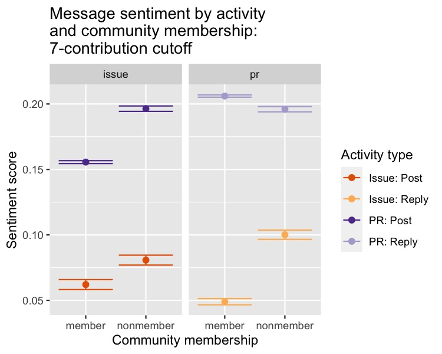
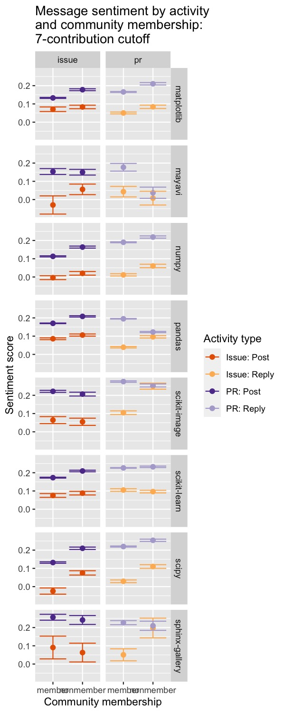
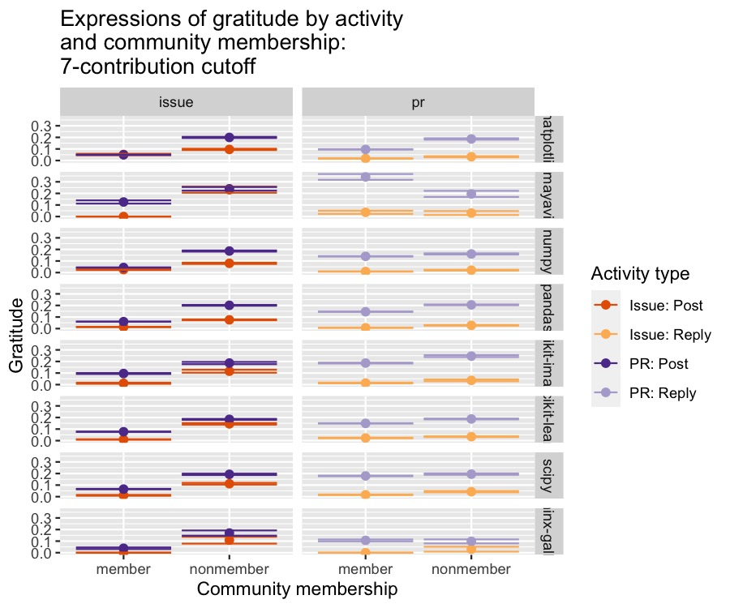
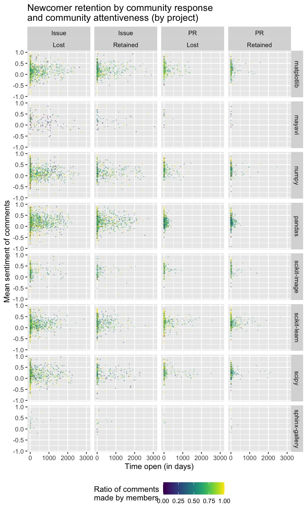
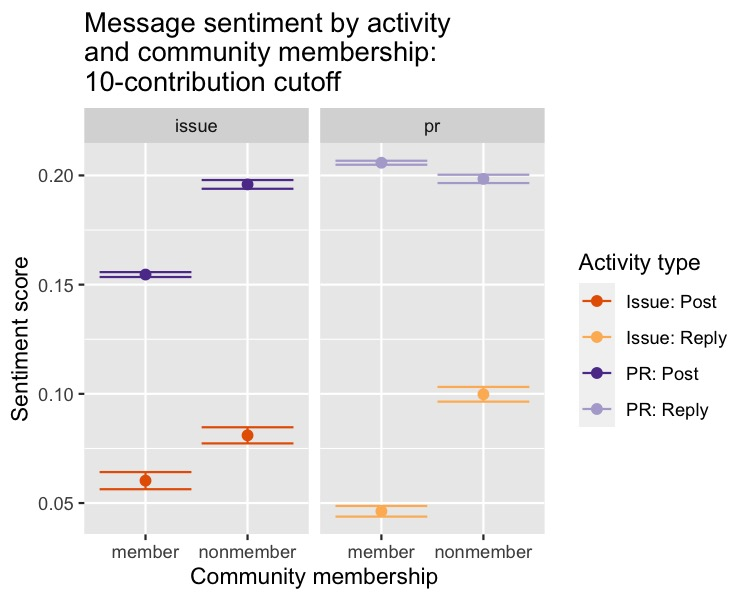
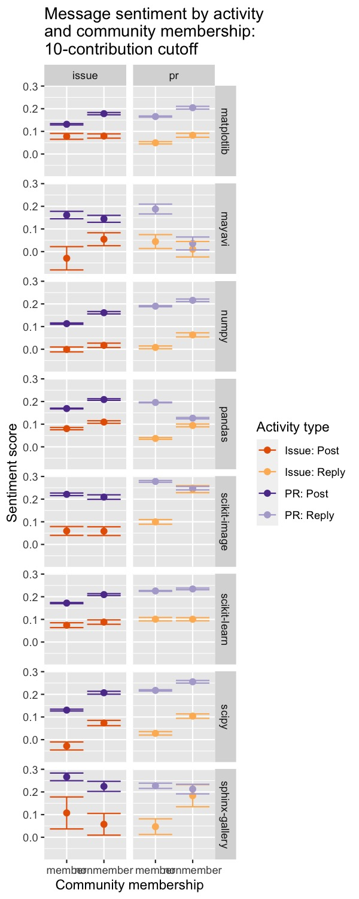
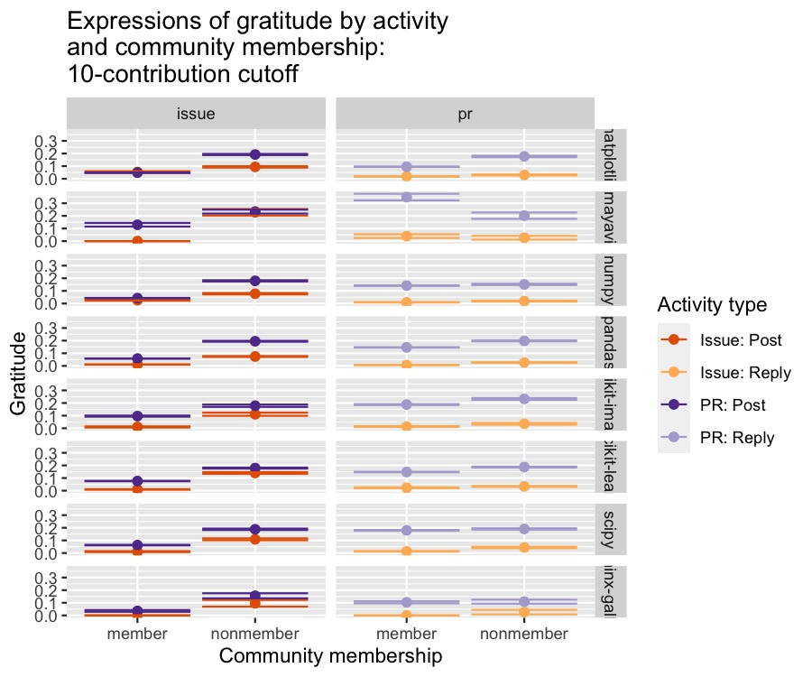

This R markdown provides the robustness analysis for our forthcoming manuscript
(Paxton, Varoquaux, Geiger, & Holdgraf, *in preparation*).

To run this from scratch, you will need the following files:

* `../../data/analysis_data/sentiment_frame_tickets-for_r.csv`: Contains cleaned
**posts**-related data (sometimes also referred to as *tickets*) and 
derived variables from scraped GitHub data.
* `../../data/analysis_data/sentiment_frame_comments-for_r.csv`: Contains
cleaned **comments**-related data and derived variables from scraped GitHub
data.
* `./utils/ossc-libraries_and_functions.r`: Loads in necessary libraries and
creates new functions for our analyses.
* `./utils/data-loading-robustness.R`: loads functions related to data loading and
preprocessing.

**Code written by**: A. Paxton (University of Connecticut) & N. Varoquaux
(CNRS)

**Date last compiled**:  `r Sys.time()`

```{r silent-preparations, include=FALSE}
library(knitr)
knitr::opts_chunk$set(cache=TRUE, autodep=TRUE, cache.lazy=FALSE)
options(scipen=999)
```

***

# Preliminaries

```{r prelim, warning = FALSE, error = FALSE, message = FALSE}

# clear everything
rm(list=ls())

# load libraries and add new functions
source('./utils/ossc-libraries_and_functions.r')
source("./utils/data-loading-robustness.R")

```

***

# Create robustness datasets

Here, we'll load the data and specify two additional membership cutoffs: 
7 contributions and 10 contributions.

```{r choosing_datasets}

# specify 7-contribution cutoff
tickets_frame_7 = loading_tickets_data(dataset="original", membership_cutoff = 7)
comments_frame_7 = loading_comments_data(dataset="original", membership_cutoff = 7)

# specify 10-contribution cutoff
tickets_frame_10 = loading_tickets_data(dataset="original", membership_cutoff = 10)
comments_frame_10 = loading_comments_data(dataset="original", membership_cutoff = 10)

```

***

# Data analysis: 7-contribution cutoff

***

## Model Series 1: Sentiment analysis

***

### Data preparation

Before we can run Model Series 1, we need to combine `tickets_frame` and
`comments_frame` into a single dataframe. We do this using the
`combine_tickets_and_comments` function, `defined in utils/data-loading.R`

```{r prepare-data-for-sentiment-analysis-7cutoff, message=FALSE}

# create for 7-contribution cutoff
sentiment_frame_7 = combine_tickets_and_comments(tickets_frame_7, 
                                                 comments_frame_7)

```

```{r save-sentiment_7-frame, echo=FALSE}

# save only the higher-cutoff versions (since we've already saved the original cutoff)
dir.create("results/data", showWarnings=FALSE, recursive=TRUE)
write.table(sentiment_frame_7,
            file="results/data/sentiment_frame-robustness_7.tsv",
            sep="\t")
```

***

### Model 1.1: Do different kinds of activities materially differ in emotion?

#### Robustness Model 1.1a: 7-contribution cutoff

Here, we reproduce Model 1.1a with a 7-contribution cutoff.

```{r model-emotion-by-author-group-7cutoff}

# do members and nonmembers materially differ in emotion?
fixed_creators_v_commenters_emotion_7 = lmer(
  compound_emotion ~ 0 + author_group + (1 | author_name) + (1 | project),
  data=sentiment_frame_7,
  REML=FALSE)

```

```{r clean-up-model-1.1a-output-7cutoff}

# convert Model 1.1a output to dataframe
coefficients_and_se_7 = data.frame(
  summary(fixed_creators_v_commenters_emotion_7)$coefficients)

# get comparison names as rownames
row_names = gsub("author_group", "", 
                 gsub("type", "", row.names(coefficients_and_se_7)))

# convert model estimates to a dataframe
means = coefficients_and_se_7$Estimate
names(means) = row_names

# convert standard error to dataframe
se = coefficients_and_se_7$Std..Error
names(se) = row_names

# compute t-statistics and p-values for desired contrasts
contrasts = c("member-nonmember")
author_groups_tests_7 = compute_t_statistics(
  means, se,
  contrasts)
author_groups_tests_7[, "p_value"] = compute_p_value_from_t_stats(
  author_groups_tests_7$t_stats)
```

```{r saving_results-model-1.1a-7cutoff}
dir.create("results/models", showWarnings=FALSE)
write.table(coefficients_and_se_7,
            file="results/models/model-1.1b1-7cutoff.tsv",
            sep="\t")

```

#### Robustness Model 1.1b: 7-contribution cutoff

Here, we reproduce Model 1.1b with a 7-contribution cutoff.

```{r model-emotion-by-type-7cutoff}

# do posts and comments materially differ in emotion?
fixed_types_emotion_7 = lmer(
  compound_emotion ~ 0 + type + (1 | author_name) + (1 | project),
  data=sentiment_frame_7,
  REML=FALSE)

```

```{r clean-up-model-1.1b-output-7cutoff}

# convert Model 1.1b output to dataframe
coefficients_and_se_7 = data.frame(
  summary(fixed_types_emotion_7)$coefficients)

# get comparison names as rownames
row_names = gsub("author_group", "", 
                 gsub("type", "", row.names(coefficients_and_se_7)))

# convert model estimates to a dataframe
means = coefficients_and_se_7$Estimate
names(means) = row_names

# convert standard error to dataframe
se = coefficients_and_se_7$Std..Error
names(se) = row_names

# compute t-statistics and p-values for desired contrasts
contrasts = c("issue_post-issue_reply", # issues: posts vs. replies
              "pr_post-pr_reply",       # PRs: posts vs. replies
              "issue_post-pr_post",     # posts: issues vs. PRs
              "issue_reply-pr_reply")   # replies: issues vs. PRs
types_tests_7 = compute_t_statistics(
  means, se,
  contrasts)
types_tests_7[, "p_value"] = compute_p_value_from_t_stats(types_tests_7$t_stats)

```

```{r saving_results-model-1.1b-7cutoff}
write.table(coefficients_and_se_7,
            file="results/models/model-1.1b2-7cutoff.tsv",
            sep="\t")
```

#### Robustness Model 1.1c: 7-contribution cutoff

Here, we reproduce Model 1.1c with a 7-contribution cutoff.

```{r model-emotion-by-type-and-author-interaction-only-7cutoff}

# does emotion differ by the interaction between activity and authorship group?
community_contribution_emotion_7 = lmer(
  compound_emotion ~ 0 + type:author_group + (1 | author_name) + (1 | project),
  data=sentiment_frame_7,
  REML=FALSE)

```

Run *t*-tests among levels.

```{r clean-up-model-1.1c-output-7cutoff}

# convert Model 1.1c output to dataframe
coefficients_and_se_7 = data.frame(
  summary(community_contribution_emotion_7)$coefficients)

# get comparison names as rownames
row_names = gsub("author_group", "", gsub("type", "", row.names(coefficients_and_se_7)))

# convert model estimates to a dataframe
means = coefficients_and_se_7$Estimate
names(means) = row_names

# convert standard error to dataframe
se = coefficients_and_se_7$Std..Error
names(se) = row_names

# compute t-statistics and p-values for desired contrasts
contrasts = c(
  "issue_post:member-issue_post:nonmember",     # activity static (issue posts); membership varies (members v. nonmembers)
  "issue_reply:member-issue_reply:nonmember",   # activity static (issue replies); membership varies (members v. nonmembers)
  "pr_post:member-pr_post:nonmember",           # activity static (PR posts); membership varies (members v. nonmembers)
  "pr_reply:member-pr_reply:nonmember",         # activity static (PR replies); membership varies (members v. nonmembers)
  "issue_post:member-issue_reply:member",       # activity varies (issue posts vs. issue replies); membership static (members)
  "issue_post:nonmember-issue_reply:nonmember", # activity varies (issue posts vs. issue replies); membership static (nonmembers)
  "pr_post:member-pr_reply:member",             # activity varies (PR posts vs. PR replies); membership static (members)
  "pr_post:nonmember-pr_reply:nonmember",       # activity varies (PR posts vs. PR replies); membership static (nonmembers)
  "issue_post:member-pr_post:member",           # activity varies (issue posts vs. PR posts); membership static (members)
  "issue_post:nonmember-pr_post:nonmember",     # activity varies (issue posts vs. PR posts); membership static (nonmembers)
  "issue_reply:member-pr_reply:member",         # activity varies (issue replies vs. PR replies); membership static (members)
  "issue_reply:nonmember-pr_reply:nonmember")   # activity varies (issue replies vs. PR replies); membership static (nonmembers)
types_author_groups_tests_7 = compute_t_statistics(
  means, se,
  contrasts)
types_author_groups_tests_7[, "p_value"] = compute_p_value_from_t_stats(
  types_author_groups_tests_7$"t_stats")

```

```{r saving_results-model-1.1c-7cutoff}
write.table(coefficients_and_se_7,
            file="results/models/model-1.1b3-7cutoff.tsv",
            sep="\t")
```

#### Robustness Model 1.1d: 7-contribution cutoff

Here, we reproduce Model 1.1d with a 7-contribution cutoff.

```{r model-emotion-by-type-and-author-and-project-7cutoff}

# do posts and comments materially differ in emotion by projects?
creators_v_commenters_emotion_by_project_7 = lmer(
  compound_emotion ~ 0 + project:type:author_group + (1 | author_name),
  data = sentiment_frame_7,
  REML = FALSE)

```

```{r clean-up-model-1.1d-output-7cutoff}

# convert Model 1.1d output to dataframe
coefficients_and_se_7 = data.frame(
  summary(creators_v_commenters_emotion_by_project_7)$coefficients)

# get comparison names as rownames
row_names = gsub(
  "project", "", gsub(
    "author_group", "", gsub(
      "type", "", row.names(coefficients_and_se_7))))

# replace hyphens in project names with periods
row_names = gsub(
  "scikit-", "scikit.", gsub(
    "sphinx-", "sphinx.", row_names))

# convert model estimates to a dataframe
means = coefficients_and_se_7$Estimate
names(means) = row_names

# convert standard error to dataframe
se = coefficients_and_se_7$Std..Error
names(se) = row_names

# compute t-statistics and p-values for desired contrasts
# (note: ordering of contrasts within each project is identical to Model 1.1c)
contrasts = c(
  
  # scikit-learn
  "scikit.learn:issue_post:member-scikit.learn:issue_post:nonmember",   
  "scikit.learn:issue_reply:member-scikit.learn:issue_reply:nonmember",
  "scikit.learn:pr_post:member-scikit.learn:pr_post:nonmember",
  "scikit.learn:pr_reply:member-scikit.learn:pr_reply:nonmember",
  "scikit.learn:issue_post:member-scikit.learn:issue_reply:member",
  "scikit.learn:issue_post:nonmember-scikit.learn:issue_reply:nonmember",
  "scikit.learn:pr_post:member-scikit.learn:pr_reply:member",
  "scikit.learn:pr_post:nonmember-scikit.learn:pr_reply:nonmember",
  "scikit.learn:issue_post:member-scikit.learn:pr_post:member",
  "scikit.learn:issue_post:nonmember-scikit.learn:pr_post:nonmember",    
  "scikit.learn:issue_reply:member-scikit.learn:pr_reply:member",  
  "scikit.learn:issue_reply:nonmember-scikit.learn:pr_reply:nonmember",
  
  # scikit-image
  "scikit.image:issue_post:member-scikit.image:issue_post:nonmember", 
  "scikit.image:issue_reply:member-scikit.image:issue_reply:nonmember",
  "scikit.image:pr_post:member-scikit.image:pr_post:nonmember",       
  "scikit.image:pr_reply:member-scikit.image:pr_reply:nonmember",     
  "scikit.image:issue_post:member-scikit.image:issue_reply:member",
  "scikit.image:issue_post:nonmember-scikit.image:issue_reply:nonmember",
  "scikit.image:pr_post:member-scikit.image:pr_reply:member",     
  "scikit.image:pr_post:nonmember-scikit.image:pr_reply:nonmember",    
  "scikit.image:issue_post:member-scikit.image:pr_post:member",   
  "scikit.image:issue_post:nonmember-scikit.image:pr_post:nonmember",    
  "scikit.image:issue_reply:member-scikit.image:pr_reply:member",  
  "scikit.image:issue_reply:nonmember-scikit.image:pr_reply:nonmember",
  
  # matplotlib
  "matplotlib:issue_post:member-matplotlib:issue_post:nonmember", 
  "matplotlib:issue_reply:member-matplotlib:issue_reply:nonmember",
  "matplotlib:pr_post:member-matplotlib:pr_post:nonmember",       
  "matplotlib:pr_reply:member-matplotlib:pr_reply:nonmember",     
  "matplotlib:issue_post:member-matplotlib:issue_reply:member",
  "matplotlib:issue_post:nonmember-matplotlib:issue_reply:nonmember",
  "matplotlib:pr_post:member-matplotlib:pr_reply:member",     
  "matplotlib:pr_post:nonmember-matplotlib:pr_reply:nonmember",    
  "matplotlib:issue_post:member-matplotlib:pr_post:member",   
  "matplotlib:issue_post:nonmember-matplotlib:pr_post:nonmember",    
  "matplotlib:issue_reply:member-matplotlib:pr_reply:member",  
  "matplotlib:issue_reply:nonmember-matplotlib:pr_reply:nonmember",
  
  # mayavi
  "mayavi:issue_post:member-mayavi:issue_post:nonmember", 
  "mayavi:issue_reply:member-mayavi:issue_reply:nonmember",
  "mayavi:pr_post:member-mayavi:pr_post:nonmember",       
  "mayavi:pr_reply:member-mayavi:pr_reply:nonmember",     
  "mayavi:issue_post:member-mayavi:issue_reply:member",
  "mayavi:issue_post:nonmember-mayavi:issue_reply:nonmember",
  "mayavi:pr_post:member-mayavi:pr_reply:member",     
  "mayavi:pr_post:nonmember-mayavi:pr_reply:nonmember",    
  "mayavi:issue_post:member-mayavi:pr_post:member",   
  "mayavi:issue_post:nonmember-mayavi:pr_post:nonmember",    
  "mayavi:issue_reply:member-mayavi:pr_reply:member",  
  "mayavi:issue_reply:nonmember-mayavi:pr_reply:nonmember",
  
  # pandas
  "pandas:issue_post:member-pandas:issue_post:nonmember", 
  "pandas:issue_reply:member-pandas:issue_reply:nonmember",
  "pandas:pr_post:member-pandas:pr_post:nonmember",       
  "pandas:pr_reply:member-pandas:pr_reply:nonmember",     
  "pandas:issue_post:member-pandas:issue_reply:member",
  "pandas:issue_post:nonmember-pandas:issue_reply:nonmember",
  "pandas:pr_post:member-pandas:pr_reply:member",     
  "pandas:pr_post:nonmember-pandas:pr_reply:nonmember",    
  "pandas:issue_post:member-pandas:pr_post:member",   
  "pandas:issue_post:nonmember-pandas:pr_post:nonmember",    
  "pandas:issue_reply:member-pandas:pr_reply:member",  
  "pandas:issue_reply:nonmember-pandas:pr_reply:nonmember",
  
  # scipy
  "scipy:issue_post:member-scipy:issue_post:nonmember", 
  "scipy:issue_reply:member-scipy:issue_reply:nonmember",
  "scipy:pr_post:member-scipy:pr_post:nonmember",       
  "scipy:pr_reply:member-scipy:pr_reply:nonmember",     
  "scipy:issue_post:member-scipy:issue_reply:member",
  "scipy:issue_post:nonmember-scipy:issue_reply:nonmember",
  "scipy:pr_post:member-scipy:pr_reply:member",     
  "scipy:pr_post:nonmember-scipy:pr_reply:nonmember",    
  "scipy:issue_post:member-scipy:pr_post:member",   
  "scipy:issue_post:nonmember-scipy:pr_post:nonmember",    
  "scipy:issue_reply:member-scipy:pr_reply:member",  
  "scipy:issue_reply:nonmember-scipy:pr_reply:nonmember",
  
  # numpy
  "numpy:issue_post:member-numpy:issue_post:nonmember", 
  "numpy:issue_reply:member-numpy:issue_reply:nonmember",
  "numpy:pr_post:member-numpy:pr_post:nonmember",       
  "numpy:pr_reply:member-numpy:pr_reply:nonmember",     
  "numpy:issue_post:member-numpy:issue_reply:member",
  "numpy:issue_post:nonmember-numpy:issue_reply:nonmember",
  "numpy:pr_post:member-numpy:pr_reply:member",     
  "numpy:pr_post:nonmember-numpy:pr_reply:nonmember",    
  "numpy:issue_post:member-numpy:pr_post:member",   
  "numpy:issue_post:nonmember-numpy:pr_post:nonmember",    
  "numpy:issue_reply:member-numpy:pr_reply:member",  
  "numpy:issue_reply:nonmember-numpy:pr_reply:nonmember",
  
  # sphinx-gallery
  "sphinx.gallery:issue_post:member-sphinx.gallery:issue_post:nonmember", 
  "sphinx.gallery:issue_reply:member-sphinx.gallery:issue_reply:nonmember",
  "sphinx.gallery:pr_post:member-sphinx.gallery:pr_post:nonmember",       
  "sphinx.gallery:pr_reply:member-sphinx.gallery:pr_reply:nonmember",     
  "sphinx.gallery:issue_post:member-sphinx.gallery:issue_reply:member",
  "sphinx.gallery:issue_post:nonmember-sphinx.gallery:issue_reply:nonmember",
  "sphinx.gallery:pr_post:member-sphinx.gallery:pr_reply:member",     
  "sphinx.gallery:pr_post:nonmember-sphinx.gallery:pr_reply:nonmember",    
  "sphinx.gallery:issue_post:member-sphinx.gallery:pr_post:member",   
  "sphinx.gallery:issue_post:nonmember-sphinx.gallery:pr_post:nonmember",    
  "sphinx.gallery:issue_reply:member-sphinx.gallery:pr_reply:member",  
  "sphinx.gallery:issue_reply:nonmember-sphinx.gallery:pr_reply:nonmember"
)
project_types_author_group_tests_7 = compute_t_statistics(
  means, se,
  contrasts)
project_types_author_group_tests_7[, "p_value"] = compute_p_value_from_t_stats(
  project_types_author_group_tests_7$t_stats) 

```

```{r saving_results-model-1.1d-7cutoff}
write.table(coefficients_and_se_7,
            file="results/models/model-1.1c-7cutoff.tsv",
            sep="\t")
```

#### Robustness Model 1.1: Overall results with 7-contribution cutoff

Now we bring together all analyses from Model 1.1's 7-contribution cutoff.

```{r output-model1.1-results-table-7cutoff}

# specify main terms
author_groups_tests_7["contrast"] = row.names(author_groups_tests_7)
types_tests_7["contrast"] = row.names(types_tests_7)
all_tests_7 = merge(author_groups_tests_7, types_tests_7, all=TRUE, sort=FALSE)
all_tests_7["model"] = "Main Terms"

# specify 2-way interactions
types_author_groups_tests_7["contrast"] = row.names(types_author_groups_tests_7)
types_author_groups_tests_7["model"] = "2W: Types x Author Groups"
all_tests_7 = merge(all_tests_7, types_author_groups_tests_7, all=TRUE, sort=FALSE)

# specify 3-way interactions
project_types_author_group_tests_7["contrast"] = row.names(project_types_author_group_tests_7)
project_types_author_group_tests_7["model"] = "3W: Types x Author Groups x Project"
all_tests_7 = merge(all_tests_7, project_types_author_group_tests_7, all=TRUE,
                    sort=FALSE)

```

Let's correct all tests at once for multiple comparisons.

```{r correct-and-display-all-model-1.1-tests-7cutoff}

# specify all contrasts
row.names(all_tests_7) = all_tests_7$contrast
all_tests_7 = subset(all_tests_7, select=-c(contrast))

# print the table (reordering columns for readibility)
all_tests_7 = all_tests_7[c("model", "t_stats", "p_value")]
pander_clean_anova(all_tests_7, rename_columns=FALSE)

```

```{r emotion_write_all_results-7cutoff}
all_tests$p_val_adjusted = p.adjust(all_tests$p_value, method="BH")
write.table(all_tests, file="results/models/model-1.1b_final_pvalues-7cutoff.tsv")
```

Finally, let's plot these effects.

```{r plot-model-emotion-by-type-and-membership-7cutoff, echo=FALSE, eval=TRUE}

# aggregate sentiment over all projects
sentiment_plot_aggregated_7 = ggplot(data=sentiment_frame_7,
                                   aes(x=author_group,
                                       y=compound_emotion,
                                       colour=type)) +
  stat_summary(fun.y=mean, geom="point", size=2) +
  stat_summary(fun.data = mean_se, geom = "errorbar") +
  #coord_cartesian(ylim=c(0,.5)) +
  facet_grid(cols=vars(ticket_family)) +
  ggtitle('Message sentiment by activity\nand community membership:\n7-contribution cutoff') +
  ylab('Sentiment score') +
  xlab('Community membership') +
  labs(color='Activity type') +
  scale_color_manual(labels = c("Issue: Post",
                                "Issue: Reply",
                                "PR: Post",
                                "PR: Reply"),
                     values = c("#e66101", # issue: post (darker)
                                "#fdb863", # issue: reply (lighter)
                                "#5e3c99", # PR: post (darker)
                                "#b2abd2")) # PR: reply (lighter)

# plot a smaller one for knitr
ggsave(plot = sentiment_plot_aggregated_7,
       height = 4,
       width = 5,
       dpi = 150,
       filename = '../../figures/sentiment_analysis/ossc-sentiment_membership_contribution-aggregated-7cutoff-knitr.jpg')

```



```{r plot-model-emotion-by-type-and-membership-and-project-7cutoff, echo=FALSE, eval=TRUE}

# separate across each project
sentiment_plot_by_project_7 = ggplot(data=sentiment_frame_7,
                                   aes(x=author_group,
                                       y=compound_emotion,
                                       colour=type)) +
  stat_summary(fun.y=mean, geom="point", size=2) +
  stat_summary(fun.data = mean_se, geom = "errorbar") +
  #coord_cartesian(ylim=c(0,.5)) +
  facet_grid(cols=vars(ticket_family),
             rows=vars(project)) +
  ggtitle('Message sentiment by activity\nand community membership:\n7-contribution cutoff') +
  ylab('Sentiment score') +
  xlab('Community membership') +
  labs(color='Activity type') +
  scale_color_manual(labels = c("Issue: Post",
                                "Issue: Reply",
                                "PR: Post",
                                "PR: Reply"),
                     values = c("#e66101", # issue: post (darker)
                                "#fdb863", # issue: reply (lighter)
                                "#5e3c99", # PR: post (darker)
                                "#b2abd2")) # PR: reply (lighter)

# plot a smaller one for knitr
ggsave(plot = sentiment_plot_by_project_7,
       height = 10,
       width = 4,
       dpi = 150,
       filename = '../../figures/sentiment_analysis/ossc-sentiment_membership_contribution-by_project-7cutoff-knitr.jpg')

```



***

### Model 1.2: Time-course analysis for sentiment

The time-course analysis has been moved in a separate file.

***

### Model 1.3: Do posts and comments materially differ in gratitude?

#### Robustness dataset: Summary stats and visualization

```{r gratitude-summary-stats-7cutoff, eval=TRUE, echo=TRUE}

# create a summary table of gratitude by type and author association
gratitude_summary_stats_7 = sentiment_frame_7 %>% ungroup() %>%
  group_by(author_group, type, grateful_count) %>%
  summarise(n = n())
pander(gratitude_summary_stats_7, style = 'rmarkdown')

```

```{r plot-gratitude-predictors-by-project-7cutoff, include=FALSE, eval=TRUE}
grateful_plot_7 = ggplot(data=sentiment_frame_7,
                       aes(colour=type,
                           y=grateful_count,
                           x=author_group)) +
  stat_summary(fun.y=mean, geom="point", size=2) +
  stat_summary(fun.data = mean_se, geom = "errorbar") +
  facet_grid(cols = vars(ticket_family),
             rows = vars(project)) +
  ggtitle('Expressions of gratitude by activity\nand community membership:\n7-contribution cutoff') +
  ylab('Gratitude') +
  xlab('Community membership') +
  labs(color='Activity type') +
  scale_color_manual(labels = c("Issue: Post",
                                "Issue: Reply",
                                "PR: Post",
                                "PR: Reply"),
                     values = c("#e66101", # issue: post (darker)
                                "#fdb863", # issue: reply (lighter)
                                "#5e3c99", # PR: post (darker)
                                "#b2abd2")) # PR: reply (lighter)

# save smaller version for knitr
ggsave(plot = grateful_plot_7,
       height = 5,
       width = 6,
       dpi = 150,
       filename = '../../figures/sentiment_analysis/ossc-grateful_membership_contribution-7cutoff-knitr.jpg')

```



#### Robustness Model 1.3b: 7-contribution cutoff

Here, we reproduce Model 1.3b with a 7-contribution cutoff.

```{r model-gratitude-by-author-group-7cutoff}

# do members and nonmembers materially differ in emotion?
fixed_authors_gratitude_7 = lmer(
  log(grateful_count + 1) ~ 0 + author_group + (1 | project),
  data=sentiment_frame_7,
  REML=FALSE)

```

```{r clean-up-model-1.3b-output-7cutoff}

# convert Model 1.3b output to dataframe
coefficients_and_se_7 = data.frame(
  summary(fixed_authors_gratitude_7)$coefficients)

# get comparison names as rownames
row_names = gsub("author_group", "",
                 gsub("type", "", row.names(coefficients_and_se_7)))

# convert model estimates to a dataframe
means = coefficients_and_se_7$Estimate
names(means) = row_names

# convert standard error to dataframe
se = coefficients_and_se_7$Std..Error
names(se) = row_names

# compute t-statistics and p-values for desired contrasts
contrasts = c("member-nonmember")
author_groups_tests_7 = compute_t_statistics(
  means, se,
  contrasts)
author_groups_tests_7[, "p_value"] = compute_p_value_from_t_stats(
  author_groups_tests_7$t_stats)

```

```{r saving_results-model-1.3b-7cutoff}
write.table(coefficients_and_se_7,
            file="results/models/model-1.3b1-7cutoff.tsv",
            sep="\t")
```

#### Robustness Model 1.3c: 7-contribution cutoff

Here, we reproduce Model 1.3c with a 7-contribution cutoff.

```{r model-gratitude-by-type-7cutoff}

# do posts and comments materially differ in emotion?
fixed_types_gratitude_7 = lmer(
  log(grateful_count + 1) ~ 0 + type + (1 | project),
  data=sentiment_frame_7,
  REML=FALSE)

```

```{r clean-up-model-1.3c-output-7cutoff}

# convert Model 1.1c output to dataframe
coefficients_and_se_7 = data.frame(
  summary(fixed_types_gratitude_7)$coefficients)

# get comparison names as rownames
row_names = gsub("author_group", "",
                 gsub("type", "", row.names(coefficients_and_se_7)))

# convert model estimates to a dataframe
means = coefficients_and_se_7$Estimate
names(means) = row_names

# convert standard error to dataframe
se = coefficients_and_se_7$Std..Error
names(se) = row_names

# compute t-statistics and p-values for desired contrasts
contrasts = c("issue_post-issue_reply", # issues: posts vs. replies
              "pr_post-pr_reply",       # PRs: posts vs. replies
              "issue_post-pr_post",     # posts: issues vs. PRs
              "issue_reply-pr_reply")   # replies: issues vs. PRs
types_tests_7 = compute_t_statistics(
  means, se,
  contrasts)
types_tests_7[, "p_value"] = compute_p_value_from_t_stats(types_tests_7$t_stats)

```

```{r saving_results-model-1.3c-7cutoff}
write.table(coefficients_and_se_7,
            file="results/models/model-1.3b2-7cutoff.tsv",
            sep="\t")
```

#### Robustness Model 1.3d: 7-contribution cutoff

Here, we reproduce Model 1.3d with a 7-contribution cutoff.

```{r model-gratitude-by-type-and-author-interaction-only-7cutoff}

# does emotion differ by the interaction between activity and authorship group?
community_contribution_gratitude_7 = lmer(
  log(grateful_count + 1) ~ 0 + type:author_group + (1 | project),
  data=sentiment_frame_7,
  REML=FALSE)

```

```{r clean-up-model-1.3d-output-7cutoff}

# convert Model 1.3d output to dataframe
coefficients_and_se_7 = data.frame(
  summary(community_contribution_gratitude_7)$coefficients)

# get comparison names as rownames
row_names = gsub("author_group", "", gsub("type", "", row.names(coefficients_and_se_7)))

# convert model estimates to a dataframe
means = coefficients_and_se_7$Estimate
names(means) = row_names

# convert standard error to dataframe
se = coefficients_and_se_7$Std..Error
names(se) = row_names

# compute t-statistics and p-values for desired contrasts
contrasts = c(
  "issue_post:member-issue_post:nonmember",     # activity static (issue posts); membership varies (members v. nonmembers)
  "issue_reply:member-issue_reply:nonmember",   # activity static (issue replies); membership varies (members v. nonmembers)
  "pr_post:member-pr_post:nonmember",           # activity static (PR posts); membership varies (members v. nonmembers)
  "pr_reply:member-pr_reply:nonmember",         # activity static (PR replies); membership varies (members v. nonmembers)
  "issue_post:member-issue_reply:member",       # activity varies (issue posts vs. issue replies); membership static (members)
  "issue_post:nonmember-issue_reply:nonmember", # activity varies (issue posts vs. issue replies); membership static (nonmembers)
  "pr_post:member-pr_reply:member",             # activity varies (PR posts vs. PR replies); membership static (members)
  "pr_post:nonmember-pr_reply:nonmember",       # activity varies (PR posts vs. PR replies); membership static (nonmembers)
  "issue_post:member-pr_post:member",           # activity varies (issue posts vs. PR posts); membership static (members)
  "issue_post:nonmember-pr_post:nonmember",     # activity varies (issue posts vs. PR posts); membership static (nonmembers)
  "issue_reply:member-pr_reply:member",         # activity varies (issue replies vs. PR replies); membership static (members)
  "issue_reply:nonmember-pr_reply:nonmember")   # activity varies (issue replies vs. PR replies); membership static (nonmembers)
types_author_groups_tests_7 = compute_t_statistics(
  means, se,
  contrasts)
types_author_groups_tests_7[, "p_value"] = compute_p_value_from_t_stats(
  types_author_groups_tests_7$"t_stats")

```

```{r saving_results-model-1.3d-7cutoff}
write.table(coefficients_and_se_7,
            file="results/models/model-1.3b3-7cutoff.tsv",
            sep="\t")
```

#### Robustness Model 1.3e: 7-contribution cutoff

Here, we reproduce Model 1.3e with a 7-contribution cutoff.

```{r model-gratitude-by-type-and-author-and-project-7cutoff}

# do posts and comments materially differ in gratitude by projects?
creators_v_commenters_gratitude_by_project_7 = lm(
  log(grateful_count + 1) ~ 0 + project:type:author_group,
  data = sentiment_frame_7)

```

```{r clean-up-model-1.3e-output-7cutoff}

# convert Model 1.3e output to dataframe
coefficients_and_se_7 = data.frame(
  summary(creators_v_commenters_gratitude_by_project_7)$coefficients)

# get comparison names as rownames
row_names = gsub(
  "project", "", gsub(
    "author_group", "", gsub(
      "type", "", row.names(coefficients_and_se_7))))

# replace hyphens in project names with periods
row_names = gsub(
  "scikit-", "scikit.", gsub(
    "sphinx-", "sphinx.", row_names))

# convert model estimates to a dataframe
means = coefficients_and_se_7$Estimate
names(means) = row_names

# convert standard error to dataframe
se = coefficients_and_se_7$Std..Error
names(se) = row_names

# compute t-statistics and p-values for desired contrasts
# (note: ordering of contrasts within each project is identical to Model 1.3c)
contrasts = c(
  
  # scikit-learn
  "scikit.learn:issue_post:member-scikit.learn:issue_post:nonmember",
  "scikit.learn:issue_reply:member-scikit.learn:issue_reply:nonmember",
  "scikit.learn:pr_post:member-scikit.learn:pr_post:nonmember",
  "scikit.learn:pr_reply:member-scikit.learn:pr_reply:nonmember",
  "scikit.learn:issue_post:member-scikit.learn:issue_reply:member",
  "scikit.learn:issue_post:nonmember-scikit.learn:issue_reply:nonmember",
  "scikit.learn:pr_post:member-scikit.learn:pr_reply:member",
  "scikit.learn:pr_post:nonmember-scikit.learn:pr_reply:nonmember",
  "scikit.learn:issue_post:member-scikit.learn:pr_post:member",
  "scikit.learn:issue_post:nonmember-scikit.learn:pr_post:nonmember",
  "scikit.learn:issue_reply:member-scikit.learn:pr_reply:member",
  "scikit.learn:issue_reply:nonmember-scikit.learn:pr_reply:nonmember",
  
  # scikit-image
  "scikit.image:issue_post:member-scikit.image:issue_post:nonmember",
  "scikit.image:issue_reply:member-scikit.image:issue_reply:nonmember",
  "scikit.image:pr_post:member-scikit.image:pr_post:nonmember",
  "scikit.image:pr_reply:member-scikit.image:pr_reply:nonmember",
  "scikit.image:issue_post:member-scikit.image:issue_reply:member",
  "scikit.image:issue_post:nonmember-scikit.image:issue_reply:nonmember",
  "scikit.image:pr_post:member-scikit.image:pr_reply:member",
  "scikit.image:pr_post:nonmember-scikit.image:pr_reply:nonmember",
  "scikit.image:issue_post:member-scikit.image:pr_post:member",
  "scikit.image:issue_post:nonmember-scikit.image:pr_post:nonmember",
  "scikit.image:issue_reply:member-scikit.image:pr_reply:member",
  "scikit.image:issue_reply:nonmember-scikit.image:pr_reply:nonmember",
  
  # matplotlib
  "matplotlib:issue_post:member-matplotlib:issue_post:nonmember",
  "matplotlib:issue_reply:member-matplotlib:issue_reply:nonmember",
  "matplotlib:pr_post:member-matplotlib:pr_post:nonmember",
  "matplotlib:pr_reply:member-matplotlib:pr_reply:nonmember",
  "matplotlib:issue_post:member-matplotlib:issue_reply:member",
  "matplotlib:issue_post:nonmember-matplotlib:issue_reply:nonmember",
  "matplotlib:pr_post:member-matplotlib:pr_reply:member",
  "matplotlib:pr_post:nonmember-matplotlib:pr_reply:nonmember",
  "matplotlib:issue_post:member-matplotlib:pr_post:member",
  "matplotlib:issue_post:nonmember-matplotlib:pr_post:nonmember",
  "matplotlib:issue_reply:member-matplotlib:pr_reply:member",
  "matplotlib:issue_reply:nonmember-matplotlib:pr_reply:nonmember",
  
  # mayavi
  "mayavi:issue_post:member-mayavi:issue_post:nonmember",
  "mayavi:issue_reply:member-mayavi:issue_reply:nonmember",
  "mayavi:pr_post:member-mayavi:pr_post:nonmember",
  "mayavi:pr_reply:member-mayavi:pr_reply:nonmember",
  "mayavi:issue_post:member-mayavi:issue_reply:member",
  "mayavi:issue_post:nonmember-mayavi:issue_reply:nonmember",
  "mayavi:pr_post:member-mayavi:pr_reply:member",
  "mayavi:pr_post:nonmember-mayavi:pr_reply:nonmember",
  "mayavi:issue_post:member-mayavi:pr_post:member",
  "mayavi:issue_post:nonmember-mayavi:pr_post:nonmember",
  "mayavi:issue_reply:member-mayavi:pr_reply:member",
  "mayavi:issue_reply:nonmember-mayavi:pr_reply:nonmember",
  
  # pandas
  "pandas:issue_post:member-pandas:issue_post:nonmember",
  "pandas:issue_reply:member-pandas:issue_reply:nonmember",
  "pandas:pr_post:member-pandas:pr_post:nonmember",
  "pandas:pr_reply:member-pandas:pr_reply:nonmember",
  "pandas:issue_post:member-pandas:issue_reply:member",
  "pandas:issue_post:nonmember-pandas:issue_reply:nonmember",
  "pandas:pr_post:member-pandas:pr_reply:member",
  "pandas:pr_post:nonmember-pandas:pr_reply:nonmember",
  "pandas:issue_post:member-pandas:pr_post:member",
  "pandas:issue_post:nonmember-pandas:pr_post:nonmember",
  "pandas:issue_reply:member-pandas:pr_reply:member",
  "pandas:issue_reply:nonmember-pandas:pr_reply:nonmember",
  
  # scipy
  "scipy:issue_post:member-scipy:issue_post:nonmember",
  "scipy:issue_reply:member-scipy:issue_reply:nonmember",
  "scipy:pr_post:member-scipy:pr_post:nonmember",
  "scipy:pr_reply:member-scipy:pr_reply:nonmember",
  "scipy:issue_post:member-scipy:issue_reply:member",
  "scipy:issue_post:nonmember-scipy:issue_reply:nonmember",
  "scipy:pr_post:member-scipy:pr_reply:member",
  "scipy:pr_post:nonmember-scipy:pr_reply:nonmember",
  "scipy:issue_post:member-scipy:pr_post:member",
  "scipy:issue_post:nonmember-scipy:pr_post:nonmember",
  "scipy:issue_reply:member-scipy:pr_reply:member",
  "scipy:issue_reply:nonmember-scipy:pr_reply:nonmember",
  
  # numpy
  "numpy:issue_post:member-numpy:issue_post:nonmember",
  "numpy:issue_reply:member-numpy:issue_reply:nonmember",
  "numpy:pr_post:member-numpy:pr_post:nonmember",
  "numpy:pr_reply:member-numpy:pr_reply:nonmember",
  "numpy:issue_post:member-numpy:issue_reply:member",
  "numpy:issue_post:nonmember-numpy:issue_reply:nonmember",
  "numpy:pr_post:member-numpy:pr_reply:member",
  "numpy:pr_post:nonmember-numpy:pr_reply:nonmember",
  "numpy:issue_post:member-numpy:pr_post:member",
  "numpy:issue_post:nonmember-numpy:pr_post:nonmember",
  "numpy:issue_reply:member-numpy:pr_reply:member",
  "numpy:issue_reply:nonmember-numpy:pr_reply:nonmember",
  
  # sphinx-gallery
  "sphinx.gallery:issue_post:member-sphinx.gallery:issue_post:nonmember",
  "sphinx.gallery:issue_reply:member-sphinx.gallery:issue_reply:nonmember",
  "sphinx.gallery:pr_post:member-sphinx.gallery:pr_post:nonmember",
  "sphinx.gallery:pr_reply:member-sphinx.gallery:pr_reply:nonmember",
  "sphinx.gallery:issue_post:member-sphinx.gallery:issue_reply:member",
  "sphinx.gallery:issue_post:nonmember-sphinx.gallery:issue_reply:nonmember",
  "sphinx.gallery:pr_post:member-sphinx.gallery:pr_reply:member",
  "sphinx.gallery:pr_post:nonmember-sphinx.gallery:pr_reply:nonmember",
  "sphinx.gallery:issue_post:member-sphinx.gallery:pr_post:member",
  "sphinx.gallery:issue_post:nonmember-sphinx.gallery:pr_post:nonmember",
  "sphinx.gallery:issue_reply:member-sphinx.gallery:pr_reply:member",
  "sphinx.gallery:issue_reply:nonmember-sphinx.gallery:pr_reply:nonmember"
)
project_types_author_group_tests_7 = compute_t_statistics(
  means, se,
  contrasts)
project_types_author_group_tests_7[, "p_value"] = compute_p_value_from_t_stats(
  project_types_author_group_tests_7$t_stats)

```

```{r saving_results-model-1.3e-7cutoff}
write.table(coefficients_and_se_7,
            file="results/models/model-1.3e-7cutoff.tsv",
            sep="\t")
```

#### Robustness Model 1.3: Overall results with 7-contribution cutoff

Now we bring together all analyses from Robustness Model 1.3.

```{r output-model1.3-results-table-7cutoff}

# specify main terms
author_groups_tests_7["contrast"] = row.names(author_groups_tests_7)
types_tests_7["contrast"] = row.names(types_tests_7)
all_tests_7 = merge(author_groups_tests_7, types_tests_7, all=TRUE, sort=FALSE)
all_tests_7["model"] = "Main Terms"

# specify 2-way interactions
types_author_groups_tests_7["contrast"] = row.names(types_author_groups_tests_7)
types_author_groups_tests_7["model"] = "2W: Types x Author Groups"
all_tests_7 = merge(all_tests_7, types_author_groups_tests_7, all=TRUE, sort=FALSE)

# specify 3-way interactions
project_types_author_group_tests_7["contrast"] = row.names(project_types_author_group_tests_7)
project_types_author_group_tests_7["model"] = "3W: Types x Author Groups x Project"
all_tests_7 = merge(all_tests_7, project_types_author_group_tests_7, all=TRUE,
                    sort=FALSE)

```

```{r correct-and-display-all-model-1.3-tests-7cutoff}

# specify all contrasts
row.names(all_tests_7) = all_tests_7$contrast
all_tests_7 = subset(all_tests_7, select=-c(contrast))

# print the table (reordering columns for readability)
all_tests_7 = all_tests_7[c("model", "t_stats", "p_value")]
pander_clean_anova(all_tests_7, rename_columns=FALSE)

```

```{r gratitude_write_all_results-7cutoff}
all_tests_7$p_val_adjusted = p.adjust(all_tests_7$p_value, method="BH")
write.table(all_tests_7, file="results/models/model-1.3b_final_pvalues-7cutoff.tsv")
```

***

### Model 1.4: Time-course analysis for gratitude

The time-course analysis has been moved in a separate file.

***

## Model Series 2: Retention

Our second set of models investigates what aspects of the response to a 
newcomer's first activity (including aspects of the community's response
to their contribution) might predict their likelihood to come back to 
contribute a second time.

***

### Data preparation

```{r aggregate-comments-frame-7cutoff}

# prepare comment dataset for 7-contribution cutoff dataset
aggregated_comments_7 = comments_frame_7 %>% ungroup() %>%
  mutate(author_group_numeric = dplyr::if_else(author_group=='member',
                                               1,
                                               0)) %>%
  dplyr::group_by(project, ticket_id) %>%
  dplyr::summarise(number_of_comments = n(),
                   comment_sentiment_mean = mean(compound_emotion, na.rm=TRUE),
                   comment_sentiment_variance = var(compound_emotion),
                   comment_sentiment_max_negative = max(negative_emotion),
                   comment_sentiment_max_positive = max(positive_emotion),
                   comment_grateful_cumulative = sum(grateful_count),
                   comment_first_response = min(date),
                   comment_member_ratio = sum(author_group_numeric)/n())

```

```{r prep-for-retention-analysis-7cutoff}

# create joint dataframe
retention_frame_7 = tickets_frame_7 %>%
  dplyr::left_join(., aggregated_comments_7,
                   by=c('project', 'ticket_id')) %>%
  
  # keep only newcomers
  dplyr::filter(first_ticket == TRUE) %>%
  
  # keep only select variables
  dplyr::select(project,
                date,
                contains('author'),
                first_ticket,
                contains('num_'),
                contains('ticket'),
                contains('type'),
                contains('grateful_count'),
                contains('emotion'),
                open_time,
                contains('comment_'),
                number_of_comments,
                -contains('stamp'),
                -contains('last_comment')) %>%
  
  # read appropriate variables as logical
  mutate_at(vars(first_ticket,
                 ticket_author_last_ticket),
            as.logical) %>%
  
  # recode and rename retention variable so that it reflects continued engagement
  dplyr::rename(retained_newcomer = ticket_author_last_ticket) %>%
  mutate(retained_newcomer = dplyr::if_else(retained_newcomer==TRUE,
                                            FALSE,
                                            TRUE)) %>%
  
  # recode ticket group as two-level numeric factor
  mutate(ticket_family_numeric = dplyr::if_else(ticket_family=='issue',
                                                -.5,
                                                .5)) %>%
  
  #convert to factors (as needed) for proper modeling
  mutate_at(vars(project,
                 author_name,
                 author_group,
                 author_association,
                 type,
                 type_family,
                 ticket_family,
                 ticket_family_numeric,
                 retained_newcomer),
            as.factor)
```

```{r write_data_newcomer_retention-7cutoff}
write.table(retention_frame_7, "results/data/newcomer_retention-7cutoff.tsv", sep="\t")
```

***

### Robustness Model 2.1: 7-contribution cutoff

Here, we reproduce Model 2.1 with a 7-contribution cutoff.

```{r plot-predicting-retention-by-project-7cutoff, echo=FALSE, include=FALSE, eval=TRUE}

# create the plot of newcomer retention by each project
retention_plot_by_project_7 = ggplot(data=retention_frame_7,
                                   aes(x=open_time/(60*60*24),
                                       color=comment_member_ratio,
                                       y=comment_sentiment_mean)) +
  geom_jitter(alpha=0.3, size=.1) +
  facet_grid(rows = vars(project),
             cols = c(vars(ticket_family),
                      vars(retained_newcomer)
             ),
             labeller = labeller(
               ticket_family = c(issue = "Issue", 
                                 pr = "PR"),
               retained_newcomer = c('TRUE'="Retained",
                                     'FALSE'="Lost"))) +
  ggtitle("Newcomer retention by community response\nand community attentiveness (by project)") +
  xlab('Time open (in days)') +
  ylab('Mean sentiment of comments') +
  scale_color_viridis() + 
  labs(color='Ratio of comments\nmade by members') +
  theme(legend.position = "bottom")

# save smaller version for knitr
ggsave(plot = retention_plot_by_project_7,
       height = 10,
       width = 6,
       dpi = 150,
       filename = '../../figures/sentiment_analysis/ossc-retention_emotion-by_project-7cutoff-knitr.jpg')

```



```{r retention_contribution_type-7cutoff}
retention_predictors_7 = glmer(retained_newcomer ~ 0 + ticket_family + (1 | project),
                             data=retention_frame_7, family=binomial)
coefficients_and_se = data.frame(
  summary(retention_predictors_7)$coefficients)

# get comparison names as rownames
row_names = gsub("ticket_family", "", row.names(coefficients_and_se))
# convert model estimates to a dataframe
means = coefficients_and_se$Estimate
names(means) = row_names

# convert standard error to dataframe
se = coefficients_and_se$Std..Error
names(se) = row_names

# compute t-statistics and p-values for desired contrasts
contrasts = c("pr-issue")
retention_tests_7 = compute_t_statistics(
  means, se,
  contrasts)
retention_tests_7[, "p_value"] = compute_p_value_from_t_stats(
  retention_tests_7$t_stats)


# Keep coefficient + sde for plotting purposes
all_coefs_and_se_7 = coefficients_and_se[, c("Estimate", "Std..Error")]
all_random_effects_7 = ranef(retention_predictors_7)$"project"
colnames(all_random_effects_7) = "ticket_family"
```


```{r retention_open_time-7cutoff}
# Open time
retention_predictor_7 = glmer(retained_newcomer ~ open_time + (1 | project),
                            data=retention_frame_7, family=binomial, nAGQ=0)
retention_tests_7_continuous = as.data.frame(summary(
  retention_predictor_7)$coefficients)
new_coefs = retention_tests_7_continuous[, c("Estimate", "Std. Error")]
colnames(new_coefs) = colnames(all_coefs_and_se_7)
all_coefs_and_se_7 = rbind(
  all_coefs_and_se_7, new_coefs)
retention_tests_7_continuous[, "row_names"] = row.names(
  retention_tests_7_continuous)

random_effects_7 = ranef(retention_predictor_7)$project
colnames(random_effects_7) = "open_time"
all_random_effects_7 = cbind(all_random_effects_7, random_effects_7)

# Comment grateful cumulative
retention_predictor_7 = glmer(retained_newcomer ~ comment_grateful_cumulative + (1 | project),
                            data=retention_frame_7, family=binomial, nAGQ=0)
retention_grateful =  as.data.frame(summary(retention_predictor_7)$coefficients)
new_coefs = retention_grateful[, c("Estimate", "Std. Error")]
colnames(new_coefs) = colnames(all_coefs_and_se_7)
all_coefs_and_se_7 = rbind(
  all_coefs_and_se_7, new_coefs)
retention_grateful[, "row_names"] = row.names(
  retention_grateful)
retention_tests_7_continuous = merge(
  retention_tests_7_continuous,
  retention_grateful, all=TRUE, sort=FALSE)

random_effects_7 = ranef(retention_predictor_7)$project
colnames(random_effects_7) = "comment_grateful_cumulative"
all_random_effects_7 = cbind(all_random_effects_7, random_effects_7)

# Comment sentiment max negative
retention_predictor_7 = glmer(retained_newcomer ~ comment_sentiment_max_negative + (1 | project),
                            data=retention_frame_7, family=binomial, nAGQ=0)
retention_comment_sentiment_max_negative = as.data.frame(
  summary(retention_predictor_7)$coefficients)
new_coefs = retention_comment_sentiment_max_negative[, c("Estimate", "Std. Error")]
colnames(new_coefs) = colnames(all_coefs_and_se_7)
all_coefs_and_se_7 = rbind(
  all_coefs_and_se_7, new_coefs)
retention_comment_sentiment_max_negative[, "row_names"] = row.names(
  retention_comment_sentiment_max_negative)
retention_tests_7_continuous = merge(
  retention_tests_7_continuous,
  retention_comment_sentiment_max_negative,
  all=TRUE, sort=FALSE)

random_effects_7 = ranef(retention_predictor_7)$project
colnames(random_effects_7) = "comment_sentiment_max_negative"
all_random_effects_7 = cbind(all_random_effects_7, random_effects_7)

# Number of comments
retention_predictor_7 = glmer(retained_newcomer ~ number_of_comments + (1 | project),
                            data=retention_frame_7, family=binomial, nAGQ=0)
retention_number_of_comment = as.data.frame(
  summary(retention_predictor_7)$coefficients)
new_coefs = retention_number_of_comment[, c("Estimate", "Std. Error")]
colnames(new_coefs) = colnames(all_coefs_and_se_7)
all_coefs_and_se_7 = rbind(
  all_coefs_and_se_7,
  new_coefs)
retention_number_of_comment[, "row_names"] = row.names(
  retention_number_of_comment)
retention_tests_7_continuous = merge(
  retention_tests_7_continuous,
  retention_number_of_comment,
  all=TRUE, sort=FALSE)

random_effects_7 = ranef(retention_predictor_7)$project
colnames(random_effects_7) = "number_of_comments"
all_random_effects_7 = cbind(all_random_effects_7, random_effects_7)

# Comment member ratio
retention_predictor_7 = glmer(retained_newcomer ~ comment_member_ratio + (1 | project),
                            data=retention_frame_7, family=binomial, nAGQ=0)

retention_comment_member_ratio = as.data.frame(
  summary(retention_predictor_7)$coefficients)
new_coefs = retention_comment_member_ratio[, c("Estimate", "Std. Error")]
colnames(new_coefs) = colnames(all_coefs_and_se_7)
all_coefs_and_se_7 = rbind(
  all_coefs_and_se_7,
  new_coefs)

retention_comment_member_ratio[, "row_names"] = row.names(
  retention_comment_member_ratio)
retention_tests_7_continuous = merge(
  retention_tests_7_continuous,
  retention_comment_member_ratio,
  all=TRUE, sort=FALSE)

random_effects_7 = ranef(retention_predictor_7)$project
colnames(random_effects_7) = "comment_member_ratio"
all_random_effects_7 = cbind(all_random_effects_7, random_effects_7)

# Comment sentiment mean
retention_predictor_7 = glmer(retained_newcomer ~ comment_sentiment_mean + (1 | project),
                            data=retention_frame_7, family=binomial, nAGQ=0)
retention_comment_sentiment_mean = as.data.frame(
  summary(retention_predictor_7)$coefficients)
new_coefs = retention_comment_sentiment_mean[, c("Estimate", "Std. Error")]
colnames(new_coefs) = colnames(all_coefs_and_se_7)
all_coefs_and_se_7 = rbind(
  all_coefs_and_se_7,
  new_coefs)
retention_comment_sentiment_mean[, "row_names"] = row.names(
  retention_comment_sentiment_mean)
retention_tests_7_continuous = rbind(
  retention_tests_7_continuous,
  retention_comment_sentiment_mean)

random_effects_7 = ranef(retention_predictor_7)$project
colnames(random_effects_7) = "comment_sentiment_mean"
all_random_effects_7 = cbind(all_random_effects_7, random_effects_7)

```

Now let's do interaction terms between contribution types and everything else.

```{r interaction_terms-7cutoff}
# Ticket family x open time
retention_predictor_7 = glmer(
  retained_newcomer ~ 0 + ticket_family + ticket_family:open_time + (1 | project),
  data=retention_frame_7, family=binomial, nAGQ=0)
retention_open_time = as.data.frame(
  summary(retention_predictor_7)$coefficients)
new_coefs = retention_open_time[, c("Estimate", "Std. Error")]
colnames(new_coefs) = colnames(all_coefs_and_se_7)
all_coefs_and_se_7 = rbind(
  all_coefs_and_se_7,
  new_coefs)
retention_open_time[, "row_names"] = row.names(
  retention_open_time)
retention_tests_7_continuous = rbind(
  retention_tests_7_continuous,
  retention_open_time)
random_effects_7 = ranef(retention_predictor_7)$project
colnames(random_effects_7) = "ticket_family_open_time"
all_random_effects_7 = cbind(all_random_effects_7, random_effects_7)

# Ticket family x comment sentiment max negative
retention_predictor_7 = glmer(
  retained_newcomer ~ 0 + ticket_family + ticket_family:comment_sentiment_max_negative + (1 | project),
  data=retention_frame_7, family=binomial, nAGQ=0)
retention_comment_sentiment_max_negative = as.data.frame(
  summary(retention_predictor_7)$coefficients)
new_coefs = retention_comment_sentiment_max_negative[, c("Estimate", "Std. Error")]
colnames(new_coefs) = colnames(all_coefs_and_se_7)
all_coefs_and_se_7 = rbind(
  all_coefs_and_se_7,
  new_coefs)
retention_comment_sentiment_max_negative[, "row_names"] = row.names(
  retention_comment_sentiment_max_negative)
retention_tests_7_continuous = merge(
  retention_tests_7_continuous,
  retention_comment_sentiment_max_negative,
  all=TRUE, sort=FALSE)

random_effects_7 = ranef(retention_predictor_7)$project
colnames(random_effects_7) = "ticket_family_comment_sentiment_max_negative"
all_random_effects_7 = cbind(all_random_effects_7, random_effects_7)

# Ticket family x number of comments
retention_predictor_7 = glmer(
  retained_newcomer ~ 0 + ticket_family + ticket_family:number_of_comments + (1 | project),
  data=retention_frame_7, family=binomial, nAGQ=0)
retention_number_of_comments = as.data.frame(
  summary(retention_predictor_7)$coefficients)
new_coefs = retention_number_of_comments[, c("Estimate", "Std. Error")]
colnames(new_coefs) = colnames(all_coefs_and_se_7)
all_coefs_and_se_7 = rbind(
  all_coefs_and_se_7,
  new_coefs)
retention_number_of_comments[, "row_names"] = row.names(
  retention_number_of_comments)
retention_tests_7_continuous = merge(
  retention_tests_7_continuous,
  retention_number_of_comments,
  all=TRUE, sort=FALSE)

random_effects_7 = ranef(retention_predictor_7)$project
colnames(random_effects_7) = "ticket_family_number_of_comments"
all_random_effects_7 = cbind(all_random_effects_7, random_effects_7)

# Ticket family x comment member ratio
retention_predictor_7 = glmer(
  retained_newcomer ~ 0 + ticket_family + ticket_family:comment_member_ratio + (1 | project),
  data=retention_frame_7, family=binomial, nAGQ=0)
retention_comment_member_ratio = as.data.frame(
  summary(retention_predictor_7)$coefficients)
new_coefs = retention_comment_member_ratio[, c("Estimate", "Std. Error")]
colnames(new_coefs) = colnames(all_coefs_and_se_7)
all_coefs_and_se_7 = rbind(
  all_coefs_and_se_7,
  new_coefs)
retention_comment_member_ratio[, "row_names"] = row.names(
  retention_comment_member_ratio)
retention_tests_7_continuous = rbind(
  retention_tests_7_continuous,
  retention_comment_member_ratio)

random_effects_7 = ranef(retention_predictor_7)$project
colnames(random_effects_7) = "ticket_family_comment_member_ratio"
all_random_effects_7 = cbind(all_random_effects_7, random_effects_7)

# Ticket family x comment sentiment mean
retention_predictor_7 = glmer(
  retained_newcomer ~ 0 + ticket_family + ticket_family:comment_sentiment_mean + (1 | project),
  data=retention_frame_7, family=binomial, nAGQ=0)
retention_comment_sentiment_mean = as.data.frame(
  summary(retention_predictor_7)$coefficients)
new_coefs = retention_comment_sentiment_mean[, c("Estimate", "Std. Error")]
colnames(new_coefs) = colnames(all_coefs_and_se_7)
all_coefs_and_se_7 = rbind(
  all_coefs_and_se_7,
  new_coefs)
retention_comment_sentiment_mean[, "row_names"] = row.names(
  retention_comment_sentiment_mean)
retention_tests_7_continuous = rbind(
  retention_tests_7_continuous,
  retention_comment_sentiment_mean)

random_effects_7 = ranef(retention_predictor_7)$project
colnames(random_effects_7) = "ticket_family_comment_sentiment_mean"
all_random_effects_7 = cbind(all_random_effects_7, random_effects_7)

# Ticket family x comment grateful cumulative
retention_predictor_7 = glmer(
  retained_newcomer ~ 0 + ticket_family + ticket_family:comment_grateful_cumulative + (1 | project),
  data=retention_frame_7, family=binomial, nAGQ=0)
retention_comment_grateful_cumulative = as.data.frame(
  summary(retention_predictor_7)$coefficients)
new_coefs = retention_comment_grateful_cumulative[, c("Estimate", "Std. Error")]
colnames(new_coefs) = colnames(all_coefs_and_se_7)
all_coefs_and_se_7 = rbind(
  all_coefs_and_se_7,
  new_coefs)
retention_comment_grateful_cumulative[, "row_names"] = row.names(
  retention_comment_grateful_cumulative)
retention_tests_7_continuous = rbind(
  retention_tests_7_continuous,
  retention_comment_grateful_cumulative)

random_effects_7 = ranef(retention_predictor_7)$project
colnames(random_effects_7) = "ticket_family_comment_grateful_cumulative"
all_random_effects_7 = cbind(all_random_effects_7, random_effects_7)

```

```{r cleaning_up_table-7cutoff}
mask = (
  retention_tests_7_continuous$row_names != "(Intercept)" &
    retention_tests_7_continuous$row_names != "ticket_familyissue" &
    retention_tests_7_continuous$row_names != "ticket_familypr")
retention_tests_7_continuous = retention_tests_7_continuous[mask, ]
row.names(retention_tests_7_continuous) = retention_tests_7_continuous[,
                                                                   "row_names"] 

columns_of_interest = c("z value", "Pr(>|z|)")
retention_tests_7_continuous = retention_tests_7_continuous[, columns_of_interest]
retention_tests_7_continuous["model"] = row.names(retention_tests_7_continuous)
colnames(retention_tests_7_continuous) = c("stat", "p_value", "model")
retention_tests_7["model"] = row.names(retention_tests_7)
colnames(retention_tests_7) = c("stat", "p_value", "model")

retention_tests_7 = rbind(retention_tests_7, retention_tests_7_continuous)
```

```{r display_model2_results-7cutoff}
pander_clean_anova(retention_tests_7[c("model", "stat", "p_value")],
                   rename_columns=FALSE)
```

```{r write_results-2.1-7cutoff}
write.table(retention_tests_7,
            file="results/models/model-2.1-7cutoff.tsv", sep="\t")
```

```{r write_all_results-2.1-7cutoff}
retention_tests_7$p_val_adjusted = p.adjust(retention_tests_7$p_value, method="BH")
write.table(retention_tests_7, file="results/models/model-2.1-7cutoff.tsv")
```

***

### Robustness Model 2.2: 7-contribution cutoff

Here, we reproduce Model 2.2 with a 7-contribution cutoff.

```{r max_positive-7cutoff}

# max positive comment sentiment
retention_predictor_7 = glmer(retained_newcomer ~ comment_sentiment_max_positive + (1 | project),
                            data=retention_frame_7, family=binomial, nAGQ=0)
retention_comment_sentiment_max_positive = as.data.frame(
  summary(retention_predictor_7)$coefficients)

# extract coefficients
new_coefs = retention_comment_sentiment_max_positive[, c("Estimate", "Std. Error")]
colnames(new_coefs) = colnames(all_coefs_and_se_7)
all_coefs_and_se_7 = rbind(
  all_coefs_and_se_7, new_coefs)

# concatenate
retention_comment_sentiment_max_positive[, "row_names"] = row.names(
  retention_comment_sentiment_max_positive)
retention_comment_sentiment_followups = retention_comment_sentiment_max_positive

# ticket family x max positive comment sentiment
retention_predictor_7 = glmer(
  retained_newcomer ~ 0 + ticket_family + ticket_family:comment_sentiment_max_positive + (1 | project),
  data=retention_frame_7, family=binomial, nAGQ=0)
retention_comment_sentiment_max_positive = as.data.frame(
  summary(retention_predictor_7)$coefficients)

# extract coefficients
new_coefs = retention_comment_sentiment_max_positive[, c("Estimate", "Std. Error")]
colnames(new_coefs) = colnames(all_coefs_and_se_7)
all_coefs_and_se_7 = rbind(
  all_coefs_and_se_7,
  new_coefs)

# concatenate
retention_comment_sentiment_max_positive[, "row_names"] = row.names(
  retention_comment_sentiment_max_positive)
retention_comment_sentiment_followups = merge(
  retention_comment_sentiment_followups,
  retention_comment_sentiment_max_positive,
  all=TRUE, sort=FALSE)


```


```{r sentiment_variance-7cutoff}

# sentiment variance
retention_predictor_7 = glmer(
  retained_newcomer ~ 0 + comment_sentiment_variance + (1 | project),
  data=retention_frame_7, family=binomial, nAGQ=0)
retention_comment_sentiment_variance = as.data.frame(
  summary(retention_predictor_7)$coefficients)

# extract coefficients
new_coefs = retention_comment_sentiment_variance[, c("Estimate", "Std. Error")]
colnames(new_coefs) = colnames(all_coefs_and_se_7)
all_coefs_and_se_7_2.1 = rbind(
  all_coefs_and_se_7,
  new_coefs)

# concatenate
retention_comment_sentiment_variance[, "row_names"] = row.names(
  retention_comment_sentiment_variance)
retention_comment_sentiment_followups = merge(
  retention_comment_sentiment_followups,
  retention_comment_sentiment_variance,
  all=TRUE, sort=FALSE)

# ticket family x sentiment variance
retention_predictor_7 = glmer(
  retained_newcomer ~ 0 + ticket_family + ticket_family:comment_sentiment_variance + (1 | project),
  data=retention_frame_7, family=binomial, nAGQ=0)
retention_comment_sentiment_variance = as.data.frame(
  summary(retention_predictor_7)$coefficients)

# extract coefficients
new_coefs = retention_comment_sentiment_variance[, c("Estimate", "Std. Error")]
colnames(new_coefs) = colnames(all_coefs_and_se_7)
all_coefs_and_se_7_2.1 = rbind(
  all_coefs_and_se_7,
  new_coefs)

# concatenate
retention_comment_sentiment_variance[, "row_names"] = row.names(
  retention_comment_sentiment_variance)
retention_comment_sentiment_followups = merge(
  retention_comment_sentiment_followups,
  retention_comment_sentiment_variance,
  all=TRUE, sort=FALSE)

```

```{r add-sentiment-variance-and-recalculate-ps-7cutoff}

# set column names
colnames(retention_comment_sentiment_followups) = c("Estimate", "Std Error", "Z value", "p_value", "model")

# remove unneeded rows
mask = (
  retention_comment_sentiment_followups$model != "(Intercept)" &
    retention_comment_sentiment_followups$model != "ticket_familyissue" &
    retention_comment_sentiment_followups$model != "ticket_familypr")
retention_comment_sentiment_followups = retention_comment_sentiment_followups[mask, ]
rownames(retention_comment_sentiment_followups) = retention_comment_sentiment_followups$model

# extract necessary columns and rename
columns_of_interest = c("Z value", "p_value", "model")
retention_comment_sentiment_followups = select(retention_comment_sentiment_followups, 
                                               one_of(columns_of_interest))
colnames(retention_comment_sentiment_followups) = c("stat", "p_value", "model")

# concatenate with model 2
retention_tests_7_2.2 = rbind(select(retention_tests_7, -p_val_adjusted), 
                            retention_comment_sentiment_followups)

```

```{r write_results-2.2-7cutoff}
write.table(retention_tests_7_2.2,
            file="results/models/model-2.2-7cutoff.tsv", sep="\t")
```

```{r write_all_results-7cutoff}
retention_tests_7$p_val_adjusted = p.adjust(retention_tests_7$p_value, method="BH")
write.table(retention_tests_7, file="results/models/model_2-7cutoff.tsv")

retention_tests_7_2.2$p_val_adjusted = p.adjust(retention_tests_7_2.2$p_value, method="BH")
write.table(retention_tests_7_2.2, file="results/models/model_2.2_final_pvalues-7cutoff.tsv")

write.table(
  all_random_effects_7,
  "results/models/newcomer_retention_ticket_family_random_effects-7cutoff.tsv")

```

```{r print-model-2.2-results-7cutoff}
pander_clean_anova(retention_tests_7_2.2[c("model", "stat", "p_value")],
                   rename_columns=FALSE)
```

***

# Data analysis: 10-contribution cutoff

***

## Model Series 1: Sentiment analysis

***

### Data preparation

Before we can run Model Series 1, we need to combine `tickets_frame` and
`comments_frame` into a single dataframe. We do this using the
`combine_tickets_and_comments` function, `defined in utils/data-loading.R`

```{r prepare-data-for-sentiment-analysis-10cutoff, message=FALSE}

# create for 10-contribution cutoff
sentiment_frame_10 = combine_tickets_and_comments(tickets_frame_10, 
                                                 comments_frame_10)

```

```{r save-sentiment_10-frame, echo=FALSE}

# save only the higher-cutoff versions (since we've already saved the original cutoff)
dir.create("results/data", showWarnings=FALSE, recursive=TRUE)
write.table(sentiment_frame_10,
            file="results/data/sentiment_frame-robustness_10.tsv",
            sep="\t")
```

***

### Model 1.1: Do different kinds of activities materially differ in emotion?

#### Robustness Model 1.1a: 10-contribution cutoff

Here, we reproduce Model 1.1a with a 10-contribution cutoff.

```{r model-emotion-by-author-group-10cutoff}

# do members and nonmembers materially differ in emotion?
fixed_creators_v_commenters_emotion_10 = lmer(
  compound_emotion ~ 0 + author_group + (1 | author_name) + (1 | project),
  data=sentiment_frame_10,
  REML=FALSE)

```

```{r clean-up-model-1.1a-output-10cutoff}

# convert Model 1.1a output to dataframe
coefficients_and_se_10 = data.frame(
  summary(fixed_creators_v_commenters_emotion_10)$coefficients)

# get comparison names as rownames
row_names = gsub("author_group", "", 
                 gsub("type", "", row.names(coefficients_and_se_10)))

# convert model estimates to a dataframe
means = coefficients_and_se_10$Estimate
names(means) = row_names

# convert standard error to dataframe
se = coefficients_and_se_10$Std..Error
names(se) = row_names

# compute t-statistics and p-values for desired contrasts
contrasts = c("member-nonmember")
author_groups_tests_10 = compute_t_statistics(
  means, se,
  contrasts)
author_groups_tests_10[, "p_value"] = compute_p_value_from_t_stats(
  author_groups_tests_10$t_stats)
```

```{r saving_results-model-1.1a-10cutoff}
dir.create("results/models", showWarnings=FALSE)
write.table(coefficients_and_se_10,
            file="results/models/model-1.1b1-10cutoff.tsv",
            sep="\t")

```

#### Robustness Model 1.1b: 10-contribution cutoff

Here, we reproduce Model 1.1b with a 10-contribution cutoff.

```{r model-emotion-by-type-10cutoff}

# do posts and comments materially differ in emotion?
fixed_types_emotion_10 = lmer(
  compound_emotion ~ 0 + type + (1 | author_name) + (1 | project),
  data=sentiment_frame_10,
  REML=FALSE)

```

```{r clean-up-model-1.1b-output-10cutoff}

# convert Model 1.1b output to dataframe
coefficients_and_se_10 = data.frame(
  summary(fixed_types_emotion_10)$coefficients)

# get comparison names as rownames
row_names = gsub("author_group", "", 
                 gsub("type", "", row.names(coefficients_and_se_10)))

# convert model estimates to a dataframe
means = coefficients_and_se_10$Estimate
names(means) = row_names

# convert standard error to dataframe
se = coefficients_and_se_10$Std..Error
names(se) = row_names

# compute t-statistics and p-values for desired contrasts
contrasts = c("issue_post-issue_reply", # issues: posts vs. replies
              "pr_post-pr_reply",       # PRs: posts vs. replies
              "issue_post-pr_post",     # posts: issues vs. PRs
              "issue_reply-pr_reply")   # replies: issues vs. PRs
types_tests_10 = compute_t_statistics(
  means, se,
  contrasts)
types_tests_10[, "p_value"] = compute_p_value_from_t_stats(types_tests_10$t_stats)

```

```{r saving_results-model-1.1b-10cutoff}
write.table(coefficients_and_se_10,
            file="results/models/model-1.1b2-10cutoff.tsv",
            sep="\t")
```

#### Robustness Model 1.1c: 10-contribution cutoff

Here, we reproduce Model 1.1c with a 10-contribution cutoff.

```{r model-emotion-by-type-and-author-interaction-only-10cutoff}

# does emotion differ by the interaction between activity and authorship group?
community_contribution_emotion_10 = lmer(
  compound_emotion ~ 0 + type:author_group + (1 | author_name) + (1 | project),
  data=sentiment_frame_10,
  REML=FALSE)

```

Run *t*-tests among levels.

```{r clean-up-model-1.1c-output-10cutoff}

# convert Model 1.1c output to dataframe
coefficients_and_se_10 = data.frame(
  summary(community_contribution_emotion_10)$coefficients)

# get comparison names as rownames
row_names = gsub("author_group", "", gsub("type", "", row.names(coefficients_and_se_10)))

# convert model estimates to a dataframe
means = coefficients_and_se_10$Estimate
names(means) = row_names

# convert standard error to dataframe
se = coefficients_and_se_10$Std..Error
names(se) = row_names

# compute t-statistics and p-values for desired contrasts
contrasts = c(
  "issue_post:member-issue_post:nonmember",     # activity static (issue posts); membership varies (members v. nonmembers)
  "issue_reply:member-issue_reply:nonmember",   # activity static (issue replies); membership varies (members v. nonmembers)
  "pr_post:member-pr_post:nonmember",           # activity static (PR posts); membership varies (members v. nonmembers)
  "pr_reply:member-pr_reply:nonmember",         # activity static (PR replies); membership varies (members v. nonmembers)
  "issue_post:member-issue_reply:member",       # activity varies (issue posts vs. issue replies); membership static (members)
  "issue_post:nonmember-issue_reply:nonmember", # activity varies (issue posts vs. issue replies); membership static (nonmembers)
  "pr_post:member-pr_reply:member",             # activity varies (PR posts vs. PR replies); membership static (members)
  "pr_post:nonmember-pr_reply:nonmember",       # activity varies (PR posts vs. PR replies); membership static (nonmembers)
  "issue_post:member-pr_post:member",           # activity varies (issue posts vs. PR posts); membership static (members)
  "issue_post:nonmember-pr_post:nonmember",     # activity varies (issue posts vs. PR posts); membership static (nonmembers)
  "issue_reply:member-pr_reply:member",         # activity varies (issue replies vs. PR replies); membership static (members)
  "issue_reply:nonmember-pr_reply:nonmember")   # activity varies (issue replies vs. PR replies); membership static (nonmembers)
types_author_groups_tests_10 = compute_t_statistics(
  means, se,
  contrasts)
types_author_groups_tests_10[, "p_value"] = compute_p_value_from_t_stats(
  types_author_groups_tests_10$"t_stats")

```

```{r saving_results-model-1.1c-10cutoff}
write.table(coefficients_and_se_10,
            file="results/models/model-1.1b3-10cutoff.tsv",
            sep="\t")
```

#### Robustness Model 1.1d: 10-contribution cutoff

Here, we reproduce Model 1.1d with a 10-contribution cutoff.

```{r model-emotion-by-type-and-author-and-project-10cutoff}

# do posts and comments materially differ in emotion by projects?
creators_v_commenters_emotion_by_project_10 = lmer(
  compound_emotion ~ 0 + project:type:author_group + (1 | author_name),
  data = sentiment_frame_10,
  REML = FALSE)

```

```{r clean-up-model-1.1d-output-10cutoff}

# convert Model 1.1d output to dataframe
coefficients_and_se_10 = data.frame(
  summary(creators_v_commenters_emotion_by_project_10)$coefficients)

# get comparison names as rownames
row_names = gsub(
  "project", "", gsub(
    "author_group", "", gsub(
      "type", "", row.names(coefficients_and_se_10))))

# replace hyphens in project names with periods
row_names = gsub(
  "scikit-", "scikit.", gsub(
    "sphinx-", "sphinx.", row_names))

# convert model estimates to a dataframe
means = coefficients_and_se_10$Estimate
names(means) = row_names

# convert standard error to dataframe
se = coefficients_and_se_10$Std..Error
names(se) = row_names

# compute t-statistics and p-values for desired contrasts
# (note: ordering of contrasts within each project is identical to Model 1.1c)
contrasts = c(
  
  # scikit-learn
  "scikit.learn:issue_post:member-scikit.learn:issue_post:nonmember",   
  "scikit.learn:issue_reply:member-scikit.learn:issue_reply:nonmember",
  "scikit.learn:pr_post:member-scikit.learn:pr_post:nonmember",
  "scikit.learn:pr_reply:member-scikit.learn:pr_reply:nonmember",
  "scikit.learn:issue_post:member-scikit.learn:issue_reply:member",
  "scikit.learn:issue_post:nonmember-scikit.learn:issue_reply:nonmember",
  "scikit.learn:pr_post:member-scikit.learn:pr_reply:member",
  "scikit.learn:pr_post:nonmember-scikit.learn:pr_reply:nonmember",
  "scikit.learn:issue_post:member-scikit.learn:pr_post:member",
  "scikit.learn:issue_post:nonmember-scikit.learn:pr_post:nonmember",    
  "scikit.learn:issue_reply:member-scikit.learn:pr_reply:member",  
  "scikit.learn:issue_reply:nonmember-scikit.learn:pr_reply:nonmember",
  
  # scikit-image
  "scikit.image:issue_post:member-scikit.image:issue_post:nonmember", 
  "scikit.image:issue_reply:member-scikit.image:issue_reply:nonmember",
  "scikit.image:pr_post:member-scikit.image:pr_post:nonmember",       
  "scikit.image:pr_reply:member-scikit.image:pr_reply:nonmember",     
  "scikit.image:issue_post:member-scikit.image:issue_reply:member",
  "scikit.image:issue_post:nonmember-scikit.image:issue_reply:nonmember",
  "scikit.image:pr_post:member-scikit.image:pr_reply:member",     
  "scikit.image:pr_post:nonmember-scikit.image:pr_reply:nonmember",    
  "scikit.image:issue_post:member-scikit.image:pr_post:member",   
  "scikit.image:issue_post:nonmember-scikit.image:pr_post:nonmember",    
  "scikit.image:issue_reply:member-scikit.image:pr_reply:member",  
  "scikit.image:issue_reply:nonmember-scikit.image:pr_reply:nonmember",
  
  # matplotlib
  "matplotlib:issue_post:member-matplotlib:issue_post:nonmember", 
  "matplotlib:issue_reply:member-matplotlib:issue_reply:nonmember",
  "matplotlib:pr_post:member-matplotlib:pr_post:nonmember",       
  "matplotlib:pr_reply:member-matplotlib:pr_reply:nonmember",     
  "matplotlib:issue_post:member-matplotlib:issue_reply:member",
  "matplotlib:issue_post:nonmember-matplotlib:issue_reply:nonmember",
  "matplotlib:pr_post:member-matplotlib:pr_reply:member",     
  "matplotlib:pr_post:nonmember-matplotlib:pr_reply:nonmember",    
  "matplotlib:issue_post:member-matplotlib:pr_post:member",   
  "matplotlib:issue_post:nonmember-matplotlib:pr_post:nonmember",    
  "matplotlib:issue_reply:member-matplotlib:pr_reply:member",  
  "matplotlib:issue_reply:nonmember-matplotlib:pr_reply:nonmember",
  
  # mayavi
  "mayavi:issue_post:member-mayavi:issue_post:nonmember", 
  "mayavi:issue_reply:member-mayavi:issue_reply:nonmember",
  "mayavi:pr_post:member-mayavi:pr_post:nonmember",       
  "mayavi:pr_reply:member-mayavi:pr_reply:nonmember",     
  "mayavi:issue_post:member-mayavi:issue_reply:member",
  "mayavi:issue_post:nonmember-mayavi:issue_reply:nonmember",
  "mayavi:pr_post:member-mayavi:pr_reply:member",     
  "mayavi:pr_post:nonmember-mayavi:pr_reply:nonmember",    
  "mayavi:issue_post:member-mayavi:pr_post:member",   
  "mayavi:issue_post:nonmember-mayavi:pr_post:nonmember",    
  "mayavi:issue_reply:member-mayavi:pr_reply:member",  
  "mayavi:issue_reply:nonmember-mayavi:pr_reply:nonmember",
  
  # pandas
  "pandas:issue_post:member-pandas:issue_post:nonmember", 
  "pandas:issue_reply:member-pandas:issue_reply:nonmember",
  "pandas:pr_post:member-pandas:pr_post:nonmember",       
  "pandas:pr_reply:member-pandas:pr_reply:nonmember",     
  "pandas:issue_post:member-pandas:issue_reply:member",
  "pandas:issue_post:nonmember-pandas:issue_reply:nonmember",
  "pandas:pr_post:member-pandas:pr_reply:member",     
  "pandas:pr_post:nonmember-pandas:pr_reply:nonmember",    
  "pandas:issue_post:member-pandas:pr_post:member",   
  "pandas:issue_post:nonmember-pandas:pr_post:nonmember",    
  "pandas:issue_reply:member-pandas:pr_reply:member",  
  "pandas:issue_reply:nonmember-pandas:pr_reply:nonmember",
  
  # scipy
  "scipy:issue_post:member-scipy:issue_post:nonmember", 
  "scipy:issue_reply:member-scipy:issue_reply:nonmember",
  "scipy:pr_post:member-scipy:pr_post:nonmember",       
  "scipy:pr_reply:member-scipy:pr_reply:nonmember",     
  "scipy:issue_post:member-scipy:issue_reply:member",
  "scipy:issue_post:nonmember-scipy:issue_reply:nonmember",
  "scipy:pr_post:member-scipy:pr_reply:member",     
  "scipy:pr_post:nonmember-scipy:pr_reply:nonmember",    
  "scipy:issue_post:member-scipy:pr_post:member",   
  "scipy:issue_post:nonmember-scipy:pr_post:nonmember",    
  "scipy:issue_reply:member-scipy:pr_reply:member",  
  "scipy:issue_reply:nonmember-scipy:pr_reply:nonmember",
  
  # numpy
  "numpy:issue_post:member-numpy:issue_post:nonmember", 
  "numpy:issue_reply:member-numpy:issue_reply:nonmember",
  "numpy:pr_post:member-numpy:pr_post:nonmember",       
  "numpy:pr_reply:member-numpy:pr_reply:nonmember",     
  "numpy:issue_post:member-numpy:issue_reply:member",
  "numpy:issue_post:nonmember-numpy:issue_reply:nonmember",
  "numpy:pr_post:member-numpy:pr_reply:member",     
  "numpy:pr_post:nonmember-numpy:pr_reply:nonmember",    
  "numpy:issue_post:member-numpy:pr_post:member",   
  "numpy:issue_post:nonmember-numpy:pr_post:nonmember",    
  "numpy:issue_reply:member-numpy:pr_reply:member",  
  "numpy:issue_reply:nonmember-numpy:pr_reply:nonmember",
  
  # sphinx-gallery
  "sphinx.gallery:issue_post:member-sphinx.gallery:issue_post:nonmember", 
  "sphinx.gallery:issue_reply:member-sphinx.gallery:issue_reply:nonmember",
  "sphinx.gallery:pr_post:member-sphinx.gallery:pr_post:nonmember",       
  "sphinx.gallery:pr_reply:member-sphinx.gallery:pr_reply:nonmember",     
  "sphinx.gallery:issue_post:member-sphinx.gallery:issue_reply:member",
  "sphinx.gallery:issue_post:nonmember-sphinx.gallery:issue_reply:nonmember",
  "sphinx.gallery:pr_post:member-sphinx.gallery:pr_reply:member",     
  "sphinx.gallery:pr_post:nonmember-sphinx.gallery:pr_reply:nonmember",    
  "sphinx.gallery:issue_post:member-sphinx.gallery:pr_post:member",   
  "sphinx.gallery:issue_post:nonmember-sphinx.gallery:pr_post:nonmember",    
  "sphinx.gallery:issue_reply:member-sphinx.gallery:pr_reply:member",  
  "sphinx.gallery:issue_reply:nonmember-sphinx.gallery:pr_reply:nonmember"
)
project_types_author_group_tests_10 = compute_t_statistics(
  means, se,
  contrasts)
project_types_author_group_tests_10[, "p_value"] = compute_p_value_from_t_stats(
  project_types_author_group_tests_10$t_stats) 

```

```{r saving_results-model-1.1d-10cutoff}
write.table(coefficients_and_se_10,
            file="results/models/model-1.1c-10cutoff.tsv",
            sep="\t")
```

#### Robustness Model 1.1: Overall results with 10-contribution cutoff

Now we bring together all analyses from Model 1.1's 10-contribution cutoff.

```{r output-model1.1-results-table-10cutoff}

# specify main terms
author_groups_tests_10["contrast"] = row.names(author_groups_tests_10)
types_tests_10["contrast"] = row.names(types_tests_10)
all_tests_10 = merge(author_groups_tests_10, types_tests_10, all=TRUE, sort=FALSE)
all_tests_10["model"] = "Main Terms"

# specify 2-way interactions
types_author_groups_tests_10["contrast"] = row.names(types_author_groups_tests_10)
types_author_groups_tests_10["model"] = "2W: Types x Author Groups"
all_tests_10 = merge(all_tests_10, types_author_groups_tests_10, all=TRUE, sort=FALSE)

# specify 3-way interactions
project_types_author_group_tests_10["contrast"] = row.names(project_types_author_group_tests_10)
project_types_author_group_tests_10["model"] = "3W: Types x Author Groups x Project"
all_tests_10 = merge(all_tests_10, project_types_author_group_tests_10, all=TRUE,
                    sort=FALSE)

```

Let's correct all tests at once for multiple comparisons.

```{r correct-and-display-all-model-1.1-tests-10cutoff}

# specify all contrasts
row.names(all_tests_10) = all_tests_10$contrast
all_tests_10 = subset(all_tests_10, select=-c(contrast))

# print the table (reordering columns for readibility)
all_tests_10 = all_tests_10[c("model", "t_stats", "p_value")]
pander_clean_anova(all_tests_10, rename_columns=FALSE)

```

```{r emotion_write_all_results-10cutoff}
all_tests$p_val_adjusted = p.adjust(all_tests$p_value, method="BH")
write.table(all_tests, file="results/models/model-1.1b_final_pvalues-10cutoff.tsv")
```

Finally, let's plot these effects.

```{r plot-model-emotion-by-type-and-membership-10cutoff, echo=FALSE, eval=TRUE}

# aggregate sentiment over all projects
sentiment_plot_aggregated_10 = ggplot(data=sentiment_frame_10,
                                   aes(x=author_group,
                                       y=compound_emotion,
                                       colour=type)) +
  stat_summary(fun.y=mean, geom="point", size=2) +
  stat_summary(fun.data = mean_se, geom = "errorbar") +
  #coord_cartesian(ylim=c(0,.5)) +
  facet_grid(cols=vars(ticket_family)) +
  ggtitle('Message sentiment by activity\nand community membership:\n10-contribution cutoff') +
  ylab('Sentiment score') +
  xlab('Community membership') +
  labs(color='Activity type') +
  scale_color_manual(labels = c("Issue: Post",
                                "Issue: Reply",
                                "PR: Post",
                                "PR: Reply"),
                     values = c("#e66101", # issue: post (darker)
                                "#fdb863", # issue: reply (lighter)
                                "#5e3c99", # PR: post (darker)
                                "#b2abd2")) # PR: reply (lighter)

# plot a smaller one for knitr
ggsave(plot = sentiment_plot_aggregated_10,
       height = 4,
       width = 5,
       dpi = 150,
       filename = '../../figures/sentiment_analysis/ossc-sentiment_membership_contribution-aggregated-10cutoff-knitr.jpg')

```



```{r plot-model-emotion-by-type-and-membership-and-project-10cutoff, echo=FALSE, eval=TRUE}

# separate across each project
sentiment_plot_by_project_10 = ggplot(data=sentiment_frame_10,
                                   aes(x=author_group,
                                       y=compound_emotion,
                                       colour=type)) +
  stat_summary(fun.y=mean, geom="point", size=2) +
  stat_summary(fun.data = mean_se, geom = "errorbar") +
  #coord_cartesian(ylim=c(0,.5)) +
  facet_grid(cols=vars(ticket_family),
             rows=vars(project)) +
  ggtitle('Message sentiment by activity\nand community membership:\n10-contribution cutoff') +
  ylab('Sentiment score') +
  xlab('Community membership') +
  labs(color='Activity type') +
  scale_color_manual(labels = c("Issue: Post",
                                "Issue: Reply",
                                "PR: Post",
                                "PR: Reply"),
                     values = c("#e66101", # issue: post (darker)
                                "#fdb863", # issue: reply (lighter)
                                "#5e3c99", # PR: post (darker)
                                "#b2abd2")) # PR: reply (lighter)

# plot a smaller one for knitr
ggsave(plot = sentiment_plot_by_project_10,
       height = 10,
       width = 4,
       dpi = 150,
       filename = '../../figures/sentiment_analysis/ossc-sentiment_membership_contribution-by_project-10cutoff-knitr.jpg')

```



***

### Model 1.2: Time-course analysis for sentiment

The time-course analysis has been moved in a separate file.

***

### Model 1.3: Do posts and comments materially differ in gratitude?

#### Robustness dataset: Summary stats and visualization

```{r gratitude-summary-stats-10cutoff, eval=TRUE, echo=TRUE}

# create a summary table of gratitude by type and author association
gratitude_summary_stats_10 = sentiment_frame_10 %>% ungroup() %>%
  group_by(author_group, type, grateful_count) %>%
  summarise(n = n())
pander(gratitude_summary_stats_10, style = 'rmarkdown')

```

```{r plot-gratitude-predictors-by-project-10cutoff, include=FALSE, eval=TRUE}
grateful_plot_10 = ggplot(data=sentiment_frame_10,
                       aes(colour=type,
                           y=grateful_count,
                           x=author_group)) +
  stat_summary(fun.y=mean, geom="point", size=2) +
  stat_summary(fun.data = mean_se, geom = "errorbar") +
  facet_grid(cols = vars(ticket_family),
             rows = vars(project)) +
  ggtitle('Expressions of gratitude by activity\nand community membership:\n10-contribution cutoff') +
  ylab('Gratitude') +
  xlab('Community membership') +
  labs(color='Activity type') +
  scale_color_manual(labels = c("Issue: Post",
                                "Issue: Reply",
                                "PR: Post",
                                "PR: Reply"),
                     values = c("#e66101", # issue: post (darker)
                                "#fdb863", # issue: reply (lighter)
                                "#5e3c99", # PR: post (darker)
                                "#b2abd2")) # PR: reply (lighter)

# save smaller version for knitr
ggsave(plot = grateful_plot_10,
       height = 5,
       width = 6,
       dpi = 150,
       filename = '../../figures/sentiment_analysis/ossc-grateful_membership_contribution-10cutoff-knitr.jpg')

```



#### Robustness Model 1.3b: 10-contribution cutoff

Here, we reproduce Model 1.3b with a 10-contribution cutoff.

```{r model-gratitude-by-author-group-10cutoff}

# do members and nonmembers materially differ in emotion?
fixed_authors_gratitude_10 = lmer(
  log(grateful_count + 1) ~ 0 + author_group + (1 | project),
  data=sentiment_frame_10,
  REML=FALSE)

```

```{r clean-up-model-1.3b-output-10cutoff}

# convert Model 1.3b output to dataframe
coefficients_and_se_10 = data.frame(
  summary(fixed_authors_gratitude_10)$coefficients)

# get comparison names as rownames
row_names = gsub("author_group", "",
                 gsub("type", "", row.names(coefficients_and_se_10)))

# convert model estimates to a dataframe
means = coefficients_and_se_10$Estimate
names(means) = row_names

# convert standard error to dataframe
se = coefficients_and_se_10$Std..Error
names(se) = row_names

# compute t-statistics and p-values for desired contrasts
contrasts = c("member-nonmember")
author_groups_tests_10 = compute_t_statistics(
  means, se,
  contrasts)
author_groups_tests_10[, "p_value"] = compute_p_value_from_t_stats(
  author_groups_tests_10$t_stats)

```

```{r saving_results-model-1.3b-10cutoff}
write.table(coefficients_and_se_10,
            file="results/models/model-1.3b1-10cutoff.tsv",
            sep="\t")
```

#### Robustness Model 1.3c: 10-contribution cutoff

Here, we reproduce Model 1.3c with a 10-contribution cutoff.

```{r model-gratitude-by-type-10cutoff}

# do posts and comments materially differ in emotion?
fixed_types_gratitude_10 = lmer(
  log(grateful_count + 1) ~ 0 + type + (1 | project),
  data=sentiment_frame_10,
  REML=FALSE)

```

```{r clean-up-model-1.3c-output-10cutoff}

# convert Model 1.1c output to dataframe
coefficients_and_se_10 = data.frame(
  summary(fixed_types_gratitude_10)$coefficients)

# get comparison names as rownames
row_names = gsub("author_group", "",
                 gsub("type", "", row.names(coefficients_and_se_10)))

# convert model estimates to a dataframe
means = coefficients_and_se_10$Estimate
names(means) = row_names

# convert standard error to dataframe
se = coefficients_and_se_10$Std..Error
names(se) = row_names

# compute t-statistics and p-values for desired contrasts
contrasts = c("issue_post-issue_reply", # issues: posts vs. replies
              "pr_post-pr_reply",       # PRs: posts vs. replies
              "issue_post-pr_post",     # posts: issues vs. PRs
              "issue_reply-pr_reply")   # replies: issues vs. PRs
types_tests_10 = compute_t_statistics(
  means, se,
  contrasts)
types_tests_10[, "p_value"] = compute_p_value_from_t_stats(types_tests_10$t_stats)

```

```{r saving_results-model-1.3c-10cutoff}
write.table(coefficients_and_se_10,
            file="results/models/model-1.3b2-10cutoff.tsv",
            sep="\t")
```

#### Robustness Model 1.3d: 10-contribution cutoff

Here, we reproduce Model 1.3d with a 10-contribution cutoff.

```{r model-gratitude-by-type-and-author-interaction-only-10cutoff}

# does emotion differ by the interaction between activity and authorship group?
community_contribution_gratitude_10 = lmer(
  log(grateful_count + 1) ~ 0 + type:author_group + (1 | project),
  data=sentiment_frame_10,
  REML=FALSE)

```

```{r clean-up-model-1.3d-output-10cutoff}

# convert Model 1.3d output to dataframe
coefficients_and_se_10 = data.frame(
  summary(community_contribution_gratitude_10)$coefficients)

# get comparison names as rownames
row_names = gsub("author_group", "", gsub("type", "", row.names(coefficients_and_se_10)))

# convert model estimates to a dataframe
means = coefficients_and_se_10$Estimate
names(means) = row_names

# convert standard error to dataframe
se = coefficients_and_se_10$Std..Error
names(se) = row_names

# compute t-statistics and p-values for desired contrasts
contrasts = c(
  "issue_post:member-issue_post:nonmember",     # activity static (issue posts); membership varies (members v. nonmembers)
  "issue_reply:member-issue_reply:nonmember",   # activity static (issue replies); membership varies (members v. nonmembers)
  "pr_post:member-pr_post:nonmember",           # activity static (PR posts); membership varies (members v. nonmembers)
  "pr_reply:member-pr_reply:nonmember",         # activity static (PR replies); membership varies (members v. nonmembers)
  "issue_post:member-issue_reply:member",       # activity varies (issue posts vs. issue replies); membership static (members)
  "issue_post:nonmember-issue_reply:nonmember", # activity varies (issue posts vs. issue replies); membership static (nonmembers)
  "pr_post:member-pr_reply:member",             # activity varies (PR posts vs. PR replies); membership static (members)
  "pr_post:nonmember-pr_reply:nonmember",       # activity varies (PR posts vs. PR replies); membership static (nonmembers)
  "issue_post:member-pr_post:member",           # activity varies (issue posts vs. PR posts); membership static (members)
  "issue_post:nonmember-pr_post:nonmember",     # activity varies (issue posts vs. PR posts); membership static (nonmembers)
  "issue_reply:member-pr_reply:member",         # activity varies (issue replies vs. PR replies); membership static (members)
  "issue_reply:nonmember-pr_reply:nonmember")   # activity varies (issue replies vs. PR replies); membership static (nonmembers)
types_author_groups_tests_10 = compute_t_statistics(
  means, se,
  contrasts)
types_author_groups_tests_10[, "p_value"] = compute_p_value_from_t_stats(
  types_author_groups_tests_10$"t_stats")

```

```{r saving_results-model-1.3d-10cutoff}
write.table(coefficients_and_se_10,
            file="results/models/model-1.3b3-10cutoff.tsv",
            sep="\t")
```

#### Robustness Model 1.3e: 10-contribution cutoff

Here, we reproduce Model 1.3e with a 10-contribution cutoff.

```{r model-gratitude-by-type-and-author-and-project-10cutoff}

# do posts and comments materially differ in gratitude by projects?
creators_v_commenters_gratitude_by_project_10 = lm(
  log(grateful_count + 1) ~ 0 + project:type:author_group,
  data = sentiment_frame_10)

```

```{r clean-up-model-1.3e-output-10cutoff}

# convert Model 1.3e output to dataframe
coefficients_and_se_10 = data.frame(
  summary(creators_v_commenters_gratitude_by_project_10)$coefficients)

# get comparison names as rownames
row_names = gsub(
  "project", "", gsub(
    "author_group", "", gsub(
      "type", "", row.names(coefficients_and_se_10))))

# replace hyphens in project names with periods
row_names = gsub(
  "scikit-", "scikit.", gsub(
    "sphinx-", "sphinx.", row_names))

# convert model estimates to a dataframe
means = coefficients_and_se_10$Estimate
names(means) = row_names

# convert standard error to dataframe
se = coefficients_and_se_10$Std..Error
names(se) = row_names

# compute t-statistics and p-values for desired contrasts
# (note: ordering of contrasts within each project is identical to Model 1.3c)
contrasts = c(
  
  # scikit-learn
  "scikit.learn:issue_post:member-scikit.learn:issue_post:nonmember",
  "scikit.learn:issue_reply:member-scikit.learn:issue_reply:nonmember",
  "scikit.learn:pr_post:member-scikit.learn:pr_post:nonmember",
  "scikit.learn:pr_reply:member-scikit.learn:pr_reply:nonmember",
  "scikit.learn:issue_post:member-scikit.learn:issue_reply:member",
  "scikit.learn:issue_post:nonmember-scikit.learn:issue_reply:nonmember",
  "scikit.learn:pr_post:member-scikit.learn:pr_reply:member",
  "scikit.learn:pr_post:nonmember-scikit.learn:pr_reply:nonmember",
  "scikit.learn:issue_post:member-scikit.learn:pr_post:member",
  "scikit.learn:issue_post:nonmember-scikit.learn:pr_post:nonmember",
  "scikit.learn:issue_reply:member-scikit.learn:pr_reply:member",
  "scikit.learn:issue_reply:nonmember-scikit.learn:pr_reply:nonmember",
  
  # scikit-image
  "scikit.image:issue_post:member-scikit.image:issue_post:nonmember",
  "scikit.image:issue_reply:member-scikit.image:issue_reply:nonmember",
  "scikit.image:pr_post:member-scikit.image:pr_post:nonmember",
  "scikit.image:pr_reply:member-scikit.image:pr_reply:nonmember",
  "scikit.image:issue_post:member-scikit.image:issue_reply:member",
  "scikit.image:issue_post:nonmember-scikit.image:issue_reply:nonmember",
  "scikit.image:pr_post:member-scikit.image:pr_reply:member",
  "scikit.image:pr_post:nonmember-scikit.image:pr_reply:nonmember",
  "scikit.image:issue_post:member-scikit.image:pr_post:member",
  "scikit.image:issue_post:nonmember-scikit.image:pr_post:nonmember",
  "scikit.image:issue_reply:member-scikit.image:pr_reply:member",
  "scikit.image:issue_reply:nonmember-scikit.image:pr_reply:nonmember",
  
  # matplotlib
  "matplotlib:issue_post:member-matplotlib:issue_post:nonmember",
  "matplotlib:issue_reply:member-matplotlib:issue_reply:nonmember",
  "matplotlib:pr_post:member-matplotlib:pr_post:nonmember",
  "matplotlib:pr_reply:member-matplotlib:pr_reply:nonmember",
  "matplotlib:issue_post:member-matplotlib:issue_reply:member",
  "matplotlib:issue_post:nonmember-matplotlib:issue_reply:nonmember",
  "matplotlib:pr_post:member-matplotlib:pr_reply:member",
  "matplotlib:pr_post:nonmember-matplotlib:pr_reply:nonmember",
  "matplotlib:issue_post:member-matplotlib:pr_post:member",
  "matplotlib:issue_post:nonmember-matplotlib:pr_post:nonmember",
  "matplotlib:issue_reply:member-matplotlib:pr_reply:member",
  "matplotlib:issue_reply:nonmember-matplotlib:pr_reply:nonmember",
  
  # mayavi
  "mayavi:issue_post:member-mayavi:issue_post:nonmember",
  "mayavi:issue_reply:member-mayavi:issue_reply:nonmember",
  "mayavi:pr_post:member-mayavi:pr_post:nonmember",
  "mayavi:pr_reply:member-mayavi:pr_reply:nonmember",
  "mayavi:issue_post:member-mayavi:issue_reply:member",
  "mayavi:issue_post:nonmember-mayavi:issue_reply:nonmember",
  "mayavi:pr_post:member-mayavi:pr_reply:member",
  "mayavi:pr_post:nonmember-mayavi:pr_reply:nonmember",
  "mayavi:issue_post:member-mayavi:pr_post:member",
  "mayavi:issue_post:nonmember-mayavi:pr_post:nonmember",
  "mayavi:issue_reply:member-mayavi:pr_reply:member",
  "mayavi:issue_reply:nonmember-mayavi:pr_reply:nonmember",
  
  # pandas
  "pandas:issue_post:member-pandas:issue_post:nonmember",
  "pandas:issue_reply:member-pandas:issue_reply:nonmember",
  "pandas:pr_post:member-pandas:pr_post:nonmember",
  "pandas:pr_reply:member-pandas:pr_reply:nonmember",
  "pandas:issue_post:member-pandas:issue_reply:member",
  "pandas:issue_post:nonmember-pandas:issue_reply:nonmember",
  "pandas:pr_post:member-pandas:pr_reply:member",
  "pandas:pr_post:nonmember-pandas:pr_reply:nonmember",
  "pandas:issue_post:member-pandas:pr_post:member",
  "pandas:issue_post:nonmember-pandas:pr_post:nonmember",
  "pandas:issue_reply:member-pandas:pr_reply:member",
  "pandas:issue_reply:nonmember-pandas:pr_reply:nonmember",
  
  # scipy
  "scipy:issue_post:member-scipy:issue_post:nonmember",
  "scipy:issue_reply:member-scipy:issue_reply:nonmember",
  "scipy:pr_post:member-scipy:pr_post:nonmember",
  "scipy:pr_reply:member-scipy:pr_reply:nonmember",
  "scipy:issue_post:member-scipy:issue_reply:member",
  "scipy:issue_post:nonmember-scipy:issue_reply:nonmember",
  "scipy:pr_post:member-scipy:pr_reply:member",
  "scipy:pr_post:nonmember-scipy:pr_reply:nonmember",
  "scipy:issue_post:member-scipy:pr_post:member",
  "scipy:issue_post:nonmember-scipy:pr_post:nonmember",
  "scipy:issue_reply:member-scipy:pr_reply:member",
  "scipy:issue_reply:nonmember-scipy:pr_reply:nonmember",
  
  # numpy
  "numpy:issue_post:member-numpy:issue_post:nonmember",
  "numpy:issue_reply:member-numpy:issue_reply:nonmember",
  "numpy:pr_post:member-numpy:pr_post:nonmember",
  "numpy:pr_reply:member-numpy:pr_reply:nonmember",
  "numpy:issue_post:member-numpy:issue_reply:member",
  "numpy:issue_post:nonmember-numpy:issue_reply:nonmember",
  "numpy:pr_post:member-numpy:pr_reply:member",
  "numpy:pr_post:nonmember-numpy:pr_reply:nonmember",
  "numpy:issue_post:member-numpy:pr_post:member",
  "numpy:issue_post:nonmember-numpy:pr_post:nonmember",
  "numpy:issue_reply:member-numpy:pr_reply:member",
  "numpy:issue_reply:nonmember-numpy:pr_reply:nonmember",
  
  # sphinx-gallery
  "sphinx.gallery:issue_post:member-sphinx.gallery:issue_post:nonmember",
  "sphinx.gallery:issue_reply:member-sphinx.gallery:issue_reply:nonmember",
  "sphinx.gallery:pr_post:member-sphinx.gallery:pr_post:nonmember",
  "sphinx.gallery:pr_reply:member-sphinx.gallery:pr_reply:nonmember",
  "sphinx.gallery:issue_post:member-sphinx.gallery:issue_reply:member",
  "sphinx.gallery:issue_post:nonmember-sphinx.gallery:issue_reply:nonmember",
  "sphinx.gallery:pr_post:member-sphinx.gallery:pr_reply:member",
  "sphinx.gallery:pr_post:nonmember-sphinx.gallery:pr_reply:nonmember",
  "sphinx.gallery:issue_post:member-sphinx.gallery:pr_post:member",
  "sphinx.gallery:issue_post:nonmember-sphinx.gallery:pr_post:nonmember",
  "sphinx.gallery:issue_reply:member-sphinx.gallery:pr_reply:member",
  "sphinx.gallery:issue_reply:nonmember-sphinx.gallery:pr_reply:nonmember"
)
project_types_author_group_tests_10 = compute_t_statistics(
  means, se,
  contrasts)
project_types_author_group_tests_10[, "p_value"] = compute_p_value_from_t_stats(
  project_types_author_group_tests_10$t_stats)

```

```{r saving_results-model-1.3e-10cutoff}
write.table(coefficients_and_se_10,
            file="results/models/model-1.3e-10cutoff.tsv",
            sep="\t")
```

#### Robustness Model 1.3: Overall results with 10-contribution cutoff

Now we bring together all analyses from Robustness Model 1.3.

```{r output-model1.3-results-table-10cutoff}

# specify main terms
author_groups_tests_10["contrast"] = row.names(author_groups_tests_10)
types_tests_10["contrast"] = row.names(types_tests_10)
all_tests_10 = merge(author_groups_tests_10, types_tests_10, all=TRUE, sort=FALSE)
all_tests_10["model"] = "Main Terms"

# specify 2-way interactions
types_author_groups_tests_10["contrast"] = row.names(types_author_groups_tests_10)
types_author_groups_tests_10["model"] = "2W: Types x Author Groups"
all_tests_10 = merge(all_tests_10, types_author_groups_tests_10, all=TRUE, sort=FALSE)

# specify 3-way interactions
project_types_author_group_tests_10["contrast"] = row.names(project_types_author_group_tests_10)
project_types_author_group_tests_10["model"] = "3W: Types x Author Groups x Project"
all_tests_10 = merge(all_tests_10, project_types_author_group_tests_10, all=TRUE,
                    sort=FALSE)

```

```{r correct-and-display-all-model-1.3-tests-10cutoff}

# specify all contrasts
row.names(all_tests_10) = all_tests_10$contrast
all_tests_10 = subset(all_tests_10, select=-c(contrast))

# print the table (reordering columns for readability)
all_tests_10 = all_tests_10[c("model", "t_stats", "p_value")]
pander_clean_anova(all_tests_10, rename_columns=FALSE)

```

```{r gratitude_write_all_results-10cutoff}
all_tests_10$p_val_adjusted = p.adjust(all_tests_10$p_value, method="BH")
write.table(all_tests_10, file="results/models/model-1.3b_final_pvalues-10cutoff.tsv")
```

***

### Model 1.4: Time-course analysis for gratitude

The time-course analysis has been moved in a separate file.

***

## Model Series 2: Retention

Our second set of models investigates what aspects of the response to a 
newcomer's first activity (including aspects of the community's response
to their contribution) might predict their likelihood to come back to 
contribute a second time.

***

### Data preparation

```{r aggregate-comments-frame-10cutoff}

# prepare comment dataset for 10-contribution cutoff dataset
aggregated_comments_10 = comments_frame_10 %>% ungroup() %>%
  mutate(author_group_numeric = dplyr::if_else(author_group=='member',
                                               1,
                                               0)) %>%
  dplyr::group_by(project, ticket_id) %>%
  dplyr::summarise(number_of_comments = n(),
                   comment_sentiment_mean = mean(compound_emotion, na.rm=TRUE),
                   comment_sentiment_variance = var(compound_emotion),
                   comment_sentiment_max_negative = max(negative_emotion),
                   comment_sentiment_max_positive = max(positive_emotion),
                   comment_grateful_cumulative = sum(grateful_count),
                   comment_first_response = min(date),
                   comment_member_ratio = sum(author_group_numeric)/n())

```

```{r prep-for-retention-analysis-10cutoff}

# create joint dataframe
retention_frame_10 = tickets_frame_10 %>%
  dplyr::left_join(., aggregated_comments_10,
                   by=c('project', 'ticket_id')) %>%
  
  # keep only newcomers
  dplyr::filter(first_ticket == TRUE) %>%
  
  # keep only select variables
  dplyr::select(project,
                date,
                contains('author'),
                first_ticket,
                contains('num_'),
                contains('ticket'),
                contains('type'),
                contains('grateful_count'),
                contains('emotion'),
                open_time,
                contains('comment_'),
                number_of_comments,
                -contains('stamp'),
                -contains('last_comment')) %>%
  
  # read appropriate variables as logical
  mutate_at(vars(first_ticket,
                 ticket_author_last_ticket),
            as.logical) %>%
  
  # recode and rename retention variable so that it reflects continued engagement
  dplyr::rename(retained_newcomer = ticket_author_last_ticket) %>%
  mutate(retained_newcomer = dplyr::if_else(retained_newcomer==TRUE,
                                            FALSE,
                                            TRUE)) %>%
  
  # recode ticket group as two-level numeric factor
  mutate(ticket_family_numeric = dplyr::if_else(ticket_family=='issue',
                                                -.5,
                                                .5)) %>%
  
  #convert to factors (as needed) for proper modeling
  mutate_at(vars(project,
                 author_name,
                 author_group,
                 author_association,
                 type,
                 type_family,
                 ticket_family,
                 ticket_family_numeric,
                 retained_newcomer),
            as.factor)
```

```{r write_data_newcomer_retention-10cutoff}
write.table(retention_frame_10, "results/data/newcomer_retention-10cutoff.tsv", sep="\t")
```

***

### Robustness Model 2.1: 10-contribution cutoff

Here, we reproduce Model 2.1 with a 10-contribution cutoff.

```{r plot-predicting-retention-by-project-10cutoff, echo=FALSE, include=FALSE, eval=TRUE}

# create the plot of newcomer retention by each project
retention_plot_by_project_10 = ggplot(data=retention_frame_10,
                                   aes(x=open_time/(60*60*24),
                                       color=comment_member_ratio,
                                       y=comment_sentiment_mean)) +
  geom_jitter(alpha=0.3, size=.1) +
  facet_grid(rows = vars(project),
             cols = c(vars(ticket_family),
                      vars(retained_newcomer)
             ),
             labeller = labeller(
               ticket_family = c(issue = "Issue", 
                                 pr = "PR"),
               retained_newcomer = c('TRUE'="Retained",
                                     'FALSE'="Lost"))) +
  ggtitle("Newcomer retention by community response\nand community attentiveness (by project)") +
  xlab('Time open (in days)') +
  ylab('Mean sentiment of comments') +
  scale_color_viridis() + 
  labs(color='Ratio of comments\nmade by members') +
  theme(legend.position = "bottom")

# save smaller version for knitr
ggsave(plot = retention_plot_by_project_10,
       height = 10,
       width = 6,
       dpi = 150,
       filename = '../../figures/sentiment_analysis/ossc-retention_emotion-by_project-10cutoff-knitr.jpg')

```


```{r retention_contribution_type-10cutoff}
retention_predictors_10 = glmer(retained_newcomer ~ 0 + ticket_family + (1 | project),
                             data=retention_frame_10, family=binomial)
coefficients_and_se = data.frame(
  summary(retention_predictors_10)$coefficients)

# get comparison names as rownames
row_names = gsub("ticket_family", "", row.names(coefficients_and_se))
# convert model estimates to a dataframe
means = coefficients_and_se$Estimate
names(means) = row_names

# convert standard error to dataframe
se = coefficients_and_se$Std..Error
names(se) = row_names

# compute t-statistics and p-values for desired contrasts
contrasts = c("pr-issue")
retention_tests_10 = compute_t_statistics(
  means, se,
  contrasts)
retention_tests_10[, "p_value"] = compute_p_value_from_t_stats(
  retention_tests_10$t_stats)


# Keep coefficient + sde for plotting purposes
all_coefs_and_se_10 = coefficients_and_se[, c("Estimate", "Std..Error")]
all_random_effects_10 = ranef(retention_predictors_10)$"project"
colnames(all_random_effects_10) = "ticket_family"
```


```{r retention_open_time-10cutoff}
# Open time
retention_predictor_10 = glmer(retained_newcomer ~ open_time + (1 | project),
                            data=retention_frame_10, family=binomial, nAGQ=0)
retention_tests_10_continuous = as.data.frame(summary(
  retention_predictor_10)$coefficients)
new_coefs = retention_tests_10_continuous[, c("Estimate", "Std. Error")]
colnames(new_coefs) = colnames(all_coefs_and_se_10)
all_coefs_and_se_10 = rbind(
  all_coefs_and_se_10, new_coefs)
retention_tests_10_continuous[, "row_names"] = row.names(
  retention_tests_10_continuous)

random_effects_10 = ranef(retention_predictor_10)$project
colnames(random_effects_10) = "open_time"
all_random_effects_10 = cbind(all_random_effects_10, random_effects_10)

# Comment grateful cumulative
retention_predictor_10 = glmer(retained_newcomer ~ comment_grateful_cumulative + (1 | project),
                            data=retention_frame_10, family=binomial, nAGQ=0)
retention_grateful =  as.data.frame(summary(retention_predictor_10)$coefficients)
new_coefs = retention_grateful[, c("Estimate", "Std. Error")]
colnames(new_coefs) = colnames(all_coefs_and_se_10)
all_coefs_and_se_10 = rbind(
  all_coefs_and_se_10, new_coefs)
retention_grateful[, "row_names"] = row.names(
  retention_grateful)
retention_tests_10_continuous = merge(
  retention_tests_10_continuous,
  retention_grateful, all=TRUE, sort=FALSE)

random_effects_10 = ranef(retention_predictor_10)$project
colnames(random_effects_10) = "comment_grateful_cumulative"
all_random_effects_10 = cbind(all_random_effects_10, random_effects_10)

# Comment sentiment max negative
retention_predictor_10 = glmer(retained_newcomer ~ comment_sentiment_max_negative + (1 | project),
                            data=retention_frame_10, family=binomial, nAGQ=0)
retention_comment_sentiment_max_negative = as.data.frame(
  summary(retention_predictor_10)$coefficients)
new_coefs = retention_comment_sentiment_max_negative[, c("Estimate", "Std. Error")]
colnames(new_coefs) = colnames(all_coefs_and_se_10)
all_coefs_and_se_10 = rbind(
  all_coefs_and_se_10, new_coefs)
retention_comment_sentiment_max_negative[, "row_names"] = row.names(
  retention_comment_sentiment_max_negative)
retention_tests_10_continuous = merge(
  retention_tests_10_continuous,
  retention_comment_sentiment_max_negative,
  all=TRUE, sort=FALSE)

random_effects_10 = ranef(retention_predictor_10)$project
colnames(random_effects_10) = "comment_sentiment_max_negative"
all_random_effects_10 = cbind(all_random_effects_10, random_effects_10)

# Number of comments
retention_predictor_10 = glmer(retained_newcomer ~ number_of_comments + (1 | project),
                            data=retention_frame_10, family=binomial, nAGQ=0)
retention_number_of_comment = as.data.frame(
  summary(retention_predictor_10)$coefficients)
new_coefs = retention_number_of_comment[, c("Estimate", "Std. Error")]
colnames(new_coefs) = colnames(all_coefs_and_se_10)
all_coefs_and_se_10 = rbind(
  all_coefs_and_se_10,
  new_coefs)
retention_number_of_comment[, "row_names"] = row.names(
  retention_number_of_comment)
retention_tests_10_continuous = merge(
  retention_tests_10_continuous,
  retention_number_of_comment,
  all=TRUE, sort=FALSE)

random_effects_10 = ranef(retention_predictor_10)$project
colnames(random_effects_10) = "number_of_comments"
all_random_effects_10 = cbind(all_random_effects_10, random_effects_10)

# Comment member ratio
retention_predictor_10 = glmer(retained_newcomer ~ comment_member_ratio + (1 | project),
                            data=retention_frame_10, family=binomial, nAGQ=0)

retention_comment_member_ratio = as.data.frame(
  summary(retention_predictor_10)$coefficients)
new_coefs = retention_comment_member_ratio[, c("Estimate", "Std. Error")]
colnames(new_coefs) = colnames(all_coefs_and_se_10)
all_coefs_and_se_10 = rbind(
  all_coefs_and_se_10,
  new_coefs)

retention_comment_member_ratio[, "row_names"] = row.names(
  retention_comment_member_ratio)
retention_tests_10_continuous = merge(
  retention_tests_10_continuous,
  retention_comment_member_ratio,
  all=TRUE, sort=FALSE)

random_effects_10 = ranef(retention_predictor_10)$project
colnames(random_effects_10) = "comment_member_ratio"
all_random_effects_10 = cbind(all_random_effects_10, random_effects_10)

# Comment sentiment mean
retention_predictor_10 = glmer(retained_newcomer ~ comment_sentiment_mean + (1 | project),
                            data=retention_frame_10, family=binomial, nAGQ=0)
retention_comment_sentiment_mean = as.data.frame(
  summary(retention_predictor_10)$coefficients)
new_coefs = retention_comment_sentiment_mean[, c("Estimate", "Std. Error")]
colnames(new_coefs) = colnames(all_coefs_and_se_10)
all_coefs_and_se_10 = rbind(
  all_coefs_and_se_10,
  new_coefs)
retention_comment_sentiment_mean[, "row_names"] = row.names(
  retention_comment_sentiment_mean)
retention_tests_10_continuous = rbind(
  retention_tests_10_continuous,
  retention_comment_sentiment_mean)

random_effects_10 = ranef(retention_predictor_10)$project
colnames(random_effects_10) = "comment_sentiment_mean"
all_random_effects_10 = cbind(all_random_effects_10, random_effects_10)

```

Now let's do interaction terms between contribution types and everything else.

```{r interaction_terms-10cutoff}
# Ticket family x open time
retention_predictor_10 = glmer(
  retained_newcomer ~ 0 + ticket_family + ticket_family:open_time + (1 | project),
  data=retention_frame_10, family=binomial, nAGQ=0)
retention_open_time = as.data.frame(
  summary(retention_predictor_10)$coefficients)
new_coefs = retention_open_time[, c("Estimate", "Std. Error")]
colnames(new_coefs) = colnames(all_coefs_and_se_10)
all_coefs_and_se_10 = rbind(
  all_coefs_and_se_10,
  new_coefs)
retention_open_time[, "row_names"] = row.names(
  retention_open_time)
retention_tests_10_continuous = rbind(
  retention_tests_10_continuous,
  retention_open_time)
random_effects_10 = ranef(retention_predictor_10)$project
colnames(random_effects_10) = "ticket_family_open_time"
all_random_effects_10 = cbind(all_random_effects_10, random_effects_10)

# Ticket family x comment sentiment max negative
retention_predictor_10 = glmer(
  retained_newcomer ~ 0 + ticket_family + ticket_family:comment_sentiment_max_negative + (1 | project),
  data=retention_frame_10, family=binomial, nAGQ=0)
retention_comment_sentiment_max_negative = as.data.frame(
  summary(retention_predictor_10)$coefficients)
new_coefs = retention_comment_sentiment_max_negative[, c("Estimate", "Std. Error")]
colnames(new_coefs) = colnames(all_coefs_and_se_10)
all_coefs_and_se_10 = rbind(
  all_coefs_and_se_10,
  new_coefs)
retention_comment_sentiment_max_negative[, "row_names"] = row.names(
  retention_comment_sentiment_max_negative)
retention_tests_10_continuous = merge(
  retention_tests_10_continuous,
  retention_comment_sentiment_max_negative,
  all=TRUE, sort=FALSE)

random_effects_10 = ranef(retention_predictor_10)$project
colnames(random_effects_10) = "ticket_family_comment_sentiment_max_negative"
all_random_effects_10 = cbind(all_random_effects_10, random_effects_10)

# Ticket family x number of comments
retention_predictor_10 = glmer(
  retained_newcomer ~ 0 + ticket_family + ticket_family:number_of_comments + (1 | project),
  data=retention_frame_10, family=binomial, nAGQ=0)
retention_number_of_comments = as.data.frame(
  summary(retention_predictor_10)$coefficients)
new_coefs = retention_number_of_comments[, c("Estimate", "Std. Error")]
colnames(new_coefs) = colnames(all_coefs_and_se_10)
all_coefs_and_se_10 = rbind(
  all_coefs_and_se_10,
  new_coefs)
retention_number_of_comments[, "row_names"] = row.names(
  retention_number_of_comments)
retention_tests_10_continuous = merge(
  retention_tests_10_continuous,
  retention_number_of_comments,
  all=TRUE, sort=FALSE)

random_effects_10 = ranef(retention_predictor_10)$project
colnames(random_effects_10) = "ticket_family_number_of_comments"
all_random_effects_10 = cbind(all_random_effects_10, random_effects_10)

# Ticket family x comment member ratio
retention_predictor_10 = glmer(
  retained_newcomer ~ 0 + ticket_family + ticket_family:comment_member_ratio + (1 | project),
  data=retention_frame_10, family=binomial, nAGQ=0)
retention_comment_member_ratio = as.data.frame(
  summary(retention_predictor_10)$coefficients)
new_coefs = retention_comment_member_ratio[, c("Estimate", "Std. Error")]
colnames(new_coefs) = colnames(all_coefs_and_se_10)
all_coefs_and_se_10 = rbind(
  all_coefs_and_se_10,
  new_coefs)
retention_comment_member_ratio[, "row_names"] = row.names(
  retention_comment_member_ratio)
retention_tests_10_continuous = rbind(
  retention_tests_10_continuous,
  retention_comment_member_ratio)

random_effects_10 = ranef(retention_predictor_10)$project
colnames(random_effects_10) = "ticket_family_comment_member_ratio"
all_random_effects_10 = cbind(all_random_effects_10, random_effects_10)

# Ticket family x comment sentiment mean
retention_predictor_10 = glmer(
  retained_newcomer ~ 0 + ticket_family + ticket_family:comment_sentiment_mean + (1 | project),
  data=retention_frame_10, family=binomial, nAGQ=0)
retention_comment_sentiment_mean = as.data.frame(
  summary(retention_predictor_10)$coefficients)
new_coefs = retention_comment_sentiment_mean[, c("Estimate", "Std. Error")]
colnames(new_coefs) = colnames(all_coefs_and_se_10)
all_coefs_and_se_10 = rbind(
  all_coefs_and_se_10,
  new_coefs)
retention_comment_sentiment_mean[, "row_names"] = row.names(
  retention_comment_sentiment_mean)
retention_tests_10_continuous = rbind(
  retention_tests_10_continuous,
  retention_comment_sentiment_mean)

random_effects_10 = ranef(retention_predictor_10)$project
colnames(random_effects_10) = "ticket_family_comment_sentiment_mean"
all_random_effects_10 = cbind(all_random_effects_10, random_effects_10)

# Ticket family x comment grateful cumulative
retention_predictor_10 = glmer(
  retained_newcomer ~ 0 + ticket_family + ticket_family:comment_grateful_cumulative + (1 | project),
  data=retention_frame_10, family=binomial, nAGQ=0)
retention_comment_grateful_cumulative = as.data.frame(
  summary(retention_predictor_10)$coefficients)
new_coefs = retention_comment_grateful_cumulative[, c("Estimate", "Std. Error")]
colnames(new_coefs) = colnames(all_coefs_and_se_10)
all_coefs_and_se_10 = rbind(
  all_coefs_and_se_10,
  new_coefs)
retention_comment_grateful_cumulative[, "row_names"] = row.names(
  retention_comment_grateful_cumulative)
retention_tests_10_continuous = rbind(
  retention_tests_10_continuous,
  retention_comment_grateful_cumulative)

random_effects_10 = ranef(retention_predictor_10)$project
colnames(random_effects_10) = "ticket_family_comment_grateful_cumulative"
all_random_effects_10 = cbind(all_random_effects_10, random_effects_10)

```

```{r cleaning_up_table-10cutoff}
mask = (
  retention_tests_10_continuous$row_names != "(Intercept)" &
    retention_tests_10_continuous$row_names != "ticket_familyissue" &
    retention_tests_10_continuous$row_names != "ticket_familypr")
retention_tests_10_continuous = retention_tests_10_continuous[mask, ]
row.names(retention_tests_10_continuous) = retention_tests_10_continuous[,
                                                                   "row_names"] 

columns_of_interest = c("z value", "Pr(>|z|)")
retention_tests_10_continuous = retention_tests_10_continuous[, columns_of_interest]
retention_tests_10_continuous["model"] = row.names(retention_tests_10_continuous)
colnames(retention_tests_10_continuous) = c("stat", "p_value", "model")
retention_tests_10["model"] = row.names(retention_tests_10)
colnames(retention_tests_10) = c("stat", "p_value", "model")

retention_tests_10 = rbind(retention_tests_10, retention_tests_10_continuous)
```

```{r display_model2_results-10cutoff}
pander_clean_anova(retention_tests_10[c("model", "stat", "p_value")],
                   rename_columns=FALSE)
```

```{r write_results-2.1-10cutoff}
write.table(retention_tests_10,
            file="results/models/model-2.1-10cutoff.tsv", sep="\t")
```

```{r write_all_results-2.1-10cutoff}
retention_tests_10$p_val_adjusted = p.adjust(retention_tests_10$p_value, method="BH")
write.table(retention_tests_10, file="results/models/model-2.1-10cutoff.tsv")
```

***

### Robustness Model 2.2: 10-contribution cutoff

Here, we reproduce Model 2.2 with a 10-contribution cutoff.

```{r max_positive-10cutoff}

# max positive comment sentiment
retention_predictor_10 = glmer(retained_newcomer ~ comment_sentiment_max_positive + (1 | project),
                            data=retention_frame_10, family=binomial, nAGQ=0)
retention_comment_sentiment_max_positive = as.data.frame(
  summary(retention_predictor_10)$coefficients)

# extract coefficients
new_coefs = retention_comment_sentiment_max_positive[, c("Estimate", "Std. Error")]
colnames(new_coefs) = colnames(all_coefs_and_se_10)
all_coefs_and_se_10 = rbind(
  all_coefs_and_se_10, new_coefs)

# concatenate
retention_comment_sentiment_max_positive[, "row_names"] = row.names(
  retention_comment_sentiment_max_positive)
retention_comment_sentiment_followups = retention_comment_sentiment_max_positive

# ticket family x max positive comment sentiment
retention_predictor_10 = glmer(
  retained_newcomer ~ 0 + ticket_family + ticket_family:comment_sentiment_max_positive + (1 | project),
  data=retention_frame_10, family=binomial, nAGQ=0)
retention_comment_sentiment_max_positive = as.data.frame(
  summary(retention_predictor_10)$coefficients)

# extract coefficients
new_coefs = retention_comment_sentiment_max_positive[, c("Estimate", "Std. Error")]
colnames(new_coefs) = colnames(all_coefs_and_se_10)
all_coefs_and_se_10 = rbind(
  all_coefs_and_se_10,
  new_coefs)

# concatenate
retention_comment_sentiment_max_positive[, "row_names"] = row.names(
  retention_comment_sentiment_max_positive)
retention_comment_sentiment_followups = merge(
  retention_comment_sentiment_followups,
  retention_comment_sentiment_max_positive,
  all=TRUE, sort=FALSE)


```


```{r sentiment_variance-10cutoff}

# sentiment variance
retention_predictor_10 = glmer(
  retained_newcomer ~ 0 + comment_sentiment_variance + (1 | project),
  data=retention_frame_10, family=binomial, nAGQ=0)
retention_comment_sentiment_variance = as.data.frame(
  summary(retention_predictor_10)$coefficients)

# extract coefficients
new_coefs = retention_comment_sentiment_variance[, c("Estimate", "Std. Error")]
colnames(new_coefs) = colnames(all_coefs_and_se_10)
all_coefs_and_se_10_2.1 = rbind(
  all_coefs_and_se_10,
  new_coefs)

# concatenate
retention_comment_sentiment_variance[, "row_names"] = row.names(
  retention_comment_sentiment_variance)
retention_comment_sentiment_followups = merge(
  retention_comment_sentiment_followups,
  retention_comment_sentiment_variance,
  all=TRUE, sort=FALSE)

# ticket family x sentiment variance
retention_predictor_10 = glmer(
  retained_newcomer ~ 0 + ticket_family + ticket_family:comment_sentiment_variance + (1 | project),
  data=retention_frame_10, family=binomial, nAGQ=0)
retention_comment_sentiment_variance = as.data.frame(
  summary(retention_predictor_10)$coefficients)

# extract coefficients
new_coefs = retention_comment_sentiment_variance[, c("Estimate", "Std. Error")]
colnames(new_coefs) = colnames(all_coefs_and_se_10)
all_coefs_and_se_10_2.1 = rbind(
  all_coefs_and_se_10,
  new_coefs)

# concatenate
retention_comment_sentiment_variance[, "row_names"] = row.names(
  retention_comment_sentiment_variance)
retention_comment_sentiment_followups = merge(
  retention_comment_sentiment_followups,
  retention_comment_sentiment_variance,
  all=TRUE, sort=FALSE)

```

```{r add-sentiment-variance-and-recalculate-ps-10cutoff}

# set column names
colnames(retention_comment_sentiment_followups) = c("Estimate", "Std Error", "Z value", "p_value", "model")

# remove unneeded rows
mask = (
  retention_comment_sentiment_followups$model != "(Intercept)" &
    retention_comment_sentiment_followups$model != "ticket_familyissue" &
    retention_comment_sentiment_followups$model != "ticket_familypr")
retention_comment_sentiment_followups = retention_comment_sentiment_followups[mask, ]
rownames(retention_comment_sentiment_followups) = retention_comment_sentiment_followups$model

# extract necessary columns and rename
columns_of_interest = c("Z value", "p_value", "model")
retention_comment_sentiment_followups = select(retention_comment_sentiment_followups, 
                                               one_of(columns_of_interest))
colnames(retention_comment_sentiment_followups) = c("stat", "p_value", "model")

# concatenate with model 2
retention_tests_10_2.2 = rbind(select(retention_tests_10, -p_val_adjusted), 
                            retention_comment_sentiment_followups)

```

```{r write_results-2.2-10cutoff}
write.table(retention_tests_10_2.2,
            file="results/models/model-2.2-10cutoff.tsv", sep="\t")
```

```{r write_all_results-10cutoff}
retention_tests_10$p_val_adjusted = p.adjust(retention_tests_10$p_value, method="BH")
write.table(retention_tests_10, file="results/models/model_2-10cutoff.tsv")

retention_tests_10_2.2$p_val_adjusted = p.adjust(retention_tests_10_2.2$p_value, method="BH")
write.table(retention_tests_10_2.2, file="results/models/model_2.2_final_pvalues-10cutoff.tsv")

write.table(
  all_random_effects_10,
  "results/models/newcomer_retention_ticket_family_random_effects-10cutoff.tsv")

```

```{r print-model-2.2-results-10cutoff}
pander_clean_anova(retention_tests_10_2.2[c("model", "stat", "p_value")],
                   rename_columns=FALSE)
```
