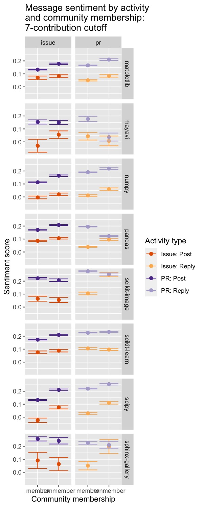
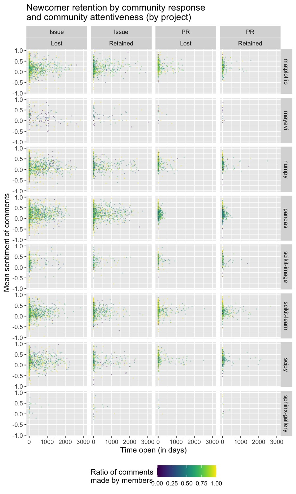
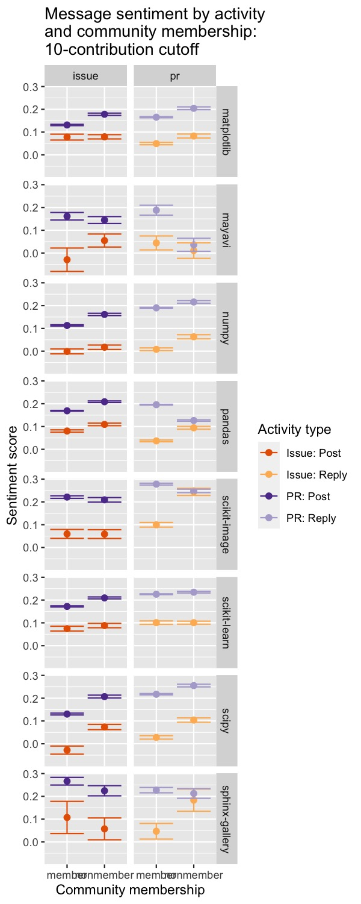
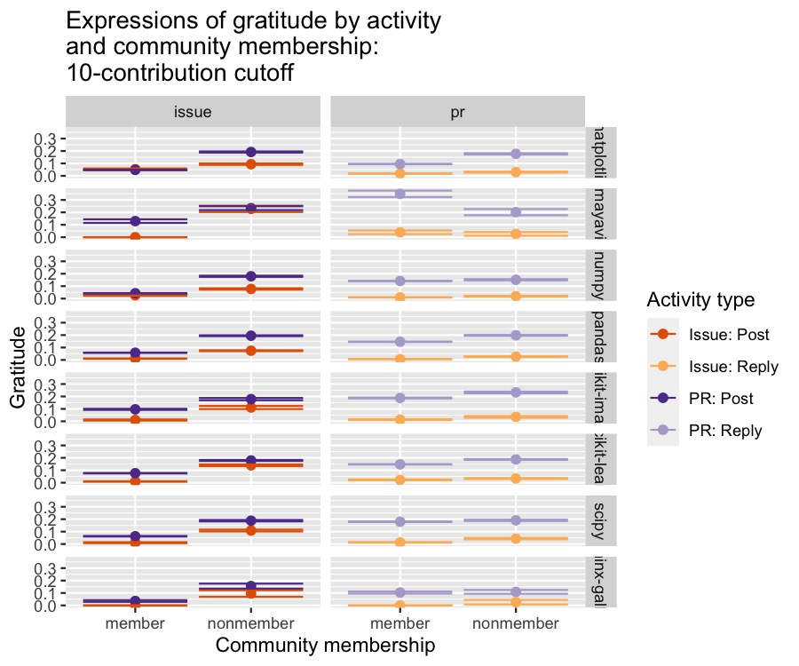

This R markdown provides the robustness analysis for our forthcoming manuscript
(Paxton, Varoquaux, Geiger, & Holdgraf, *in preparation*).

To run this from scratch, you will need the following files:

* `../../data/analysis_data/sentiment_frame_tickets-for_r.csv`: Contains cleaned
**posts**-related data (sometimes also referred to as *tickets*) and 
derived variables from scraped GitHub data.
* `../../data/analysis_data/sentiment_frame_comments-for_r.csv`: Contains
cleaned **comments**-related data and derived variables from scraped GitHub
data.
* `./utils/ossc-libraries_and_functions.r`: Loads in necessary libraries and
creates new functions for our analyses.
* `./utils/data-loading-robustness.R`: loads functions related to data loading and
preprocessing.

**Code written by**: A. Paxton (University of Connecticut) & N. Varoquaux
(CNRS)

**Date last compiled**:  2021-07-08 13:43:30


***

# Preliminaries


```r
# clear everything
rm(list=ls())

# load libraries and add new functions
source('./utils/ossc-libraries_and_functions.r')
source("./utils/data-loading-robustness.R")
```

***

# Create robustness datasets

Here, we'll load the data and specify two additional membership cutoffs: 
7 contributions and 10 contributions.


```r
# specify 7-contribution cutoff
tickets_frame_7 = loading_tickets_data(dataset="original", membership_cutoff = 7)
comments_frame_7 = loading_comments_data(dataset="original", membership_cutoff = 7)

# specify 10-contribution cutoff
tickets_frame_10 = loading_tickets_data(dataset="original", membership_cutoff = 10)
comments_frame_10 = loading_comments_data(dataset="original", membership_cutoff = 10)
```

***

# Data analysis: 7-contribution cutoff

***

## Model Series 1: Sentiment analysis

***

### Data preparation

Before we can run Model Series 1, we need to combine `tickets_frame` and
`comments_frame` into a single dataframe. We do this using the
`combine_tickets_and_comments` function, `defined in utils/data-loading.R`


```r
# create for 7-contribution cutoff
sentiment_frame_7 = combine_tickets_and_comments(tickets_frame_7, 
                                                 comments_frame_7)
```


***

### Model 1.1: Do different kinds of activities materially differ in emotion?

#### Robustness Model 1.1a: 7-contribution cutoff

Here, we reproduce Model 1.1a with a 7-contribution cutoff.


```r
# do members and nonmembers materially differ in emotion?
fixed_creators_v_commenters_emotion_7 = lmer(
  compound_emotion ~ 0 + author_group + (1 | author_name) + (1 | project),
  data=sentiment_frame_7,
  REML=FALSE)
```


```r
# convert Model 1.1a output to dataframe
coefficients_and_se_7 = data.frame(
  summary(fixed_creators_v_commenters_emotion_7)$coefficients)

# get comparison names as rownames
row_names = gsub("author_group", "", 
                 gsub("type", "", row.names(coefficients_and_se_7)))

# convert model estimates to a dataframe
means = coefficients_and_se_7$Estimate
names(means) = row_names

# convert standard error to dataframe
se = coefficients_and_se_7$Std..Error
names(se) = row_names

# compute t-statistics and p-values for desired contrasts
contrasts = c("member-nonmember")
author_groups_tests_7 = compute_t_statistics(
  means, se,
  contrasts)
author_groups_tests_7[, "p_value"] = compute_p_value_from_t_stats(
  author_groups_tests_7$t_stats)
```


```r
dir.create("results/models", showWarnings=FALSE)
write.table(coefficients_and_se_7,
            file="results/models/model-1.1b1-7cutoff.tsv",
            sep="\t")
```

#### Robustness Model 1.1b: 7-contribution cutoff

Here, we reproduce Model 1.1b with a 7-contribution cutoff.


```r
# do posts and comments materially differ in emotion?
fixed_types_emotion_7 = lmer(
  compound_emotion ~ 0 + type + (1 | author_name) + (1 | project),
  data=sentiment_frame_7,
  REML=FALSE)
```


```r
# convert Model 1.1b output to dataframe
coefficients_and_se_7 = data.frame(
  summary(fixed_types_emotion_7)$coefficients)

# get comparison names as rownames
row_names = gsub("author_group", "", 
                 gsub("type", "", row.names(coefficients_and_se_7)))

# convert model estimates to a dataframe
means = coefficients_and_se_7$Estimate
names(means) = row_names

# convert standard error to dataframe
se = coefficients_and_se_7$Std..Error
names(se) = row_names

# compute t-statistics and p-values for desired contrasts
contrasts = c("issue_post-issue_reply", # issues: posts vs. replies
              "pr_post-pr_reply",       # PRs: posts vs. replies
              "issue_post-pr_post",     # posts: issues vs. PRs
              "issue_reply-pr_reply")   # replies: issues vs. PRs
types_tests_7 = compute_t_statistics(
  means, se,
  contrasts)
types_tests_7[, "p_value"] = compute_p_value_from_t_stats(types_tests_7$t_stats)
```


```r
write.table(coefficients_and_se_7,
            file="results/models/model-1.1b2-7cutoff.tsv",
            sep="\t")
```

#### Robustness Model 1.1c: 7-contribution cutoff

Here, we reproduce Model 1.1c with a 7-contribution cutoff.


```r
# does emotion differ by the interaction between activity and authorship group?
community_contribution_emotion_7 = lmer(
  compound_emotion ~ 0 + type:author_group + (1 | author_name) + (1 | project),
  data=sentiment_frame_7,
  REML=FALSE)
```

Run *t*-tests among levels.


```r
# convert Model 1.1c output to dataframe
coefficients_and_se_7 = data.frame(
  summary(community_contribution_emotion_7)$coefficients)

# get comparison names as rownames
row_names = gsub("author_group", "", gsub("type", "", row.names(coefficients_and_se_7)))

# convert model estimates to a dataframe
means = coefficients_and_se_7$Estimate
names(means) = row_names

# convert standard error to dataframe
se = coefficients_and_se_7$Std..Error
names(se) = row_names

# compute t-statistics and p-values for desired contrasts
contrasts = c(
  "issue_post:member-issue_post:nonmember",     # activity static (issue posts); membership varies (members v. nonmembers)
  "issue_reply:member-issue_reply:nonmember",   # activity static (issue replies); membership varies (members v. nonmembers)
  "pr_post:member-pr_post:nonmember",           # activity static (PR posts); membership varies (members v. nonmembers)
  "pr_reply:member-pr_reply:nonmember",         # activity static (PR replies); membership varies (members v. nonmembers)
  "issue_post:member-issue_reply:member",       # activity varies (issue posts vs. issue replies); membership static (members)
  "issue_post:nonmember-issue_reply:nonmember", # activity varies (issue posts vs. issue replies); membership static (nonmembers)
  "pr_post:member-pr_reply:member",             # activity varies (PR posts vs. PR replies); membership static (members)
  "pr_post:nonmember-pr_reply:nonmember",       # activity varies (PR posts vs. PR replies); membership static (nonmembers)
  "issue_post:member-pr_post:member",           # activity varies (issue posts vs. PR posts); membership static (members)
  "issue_post:nonmember-pr_post:nonmember",     # activity varies (issue posts vs. PR posts); membership static (nonmembers)
  "issue_reply:member-pr_reply:member",         # activity varies (issue replies vs. PR replies); membership static (members)
  "issue_reply:nonmember-pr_reply:nonmember")   # activity varies (issue replies vs. PR replies); membership static (nonmembers)
types_author_groups_tests_7 = compute_t_statistics(
  means, se,
  contrasts)
types_author_groups_tests_7[, "p_value"] = compute_p_value_from_t_stats(
  types_author_groups_tests_7$"t_stats")
```


```r
write.table(coefficients_and_se_7,
            file="results/models/model-1.1b3-7cutoff.tsv",
            sep="\t")
```

#### Robustness Model 1.1d: 7-contribution cutoff

Here, we reproduce Model 1.1d with a 7-contribution cutoff.


```r
# do posts and comments materially differ in emotion by projects?
creators_v_commenters_emotion_by_project_7 = lmer(
  compound_emotion ~ 0 + project:type:author_group + (1 | author_name),
  data = sentiment_frame_7,
  REML = FALSE)
```


```r
# convert Model 1.1d output to dataframe
coefficients_and_se_7 = data.frame(
  summary(creators_v_commenters_emotion_by_project_7)$coefficients)

# get comparison names as rownames
row_names = gsub(
  "project", "", gsub(
    "author_group", "", gsub(
      "type", "", row.names(coefficients_and_se_7))))

# replace hyphens in project names with periods
row_names = gsub(
  "scikit-", "scikit.", gsub(
    "sphinx-", "sphinx.", row_names))

# convert model estimates to a dataframe
means = coefficients_and_se_7$Estimate
names(means) = row_names

# convert standard error to dataframe
se = coefficients_and_se_7$Std..Error
names(se) = row_names

# compute t-statistics and p-values for desired contrasts
# (note: ordering of contrasts within each project is identical to Model 1.1c)
contrasts = c(
  
  # scikit-learn
  "scikit.learn:issue_post:member-scikit.learn:issue_post:nonmember",   
  "scikit.learn:issue_reply:member-scikit.learn:issue_reply:nonmember",
  "scikit.learn:pr_post:member-scikit.learn:pr_post:nonmember",
  "scikit.learn:pr_reply:member-scikit.learn:pr_reply:nonmember",
  "scikit.learn:issue_post:member-scikit.learn:issue_reply:member",
  "scikit.learn:issue_post:nonmember-scikit.learn:issue_reply:nonmember",
  "scikit.learn:pr_post:member-scikit.learn:pr_reply:member",
  "scikit.learn:pr_post:nonmember-scikit.learn:pr_reply:nonmember",
  "scikit.learn:issue_post:member-scikit.learn:pr_post:member",
  "scikit.learn:issue_post:nonmember-scikit.learn:pr_post:nonmember",    
  "scikit.learn:issue_reply:member-scikit.learn:pr_reply:member",  
  "scikit.learn:issue_reply:nonmember-scikit.learn:pr_reply:nonmember",
  
  # scikit-image
  "scikit.image:issue_post:member-scikit.image:issue_post:nonmember", 
  "scikit.image:issue_reply:member-scikit.image:issue_reply:nonmember",
  "scikit.image:pr_post:member-scikit.image:pr_post:nonmember",       
  "scikit.image:pr_reply:member-scikit.image:pr_reply:nonmember",     
  "scikit.image:issue_post:member-scikit.image:issue_reply:member",
  "scikit.image:issue_post:nonmember-scikit.image:issue_reply:nonmember",
  "scikit.image:pr_post:member-scikit.image:pr_reply:member",     
  "scikit.image:pr_post:nonmember-scikit.image:pr_reply:nonmember",    
  "scikit.image:issue_post:member-scikit.image:pr_post:member",   
  "scikit.image:issue_post:nonmember-scikit.image:pr_post:nonmember",    
  "scikit.image:issue_reply:member-scikit.image:pr_reply:member",  
  "scikit.image:issue_reply:nonmember-scikit.image:pr_reply:nonmember",
  
  # matplotlib
  "matplotlib:issue_post:member-matplotlib:issue_post:nonmember", 
  "matplotlib:issue_reply:member-matplotlib:issue_reply:nonmember",
  "matplotlib:pr_post:member-matplotlib:pr_post:nonmember",       
  "matplotlib:pr_reply:member-matplotlib:pr_reply:nonmember",     
  "matplotlib:issue_post:member-matplotlib:issue_reply:member",
  "matplotlib:issue_post:nonmember-matplotlib:issue_reply:nonmember",
  "matplotlib:pr_post:member-matplotlib:pr_reply:member",     
  "matplotlib:pr_post:nonmember-matplotlib:pr_reply:nonmember",    
  "matplotlib:issue_post:member-matplotlib:pr_post:member",   
  "matplotlib:issue_post:nonmember-matplotlib:pr_post:nonmember",    
  "matplotlib:issue_reply:member-matplotlib:pr_reply:member",  
  "matplotlib:issue_reply:nonmember-matplotlib:pr_reply:nonmember",
  
  # mayavi
  "mayavi:issue_post:member-mayavi:issue_post:nonmember", 
  "mayavi:issue_reply:member-mayavi:issue_reply:nonmember",
  "mayavi:pr_post:member-mayavi:pr_post:nonmember",       
  "mayavi:pr_reply:member-mayavi:pr_reply:nonmember",     
  "mayavi:issue_post:member-mayavi:issue_reply:member",
  "mayavi:issue_post:nonmember-mayavi:issue_reply:nonmember",
  "mayavi:pr_post:member-mayavi:pr_reply:member",     
  "mayavi:pr_post:nonmember-mayavi:pr_reply:nonmember",    
  "mayavi:issue_post:member-mayavi:pr_post:member",   
  "mayavi:issue_post:nonmember-mayavi:pr_post:nonmember",    
  "mayavi:issue_reply:member-mayavi:pr_reply:member",  
  "mayavi:issue_reply:nonmember-mayavi:pr_reply:nonmember",
  
  # pandas
  "pandas:issue_post:member-pandas:issue_post:nonmember", 
  "pandas:issue_reply:member-pandas:issue_reply:nonmember",
  "pandas:pr_post:member-pandas:pr_post:nonmember",       
  "pandas:pr_reply:member-pandas:pr_reply:nonmember",     
  "pandas:issue_post:member-pandas:issue_reply:member",
  "pandas:issue_post:nonmember-pandas:issue_reply:nonmember",
  "pandas:pr_post:member-pandas:pr_reply:member",     
  "pandas:pr_post:nonmember-pandas:pr_reply:nonmember",    
  "pandas:issue_post:member-pandas:pr_post:member",   
  "pandas:issue_post:nonmember-pandas:pr_post:nonmember",    
  "pandas:issue_reply:member-pandas:pr_reply:member",  
  "pandas:issue_reply:nonmember-pandas:pr_reply:nonmember",
  
  # scipy
  "scipy:issue_post:member-scipy:issue_post:nonmember", 
  "scipy:issue_reply:member-scipy:issue_reply:nonmember",
  "scipy:pr_post:member-scipy:pr_post:nonmember",       
  "scipy:pr_reply:member-scipy:pr_reply:nonmember",     
  "scipy:issue_post:member-scipy:issue_reply:member",
  "scipy:issue_post:nonmember-scipy:issue_reply:nonmember",
  "scipy:pr_post:member-scipy:pr_reply:member",     
  "scipy:pr_post:nonmember-scipy:pr_reply:nonmember",    
  "scipy:issue_post:member-scipy:pr_post:member",   
  "scipy:issue_post:nonmember-scipy:pr_post:nonmember",    
  "scipy:issue_reply:member-scipy:pr_reply:member",  
  "scipy:issue_reply:nonmember-scipy:pr_reply:nonmember",
  
  # numpy
  "numpy:issue_post:member-numpy:issue_post:nonmember", 
  "numpy:issue_reply:member-numpy:issue_reply:nonmember",
  "numpy:pr_post:member-numpy:pr_post:nonmember",       
  "numpy:pr_reply:member-numpy:pr_reply:nonmember",     
  "numpy:issue_post:member-numpy:issue_reply:member",
  "numpy:issue_post:nonmember-numpy:issue_reply:nonmember",
  "numpy:pr_post:member-numpy:pr_reply:member",     
  "numpy:pr_post:nonmember-numpy:pr_reply:nonmember",    
  "numpy:issue_post:member-numpy:pr_post:member",   
  "numpy:issue_post:nonmember-numpy:pr_post:nonmember",    
  "numpy:issue_reply:member-numpy:pr_reply:member",  
  "numpy:issue_reply:nonmember-numpy:pr_reply:nonmember",
  
  # sphinx-gallery
  "sphinx.gallery:issue_post:member-sphinx.gallery:issue_post:nonmember", 
  "sphinx.gallery:issue_reply:member-sphinx.gallery:issue_reply:nonmember",
  "sphinx.gallery:pr_post:member-sphinx.gallery:pr_post:nonmember",       
  "sphinx.gallery:pr_reply:member-sphinx.gallery:pr_reply:nonmember",     
  "sphinx.gallery:issue_post:member-sphinx.gallery:issue_reply:member",
  "sphinx.gallery:issue_post:nonmember-sphinx.gallery:issue_reply:nonmember",
  "sphinx.gallery:pr_post:member-sphinx.gallery:pr_reply:member",     
  "sphinx.gallery:pr_post:nonmember-sphinx.gallery:pr_reply:nonmember",    
  "sphinx.gallery:issue_post:member-sphinx.gallery:pr_post:member",   
  "sphinx.gallery:issue_post:nonmember-sphinx.gallery:pr_post:nonmember",    
  "sphinx.gallery:issue_reply:member-sphinx.gallery:pr_reply:member",  
  "sphinx.gallery:issue_reply:nonmember-sphinx.gallery:pr_reply:nonmember"
)
project_types_author_group_tests_7 = compute_t_statistics(
  means, se,
  contrasts)
project_types_author_group_tests_7[, "p_value"] = compute_p_value_from_t_stats(
  project_types_author_group_tests_7$t_stats) 
```


```r
write.table(coefficients_and_se_7,
            file="results/models/model-1.1c-7cutoff.tsv",
            sep="\t")
```

#### Robustness Model 1.1: Overall results with 7-contribution cutoff

Now we bring together all analyses from Model 1.1's 7-contribution cutoff.


```r
# specify main terms
author_groups_tests_7["contrast"] = row.names(author_groups_tests_7)
types_tests_7["contrast"] = row.names(types_tests_7)
all_tests_7 = merge(author_groups_tests_7, types_tests_7, all=TRUE, sort=FALSE)
all_tests_7["model"] = "Main Terms"

# specify 2-way interactions
types_author_groups_tests_7["contrast"] = row.names(types_author_groups_tests_7)
types_author_groups_tests_7["model"] = "2W: Types x Author Groups"
all_tests_7 = merge(all_tests_7, types_author_groups_tests_7, all=TRUE, sort=FALSE)

# specify 3-way interactions
project_types_author_group_tests_7["contrast"] = row.names(project_types_author_group_tests_7)
project_types_author_group_tests_7["model"] = "3W: Types x Author Groups x Project"
all_tests_7 = merge(all_tests_7, project_types_author_group_tests_7, all=TRUE,
                    sort=FALSE)
```

Let's correct all tests at once for multiple comparisons.


```r
# specify all contrasts
row.names(all_tests_7) = all_tests_7$contrast
all_tests_7 = subset(all_tests_7, select=-c(contrast))

# print the table (reordering columns for readibility)
all_tests_7 = all_tests_7[c("model", "t_stats", "p_value")]
pander_clean_anova(all_tests_7, rename_columns=FALSE)
```


|                                    &nbsp;                                    |                model                | t_stats  | p_value | p_adj  | sig |
|:----------------------------------------------------------------------------:|:-----------------------------------:|:--------:|:-------:|:------:|:---:|
|                             **member-nonmember**                             |             Main Terms              | -0.1101  |  0.91   |  0.94  |     |
|                          **issue_post-issue_reply**                          |             Main Terms              |  -8.828  | 0.0001  | 0.0001 | *** |
|                             **pr_post-pr_reply**                             |             Main Terms              |  -11.45  | 0.0001  | 0.0001 | *** |
|                            **issue_post-pr_post**                            |             Main Terms              | -0.6207  |  0.54   |  0.65  |     |
|                           **issue_reply-pr_reply**                           |             Main Terms              |  -3.329  |  0.001  | 0.002  | **  |
|                  **issue_post:member-issue_post:nonmember**                  |      2W: Types x Author Groups      | -0.5187  |   0.6   |  0.7   |     |
|                 **issue_reply:member-issue_reply:nonmember**                 |      2W: Types x Author Groups      |  -2.217  |  0.027  | 0.045  |  *  |
|                     **pr_post:member-pr_post:nonmember**                     |      2W: Types x Author Groups      |  -2.53   |  0.011  |  0.02  |  *  |
|                    **pr_reply:member-pr_reply:nonmember**                    |      2W: Types x Author Groups      | -0.1688  |  0.87   |  0.92  |     |
|                   **issue_post:member-issue_reply:member**                   |      2W: Types x Author Groups      |  -7.25   | 0.0001  | 0.0001 | *** |
|                **issue_post:nonmember-issue_reply:nonmember**                |      2W: Types x Author Groups      |  -9.355  | 0.0001  | 0.0001 | *** |
|                      **pr_post:member-pr_reply:member**                      |      2W: Types x Author Groups      |  -11.1   | 0.0001  | 0.0001 | *** |
|                   **pr_post:nonmember-pr_reply:nonmember**                   |      2W: Types x Author Groups      |  -8.804  | 0.0001  | 0.0001 | *** |
|                     **issue_post:member-pr_post:member**                     |      2W: Types x Author Groups      |  0.3624  |  0.72   |  0.79  |     |
|                  **issue_post:nonmember-pr_post:nonmember**                  |      2W: Types x Author Groups      |  -1.676  |  0.094  | 0.149  |     |
|                    **issue_reply:member-pr_reply:member**                    |      2W: Types x Author Groups      |  -3.41   |  0.001  | 0.001  | **  |
|                 **issue_reply:nonmember-pr_reply:nonmember**                 |      2W: Types x Author Groups      |  -1.446  |  0.148  | 0.218  |     |
|     **scikit.learn:issue_post:member-scikit.learn:issue_post:nonmember**     | 3W: Types x Author Groups x Project | -0.5023  |  0.62   |  0.7   |     |
|    **scikit.learn:issue_reply:member-scikit.learn:issue_reply:nonmember**    | 3W: Types x Author Groups x Project |  -4.349  | 0.0001  | 0.0001 | *** |
|        **scikit.learn:pr_post:member-scikit.learn:pr_post:nonmember**        | 3W: Types x Author Groups x Project | -0.1151  |  0.91   |  0.94  |     |
|       **scikit.learn:pr_reply:member-scikit.learn:pr_reply:nonmember**       | 3W: Types x Author Groups x Project |  -1.56   |  0.119  | 0.183  |     |
|      **scikit.learn:issue_post:member-scikit.learn:issue_reply:member**      | 3W: Types x Author Groups x Project |  -8.349  | 0.0001  | 0.0001 | *** |
|   **scikit.learn:issue_post:nonmember-scikit.learn:issue_reply:nonmember**   | 3W: Types x Author Groups x Project |  -13.19  | 0.0001  | 0.0001 | *** |
|         **scikit.learn:pr_post:member-scikit.learn:pr_reply:member**         | 3W: Types x Author Groups x Project |  -12.09  | 0.0001  | 0.0001 | *** |
|      **scikit.learn:pr_post:nonmember-scikit.learn:pr_reply:nonmember**      | 3W: Types x Author Groups x Project |  -14.25  | 0.0001  | 0.0001 | *** |
|        **scikit.learn:issue_post:member-scikit.learn:pr_post:member**        | 3W: Types x Author Groups x Project |  -1.679  |  0.093  | 0.149  |     |
|     **scikit.learn:issue_post:nonmember-scikit.learn:pr_post:nonmember**     | 3W: Types x Author Groups x Project |  -1.555  |  0.12   | 0.183  |     |
|       **scikit.learn:issue_reply:member-scikit.learn:pr_reply:member**       | 3W: Types x Author Groups x Project |  -6.358  | 0.0001  | 0.0001 | *** |
|    **scikit.learn:issue_reply:nonmember-scikit.learn:pr_reply:nonmember**    | 3W: Types x Author Groups x Project |  -4.049  | 0.0001  | 0.0001 | *** |
|     **scikit.image:issue_post:member-scikit.image:issue_post:nonmember**     | 3W: Types x Author Groups x Project | -0.5506  |  0.58   |  0.68  |     |
|    **scikit.image:issue_reply:member-scikit.image:issue_reply:nonmember**    | 3W: Types x Author Groups x Project |  -1.26   |  0.208  |  0.3   |     |
|        **scikit.image:pr_post:member-scikit.image:pr_post:nonmember**        | 3W: Types x Author Groups x Project |  -6.823  | 0.0001  | 0.0001 | *** |
|       **scikit.image:pr_reply:member-scikit.image:pr_reply:nonmember**       | 3W: Types x Author Groups x Project |  0.1564  |  0.88   |  0.92  |     |
|      **scikit.image:issue_post:member-scikit.image:issue_reply:member**      | 3W: Types x Author Groups x Project |  -7.104  | 0.0001  | 0.0001 | *** |
|   **scikit.image:issue_post:nonmember-scikit.image:issue_reply:nonmember**   | 3W: Types x Author Groups x Project |  -8.036  | 0.0001  | 0.0001 | *** |
|         **scikit.image:pr_post:member-scikit.image:pr_reply:member**         | 3W: Types x Author Groups x Project |  -9.174  | 0.0001  | 0.0001 | *** |
|      **scikit.image:pr_post:nonmember-scikit.image:pr_reply:nonmember**      | 3W: Types x Author Groups x Project | -0.09704 |  0.92   |  0.94  |     |
|        **scikit.image:issue_post:member-scikit.image:pr_post:member**        | 3W: Types x Author Groups x Project |  -2.75   |  0.006  | 0.011  |  *  |
|     **scikit.image:issue_post:nonmember-scikit.image:pr_post:nonmember**     | 3W: Types x Author Groups x Project |  -8.337  | 0.0001  | 0.0001 | *** |
|       **scikit.image:issue_reply:member-scikit.image:pr_reply:member**       | 3W: Types x Author Groups x Project |  -4.308  | 0.0001  | 0.0001 | *** |
|    **scikit.image:issue_reply:nonmember-scikit.image:pr_reply:nonmember**    | 3W: Types x Author Groups x Project |  -2.616  |  0.009  | 0.016  |  *  |
|       **matplotlib:issue_post:member-matplotlib:issue_post:nonmember**       | 3W: Types x Author Groups x Project | -0.3307  |  0.74   |  0.81  |     |
|      **matplotlib:issue_reply:member-matplotlib:issue_reply:nonmember**      | 3W: Types x Author Groups x Project | -0.9883  |  0.32   |  0.43  |     |
|          **matplotlib:pr_post:member-matplotlib:pr_post:nonmember**          | 3W: Types x Author Groups x Project |  -0.603  |  0.55   |  0.66  |     |
|         **matplotlib:pr_reply:member-matplotlib:pr_reply:nonmember**         | 3W: Types x Author Groups x Project |  -1.134  |  0.26   |  0.36  |     |
|        **matplotlib:issue_post:member-matplotlib:issue_reply:member**        | 3W: Types x Author Groups x Project |  -6.957  | 0.0001  | 0.0001 | *** |
|     **matplotlib:issue_post:nonmember-matplotlib:issue_reply:nonmember**     | 3W: Types x Author Groups x Project |  -10.12  | 0.0001  | 0.0001 | *** |
|           **matplotlib:pr_post:member-matplotlib:pr_reply:member**           | 3W: Types x Author Groups x Project |  -11.17  | 0.0001  | 0.0001 | *** |
|        **matplotlib:pr_post:nonmember-matplotlib:pr_reply:nonmember**        | 3W: Types x Author Groups x Project |  -9.306  | 0.0001  | 0.0001 | *** |
|          **matplotlib:issue_post:member-matplotlib:pr_post:member**          | 3W: Types x Author Groups x Project | -0.3864  |   0.7   |  0.79  |     |
|       **matplotlib:issue_post:nonmember-matplotlib:pr_post:nonmember**       | 3W: Types x Author Groups x Project | -0.6682  |   0.5   |  0.63  |     |
|         **matplotlib:issue_reply:member-matplotlib:pr_reply:member**         | 3W: Types x Author Groups x Project |  -2.773  |  0.006  | 0.011  |  *  |
|      **matplotlib:issue_reply:nonmember-matplotlib:pr_reply:nonmember**      | 3W: Types x Author Groups x Project |  -3.012  |  0.003  | 0.005  | **  |
|           **mayavi:issue_post:member-mayavi:issue_post:nonmember**           | 3W: Types x Author Groups x Project |  -1.119  |  0.26   |  0.36  |     |
|          **mayavi:issue_reply:member-mayavi:issue_reply:nonmember**          | 3W: Types x Author Groups x Project | -0.6237  |  0.53   |  0.65  |     |
|              **mayavi:pr_post:member-mayavi:pr_post:nonmember**              | 3W: Types x Author Groups x Project | -0.3777  |  0.71   |  0.79  |     |
|             **mayavi:pr_reply:member-mayavi:pr_reply:nonmember**             | 3W: Types x Author Groups x Project |  -1.511  |  0.131  | 0.194  |     |
|            **mayavi:issue_post:member-mayavi:issue_reply:member**            | 3W: Types x Author Groups x Project |  -1.866  |  0.062  | 0.103  |     |
|         **mayavi:issue_post:nonmember-mayavi:issue_reply:nonmember**         | 3W: Types x Author Groups x Project |  -2.811  |  0.005  |  0.01  |  *  |
|               **mayavi:pr_post:member-mayavi:pr_reply:member**               | 3W: Types x Author Groups x Project |  -2.325  |  0.02   | 0.035  |  *  |
|            **mayavi:pr_post:nonmember-mayavi:pr_reply:nonmember**            | 3W: Types x Author Groups x Project |  -3.264  |  0.001  | 0.002  | **  |
|              **mayavi:issue_post:member-mayavi:pr_post:member**              | 3W: Types x Author Groups x Project | 0.01245  |  0.99   |  0.99  |     |
|           **mayavi:issue_post:nonmember-mayavi:pr_post:nonmember**           | 3W: Types x Author Groups x Project |  0.9164  |  0.36   |  0.47  |     |
|             **mayavi:issue_reply:member-mayavi:pr_reply:member**             | 3W: Types x Author Groups x Project | -0.1123  |  0.91   |  0.94  |     |
|          **mayavi:issue_reply:nonmember-mayavi:pr_reply:nonmember**          | 3W: Types x Author Groups x Project |  -1.517  |  0.129  | 0.194  |     |
|           **pandas:issue_post:member-pandas:issue_post:nonmember**           | 3W: Types x Author Groups x Project |  -1.016  |  0.31   |  0.42  |     |
|          **pandas:issue_reply:member-pandas:issue_reply:nonmember**          | 3W: Types x Author Groups x Project |  -5.114  | 0.0001  | 0.0001 | *** |
|              **pandas:pr_post:member-pandas:pr_post:nonmember**              | 3W: Types x Author Groups x Project |  -4.439  | 0.0001  | 0.0001 | *** |
|             **pandas:pr_reply:member-pandas:pr_reply:nonmember**             | 3W: Types x Author Groups x Project |  3.027   |  0.002  | 0.005  | **  |
|            **pandas:issue_post:member-pandas:issue_reply:member**            | 3W: Types x Author Groups x Project |  -9.48   | 0.0001  | 0.0001 | *** |
|         **pandas:issue_post:nonmember-pandas:issue_reply:nonmember**         | 3W: Types x Author Groups x Project |  -15.26  | 0.0001  | 0.0001 | *** |
|               **pandas:pr_post:member-pandas:pr_reply:member**               | 3W: Types x Author Groups x Project |  -17.9   | 0.0001  | 0.0001 | *** |
|            **pandas:pr_post:nonmember-pandas:pr_reply:nonmember**            | 3W: Types x Author Groups x Project |  -8.93   | 0.0001  | 0.0001 | *** |
|              **pandas:issue_post:member-pandas:pr_post:member**              | 3W: Types x Author Groups x Project |  4.495   | 0.0001  | 0.0001 | *** |
|           **pandas:issue_post:nonmember-pandas:pr_post:nonmember**           | 3W: Types x Author Groups x Project |  0.7324  |  0.46   |  0.59  |     |
|             **pandas:issue_reply:member-pandas:pr_reply:member**             | 3W: Types x Author Groups x Project |  -3.828  | 0.0001  | 0.0003 | *** |
|          **pandas:issue_reply:nonmember-pandas:pr_reply:nonmember**          | 3W: Types x Author Groups x Project |  4.171   | 0.0001  | 0.0001 | *** |
|            **scipy:issue_post:member-scipy:issue_post:nonmember**            | 3W: Types x Author Groups x Project |  -3.689  | 0.0002  |   0    | *** |
|           **scipy:issue_reply:member-scipy:issue_reply:nonmember**           | 3W: Types x Author Groups x Project |  -5.782  | 0.0001  | 0.0001 | *** |
|               **scipy:pr_post:member-scipy:pr_post:nonmember**               | 3W: Types x Author Groups x Project |  -3.722  | 0.0002  |   0    | *** |
|              **scipy:pr_reply:member-scipy:pr_reply:nonmember**              | 3W: Types x Author Groups x Project |  -1.127  |  0.26   |  0.36  |     |
|             **scipy:issue_post:member-scipy:issue_reply:member**             | 3W: Types x Author Groups x Project |  -9.088  | 0.0001  | 0.0001 | *** |
|          **scipy:issue_post:nonmember-scipy:issue_reply:nonmember**          | 3W: Types x Author Groups x Project |  -11.79  | 0.0001  | 0.0001 | *** |
|                **scipy:pr_post:member-scipy:pr_reply:member**                | 3W: Types x Author Groups x Project |  -16.37  | 0.0001  | 0.0001 | *** |
|             **scipy:pr_post:nonmember-scipy:pr_reply:nonmember**             | 3W: Types x Author Groups x Project |  -10.65  | 0.0001  | 0.0001 | *** |
|               **scipy:issue_post:member-scipy:pr_post:member**               | 3W: Types x Author Groups x Project |  -2.735  |  0.006  | 0.012  |  *  |
|            **scipy:issue_post:nonmember-scipy:pr_post:nonmember**            | 3W: Types x Author Groups x Project |  -2.458  |  0.014  | 0.025  |  *  |
|              **scipy:issue_reply:member-scipy:pr_reply:member**              | 3W: Types x Author Groups x Project |  -9.164  | 0.0001  | 0.0001 | *** |
|           **scipy:issue_reply:nonmember-scipy:pr_reply:nonmember**           | 3W: Types x Author Groups x Project |   -3.7   | 0.0002  |   0    | *** |
|            **numpy:issue_post:member-numpy:issue_post:nonmember**            | 3W: Types x Author Groups x Project |  0.821   |  0.41   |  0.54  |     |
|           **numpy:issue_reply:member-numpy:issue_reply:nonmember**           | 3W: Types x Author Groups x Project |  -2.805  |  0.005  |  0.01  |  *  |
|               **numpy:pr_post:member-numpy:pr_post:nonmember**               | 3W: Types x Author Groups x Project |  -0.775  |  0.44   |  0.56  |     |
|              **numpy:pr_reply:member-numpy:pr_reply:nonmember**              | 3W: Types x Author Groups x Project |  0.6939  |  0.49   |  0.61  |     |
|             **numpy:issue_post:member-numpy:issue_reply:member**             | 3W: Types x Author Groups x Project |  -9.073  | 0.0001  | 0.0001 | *** |
|          **numpy:issue_post:nonmember-numpy:issue_reply:nonmember**          | 3W: Types x Author Groups x Project |  -14.15  | 0.0001  | 0.0001 | *** |
|                **numpy:pr_post:member-numpy:pr_reply:member**                | 3W: Types x Author Groups x Project |  -16.88  | 0.0001  | 0.0001 | *** |
|             **numpy:pr_post:nonmember-numpy:pr_reply:nonmember**             | 3W: Types x Author Groups x Project |  -11.78  | 0.0001  | 0.0001 | *** |
|               **numpy:issue_post:member-numpy:pr_post:member**               | 3W: Types x Author Groups x Project |  -1.359  |  0.174  |  0.25  |     |
|            **numpy:issue_post:nonmember-numpy:pr_post:nonmember**            | 3W: Types x Author Groups x Project |  -2.96   |  0.003  | 0.006  | **  |
|              **numpy:issue_reply:member-numpy:pr_reply:member**              | 3W: Types x Author Groups x Project |  -9.457  | 0.0001  | 0.0001 | *** |
|           **numpy:issue_reply:nonmember-numpy:pr_reply:nonmember**           | 3W: Types x Author Groups x Project |  -5.041  | 0.0001  | 0.0001 | *** |
|   **sphinx.gallery:issue_post:member-sphinx.gallery:issue_post:nonmember**   | 3W: Types x Author Groups x Project |  0.2718  |  0.79   |  0.85  |     |
|  **sphinx.gallery:issue_reply:member-sphinx.gallery:issue_reply:nonmember**  | 3W: Types x Author Groups x Project |  0.9494  |  0.34   |  0.46  |     |
|      **sphinx.gallery:pr_post:member-sphinx.gallery:pr_post:nonmember**      | 3W: Types x Author Groups x Project |  -1.852  |  0.064  | 0.105  |     |
|     **sphinx.gallery:pr_reply:member-sphinx.gallery:pr_reply:nonmember**     | 3W: Types x Author Groups x Project |  0.5485  |  0.58   |  0.68  |     |
|    **sphinx.gallery:issue_post:member-sphinx.gallery:issue_reply:member**    | 3W: Types x Author Groups x Project |  -3.677  | 0.0002  | 0.001  | **  |
| **sphinx.gallery:issue_post:nonmember-sphinx.gallery:issue_reply:nonmember** | 3W: Types x Author Groups x Project |  -3.645  | 0.0003  | 0.001  | **  |
|       **sphinx.gallery:pr_post:member-sphinx.gallery:pr_reply:member**       | 3W: Types x Author Groups x Project |  -3.591  | 0.0003  | 0.001  | **  |
|    **sphinx.gallery:pr_post:nonmember-sphinx.gallery:pr_reply:nonmember**    | 3W: Types x Author Groups x Project | -0.03203 |  0.97   |  0.98  |     |
|      **sphinx.gallery:issue_post:member-sphinx.gallery:pr_post:member**      | 3W: Types x Author Groups x Project |  -0.288  |  0.77   |  0.84  |     |
|   **sphinx.gallery:issue_post:nonmember-sphinx.gallery:pr_post:nonmember**   | 3W: Types x Author Groups x Project |  -2.276  |  0.023  | 0.039  |  *  |
|     **sphinx.gallery:issue_reply:member-sphinx.gallery:pr_reply:member**     | 3W: Types x Author Groups x Project |  1.603   |  0.109  | 0.171  |     |
|  **sphinx.gallery:issue_reply:nonmember-sphinx.gallery:pr_reply:nonmember**  | 3W: Types x Author Groups x Project |  0.5899  |  0.56   |  0.66  |     |


```r
all_tests$p_val_adjusted = p.adjust(all_tests$p_value, method="BH")
write.table(all_tests, file="results/models/model-1.1b_final_pvalues-7cutoff.tsv")
```

Finally, let's plot these effects.


```
## Warning: `fun.y` is deprecated. Use `fun` instead.
```


```
## Warning: `fun.y` is deprecated. Use `fun` instead.
```



***

### Model 1.2: Time-course analysis for sentiment

The time-course analysis has been moved in a separate file.

***

### Model 1.3: Do posts and comments materially differ in gratitude?

#### Robustness dataset: Summary stats and visualization


```r
# create a summary table of gratitude by type and author association
gratitude_summary_stats_7 = sentiment_frame_7 %>% ungroup() %>%
  group_by(author_group, type, grateful_count) %>%
  summarise(n = n())
```

```
## `summarise()` has grouped output by 'author_group', 'type'. You can override using the `.groups` argument.
```

```r
pander(gratitude_summary_stats_7, style = 'rmarkdown')
```


| author_group |    type     | grateful_count |   n    |
|:------------:|:-----------:|:--------------:|:------:|
|    member    | issue_post  |       0        | 13300  |
|    member    | issue_post  |       1        |  225   |
|    member    | issue_post  |       2        |   13   |
|    member    | issue_post  |       3        |   3    |
|    member    |   pr_post   |       0        | 23462  |
|    member    |   pr_post   |       1        |  301   |
|    member    |   pr_post   |       2        |   10   |
|    member    | issue_reply |       0        | 127977 |
|    member    | issue_reply |       1        |  7860  |
|    member    | issue_reply |       2        |  227   |
|    member    | issue_reply |       3        |   11   |
|    member    |  pr_reply   |       0        | 177302 |
|    member    |  pr_reply   |       1        | 28419  |
|    member    |  pr_reply   |       2        |  614   |
|    member    |  pr_reply   |       3        |   35   |
|    member    |  pr_reply   |       4        |   2    |
|  nonmember   | issue_post  |       0        | 16847  |
|  nonmember   | issue_post  |       1        |  1637  |
|  nonmember   | issue_post  |       2        |  105   |
|  nonmember   | issue_post  |       3        |   3    |
|  nonmember   |   pr_post   |       0        | 12385  |
|  nonmember   |   pr_post   |       1        |  356   |
|  nonmember   |   pr_post   |       2        |   22   |
|  nonmember   |   pr_post   |       3        |   2    |
|  nonmember   | issue_reply |       0        | 40617  |
|  nonmember   | issue_reply |       1        |  8130  |
|  nonmember   | issue_reply |       2        |  661   |
|  nonmember   | issue_reply |       3        |   44   |
|  nonmember   | issue_reply |       4        |   2    |
|  nonmember   |  pr_reply   |       0        | 38442  |
|  nonmember   |  pr_reply   |       1        |  8251  |
|  nonmember   |  pr_reply   |       2        |  393   |
|  nonmember   |  pr_reply   |       3        |   37   |


#### Robustness Model 1.3b: 7-contribution cutoff

Here, we reproduce Model 1.3b with a 7-contribution cutoff.


```r
# do members and nonmembers materially differ in emotion?
fixed_authors_gratitude_7 = lmer(
  log(grateful_count + 1) ~ 0 + author_group + (1 | project),
  data=sentiment_frame_7,
  REML=FALSE)
```


```r
# convert Model 1.3b output to dataframe
coefficients_and_se_7 = data.frame(
  summary(fixed_authors_gratitude_7)$coefficients)

# get comparison names as rownames
row_names = gsub("author_group", "",
                 gsub("type", "", row.names(coefficients_and_se_7)))

# convert model estimates to a dataframe
means = coefficients_and_se_7$Estimate
names(means) = row_names

# convert standard error to dataframe
se = coefficients_and_se_7$Std..Error
names(se) = row_names

# compute t-statistics and p-values for desired contrasts
contrasts = c("member-nonmember")
author_groups_tests_7 = compute_t_statistics(
  means, se,
  contrasts)
author_groups_tests_7[, "p_value"] = compute_p_value_from_t_stats(
  author_groups_tests_7$t_stats)
```


```r
write.table(coefficients_and_se_7,
            file="results/models/model-1.3b1-7cutoff.tsv",
            sep="\t")
```

#### Robustness Model 1.3c: 7-contribution cutoff

Here, we reproduce Model 1.3c with a 7-contribution cutoff.


```r
# do posts and comments materially differ in emotion?
fixed_types_gratitude_7 = lmer(
  log(grateful_count + 1) ~ 0 + type + (1 | project),
  data=sentiment_frame_7,
  REML=FALSE)
```


```r
# convert Model 1.1c output to dataframe
coefficients_and_se_7 = data.frame(
  summary(fixed_types_gratitude_7)$coefficients)

# get comparison names as rownames
row_names = gsub("author_group", "",
                 gsub("type", "", row.names(coefficients_and_se_7)))

# convert model estimates to a dataframe
means = coefficients_and_se_7$Estimate
names(means) = row_names

# convert standard error to dataframe
se = coefficients_and_se_7$Std..Error
names(se) = row_names

# compute t-statistics and p-values for desired contrasts
contrasts = c("issue_post-issue_reply", # issues: posts vs. replies
              "pr_post-pr_reply",       # PRs: posts vs. replies
              "issue_post-pr_post",     # posts: issues vs. PRs
              "issue_reply-pr_reply")   # replies: issues vs. PRs
types_tests_7 = compute_t_statistics(
  means, se,
  contrasts)
types_tests_7[, "p_value"] = compute_p_value_from_t_stats(types_tests_7$t_stats)
```


```r
write.table(coefficients_and_se_7,
            file="results/models/model-1.3b2-7cutoff.tsv",
            sep="\t")
```

#### Robustness Model 1.3d: 7-contribution cutoff

Here, we reproduce Model 1.3d with a 7-contribution cutoff.


```r
# does emotion differ by the interaction between activity and authorship group?
community_contribution_gratitude_7 = lmer(
  log(grateful_count + 1) ~ 0 + type:author_group + (1 | project),
  data=sentiment_frame_7,
  REML=FALSE)
```


```r
# convert Model 1.3d output to dataframe
coefficients_and_se_7 = data.frame(
  summary(community_contribution_gratitude_7)$coefficients)

# get comparison names as rownames
row_names = gsub("author_group", "", gsub("type", "", row.names(coefficients_and_se_7)))

# convert model estimates to a dataframe
means = coefficients_and_se_7$Estimate
names(means) = row_names

# convert standard error to dataframe
se = coefficients_and_se_7$Std..Error
names(se) = row_names

# compute t-statistics and p-values for desired contrasts
contrasts = c(
  "issue_post:member-issue_post:nonmember",     # activity static (issue posts); membership varies (members v. nonmembers)
  "issue_reply:member-issue_reply:nonmember",   # activity static (issue replies); membership varies (members v. nonmembers)
  "pr_post:member-pr_post:nonmember",           # activity static (PR posts); membership varies (members v. nonmembers)
  "pr_reply:member-pr_reply:nonmember",         # activity static (PR replies); membership varies (members v. nonmembers)
  "issue_post:member-issue_reply:member",       # activity varies (issue posts vs. issue replies); membership static (members)
  "issue_post:nonmember-issue_reply:nonmember", # activity varies (issue posts vs. issue replies); membership static (nonmembers)
  "pr_post:member-pr_reply:member",             # activity varies (PR posts vs. PR replies); membership static (members)
  "pr_post:nonmember-pr_reply:nonmember",       # activity varies (PR posts vs. PR replies); membership static (nonmembers)
  "issue_post:member-pr_post:member",           # activity varies (issue posts vs. PR posts); membership static (members)
  "issue_post:nonmember-pr_post:nonmember",     # activity varies (issue posts vs. PR posts); membership static (nonmembers)
  "issue_reply:member-pr_reply:member",         # activity varies (issue replies vs. PR replies); membership static (members)
  "issue_reply:nonmember-pr_reply:nonmember")   # activity varies (issue replies vs. PR replies); membership static (nonmembers)
types_author_groups_tests_7 = compute_t_statistics(
  means, se,
  contrasts)
types_author_groups_tests_7[, "p_value"] = compute_p_value_from_t_stats(
  types_author_groups_tests_7$"t_stats")
```


```r
write.table(coefficients_and_se_7,
            file="results/models/model-1.3b3-7cutoff.tsv",
            sep="\t")
```

#### Robustness Model 1.3e: 7-contribution cutoff

Here, we reproduce Model 1.3e with a 7-contribution cutoff.


```r
# do posts and comments materially differ in gratitude by projects?
creators_v_commenters_gratitude_by_project_7 = lm(
  log(grateful_count + 1) ~ 0 + project:type:author_group,
  data = sentiment_frame_7)
```


```r
# convert Model 1.3e output to dataframe
coefficients_and_se_7 = data.frame(
  summary(creators_v_commenters_gratitude_by_project_7)$coefficients)

# get comparison names as rownames
row_names = gsub(
  "project", "", gsub(
    "author_group", "", gsub(
      "type", "", row.names(coefficients_and_se_7))))

# replace hyphens in project names with periods
row_names = gsub(
  "scikit-", "scikit.", gsub(
    "sphinx-", "sphinx.", row_names))

# convert model estimates to a dataframe
means = coefficients_and_se_7$Estimate
names(means) = row_names

# convert standard error to dataframe
se = coefficients_and_se_7$Std..Error
names(se) = row_names

# compute t-statistics and p-values for desired contrasts
# (note: ordering of contrasts within each project is identical to Model 1.3c)
contrasts = c(
  
  # scikit-learn
  "scikit.learn:issue_post:member-scikit.learn:issue_post:nonmember",
  "scikit.learn:issue_reply:member-scikit.learn:issue_reply:nonmember",
  "scikit.learn:pr_post:member-scikit.learn:pr_post:nonmember",
  "scikit.learn:pr_reply:member-scikit.learn:pr_reply:nonmember",
  "scikit.learn:issue_post:member-scikit.learn:issue_reply:member",
  "scikit.learn:issue_post:nonmember-scikit.learn:issue_reply:nonmember",
  "scikit.learn:pr_post:member-scikit.learn:pr_reply:member",
  "scikit.learn:pr_post:nonmember-scikit.learn:pr_reply:nonmember",
  "scikit.learn:issue_post:member-scikit.learn:pr_post:member",
  "scikit.learn:issue_post:nonmember-scikit.learn:pr_post:nonmember",
  "scikit.learn:issue_reply:member-scikit.learn:pr_reply:member",
  "scikit.learn:issue_reply:nonmember-scikit.learn:pr_reply:nonmember",
  
  # scikit-image
  "scikit.image:issue_post:member-scikit.image:issue_post:nonmember",
  "scikit.image:issue_reply:member-scikit.image:issue_reply:nonmember",
  "scikit.image:pr_post:member-scikit.image:pr_post:nonmember",
  "scikit.image:pr_reply:member-scikit.image:pr_reply:nonmember",
  "scikit.image:issue_post:member-scikit.image:issue_reply:member",
  "scikit.image:issue_post:nonmember-scikit.image:issue_reply:nonmember",
  "scikit.image:pr_post:member-scikit.image:pr_reply:member",
  "scikit.image:pr_post:nonmember-scikit.image:pr_reply:nonmember",
  "scikit.image:issue_post:member-scikit.image:pr_post:member",
  "scikit.image:issue_post:nonmember-scikit.image:pr_post:nonmember",
  "scikit.image:issue_reply:member-scikit.image:pr_reply:member",
  "scikit.image:issue_reply:nonmember-scikit.image:pr_reply:nonmember",
  
  # matplotlib
  "matplotlib:issue_post:member-matplotlib:issue_post:nonmember",
  "matplotlib:issue_reply:member-matplotlib:issue_reply:nonmember",
  "matplotlib:pr_post:member-matplotlib:pr_post:nonmember",
  "matplotlib:pr_reply:member-matplotlib:pr_reply:nonmember",
  "matplotlib:issue_post:member-matplotlib:issue_reply:member",
  "matplotlib:issue_post:nonmember-matplotlib:issue_reply:nonmember",
  "matplotlib:pr_post:member-matplotlib:pr_reply:member",
  "matplotlib:pr_post:nonmember-matplotlib:pr_reply:nonmember",
  "matplotlib:issue_post:member-matplotlib:pr_post:member",
  "matplotlib:issue_post:nonmember-matplotlib:pr_post:nonmember",
  "matplotlib:issue_reply:member-matplotlib:pr_reply:member",
  "matplotlib:issue_reply:nonmember-matplotlib:pr_reply:nonmember",
  
  # mayavi
  "mayavi:issue_post:member-mayavi:issue_post:nonmember",
  "mayavi:issue_reply:member-mayavi:issue_reply:nonmember",
  "mayavi:pr_post:member-mayavi:pr_post:nonmember",
  "mayavi:pr_reply:member-mayavi:pr_reply:nonmember",
  "mayavi:issue_post:member-mayavi:issue_reply:member",
  "mayavi:issue_post:nonmember-mayavi:issue_reply:nonmember",
  "mayavi:pr_post:member-mayavi:pr_reply:member",
  "mayavi:pr_post:nonmember-mayavi:pr_reply:nonmember",
  "mayavi:issue_post:member-mayavi:pr_post:member",
  "mayavi:issue_post:nonmember-mayavi:pr_post:nonmember",
  "mayavi:issue_reply:member-mayavi:pr_reply:member",
  "mayavi:issue_reply:nonmember-mayavi:pr_reply:nonmember",
  
  # pandas
  "pandas:issue_post:member-pandas:issue_post:nonmember",
  "pandas:issue_reply:member-pandas:issue_reply:nonmember",
  "pandas:pr_post:member-pandas:pr_post:nonmember",
  "pandas:pr_reply:member-pandas:pr_reply:nonmember",
  "pandas:issue_post:member-pandas:issue_reply:member",
  "pandas:issue_post:nonmember-pandas:issue_reply:nonmember",
  "pandas:pr_post:member-pandas:pr_reply:member",
  "pandas:pr_post:nonmember-pandas:pr_reply:nonmember",
  "pandas:issue_post:member-pandas:pr_post:member",
  "pandas:issue_post:nonmember-pandas:pr_post:nonmember",
  "pandas:issue_reply:member-pandas:pr_reply:member",
  "pandas:issue_reply:nonmember-pandas:pr_reply:nonmember",
  
  # scipy
  "scipy:issue_post:member-scipy:issue_post:nonmember",
  "scipy:issue_reply:member-scipy:issue_reply:nonmember",
  "scipy:pr_post:member-scipy:pr_post:nonmember",
  "scipy:pr_reply:member-scipy:pr_reply:nonmember",
  "scipy:issue_post:member-scipy:issue_reply:member",
  "scipy:issue_post:nonmember-scipy:issue_reply:nonmember",
  "scipy:pr_post:member-scipy:pr_reply:member",
  "scipy:pr_post:nonmember-scipy:pr_reply:nonmember",
  "scipy:issue_post:member-scipy:pr_post:member",
  "scipy:issue_post:nonmember-scipy:pr_post:nonmember",
  "scipy:issue_reply:member-scipy:pr_reply:member",
  "scipy:issue_reply:nonmember-scipy:pr_reply:nonmember",
  
  # numpy
  "numpy:issue_post:member-numpy:issue_post:nonmember",
  "numpy:issue_reply:member-numpy:issue_reply:nonmember",
  "numpy:pr_post:member-numpy:pr_post:nonmember",
  "numpy:pr_reply:member-numpy:pr_reply:nonmember",
  "numpy:issue_post:member-numpy:issue_reply:member",
  "numpy:issue_post:nonmember-numpy:issue_reply:nonmember",
  "numpy:pr_post:member-numpy:pr_reply:member",
  "numpy:pr_post:nonmember-numpy:pr_reply:nonmember",
  "numpy:issue_post:member-numpy:pr_post:member",
  "numpy:issue_post:nonmember-numpy:pr_post:nonmember",
  "numpy:issue_reply:member-numpy:pr_reply:member",
  "numpy:issue_reply:nonmember-numpy:pr_reply:nonmember",
  
  # sphinx-gallery
  "sphinx.gallery:issue_post:member-sphinx.gallery:issue_post:nonmember",
  "sphinx.gallery:issue_reply:member-sphinx.gallery:issue_reply:nonmember",
  "sphinx.gallery:pr_post:member-sphinx.gallery:pr_post:nonmember",
  "sphinx.gallery:pr_reply:member-sphinx.gallery:pr_reply:nonmember",
  "sphinx.gallery:issue_post:member-sphinx.gallery:issue_reply:member",
  "sphinx.gallery:issue_post:nonmember-sphinx.gallery:issue_reply:nonmember",
  "sphinx.gallery:pr_post:member-sphinx.gallery:pr_reply:member",
  "sphinx.gallery:pr_post:nonmember-sphinx.gallery:pr_reply:nonmember",
  "sphinx.gallery:issue_post:member-sphinx.gallery:pr_post:member",
  "sphinx.gallery:issue_post:nonmember-sphinx.gallery:pr_post:nonmember",
  "sphinx.gallery:issue_reply:member-sphinx.gallery:pr_reply:member",
  "sphinx.gallery:issue_reply:nonmember-sphinx.gallery:pr_reply:nonmember"
)
project_types_author_group_tests_7 = compute_t_statistics(
  means, se,
  contrasts)
project_types_author_group_tests_7[, "p_value"] = compute_p_value_from_t_stats(
  project_types_author_group_tests_7$t_stats)
```


```r
write.table(coefficients_and_se_7,
            file="results/models/model-1.3e-7cutoff.tsv",
            sep="\t")
```

#### Robustness Model 1.3: Overall results with 7-contribution cutoff

Now we bring together all analyses from Robustness Model 1.3.


```r
# specify main terms
author_groups_tests_7["contrast"] = row.names(author_groups_tests_7)
types_tests_7["contrast"] = row.names(types_tests_7)
all_tests_7 = merge(author_groups_tests_7, types_tests_7, all=TRUE, sort=FALSE)
all_tests_7["model"] = "Main Terms"

# specify 2-way interactions
types_author_groups_tests_7["contrast"] = row.names(types_author_groups_tests_7)
types_author_groups_tests_7["model"] = "2W: Types x Author Groups"
all_tests_7 = merge(all_tests_7, types_author_groups_tests_7, all=TRUE, sort=FALSE)

# specify 3-way interactions
project_types_author_group_tests_7["contrast"] = row.names(project_types_author_group_tests_7)
project_types_author_group_tests_7["model"] = "3W: Types x Author Groups x Project"
all_tests_7 = merge(all_tests_7, project_types_author_group_tests_7, all=TRUE,
                    sort=FALSE)
```


```r
# specify all contrasts
row.names(all_tests_7) = all_tests_7$contrast
all_tests_7 = subset(all_tests_7, select=-c(contrast))

# print the table (reordering columns for readability)
all_tests_7 = all_tests_7[c("model", "t_stats", "p_value")]
pander_clean_anova(all_tests_7, rename_columns=FALSE)
```


|                                    &nbsp;                                    |                model                |        t_stats        | p_value | p_adj  | sig |
|:----------------------------------------------------------------------------:|:-----------------------------------:|:---------------------:|:-------:|:------:|:---:|
|                             **member-nonmember**                             |             Main Terms              |        -4.049         | 0.0001  | 0.0001 | *** |
|                          **issue_post-issue_reply**                          |             Main Terms              |        -1.622         |  0.105  | 0.132  |     |
|                             **pr_post-pr_reply**                             |             Main Terms              |        -6.924         | 0.0001  | 0.0001 | *** |
|                            **issue_post-pr_post**                            |             Main Terms              |         2.336         |  0.02   | 0.027  |  *  |
|                           **issue_reply-pr_reply**                           |             Main Terms              |        -2.965         |  0.003  | 0.004  | **  |
|                  **issue_post:member-issue_post:nonmember**                  |      2W: Types x Author Groups      |        -4.967         | 0.0001  | 0.0001 | *** |
|                 **issue_reply:member-issue_reply:nonmember**                 |      2W: Types x Author Groups      |        -8.187         | 0.0001  | 0.0001 | *** |
|                     **pr_post:member-pr_post:nonmember**                     |      2W: Types x Author Groups      |        -0.9319        |  0.35   |  0.4   |     |
|                    **pr_reply:member-pr_reply:nonmember**                    |      2W: Types x Author Groups      |        -2.939         |  0.003  | 0.005  | **  |
|                   **issue_post:member-issue_reply:member**                   |      2W: Types x Author Groups      |        -2.711         |  0.007  |  0.01  |  *  |
|                **issue_post:nonmember-issue_reply:nonmember**                |      2W: Types x Author Groups      |        -5.799         | 0.0001  | 0.0001 | *** |
|                      **pr_post:member-pr_reply:member**                      |      2W: Types x Author Groups      |        -8.243         | 0.0001  | 0.0001 | *** |
|                   **pr_post:nonmember-pr_reply:nonmember**                   |      2W: Types x Author Groups      |        -10.11         | 0.0001  | 0.0001 | *** |
|                     **issue_post:member-pr_post:member**                     |      2W: Types x Author Groups      |        0.2606         |  0.79   |  0.83  |     |
|                  **issue_post:nonmember-pr_post:nonmember**                  |      2W: Types x Author Groups      |         4.294         | 0.0001  | 0.0001 | *** |
|                    **issue_reply:member-pr_reply:member**                    |      2W: Types x Author Groups      |        -5.287         | 0.0001  | 0.0001 | *** |
|                 **issue_reply:nonmember-pr_reply:nonmember**                 |      2W: Types x Author Groups      |        -0.0213        |  0.98   |  0.99  |     |
|     **scikit.learn:issue_post:member-scikit.learn:issue_post:nonmember**     | 3W: Types x Author Groups x Project |        -14.48         | 0.0001  | 0.0001 | *** |
|    **scikit.learn:issue_reply:member-scikit.learn:issue_reply:nonmember**    | 3W: Types x Author Groups x Project |         -27.8         | 0.0001  | 0.0001 | *** |
|        **scikit.learn:pr_post:member-scikit.learn:pr_post:nonmember**        | 3W: Types x Author Groups x Project |        -1.388         |  0.165  | 0.194  |     |
|       **scikit.learn:pr_reply:member-scikit.learn:pr_reply:nonmember**       | 3W: Types x Author Groups x Project |        -10.86         | 0.0001  | 0.0001 | *** |
|      **scikit.learn:issue_post:member-scikit.learn:issue_reply:member**      | 3W: Types x Author Groups x Project |        -9.159         | 0.0001  | 0.0001 | *** |
|   **scikit.learn:issue_post:nonmember-scikit.learn:issue_reply:nonmember**   | 3W: Types x Author Groups x Project |        -5.627         | 0.0001  | 0.0001 | *** |
|         **scikit.learn:pr_post:member-scikit.learn:pr_reply:member**         | 3W: Types x Author Groups x Project |        -21.48         | 0.0001  | 0.0001 | *** |
|      **scikit.learn:pr_post:nonmember-scikit.learn:pr_reply:nonmember**      | 3W: Types x Author Groups x Project |        -23.38         | 0.0001  | 0.0001 | *** |
|        **scikit.learn:issue_post:member-scikit.learn:pr_post:member**        | 3W: Types x Author Groups x Project |        -1.411         |  0.158  | 0.188  |     |
|     **scikit.learn:issue_post:nonmember-scikit.learn:pr_post:nonmember**     | 3W: Types x Author Groups x Project |         13.25         | 0.0001  | 0.0001 | *** |
|       **scikit.learn:issue_reply:member-scikit.learn:pr_reply:member**       | 3W: Types x Author Groups x Project |        -30.21         | 0.0001  | 0.0001 | *** |
|    **scikit.learn:issue_reply:nonmember-scikit.learn:pr_reply:nonmember**    | 3W: Types x Author Groups x Project |        -0.9281        |  0.35   |  0.4   |     |
|     **scikit.image:issue_post:member-scikit.image:issue_post:nonmember**     | 3W: Types x Author Groups x Project |        -5.425         | 0.0001  | 0.0001 | *** |
|    **scikit.image:issue_reply:member-scikit.image:issue_reply:nonmember**    | 3W: Types x Author Groups x Project |        -10.06         | 0.0001  | 0.0001 | *** |
|        **scikit.image:pr_post:member-scikit.image:pr_post:nonmember**        | 3W: Types x Author Groups x Project |        -1.507         |  0.132  | 0.159  |     |
|       **scikit.image:pr_reply:member-scikit.image:pr_reply:nonmember**       | 3W: Types x Author Groups x Project |        -9.195         | 0.0001  | 0.0001 | *** |
|      **scikit.image:issue_post:member-scikit.image:issue_reply:member**      | 3W: Types x Author Groups x Project |        -5.563         | 0.0001  | 0.0001 | *** |
|   **scikit.image:issue_post:nonmember-scikit.image:issue_reply:nonmember**   | 3W: Types x Author Groups x Project |        -4.523         | 0.0001  | 0.0001 | *** |
|         **scikit.image:pr_post:member-scikit.image:pr_reply:member**         | 3W: Types x Author Groups x Project |        -18.51         | 0.0001  | 0.0001 | *** |
|      **scikit.image:pr_post:nonmember-scikit.image:pr_reply:nonmember**      | 3W: Types x Author Groups x Project |        -15.66         | 0.0001  | 0.0001 | *** |
|        **scikit.image:issue_post:member-scikit.image:pr_post:member**        | 3W: Types x Author Groups x Project |        -0.1197        |   0.9   |  0.93  |     |
|     **scikit.image:issue_post:nonmember-scikit.image:pr_post:nonmember**     | 3W: Types x Author Groups x Project |         4.535         | 0.0001  | 0.0001 | *** |
|       **scikit.image:issue_reply:member-scikit.image:pr_reply:member**       | 3W: Types x Author Groups x Project |        -16.88         | 0.0001  | 0.0001 | *** |
|    **scikit.image:issue_reply:nonmember-scikit.image:pr_reply:nonmember**    | 3W: Types x Author Groups x Project |        -6.737         | 0.0001  | 0.0001 | *** |
|       **matplotlib:issue_post:member-matplotlib:issue_post:nonmember**       | 3W: Types x Author Groups x Project |        -4.582         | 0.0001  | 0.0001 | *** |
|      **matplotlib:issue_reply:member-matplotlib:issue_reply:nonmember**      | 3W: Types x Author Groups x Project |        -34.25         | 0.0001  | 0.0001 | *** |
|          **matplotlib:pr_post:member-matplotlib:pr_post:nonmember**          | 3W: Types x Author Groups x Project |        -1.665         |  0.096  | 0.123  |     |
|         **matplotlib:pr_reply:member-matplotlib:pr_reply:nonmember**         | 3W: Types x Author Groups x Project |        -17.56         | 0.0001  | 0.0001 | *** |
|        **matplotlib:issue_post:member-matplotlib:issue_reply:member**        | 3W: Types x Author Groups x Project |        0.07424        |  0.94   |  0.96  |     |
|     **matplotlib:issue_post:nonmember-matplotlib:issue_reply:nonmember**     | 3W: Types x Author Groups x Project |        -14.63         | 0.0001  | 0.0001 | *** |
|           **matplotlib:pr_post:member-matplotlib:pr_reply:member**           | 3W: Types x Author Groups x Project |        -16.36         | 0.0001  | 0.0001 | *** |
|        **matplotlib:pr_post:nonmember-matplotlib:pr_reply:nonmember**        | 3W: Types x Author Groups x Project |         -17.2         | 0.0001  | 0.0001 | *** |
|          **matplotlib:issue_post:member-matplotlib:pr_post:member**          | 3W: Types x Author Groups x Project |         3.558         | 0.0004  | 0.001  | **  |
|       **matplotlib:issue_post:nonmember-matplotlib:pr_post:nonmember**       | 3W: Types x Author Groups x Project |         6.669         | 0.0001  | 0.0001 | *** |
|         **matplotlib:issue_reply:member-matplotlib:pr_reply:member**         | 3W: Types x Author Groups x Project |        -15.94         | 0.0001  | 0.0001 | *** |
|      **matplotlib:issue_reply:nonmember-matplotlib:pr_reply:nonmember**      | 3W: Types x Author Groups x Project |         2.242         |  0.025  | 0.033  |  *  |
|           **mayavi:issue_post:member-mayavi:issue_post:nonmember**           | 3W: Types x Author Groups x Project |        -5.421         | 0.0001  | 0.0001 | *** |
|          **mayavi:issue_reply:member-mayavi:issue_reply:nonmember**          | 3W: Types x Author Groups x Project |        -6.412         | 0.0001  | 0.0001 | *** |
|              **mayavi:pr_post:member-mayavi:pr_post:nonmember**              | 3W: Types x Author Groups x Project |        0.1596         |  0.87   |  0.9   |     |
|             **mayavi:pr_reply:member-mayavi:pr_reply:nonmember**             | 3W: Types x Author Groups x Project |         5.286         | 0.0001  | 0.0001 | *** |
|            **mayavi:issue_post:member-mayavi:issue_reply:member**            | 3W: Types x Author Groups x Project |        -3.171         |  0.002  | 0.002  | **  |
|         **mayavi:issue_post:nonmember-mayavi:issue_reply:nonmember**         | 3W: Types x Author Groups x Project |        -0.693         |  0.49   |  0.54  |     |
|               **mayavi:pr_post:member-mayavi:pr_reply:member**               | 3W: Types x Author Groups x Project |        -10.63         | 0.0001  | 0.0001 | *** |
|            **mayavi:pr_post:nonmember-mayavi:pr_reply:nonmember**            | 3W: Types x Author Groups x Project |        -4.284         | 0.0001  | 0.0001 | *** |
|              **mayavi:issue_post:member-mayavi:pr_post:member**              | 3W: Types x Author Groups x Project |        -0.8456        |   0.4   |  0.44  |     |
|           **mayavi:issue_post:nonmember-mayavi:pr_post:nonmember**           | 3W: Types x Author Groups x Project |         5.166         | 0.0001  | 0.0001 | *** |
|             **mayavi:issue_reply:member-mayavi:pr_reply:member**             | 3W: Types x Author Groups x Project |        -10.39         | 0.0001  | 0.0001 | *** |
|          **mayavi:issue_reply:nonmember-mayavi:pr_reply:nonmember**          | 3W: Types x Author Groups x Project |         1.536         |  0.125  | 0.151  |     |
|           **pandas:issue_post:member-pandas:issue_post:nonmember**           | 3W: Types x Author Groups x Project |        -10.81         | 0.0001  | 0.0001 | *** |
|          **pandas:issue_reply:member-pandas:issue_reply:nonmember**          | 3W: Types x Author Groups x Project |        -45.23         | 0.0001  | 0.0001 | *** |
|              **pandas:pr_post:member-pandas:pr_post:nonmember**              | 3W: Types x Author Groups x Project |        -2.993         |  0.003  | 0.004  | **  |
|             **pandas:pr_reply:member-pandas:pr_reply:nonmember**             | 3W: Types x Author Groups x Project |         -19.5         | 0.0001  | 0.0001 | *** |
|            **pandas:issue_post:member-pandas:issue_reply:member**            | 3W: Types x Author Groups x Project |        -10.77         | 0.0001  | 0.0001 | *** |
|         **pandas:issue_post:nonmember-pandas:issue_reply:nonmember**         | 3W: Types x Author Groups x Project |        -25.31         | 0.0001  | 0.0001 | *** |
|               **pandas:pr_post:member-pandas:pr_reply:member**               | 3W: Types x Author Groups x Project |        -33.58         | 0.0001  | 0.0001 | *** |
|            **pandas:pr_post:nonmember-pandas:pr_reply:nonmember**            | 3W: Types x Author Groups x Project |        -28.65         | 0.0001  | 0.0001 | *** |
|              **pandas:issue_post:member-pandas:pr_post:member**              | 3W: Types x Author Groups x Project |         1.148         |  0.25   |  0.29  |     |
|           **pandas:issue_post:nonmember-pandas:pr_post:nonmember**           | 3W: Types x Author Groups x Project |         6.931         | 0.0001  | 0.0001 | *** |
|             **pandas:issue_reply:member-pandas:pr_reply:member**             | 3W: Types x Author Groups x Project |        -42.87         | 0.0001  | 0.0001 | *** |
|          **pandas:issue_reply:nonmember-pandas:pr_reply:nonmember**          | 3W: Types x Author Groups x Project |        -2.255         |  0.024  | 0.032  |  *  |
|            **scipy:issue_post:member-scipy:issue_post:nonmember**            | 3W: Types x Author Groups x Project |        -7.195         | 0.0001  | 0.0001 | *** |
|           **scipy:issue_reply:member-scipy:issue_reply:nonmember**           | 3W: Types x Author Groups x Project |        -22.68         | 0.0001  | 0.0001 | *** |
|               **scipy:pr_post:member-scipy:pr_post:nonmember**               | 3W: Types x Author Groups x Project |        -2.586         |  0.01   | 0.014  |  *  |
|              **scipy:pr_reply:member-scipy:pr_reply:nonmember**              | 3W: Types x Author Groups x Project |        -2.337         |  0.019  | 0.027  |  *  |
|             **scipy:issue_post:member-scipy:issue_reply:member**             | 3W: Types x Author Groups x Project |        -4.508         | 0.0001  | 0.0001 | *** |
|          **scipy:issue_post:nonmember-scipy:issue_reply:nonmember**          | 3W: Types x Author Groups x Project |        -9.388         | 0.0001  | 0.0001 | *** |
|                **scipy:pr_post:member-scipy:pr_reply:member**                | 3W: Types x Author Groups x Project |        -24.48         | 0.0001  | 0.0001 | *** |
|             **scipy:pr_post:nonmember-scipy:pr_reply:nonmember**             | 3W: Types x Author Groups x Project |        -16.37         | 0.0001  | 0.0001 | *** |
|               **scipy:issue_post:member-scipy:pr_post:member**               | 3W: Types x Author Groups x Project |        -0.3163        |  0.75   |  0.79  |     |
|            **scipy:issue_post:nonmember-scipy:pr_post:nonmember**            | 3W: Types x Author Groups x Project |         6.288         | 0.0001  | 0.0001 | *** |
|              **scipy:issue_reply:member-scipy:pr_reply:member**              | 3W: Types x Author Groups x Project |        -30.43         | 0.0001  | 0.0001 | *** |
|           **scipy:issue_reply:nonmember-scipy:pr_reply:nonmember**           | 3W: Types x Author Groups x Project |        -0.3833        |   0.7   |  0.75  |     |
|            **numpy:issue_post:member-numpy:issue_post:nonmember**            | 3W: Types x Author Groups x Project |        -5.454         | 0.0001  | 0.0001 | *** |
|           **numpy:issue_reply:member-numpy:issue_reply:nonmember**           | 3W: Types x Author Groups x Project |        -31.16         | 0.0001  | 0.0001 | *** |
|               **numpy:pr_post:member-numpy:pr_post:nonmember**               | 3W: Types x Author Groups x Project |        -1.211         |  0.226  |  0.26  |     |
|              **numpy:pr_reply:member-numpy:pr_reply:nonmember**              | 3W: Types x Author Groups x Project |         -3.78         | 0.0002  | 0.0002 | *** |
|             **numpy:issue_post:member-numpy:issue_reply:member**             | 3W: Types x Author Groups x Project |        -2.306         |  0.021  | 0.029  |  *  |
|          **numpy:issue_post:nonmember-numpy:issue_reply:nonmember**          | 3W: Types x Author Groups x Project |        -13.84         | 0.0001  | 0.0001 | *** |
|                **numpy:pr_post:member-numpy:pr_reply:member**                | 3W: Types x Author Groups x Project |        -23.63         | 0.0001  | 0.0001 | *** |
|             **numpy:pr_post:nonmember-numpy:pr_reply:nonmember**             | 3W: Types x Author Groups x Project |        -15.35         | 0.0001  | 0.0001 | *** |
|               **numpy:issue_post:member-numpy:pr_post:member**               | 3W: Types x Author Groups x Project |         1.822         |  0.068  | 0.089  |  .  |
|            **numpy:issue_post:nonmember-numpy:pr_post:nonmember**            | 3W: Types x Author Groups x Project |         5.825         | 0.0001  | 0.0001 | *** |
|              **numpy:issue_reply:member-numpy:pr_reply:member**              | 3W: Types x Author Groups x Project |        -32.54         | 0.0001  | 0.0001 | *** |
|           **numpy:issue_reply:nonmember-numpy:pr_reply:nonmember**           | 3W: Types x Author Groups x Project |         3.878         | 0.0001  | 0.0002 | *** |
|   **sphinx.gallery:issue_post:member-sphinx.gallery:issue_post:nonmember**   | 3W: Types x Author Groups x Project |        -2.287         |  0.022  |  0.03  |  *  |
|  **sphinx.gallery:issue_reply:member-sphinx.gallery:issue_reply:nonmember**  | 3W: Types x Author Groups x Project |        -5.943         | 0.0001  | 0.0001 | *** |
|      **sphinx.gallery:pr_post:member-sphinx.gallery:pr_post:nonmember**      | 3W: Types x Author Groups x Project |        -0.6409        |  0.52   |  0.57  |     |
|     **sphinx.gallery:pr_reply:member-sphinx.gallery:pr_reply:nonmember**     | 3W: Types x Author Groups x Project |        0.3933         |  0.69   |  0.75  |     |
|    **sphinx.gallery:issue_post:member-sphinx.gallery:issue_reply:member**    | 3W: Types x Author Groups x Project |         -1.01         |  0.31   |  0.36  |     |
| **sphinx.gallery:issue_post:nonmember-sphinx.gallery:issue_reply:nonmember** | 3W: Types x Author Groups x Project |        -1.633         |  0.103  |  0.13  |     |
|       **sphinx.gallery:pr_post:member-sphinx.gallery:pr_reply:member**       | 3W: Types x Author Groups x Project |        -3.881         | 0.0001  | 0.0002 | *** |
|    **sphinx.gallery:pr_post:nonmember-sphinx.gallery:pr_reply:nonmember**    | 3W: Types x Author Groups x Project |        -1.541         |  0.123  | 0.151  |     |
|      **sphinx.gallery:issue_post:member-sphinx.gallery:pr_post:member**      | 3W: Types x Author Groups x Project | -0.000000000000003393 |    1    |   1    |     |
|   **sphinx.gallery:issue_post:nonmember-sphinx.gallery:pr_post:nonmember**   | 3W: Types x Author Groups x Project |         1.559         |  0.119  | 0.148  |     |
|     **sphinx.gallery:issue_reply:member-sphinx.gallery:pr_reply:member**     | 3W: Types x Author Groups x Project |        -4.717         | 0.0001  | 0.0001 | *** |
|  **sphinx.gallery:issue_reply:nonmember-sphinx.gallery:pr_reply:nonmember**  | 3W: Types x Author Groups x Project |         2.634         |  0.008  | 0.012  |  *  |


```r
all_tests_7$p_val_adjusted = p.adjust(all_tests_7$p_value, method="BH")
write.table(all_tests_7, file="results/models/model-1.3b_final_pvalues-7cutoff.tsv")
```

***

### Model 1.4: Time-course analysis for gratitude

The time-course analysis has been moved in a separate file.

***

## Model Series 2: Retention

Our second set of models investigates what aspects of the response to a 
newcomer's first activity (including aspects of the community's response
to their contribution) might predict their likelihood to come back to 
contribute a second time.

***

### Data preparation


```r
# prepare comment dataset for 7-contribution cutoff dataset
aggregated_comments_7 = comments_frame_7 %>% ungroup() %>%
  mutate(author_group_numeric = dplyr::if_else(author_group=='member',
                                               1,
                                               0)) %>%
  dplyr::group_by(project, ticket_id) %>%
  dplyr::summarise(number_of_comments = n(),
                   comment_sentiment_mean = mean(compound_emotion, na.rm=TRUE),
                   comment_sentiment_variance = var(compound_emotion),
                   comment_sentiment_max_negative = max(negative_emotion),
                   comment_sentiment_max_positive = max(positive_emotion),
                   comment_grateful_cumulative = sum(grateful_count),
                   comment_first_response = min(date),
                   comment_member_ratio = sum(author_group_numeric)/n())
```

```
## `summarise()` has grouped output by 'project'. You can override using the `.groups` argument.
```


```r
# create joint dataframe
retention_frame_7 = tickets_frame_7 %>%
  dplyr::left_join(., aggregated_comments_7,
                   by=c('project', 'ticket_id')) %>%
  
  # keep only newcomers
  dplyr::filter(first_ticket == TRUE) %>%
  
  # keep only select variables
  dplyr::select(project,
                date,
                contains('author'),
                first_ticket,
                contains('num_'),
                contains('ticket'),
                contains('type'),
                contains('grateful_count'),
                contains('emotion'),
                open_time,
                contains('comment_'),
                number_of_comments,
                -contains('stamp'),
                -contains('last_comment')) %>%
  
  # read appropriate variables as logical
  mutate_at(vars(first_ticket,
                 ticket_author_last_ticket),
            as.logical) %>%
  
  # recode and rename retention variable so that it reflects continued engagement
  dplyr::rename(retained_newcomer = ticket_author_last_ticket) %>%
  mutate(retained_newcomer = dplyr::if_else(retained_newcomer==TRUE,
                                            FALSE,
                                            TRUE)) %>%
  
  # recode ticket group as two-level numeric factor
  mutate(ticket_family_numeric = dplyr::if_else(ticket_family=='issue',
                                                -.5,
                                                .5)) %>%
  
  #convert to factors (as needed) for proper modeling
  mutate_at(vars(project,
                 author_name,
                 author_group,
                 author_association,
                 type,
                 type_family,
                 ticket_family,
                 ticket_family_numeric,
                 retained_newcomer),
            as.factor)
```


```r
write.table(retention_frame_7, "results/data/newcomer_retention-7cutoff.tsv", sep="\t")
```

***

### Robustness Model 2.1: 7-contribution cutoff

Here, we reproduce Model 2.1 with a 7-contribution cutoff.





```r
retention_predictors_7 = glmer(retained_newcomer ~ 0 + ticket_family + (1 | project),
                             data=retention_frame_7, family=binomial)
coefficients_and_se = data.frame(
  summary(retention_predictors_7)$coefficients)

# get comparison names as rownames
row_names = gsub("ticket_family", "", row.names(coefficients_and_se))
# convert model estimates to a dataframe
means = coefficients_and_se$Estimate
names(means) = row_names

# convert standard error to dataframe
se = coefficients_and_se$Std..Error
names(se) = row_names

# compute t-statistics and p-values for desired contrasts
contrasts = c("pr-issue")
retention_tests_7 = compute_t_statistics(
  means, se,
  contrasts)
retention_tests_7[, "p_value"] = compute_p_value_from_t_stats(
  retention_tests_7$t_stats)


# Keep coefficient + sde for plotting purposes
all_coefs_and_se_7 = coefficients_and_se[, c("Estimate", "Std..Error")]
all_random_effects_7 = ranef(retention_predictors_7)$"project"
colnames(all_random_effects_7) = "ticket_family"
```


```r
# Open time
retention_predictor_7 = glmer(retained_newcomer ~ open_time + (1 | project),
                            data=retention_frame_7, family=binomial, nAGQ=0)
```

```
## Warning: Some predictor variables are on very different scales: consider
## rescaling
```

```r
retention_tests_7_continuous = as.data.frame(summary(
  retention_predictor_7)$coefficients)
new_coefs = retention_tests_7_continuous[, c("Estimate", "Std. Error")]
colnames(new_coefs) = colnames(all_coefs_and_se_7)
all_coefs_and_se_7 = rbind(
  all_coefs_and_se_7, new_coefs)
retention_tests_7_continuous[, "row_names"] = row.names(
  retention_tests_7_continuous)

random_effects_7 = ranef(retention_predictor_7)$project
colnames(random_effects_7) = "open_time"
all_random_effects_7 = cbind(all_random_effects_7, random_effects_7)

# Comment grateful cumulative
retention_predictor_7 = glmer(retained_newcomer ~ comment_grateful_cumulative + (1 | project),
                            data=retention_frame_7, family=binomial, nAGQ=0)
retention_grateful =  as.data.frame(summary(retention_predictor_7)$coefficients)
new_coefs = retention_grateful[, c("Estimate", "Std. Error")]
colnames(new_coefs) = colnames(all_coefs_and_se_7)
all_coefs_and_se_7 = rbind(
  all_coefs_and_se_7, new_coefs)
retention_grateful[, "row_names"] = row.names(
  retention_grateful)
retention_tests_7_continuous = merge(
  retention_tests_7_continuous,
  retention_grateful, all=TRUE, sort=FALSE)

random_effects_7 = ranef(retention_predictor_7)$project
colnames(random_effects_7) = "comment_grateful_cumulative"
all_random_effects_7 = cbind(all_random_effects_7, random_effects_7)

# Comment sentiment max negative
retention_predictor_7 = glmer(retained_newcomer ~ comment_sentiment_max_negative + (1 | project),
                            data=retention_frame_7, family=binomial, nAGQ=0)
retention_comment_sentiment_max_negative = as.data.frame(
  summary(retention_predictor_7)$coefficients)
new_coefs = retention_comment_sentiment_max_negative[, c("Estimate", "Std. Error")]
colnames(new_coefs) = colnames(all_coefs_and_se_7)
all_coefs_and_se_7 = rbind(
  all_coefs_and_se_7, new_coefs)
retention_comment_sentiment_max_negative[, "row_names"] = row.names(
  retention_comment_sentiment_max_negative)
retention_tests_7_continuous = merge(
  retention_tests_7_continuous,
  retention_comment_sentiment_max_negative,
  all=TRUE, sort=FALSE)

random_effects_7 = ranef(retention_predictor_7)$project
colnames(random_effects_7) = "comment_sentiment_max_negative"
all_random_effects_7 = cbind(all_random_effects_7, random_effects_7)

# Number of comments
retention_predictor_7 = glmer(retained_newcomer ~ number_of_comments + (1 | project),
                            data=retention_frame_7, family=binomial, nAGQ=0)
retention_number_of_comment = as.data.frame(
  summary(retention_predictor_7)$coefficients)
new_coefs = retention_number_of_comment[, c("Estimate", "Std. Error")]
colnames(new_coefs) = colnames(all_coefs_and_se_7)
all_coefs_and_se_7 = rbind(
  all_coefs_and_se_7,
  new_coefs)
retention_number_of_comment[, "row_names"] = row.names(
  retention_number_of_comment)
retention_tests_7_continuous = merge(
  retention_tests_7_continuous,
  retention_number_of_comment,
  all=TRUE, sort=FALSE)

random_effects_7 = ranef(retention_predictor_7)$project
colnames(random_effects_7) = "number_of_comments"
all_random_effects_7 = cbind(all_random_effects_7, random_effects_7)

# Comment member ratio
retention_predictor_7 = glmer(retained_newcomer ~ comment_member_ratio + (1 | project),
                            data=retention_frame_7, family=binomial, nAGQ=0)

retention_comment_member_ratio = as.data.frame(
  summary(retention_predictor_7)$coefficients)
new_coefs = retention_comment_member_ratio[, c("Estimate", "Std. Error")]
colnames(new_coefs) = colnames(all_coefs_and_se_7)
all_coefs_and_se_7 = rbind(
  all_coefs_and_se_7,
  new_coefs)

retention_comment_member_ratio[, "row_names"] = row.names(
  retention_comment_member_ratio)
retention_tests_7_continuous = merge(
  retention_tests_7_continuous,
  retention_comment_member_ratio,
  all=TRUE, sort=FALSE)

random_effects_7 = ranef(retention_predictor_7)$project
colnames(random_effects_7) = "comment_member_ratio"
all_random_effects_7 = cbind(all_random_effects_7, random_effects_7)

# Comment sentiment mean
retention_predictor_7 = glmer(retained_newcomer ~ comment_sentiment_mean + (1 | project),
                            data=retention_frame_7, family=binomial, nAGQ=0)
retention_comment_sentiment_mean = as.data.frame(
  summary(retention_predictor_7)$coefficients)
new_coefs = retention_comment_sentiment_mean[, c("Estimate", "Std. Error")]
colnames(new_coefs) = colnames(all_coefs_and_se_7)
all_coefs_and_se_7 = rbind(
  all_coefs_and_se_7,
  new_coefs)
retention_comment_sentiment_mean[, "row_names"] = row.names(
  retention_comment_sentiment_mean)
retention_tests_7_continuous = rbind(
  retention_tests_7_continuous,
  retention_comment_sentiment_mean)

random_effects_7 = ranef(retention_predictor_7)$project
colnames(random_effects_7) = "comment_sentiment_mean"
all_random_effects_7 = cbind(all_random_effects_7, random_effects_7)
```

Now let's do interaction terms between contribution types and everything else.


```r
# Ticket family x open time
retention_predictor_7 = glmer(
  retained_newcomer ~ 0 + ticket_family + ticket_family:open_time + (1 | project),
  data=retention_frame_7, family=binomial, nAGQ=0)
```

```
## Warning: Some predictor variables are on very different scales: consider
## rescaling
```

```r
retention_open_time = as.data.frame(
  summary(retention_predictor_7)$coefficients)
new_coefs = retention_open_time[, c("Estimate", "Std. Error")]
colnames(new_coefs) = colnames(all_coefs_and_se_7)
all_coefs_and_se_7 = rbind(
  all_coefs_and_se_7,
  new_coefs)
retention_open_time[, "row_names"] = row.names(
  retention_open_time)
retention_tests_7_continuous = rbind(
  retention_tests_7_continuous,
  retention_open_time)
random_effects_7 = ranef(retention_predictor_7)$project
colnames(random_effects_7) = "ticket_family_open_time"
all_random_effects_7 = cbind(all_random_effects_7, random_effects_7)

# Ticket family x comment sentiment max negative
retention_predictor_7 = glmer(
  retained_newcomer ~ 0 + ticket_family + ticket_family:comment_sentiment_max_negative + (1 | project),
  data=retention_frame_7, family=binomial, nAGQ=0)
retention_comment_sentiment_max_negative = as.data.frame(
  summary(retention_predictor_7)$coefficients)
new_coefs = retention_comment_sentiment_max_negative[, c("Estimate", "Std. Error")]
colnames(new_coefs) = colnames(all_coefs_and_se_7)
all_coefs_and_se_7 = rbind(
  all_coefs_and_se_7,
  new_coefs)
retention_comment_sentiment_max_negative[, "row_names"] = row.names(
  retention_comment_sentiment_max_negative)
retention_tests_7_continuous = merge(
  retention_tests_7_continuous,
  retention_comment_sentiment_max_negative,
  all=TRUE, sort=FALSE)

random_effects_7 = ranef(retention_predictor_7)$project
colnames(random_effects_7) = "ticket_family_comment_sentiment_max_negative"
all_random_effects_7 = cbind(all_random_effects_7, random_effects_7)

# Ticket family x number of comments
retention_predictor_7 = glmer(
  retained_newcomer ~ 0 + ticket_family + ticket_family:number_of_comments + (1 | project),
  data=retention_frame_7, family=binomial, nAGQ=0)
retention_number_of_comments = as.data.frame(
  summary(retention_predictor_7)$coefficients)
new_coefs = retention_number_of_comments[, c("Estimate", "Std. Error")]
colnames(new_coefs) = colnames(all_coefs_and_se_7)
all_coefs_and_se_7 = rbind(
  all_coefs_and_se_7,
  new_coefs)
retention_number_of_comments[, "row_names"] = row.names(
  retention_number_of_comments)
retention_tests_7_continuous = merge(
  retention_tests_7_continuous,
  retention_number_of_comments,
  all=TRUE, sort=FALSE)

random_effects_7 = ranef(retention_predictor_7)$project
colnames(random_effects_7) = "ticket_family_number_of_comments"
all_random_effects_7 = cbind(all_random_effects_7, random_effects_7)

# Ticket family x comment member ratio
retention_predictor_7 = glmer(
  retained_newcomer ~ 0 + ticket_family + ticket_family:comment_member_ratio + (1 | project),
  data=retention_frame_7, family=binomial, nAGQ=0)
retention_comment_member_ratio = as.data.frame(
  summary(retention_predictor_7)$coefficients)
new_coefs = retention_comment_member_ratio[, c("Estimate", "Std. Error")]
colnames(new_coefs) = colnames(all_coefs_and_se_7)
all_coefs_and_se_7 = rbind(
  all_coefs_and_se_7,
  new_coefs)
retention_comment_member_ratio[, "row_names"] = row.names(
  retention_comment_member_ratio)
retention_tests_7_continuous = rbind(
  retention_tests_7_continuous,
  retention_comment_member_ratio)

random_effects_7 = ranef(retention_predictor_7)$project
colnames(random_effects_7) = "ticket_family_comment_member_ratio"
all_random_effects_7 = cbind(all_random_effects_7, random_effects_7)

# Ticket family x comment sentiment mean
retention_predictor_7 = glmer(
  retained_newcomer ~ 0 + ticket_family + ticket_family:comment_sentiment_mean + (1 | project),
  data=retention_frame_7, family=binomial, nAGQ=0)
retention_comment_sentiment_mean = as.data.frame(
  summary(retention_predictor_7)$coefficients)
new_coefs = retention_comment_sentiment_mean[, c("Estimate", "Std. Error")]
colnames(new_coefs) = colnames(all_coefs_and_se_7)
all_coefs_and_se_7 = rbind(
  all_coefs_and_se_7,
  new_coefs)
retention_comment_sentiment_mean[, "row_names"] = row.names(
  retention_comment_sentiment_mean)
retention_tests_7_continuous = rbind(
  retention_tests_7_continuous,
  retention_comment_sentiment_mean)

random_effects_7 = ranef(retention_predictor_7)$project
colnames(random_effects_7) = "ticket_family_comment_sentiment_mean"
all_random_effects_7 = cbind(all_random_effects_7, random_effects_7)

# Ticket family x comment grateful cumulative
retention_predictor_7 = glmer(
  retained_newcomer ~ 0 + ticket_family + ticket_family:comment_grateful_cumulative + (1 | project),
  data=retention_frame_7, family=binomial, nAGQ=0)
retention_comment_grateful_cumulative = as.data.frame(
  summary(retention_predictor_7)$coefficients)
new_coefs = retention_comment_grateful_cumulative[, c("Estimate", "Std. Error")]
colnames(new_coefs) = colnames(all_coefs_and_se_7)
all_coefs_and_se_7 = rbind(
  all_coefs_and_se_7,
  new_coefs)
retention_comment_grateful_cumulative[, "row_names"] = row.names(
  retention_comment_grateful_cumulative)
retention_tests_7_continuous = rbind(
  retention_tests_7_continuous,
  retention_comment_grateful_cumulative)

random_effects_7 = ranef(retention_predictor_7)$project
colnames(random_effects_7) = "ticket_family_comment_grateful_cumulative"
all_random_effects_7 = cbind(all_random_effects_7, random_effects_7)
```


```r
mask = (
  retention_tests_7_continuous$row_names != "(Intercept)" &
    retention_tests_7_continuous$row_names != "ticket_familyissue" &
    retention_tests_7_continuous$row_names != "ticket_familypr")
retention_tests_7_continuous = retention_tests_7_continuous[mask, ]
row.names(retention_tests_7_continuous) = retention_tests_7_continuous[,
                                                                   "row_names"] 

columns_of_interest = c("z value", "Pr(>|z|)")
retention_tests_7_continuous = retention_tests_7_continuous[, columns_of_interest]
retention_tests_7_continuous["model"] = row.names(retention_tests_7_continuous)
colnames(retention_tests_7_continuous) = c("stat", "p_value", "model")
retention_tests_7["model"] = row.names(retention_tests_7)
colnames(retention_tests_7) = c("stat", "p_value", "model")

retention_tests_7 = rbind(retention_tests_7, retention_tests_7_continuous)
```


```r
pander_clean_anova(retention_tests_7[c("model", "stat", "p_value")],
                   rename_columns=FALSE)
```


|                        &nbsp;                         |                       model                       |  stat   | p_value | p_adj  | sig |
|:-----------------------------------------------------:|:-------------------------------------------------:|:-------:|:-------:|:------:|:---:|
|                     **pr-issue**                      |                     pr-issue                      |  5.542  | 0.0001  | 0.0001 | *** |
|                     **open_time**                     |                     open_time                     | -0.9746 |  0.33   |  0.37  |     |
|            **comment_grateful_cumulative**            |            comment_grateful_cumulative            |  6.722  | 0.0001  | 0.0001 | *** |
|          **comment_sentiment_max_negative**           |          comment_sentiment_max_negative           |  1.367  |  0.172  | 0.217  |     |
|                **number_of_comments**                 |                number_of_comments                 |  9.338  | 0.0001  | 0.0001 | *** |
|               **comment_member_ratio**                |               comment_member_ratio                | -8.953  | 0.0001  | 0.0001 | *** |
|              **comment_sentiment_mean**               |              comment_sentiment_mean               |  6.342  | 0.0001  | 0.0001 | *** |
|           **ticket_familyissue:open_time**            |           ticket_familyissue:open_time            |  3.596  | 0.0003  |   0    | *** |
|             **ticket_familypr:open_time**             |             ticket_familypr:open_time             | -2.903  |  0.004  | 0.005  | **  |
| **ticket_familyissue:comment_sentiment_max_negative** | ticket_familyissue:comment_sentiment_max_negative | -1.276  |  0.202  |  0.24  |     |
|  **ticket_familypr:comment_sentiment_max_negative**   |  ticket_familypr:comment_sentiment_max_negative   |  3.872  | 0.0001  | 0.0002 | *** |
|       **ticket_familyissue:number_of_comments**       |       ticket_familyissue:number_of_comments       |  4.012  | 0.0001  | 0.0001 | *** |
|        **ticket_familypr:number_of_comments**         |        ticket_familypr:number_of_comments         |  6.535  | 0.0001  | 0.0001 | *** |
|      **ticket_familyissue:comment_member_ratio**      |      ticket_familyissue:comment_member_ratio      | -4.611  | 0.0001  | 0.0001 | *** |
|       **ticket_familypr:comment_member_ratio**        |       ticket_familypr:comment_member_ratio        | -9.529  | 0.0001  | 0.0001 | *** |
|     **ticket_familyissue:comment_sentiment_mean**     |     ticket_familyissue:comment_sentiment_mean     |  4.387  | 0.0001  | 0.0001 | *** |
|      **ticket_familypr:comment_sentiment_mean**       |      ticket_familypr:comment_sentiment_mean       | -0.8239 |  0.41   |  0.43  |     |
|  **ticket_familyissue:comment_grateful_cumulative**   |  ticket_familyissue:comment_grateful_cumulative   | 0.05856 |  0.95   |  0.95  |     |
|    **ticket_familypr:comment_grateful_cumulative**    |    ticket_familypr:comment_grateful_cumulative    |  3.011  |  0.003  | 0.004  | **  |


```r
write.table(retention_tests_7,
            file="results/models/model-2.1-7cutoff.tsv", sep="\t")
```


```r
retention_tests_7$p_val_adjusted = p.adjust(retention_tests_7$p_value, method="BH")
write.table(retention_tests_7, file="results/models/model-2.1-7cutoff.tsv")
```

***

### Robustness Model 2.2: 7-contribution cutoff

Here, we reproduce Model 2.2 with a 7-contribution cutoff.


```r
# max positive comment sentiment
retention_predictor_7 = glmer(retained_newcomer ~ comment_sentiment_max_positive + (1 | project),
                            data=retention_frame_7, family=binomial, nAGQ=0)
retention_comment_sentiment_max_positive = as.data.frame(
  summary(retention_predictor_7)$coefficients)

# extract coefficients
new_coefs = retention_comment_sentiment_max_positive[, c("Estimate", "Std. Error")]
colnames(new_coefs) = colnames(all_coefs_and_se_7)
all_coefs_and_se_7 = rbind(
  all_coefs_and_se_7, new_coefs)

# concatenate
retention_comment_sentiment_max_positive[, "row_names"] = row.names(
  retention_comment_sentiment_max_positive)
retention_comment_sentiment_followups = retention_comment_sentiment_max_positive

# ticket family x max positive comment sentiment
retention_predictor_7 = glmer(
  retained_newcomer ~ 0 + ticket_family + ticket_family:comment_sentiment_max_positive + (1 | project),
  data=retention_frame_7, family=binomial, nAGQ=0)
retention_comment_sentiment_max_positive = as.data.frame(
  summary(retention_predictor_7)$coefficients)

# extract coefficients
new_coefs = retention_comment_sentiment_max_positive[, c("Estimate", "Std. Error")]
colnames(new_coefs) = colnames(all_coefs_and_se_7)
all_coefs_and_se_7 = rbind(
  all_coefs_and_se_7,
  new_coefs)

# concatenate
retention_comment_sentiment_max_positive[, "row_names"] = row.names(
  retention_comment_sentiment_max_positive)
retention_comment_sentiment_followups = merge(
  retention_comment_sentiment_followups,
  retention_comment_sentiment_max_positive,
  all=TRUE, sort=FALSE)
```


```r
# sentiment variance
retention_predictor_7 = glmer(
  retained_newcomer ~ 0 + comment_sentiment_variance + (1 | project),
  data=retention_frame_7, family=binomial, nAGQ=0)
retention_comment_sentiment_variance = as.data.frame(
  summary(retention_predictor_7)$coefficients)

# extract coefficients
new_coefs = retention_comment_sentiment_variance[, c("Estimate", "Std. Error")]
colnames(new_coefs) = colnames(all_coefs_and_se_7)
all_coefs_and_se_7_2.1 = rbind(
  all_coefs_and_se_7,
  new_coefs)

# concatenate
retention_comment_sentiment_variance[, "row_names"] = row.names(
  retention_comment_sentiment_variance)
retention_comment_sentiment_followups = merge(
  retention_comment_sentiment_followups,
  retention_comment_sentiment_variance,
  all=TRUE, sort=FALSE)

# ticket family x sentiment variance
retention_predictor_7 = glmer(
  retained_newcomer ~ 0 + ticket_family + ticket_family:comment_sentiment_variance + (1 | project),
  data=retention_frame_7, family=binomial, nAGQ=0)
retention_comment_sentiment_variance = as.data.frame(
  summary(retention_predictor_7)$coefficients)

# extract coefficients
new_coefs = retention_comment_sentiment_variance[, c("Estimate", "Std. Error")]
colnames(new_coefs) = colnames(all_coefs_and_se_7)
all_coefs_and_se_7_2.1 = rbind(
  all_coefs_and_se_7,
  new_coefs)

# concatenate
retention_comment_sentiment_variance[, "row_names"] = row.names(
  retention_comment_sentiment_variance)
retention_comment_sentiment_followups = merge(
  retention_comment_sentiment_followups,
  retention_comment_sentiment_variance,
  all=TRUE, sort=FALSE)
```


```r
# set column names
colnames(retention_comment_sentiment_followups) = c("Estimate", "Std Error", "Z value", "p_value", "model")

# remove unneeded rows
mask = (
  retention_comment_sentiment_followups$model != "(Intercept)" &
    retention_comment_sentiment_followups$model != "ticket_familyissue" &
    retention_comment_sentiment_followups$model != "ticket_familypr")
retention_comment_sentiment_followups = retention_comment_sentiment_followups[mask, ]
rownames(retention_comment_sentiment_followups) = retention_comment_sentiment_followups$model

# extract necessary columns and rename
columns_of_interest = c("Z value", "p_value", "model")
retention_comment_sentiment_followups = select(retention_comment_sentiment_followups, 
                                               one_of(columns_of_interest))
colnames(retention_comment_sentiment_followups) = c("stat", "p_value", "model")

# concatenate with model 2
retention_tests_7_2.2 = rbind(select(retention_tests_7, -p_val_adjusted), 
                            retention_comment_sentiment_followups)
```


```r
write.table(retention_tests_7_2.2,
            file="results/models/model-2.2-7cutoff.tsv", sep="\t")
```


```r
retention_tests_7$p_val_adjusted = p.adjust(retention_tests_7$p_value, method="BH")
write.table(retention_tests_7, file="results/models/model_2-7cutoff.tsv")

retention_tests_7_2.2$p_val_adjusted = p.adjust(retention_tests_7_2.2$p_value, method="BH")
write.table(retention_tests_7_2.2, file="results/models/model_2.2_final_pvalues-7cutoff.tsv")

write.table(
  all_random_effects_7,
  "results/models/newcomer_retention_ticket_family_random_effects-7cutoff.tsv")
```


```r
pander_clean_anova(retention_tests_7_2.2[c("model", "stat", "p_value")],
                   rename_columns=FALSE)
```


|                        &nbsp;                         |                       model                       |  stat   | p_value | p_adj  | sig |
|:-----------------------------------------------------:|:-------------------------------------------------:|:-------:|:-------:|:------:|:---:|
|                     **pr-issue**                      |                     pr-issue                      |  5.542  | 0.0001  | 0.0001 | *** |
|                     **open_time**                     |                     open_time                     | -0.9746 |  0.33   |  0.38  |     |
|            **comment_grateful_cumulative**            |            comment_grateful_cumulative            |  6.722  | 0.0001  | 0.0001 | *** |
|          **comment_sentiment_max_negative**           |          comment_sentiment_max_negative           |  1.367  |  0.172  |  0.25  |     |
|                **number_of_comments**                 |                number_of_comments                 |  9.338  | 0.0001  | 0.0001 | *** |
|               **comment_member_ratio**                |               comment_member_ratio                | -8.953  | 0.0001  | 0.0001 | *** |
|              **comment_sentiment_mean**               |              comment_sentiment_mean               |  6.342  | 0.0001  | 0.0001 | *** |
|           **ticket_familyissue:open_time**            |           ticket_familyissue:open_time            |  3.596  | 0.0003  | 0.001  | **  |
|             **ticket_familypr:open_time**             |             ticket_familypr:open_time             | -2.903  |  0.004  | 0.006  | **  |
| **ticket_familyissue:comment_sentiment_max_negative** | ticket_familyissue:comment_sentiment_max_negative | -1.276  |  0.202  |  0.28  |     |
|  **ticket_familypr:comment_sentiment_max_negative**   |  ticket_familypr:comment_sentiment_max_negative   |  3.872  | 0.0001  | 0.0002 | *** |
|       **ticket_familyissue:number_of_comments**       |       ticket_familyissue:number_of_comments       |  4.012  | 0.0001  | 0.0001 | *** |
|        **ticket_familypr:number_of_comments**         |        ticket_familypr:number_of_comments         |  6.535  | 0.0001  | 0.0001 | *** |
|      **ticket_familyissue:comment_member_ratio**      |      ticket_familyissue:comment_member_ratio      | -4.611  | 0.0001  | 0.0001 | *** |
|       **ticket_familypr:comment_member_ratio**        |       ticket_familypr:comment_member_ratio        | -9.529  | 0.0001  | 0.0001 | *** |
|     **ticket_familyissue:comment_sentiment_mean**     |     ticket_familyissue:comment_sentiment_mean     |  4.387  | 0.0001  | 0.0001 | *** |
|      **ticket_familypr:comment_sentiment_mean**       |      ticket_familypr:comment_sentiment_mean       | -0.8239 |  0.41   |  0.45  |     |
|  **ticket_familyissue:comment_grateful_cumulative**   |  ticket_familyissue:comment_grateful_cumulative   | 0.05856 |  0.95   |  0.95  |     |
|    **ticket_familypr:comment_grateful_cumulative**    |    ticket_familypr:comment_grateful_cumulative    |  3.011  |  0.003  | 0.004  | **  |
|          **comment_sentiment_max_positive**           |          comment_sentiment_max_positive           |  10.86  | 0.0001  | 0.0001 | *** |
| **ticket_familyissue:comment_sentiment_max_positive** | ticket_familyissue:comment_sentiment_max_positive |  5.301  | 0.0001  | 0.0001 | *** |
|  **ticket_familypr:comment_sentiment_max_positive**   |  ticket_familypr:comment_sentiment_max_positive   |  0.395  |  0.69   |  0.72  |     |
|            **comment_sentiment_variance**             |            comment_sentiment_variance             | -1.157  |  0.247  |  0.31  |     |
|   **ticket_familyissue:comment_sentiment_variance**   |   ticket_familyissue:comment_sentiment_variance   | -0.9735 |  0.33   |  0.38  |     |
|    **ticket_familypr:comment_sentiment_variance**     |    ticket_familypr:comment_sentiment_variance     |  1.231  |  0.218  |  0.29  |     |

***

# Data analysis: 10-contribution cutoff

***

## Model Series 1: Sentiment analysis

***

### Data preparation

Before we can run Model Series 1, we need to combine `tickets_frame` and
`comments_frame` into a single dataframe. We do this using the
`combine_tickets_and_comments` function, `defined in utils/data-loading.R`


```r
# create for 10-contribution cutoff
sentiment_frame_10 = combine_tickets_and_comments(tickets_frame_10, 
                                                 comments_frame_10)
```


***

### Model 1.1: Do different kinds of activities materially differ in emotion?

#### Robustness Model 1.1a: 10-contribution cutoff

Here, we reproduce Model 1.1a with a 10-contribution cutoff.


```r
# do members and nonmembers materially differ in emotion?
fixed_creators_v_commenters_emotion_10 = lmer(
  compound_emotion ~ 0 + author_group + (1 | author_name) + (1 | project),
  data=sentiment_frame_10,
  REML=FALSE)
```


```r
# convert Model 1.1a output to dataframe
coefficients_and_se_10 = data.frame(
  summary(fixed_creators_v_commenters_emotion_10)$coefficients)

# get comparison names as rownames
row_names = gsub("author_group", "", 
                 gsub("type", "", row.names(coefficients_and_se_10)))

# convert model estimates to a dataframe
means = coefficients_and_se_10$Estimate
names(means) = row_names

# convert standard error to dataframe
se = coefficients_and_se_10$Std..Error
names(se) = row_names

# compute t-statistics and p-values for desired contrasts
contrasts = c("member-nonmember")
author_groups_tests_10 = compute_t_statistics(
  means, se,
  contrasts)
author_groups_tests_10[, "p_value"] = compute_p_value_from_t_stats(
  author_groups_tests_10$t_stats)
```


```r
dir.create("results/models", showWarnings=FALSE)
write.table(coefficients_and_se_10,
            file="results/models/model-1.1b1-10cutoff.tsv",
            sep="\t")
```

#### Robustness Model 1.1b: 10-contribution cutoff

Here, we reproduce Model 1.1b with a 10-contribution cutoff.


```r
# do posts and comments materially differ in emotion?
fixed_types_emotion_10 = lmer(
  compound_emotion ~ 0 + type + (1 | author_name) + (1 | project),
  data=sentiment_frame_10,
  REML=FALSE)
```


```r
# convert Model 1.1b output to dataframe
coefficients_and_se_10 = data.frame(
  summary(fixed_types_emotion_10)$coefficients)

# get comparison names as rownames
row_names = gsub("author_group", "", 
                 gsub("type", "", row.names(coefficients_and_se_10)))

# convert model estimates to a dataframe
means = coefficients_and_se_10$Estimate
names(means) = row_names

# convert standard error to dataframe
se = coefficients_and_se_10$Std..Error
names(se) = row_names

# compute t-statistics and p-values for desired contrasts
contrasts = c("issue_post-issue_reply", # issues: posts vs. replies
              "pr_post-pr_reply",       # PRs: posts vs. replies
              "issue_post-pr_post",     # posts: issues vs. PRs
              "issue_reply-pr_reply")   # replies: issues vs. PRs
types_tests_10 = compute_t_statistics(
  means, se,
  contrasts)
types_tests_10[, "p_value"] = compute_p_value_from_t_stats(types_tests_10$t_stats)
```


```r
write.table(coefficients_and_se_10,
            file="results/models/model-1.1b2-10cutoff.tsv",
            sep="\t")
```

#### Robustness Model 1.1c: 10-contribution cutoff

Here, we reproduce Model 1.1c with a 10-contribution cutoff.


```r
# does emotion differ by the interaction between activity and authorship group?
community_contribution_emotion_10 = lmer(
  compound_emotion ~ 0 + type:author_group + (1 | author_name) + (1 | project),
  data=sentiment_frame_10,
  REML=FALSE)
```

Run *t*-tests among levels.


```r
# convert Model 1.1c output to dataframe
coefficients_and_se_10 = data.frame(
  summary(community_contribution_emotion_10)$coefficients)

# get comparison names as rownames
row_names = gsub("author_group", "", gsub("type", "", row.names(coefficients_and_se_10)))

# convert model estimates to a dataframe
means = coefficients_and_se_10$Estimate
names(means) = row_names

# convert standard error to dataframe
se = coefficients_and_se_10$Std..Error
names(se) = row_names

# compute t-statistics and p-values for desired contrasts
contrasts = c(
  "issue_post:member-issue_post:nonmember",     # activity static (issue posts); membership varies (members v. nonmembers)
  "issue_reply:member-issue_reply:nonmember",   # activity static (issue replies); membership varies (members v. nonmembers)
  "pr_post:member-pr_post:nonmember",           # activity static (PR posts); membership varies (members v. nonmembers)
  "pr_reply:member-pr_reply:nonmember",         # activity static (PR replies); membership varies (members v. nonmembers)
  "issue_post:member-issue_reply:member",       # activity varies (issue posts vs. issue replies); membership static (members)
  "issue_post:nonmember-issue_reply:nonmember", # activity varies (issue posts vs. issue replies); membership static (nonmembers)
  "pr_post:member-pr_reply:member",             # activity varies (PR posts vs. PR replies); membership static (members)
  "pr_post:nonmember-pr_reply:nonmember",       # activity varies (PR posts vs. PR replies); membership static (nonmembers)
  "issue_post:member-pr_post:member",           # activity varies (issue posts vs. PR posts); membership static (members)
  "issue_post:nonmember-pr_post:nonmember",     # activity varies (issue posts vs. PR posts); membership static (nonmembers)
  "issue_reply:member-pr_reply:member",         # activity varies (issue replies vs. PR replies); membership static (members)
  "issue_reply:nonmember-pr_reply:nonmember")   # activity varies (issue replies vs. PR replies); membership static (nonmembers)
types_author_groups_tests_10 = compute_t_statistics(
  means, se,
  contrasts)
types_author_groups_tests_10[, "p_value"] = compute_p_value_from_t_stats(
  types_author_groups_tests_10$"t_stats")
```


```r
write.table(coefficients_and_se_10,
            file="results/models/model-1.1b3-10cutoff.tsv",
            sep="\t")
```

#### Robustness Model 1.1d: 10-contribution cutoff

Here, we reproduce Model 1.1d with a 10-contribution cutoff.


```r
# do posts and comments materially differ in emotion by projects?
creators_v_commenters_emotion_by_project_10 = lmer(
  compound_emotion ~ 0 + project:type:author_group + (1 | author_name),
  data = sentiment_frame_10,
  REML = FALSE)
```


```r
# convert Model 1.1d output to dataframe
coefficients_and_se_10 = data.frame(
  summary(creators_v_commenters_emotion_by_project_10)$coefficients)

# get comparison names as rownames
row_names = gsub(
  "project", "", gsub(
    "author_group", "", gsub(
      "type", "", row.names(coefficients_and_se_10))))

# replace hyphens in project names with periods
row_names = gsub(
  "scikit-", "scikit.", gsub(
    "sphinx-", "sphinx.", row_names))

# convert model estimates to a dataframe
means = coefficients_and_se_10$Estimate
names(means) = row_names

# convert standard error to dataframe
se = coefficients_and_se_10$Std..Error
names(se) = row_names

# compute t-statistics and p-values for desired contrasts
# (note: ordering of contrasts within each project is identical to Model 1.1c)
contrasts = c(
  
  # scikit-learn
  "scikit.learn:issue_post:member-scikit.learn:issue_post:nonmember",   
  "scikit.learn:issue_reply:member-scikit.learn:issue_reply:nonmember",
  "scikit.learn:pr_post:member-scikit.learn:pr_post:nonmember",
  "scikit.learn:pr_reply:member-scikit.learn:pr_reply:nonmember",
  "scikit.learn:issue_post:member-scikit.learn:issue_reply:member",
  "scikit.learn:issue_post:nonmember-scikit.learn:issue_reply:nonmember",
  "scikit.learn:pr_post:member-scikit.learn:pr_reply:member",
  "scikit.learn:pr_post:nonmember-scikit.learn:pr_reply:nonmember",
  "scikit.learn:issue_post:member-scikit.learn:pr_post:member",
  "scikit.learn:issue_post:nonmember-scikit.learn:pr_post:nonmember",    
  "scikit.learn:issue_reply:member-scikit.learn:pr_reply:member",  
  "scikit.learn:issue_reply:nonmember-scikit.learn:pr_reply:nonmember",
  
  # scikit-image
  "scikit.image:issue_post:member-scikit.image:issue_post:nonmember", 
  "scikit.image:issue_reply:member-scikit.image:issue_reply:nonmember",
  "scikit.image:pr_post:member-scikit.image:pr_post:nonmember",       
  "scikit.image:pr_reply:member-scikit.image:pr_reply:nonmember",     
  "scikit.image:issue_post:member-scikit.image:issue_reply:member",
  "scikit.image:issue_post:nonmember-scikit.image:issue_reply:nonmember",
  "scikit.image:pr_post:member-scikit.image:pr_reply:member",     
  "scikit.image:pr_post:nonmember-scikit.image:pr_reply:nonmember",    
  "scikit.image:issue_post:member-scikit.image:pr_post:member",   
  "scikit.image:issue_post:nonmember-scikit.image:pr_post:nonmember",    
  "scikit.image:issue_reply:member-scikit.image:pr_reply:member",  
  "scikit.image:issue_reply:nonmember-scikit.image:pr_reply:nonmember",
  
  # matplotlib
  "matplotlib:issue_post:member-matplotlib:issue_post:nonmember", 
  "matplotlib:issue_reply:member-matplotlib:issue_reply:nonmember",
  "matplotlib:pr_post:member-matplotlib:pr_post:nonmember",       
  "matplotlib:pr_reply:member-matplotlib:pr_reply:nonmember",     
  "matplotlib:issue_post:member-matplotlib:issue_reply:member",
  "matplotlib:issue_post:nonmember-matplotlib:issue_reply:nonmember",
  "matplotlib:pr_post:member-matplotlib:pr_reply:member",     
  "matplotlib:pr_post:nonmember-matplotlib:pr_reply:nonmember",    
  "matplotlib:issue_post:member-matplotlib:pr_post:member",   
  "matplotlib:issue_post:nonmember-matplotlib:pr_post:nonmember",    
  "matplotlib:issue_reply:member-matplotlib:pr_reply:member",  
  "matplotlib:issue_reply:nonmember-matplotlib:pr_reply:nonmember",
  
  # mayavi
  "mayavi:issue_post:member-mayavi:issue_post:nonmember", 
  "mayavi:issue_reply:member-mayavi:issue_reply:nonmember",
  "mayavi:pr_post:member-mayavi:pr_post:nonmember",       
  "mayavi:pr_reply:member-mayavi:pr_reply:nonmember",     
  "mayavi:issue_post:member-mayavi:issue_reply:member",
  "mayavi:issue_post:nonmember-mayavi:issue_reply:nonmember",
  "mayavi:pr_post:member-mayavi:pr_reply:member",     
  "mayavi:pr_post:nonmember-mayavi:pr_reply:nonmember",    
  "mayavi:issue_post:member-mayavi:pr_post:member",   
  "mayavi:issue_post:nonmember-mayavi:pr_post:nonmember",    
  "mayavi:issue_reply:member-mayavi:pr_reply:member",  
  "mayavi:issue_reply:nonmember-mayavi:pr_reply:nonmember",
  
  # pandas
  "pandas:issue_post:member-pandas:issue_post:nonmember", 
  "pandas:issue_reply:member-pandas:issue_reply:nonmember",
  "pandas:pr_post:member-pandas:pr_post:nonmember",       
  "pandas:pr_reply:member-pandas:pr_reply:nonmember",     
  "pandas:issue_post:member-pandas:issue_reply:member",
  "pandas:issue_post:nonmember-pandas:issue_reply:nonmember",
  "pandas:pr_post:member-pandas:pr_reply:member",     
  "pandas:pr_post:nonmember-pandas:pr_reply:nonmember",    
  "pandas:issue_post:member-pandas:pr_post:member",   
  "pandas:issue_post:nonmember-pandas:pr_post:nonmember",    
  "pandas:issue_reply:member-pandas:pr_reply:member",  
  "pandas:issue_reply:nonmember-pandas:pr_reply:nonmember",
  
  # scipy
  "scipy:issue_post:member-scipy:issue_post:nonmember", 
  "scipy:issue_reply:member-scipy:issue_reply:nonmember",
  "scipy:pr_post:member-scipy:pr_post:nonmember",       
  "scipy:pr_reply:member-scipy:pr_reply:nonmember",     
  "scipy:issue_post:member-scipy:issue_reply:member",
  "scipy:issue_post:nonmember-scipy:issue_reply:nonmember",
  "scipy:pr_post:member-scipy:pr_reply:member",     
  "scipy:pr_post:nonmember-scipy:pr_reply:nonmember",    
  "scipy:issue_post:member-scipy:pr_post:member",   
  "scipy:issue_post:nonmember-scipy:pr_post:nonmember",    
  "scipy:issue_reply:member-scipy:pr_reply:member",  
  "scipy:issue_reply:nonmember-scipy:pr_reply:nonmember",
  
  # numpy
  "numpy:issue_post:member-numpy:issue_post:nonmember", 
  "numpy:issue_reply:member-numpy:issue_reply:nonmember",
  "numpy:pr_post:member-numpy:pr_post:nonmember",       
  "numpy:pr_reply:member-numpy:pr_reply:nonmember",     
  "numpy:issue_post:member-numpy:issue_reply:member",
  "numpy:issue_post:nonmember-numpy:issue_reply:nonmember",
  "numpy:pr_post:member-numpy:pr_reply:member",     
  "numpy:pr_post:nonmember-numpy:pr_reply:nonmember",    
  "numpy:issue_post:member-numpy:pr_post:member",   
  "numpy:issue_post:nonmember-numpy:pr_post:nonmember",    
  "numpy:issue_reply:member-numpy:pr_reply:member",  
  "numpy:issue_reply:nonmember-numpy:pr_reply:nonmember",
  
  # sphinx-gallery
  "sphinx.gallery:issue_post:member-sphinx.gallery:issue_post:nonmember", 
  "sphinx.gallery:issue_reply:member-sphinx.gallery:issue_reply:nonmember",
  "sphinx.gallery:pr_post:member-sphinx.gallery:pr_post:nonmember",       
  "sphinx.gallery:pr_reply:member-sphinx.gallery:pr_reply:nonmember",     
  "sphinx.gallery:issue_post:member-sphinx.gallery:issue_reply:member",
  "sphinx.gallery:issue_post:nonmember-sphinx.gallery:issue_reply:nonmember",
  "sphinx.gallery:pr_post:member-sphinx.gallery:pr_reply:member",     
  "sphinx.gallery:pr_post:nonmember-sphinx.gallery:pr_reply:nonmember",    
  "sphinx.gallery:issue_post:member-sphinx.gallery:pr_post:member",   
  "sphinx.gallery:issue_post:nonmember-sphinx.gallery:pr_post:nonmember",    
  "sphinx.gallery:issue_reply:member-sphinx.gallery:pr_reply:member",  
  "sphinx.gallery:issue_reply:nonmember-sphinx.gallery:pr_reply:nonmember"
)
project_types_author_group_tests_10 = compute_t_statistics(
  means, se,
  contrasts)
project_types_author_group_tests_10[, "p_value"] = compute_p_value_from_t_stats(
  project_types_author_group_tests_10$t_stats) 
```


```r
write.table(coefficients_and_se_10,
            file="results/models/model-1.1c-10cutoff.tsv",
            sep="\t")
```

#### Robustness Model 1.1: Overall results with 10-contribution cutoff

Now we bring together all analyses from Model 1.1's 10-contribution cutoff.


```r
# specify main terms
author_groups_tests_10["contrast"] = row.names(author_groups_tests_10)
types_tests_10["contrast"] = row.names(types_tests_10)
all_tests_10 = merge(author_groups_tests_10, types_tests_10, all=TRUE, sort=FALSE)
all_tests_10["model"] = "Main Terms"

# specify 2-way interactions
types_author_groups_tests_10["contrast"] = row.names(types_author_groups_tests_10)
types_author_groups_tests_10["model"] = "2W: Types x Author Groups"
all_tests_10 = merge(all_tests_10, types_author_groups_tests_10, all=TRUE, sort=FALSE)

# specify 3-way interactions
project_types_author_group_tests_10["contrast"] = row.names(project_types_author_group_tests_10)
project_types_author_group_tests_10["model"] = "3W: Types x Author Groups x Project"
all_tests_10 = merge(all_tests_10, project_types_author_group_tests_10, all=TRUE,
                    sort=FALSE)
```

Let's correct all tests at once for multiple comparisons.


```r
# specify all contrasts
row.names(all_tests_10) = all_tests_10$contrast
all_tests_10 = subset(all_tests_10, select=-c(contrast))

# print the table (reordering columns for readibility)
all_tests_10 = all_tests_10[c("model", "t_stats", "p_value")]
pander_clean_anova(all_tests_10, rename_columns=FALSE)
```


|                                    &nbsp;                                    |                model                |  t_stats  | p_value | p_adj  | sig |
|:----------------------------------------------------------------------------:|:-----------------------------------:|:---------:|:-------:|:------:|:---:|
|                             **member-nonmember**                             |             Main Terms              |  0.04579  |  0.96   |  0.99  |     |
|                          **issue_post-issue_reply**                          |             Main Terms              |  -8.828   | 0.0001  | 0.0001 | *** |
|                             **pr_post-pr_reply**                             |             Main Terms              |  -11.45   | 0.0001  | 0.0001 | *** |
|                            **issue_post-pr_post**                            |             Main Terms              |  -0.6207  |  0.54   |  0.64  |     |
|                           **issue_reply-pr_reply**                           |             Main Terms              |  -3.329   |  0.001  | 0.002  | **  |
|                  **issue_post:member-issue_post:nonmember**                  |      2W: Types x Author Groups      |  -0.4221  |  0.67   |  0.77  |     |
|                 **issue_reply:member-issue_reply:nonmember**                 |      2W: Types x Author Groups      |  -1.961   |  0.05   | 0.082  |  .  |
|                     **pr_post:member-pr_post:nonmember**                     |      2W: Types x Author Groups      |  -2.567   |  0.01   | 0.019  |  *  |
|                    **pr_reply:member-pr_reply:nonmember**                    |      2W: Types x Author Groups      |  0.2544   |   0.8   |  0.86  |     |
|                   **issue_post:member-issue_reply:member**                   |      2W: Types x Author Groups      |   -7.28   | 0.0001  | 0.0001 | *** |
|                **issue_post:nonmember-issue_reply:nonmember**                |      2W: Types x Author Groups      |  -9.272   | 0.0001  | 0.0001 | *** |
|                      **pr_post:member-pr_reply:member**                      |      2W: Types x Author Groups      |  -11.32   | 0.0001  | 0.0001 | *** |
|                   **pr_post:nonmember-pr_reply:nonmember**                   |      2W: Types x Author Groups      |  -8.635   | 0.0001  | 0.0001 | *** |
|                     **issue_post:member-pr_post:member**                     |      2W: Types x Author Groups      |  0.4598   |  0.65   |  0.75  |     |
|                  **issue_post:nonmember-pr_post:nonmember**                  |      2W: Types x Author Groups      |   -1.71   |  0.087  | 0.133  |     |
|                    **issue_reply:member-pr_reply:member**                    |      2W: Types x Author Groups      |  -3.484   |    0    | 0.001  | **  |
|                 **issue_reply:nonmember-pr_reply:nonmember**                 |      2W: Types x Author Groups      |  -1.353   |  0.176  |  0.26  |     |
|     **scikit.learn:issue_post:member-scikit.learn:issue_post:nonmember**     | 3W: Types x Author Groups x Project |  -0.4374  |  0.66   |  0.76  |     |
|    **scikit.learn:issue_reply:member-scikit.learn:issue_reply:nonmember**    | 3W: Types x Author Groups x Project |  -4.225   | 0.0001  | 0.0001 | *** |
|        **scikit.learn:pr_post:member-scikit.learn:pr_post:nonmember**        | 3W: Types x Author Groups x Project |  -0.7533  |  0.45   |  0.57  |     |
|       **scikit.learn:pr_reply:member-scikit.learn:pr_reply:nonmember**       | 3W: Types x Author Groups x Project |   -1.1    |  0.27   |  0.37  |     |
|      **scikit.learn:issue_post:member-scikit.learn:issue_reply:member**      | 3W: Types x Author Groups x Project |  -8.132   | 0.0001  | 0.0001 | *** |
|   **scikit.learn:issue_post:nonmember-scikit.learn:issue_reply:nonmember**   | 3W: Types x Author Groups x Project |  -13.41   | 0.0001  | 0.0001 | *** |
|         **scikit.learn:pr_post:member-scikit.learn:pr_reply:member**         | 3W: Types x Author Groups x Project |  -12.17   | 0.0001  | 0.0001 | *** |
|      **scikit.learn:pr_post:nonmember-scikit.learn:pr_reply:nonmember**      | 3W: Types x Author Groups x Project |  -14.12   | 0.0001  | 0.0001 | *** |
|        **scikit.learn:issue_post:member-scikit.learn:pr_post:member**        | 3W: Types x Author Groups x Project |  -1.332   |  0.183  |  0.26  |     |
|     **scikit.learn:issue_post:nonmember-scikit.learn:pr_post:nonmember**     | 3W: Types x Author Groups x Project |  -1.986   |  0.047  | 0.079  |  .  |
|       **scikit.learn:issue_reply:member-scikit.learn:pr_reply:member**       | 3W: Types x Author Groups x Project |  -6.397   | 0.0001  | 0.0001 | *** |
|    **scikit.learn:issue_reply:nonmember-scikit.learn:pr_reply:nonmember**    | 3W: Types x Author Groups x Project |  -3.969   | 0.0001  | 0.0002 | *** |
|     **scikit.image:issue_post:member-scikit.image:issue_post:nonmember**     | 3W: Types x Author Groups x Project |  -0.7045  |  0.48   |  0.59  |     |
|    **scikit.image:issue_reply:member-scikit.image:issue_reply:nonmember**    | 3W: Types x Author Groups x Project |  -1.073   |  0.28   |  0.39  |     |
|        **scikit.image:pr_post:member-scikit.image:pr_post:nonmember**        | 3W: Types x Author Groups x Project |  -6.839   | 0.0001  | 0.0001 | *** |
|       **scikit.image:pr_reply:member-scikit.image:pr_reply:nonmember**       | 3W: Types x Author Groups x Project |   1.339   |  0.18   |  0.26  |     |
|      **scikit.image:issue_post:member-scikit.image:issue_reply:member**      | 3W: Types x Author Groups x Project |  -7.114   | 0.0001  | 0.0001 | *** |
|   **scikit.image:issue_post:nonmember-scikit.image:issue_reply:nonmember**   | 3W: Types x Author Groups x Project |  -8.171   | 0.0001  | 0.0001 | *** |
|         **scikit.image:pr_post:member-scikit.image:pr_reply:member**         | 3W: Types x Author Groups x Project |  -9.513   | 0.0001  | 0.0001 | *** |
|      **scikit.image:pr_post:nonmember-scikit.image:pr_reply:nonmember**      | 3W: Types x Author Groups x Project |  0.1086   |  0.91   |  0.95  |     |
|        **scikit.image:issue_post:member-scikit.image:pr_post:member**        | 3W: Types x Author Groups x Project |  -2.627   |  0.009  | 0.016  |  *  |
|     **scikit.image:issue_post:nonmember-scikit.image:pr_post:nonmember**     | 3W: Types x Author Groups x Project |  -8.339   | 0.0001  | 0.0001 | *** |
|       **scikit.image:issue_reply:member-scikit.image:pr_reply:member**       | 3W: Types x Author Groups x Project |  -4.492   | 0.0001  | 0.0001 | *** |
|    **scikit.image:issue_reply:nonmember-scikit.image:pr_reply:nonmember**    | 3W: Types x Author Groups x Project |  -2.102   |  0.036  | 0.062  |  .  |
|       **matplotlib:issue_post:member-matplotlib:issue_post:nonmember**       | 3W: Types x Author Groups x Project |  0.6974   |  0.49   |  0.59  |     |
|      **matplotlib:issue_reply:member-matplotlib:issue_reply:nonmember**      | 3W: Types x Author Groups x Project |  -0.6977  |  0.48   |  0.59  |     |
|          **matplotlib:pr_post:member-matplotlib:pr_post:nonmember**          | 3W: Types x Author Groups x Project |  -0.3046  |  0.76   |  0.84  |     |
|         **matplotlib:pr_reply:member-matplotlib:pr_reply:nonmember**         | 3W: Types x Author Groups x Project |  -0.3486  |  0.73   |  0.82  |     |
|        **matplotlib:issue_post:member-matplotlib:issue_reply:member**        | 3W: Types x Author Groups x Project |  -6.117   | 0.0001  | 0.0001 | *** |
|     **matplotlib:issue_post:nonmember-matplotlib:issue_reply:nonmember**     | 3W: Types x Author Groups x Project |  -10.81   | 0.0001  | 0.0001 | *** |
|           **matplotlib:pr_post:member-matplotlib:pr_reply:member**           | 3W: Types x Author Groups x Project |  -11.01   | 0.0001  | 0.0001 | *** |
|        **matplotlib:pr_post:nonmember-matplotlib:pr_reply:nonmember**        | 3W: Types x Author Groups x Project |  -9.568   | 0.0001  | 0.0001 | *** |
|          **matplotlib:issue_post:member-matplotlib:pr_post:member**          | 3W: Types x Author Groups x Project |  0.1454   |  0.88   |  0.93  |     |
|       **matplotlib:issue_post:nonmember-matplotlib:pr_post:nonmember**       | 3W: Types x Author Groups x Project |  -0.9576  |  0.34   |  0.44  |     |
|         **matplotlib:issue_reply:member-matplotlib:pr_reply:member**         | 3W: Types x Author Groups x Project |  -2.824   |  0.005  |  0.01  |  *  |
|      **matplotlib:issue_reply:nonmember-matplotlib:pr_reply:nonmember**      | 3W: Types x Author Groups x Project |  -2.686   |  0.007  | 0.014  |  *  |
|           **mayavi:issue_post:member-mayavi:issue_post:nonmember**           | 3W: Types x Author Groups x Project |  -0.7007  |  0.48   |  0.59  |     |
|          **mayavi:issue_reply:member-mayavi:issue_reply:nonmember**          | 3W: Types x Author Groups x Project |  0.2661   |  0.79   |  0.86  |     |
|              **mayavi:pr_post:member-mayavi:pr_post:nonmember**              | 3W: Types x Author Groups x Project |  -0.1126  |  0.91   |  0.95  |     |
|             **mayavi:pr_reply:member-mayavi:pr_reply:nonmember**             | 3W: Types x Author Groups x Project |  -0.3153  |  0.75   |  0.83  |     |
|            **mayavi:issue_post:member-mayavi:issue_reply:member**            | 3W: Types x Author Groups x Project |  -1.963   |  0.05   | 0.082  |  .  |
|         **mayavi:issue_post:nonmember-mayavi:issue_reply:nonmember**         | 3W: Types x Author Groups x Project |  -2.762   |  0.006  | 0.011  |  *  |
|               **mayavi:pr_post:member-mayavi:pr_reply:member**               | 3W: Types x Author Groups x Project |  -2.563   |  0.01   | 0.019  |  *  |
|            **mayavi:pr_post:nonmember-mayavi:pr_reply:nonmember**            | 3W: Types x Author Groups x Project |  -2.869   |  0.004  | 0.009  | **  |
|              **mayavi:issue_post:member-mayavi:pr_post:member**              | 3W: Types x Author Groups x Project | 0.003455  |    1    |   1    |     |
|           **mayavi:issue_post:nonmember-mayavi:pr_post:nonmember**           | 3W: Types x Author Groups x Project |  0.7697   |  0.44   |  0.57  |     |
|             **mayavi:issue_reply:member-mayavi:pr_reply:member**             | 3W: Types x Author Groups x Project |  -0.2366  |  0.81   |  0.87  |     |
|          **mayavi:issue_reply:nonmember-mayavi:pr_reply:nonmember**          | 3W: Types x Author Groups x Project |  -1.031   |   0.3   |  0.4   |     |
|           **pandas:issue_post:member-pandas:issue_post:nonmember**           | 3W: Types x Author Groups x Project |  -1.822   |  0.068  | 0.108  |     |
|          **pandas:issue_reply:member-pandas:issue_reply:nonmember**          | 3W: Types x Author Groups x Project |  -4.936   | 0.0001  | 0.0001 | *** |
|              **pandas:pr_post:member-pandas:pr_post:nonmember**              | 3W: Types x Author Groups x Project |  -4.527   | 0.0001  | 0.0001 | *** |
|             **pandas:pr_reply:member-pandas:pr_reply:nonmember**             | 3W: Types x Author Groups x Project |   3.636   | 0.0003  | 0.001  | **  |
|            **pandas:issue_post:member-pandas:issue_reply:member**            | 3W: Types x Author Groups x Project |   -9.57   | 0.0001  | 0.0001 | *** |
|         **pandas:issue_post:nonmember-pandas:issue_reply:nonmember**         | 3W: Types x Author Groups x Project |  -15.03   | 0.0001  | 0.0001 | *** |
|               **pandas:pr_post:member-pandas:pr_reply:member**               | 3W: Types x Author Groups x Project |  -17.68   | 0.0001  | 0.0001 | *** |
|            **pandas:pr_post:nonmember-pandas:pr_reply:nonmember**            | 3W: Types x Author Groups x Project |  -9.196   | 0.0001  | 0.0001 | *** |
|              **pandas:issue_post:member-pandas:pr_post:member**              | 3W: Types x Author Groups x Project |   4.112   | 0.0001  | 0.0001 | *** |
|           **pandas:issue_post:nonmember-pandas:pr_post:nonmember**           | 3W: Types x Author Groups x Project |   1.268   |  0.205  |  0.29  |     |
|             **pandas:issue_reply:member-pandas:pr_reply:member**             | 3W: Types x Author Groups x Project |  -3.915   | 0.0001  | 0.0002 | *** |
|          **pandas:issue_reply:nonmember-pandas:pr_reply:nonmember**          | 3W: Types x Author Groups x Project |   4.64    | 0.0001  | 0.0001 | *** |
|            **scipy:issue_post:member-scipy:issue_post:nonmember**            | 3W: Types x Author Groups x Project |  -3.373   |  0.001  | 0.002  | **  |
|           **scipy:issue_reply:member-scipy:issue_reply:nonmember**           | 3W: Types x Author Groups x Project |  -4.972   | 0.0001  | 0.0001 | *** |
|               **scipy:pr_post:member-scipy:pr_post:nonmember**               | 3W: Types x Author Groups x Project |  -3.233   |  0.001  | 0.003  | **  |
|              **scipy:pr_reply:member-scipy:pr_reply:nonmember**              | 3W: Types x Author Groups x Project |  -1.112   |  0.27   |  0.37  |     |
|             **scipy:issue_post:member-scipy:issue_reply:member**             | 3W: Types x Author Groups x Project |  -8.836   | 0.0001  | 0.0001 | *** |
|          **scipy:issue_post:nonmember-scipy:issue_reply:nonmember**          | 3W: Types x Author Groups x Project |  -11.84   | 0.0001  | 0.0001 | *** |
|                **scipy:pr_post:member-scipy:pr_reply:member**                | 3W: Types x Author Groups x Project |  -15.88   | 0.0001  | 0.0001 | *** |
|             **scipy:pr_post:nonmember-scipy:pr_reply:nonmember**             | 3W: Types x Author Groups x Project |  -11.78   | 0.0001  | 0.0001 | *** |
|               **scipy:issue_post:member-scipy:pr_post:member**               | 3W: Types x Author Groups x Project |  -2.688   |  0.007  | 0.014  |  *  |
|            **scipy:issue_post:nonmember-scipy:pr_post:nonmember**            | 3W: Types x Author Groups x Project |  -2.374   |  0.018  | 0.032  |  *  |
|              **scipy:issue_reply:member-scipy:pr_reply:member**              | 3W: Types x Author Groups x Project |  -8.929   | 0.0001  | 0.0001 | *** |
|           **scipy:issue_reply:nonmember-scipy:pr_reply:nonmember**           | 3W: Types x Author Groups x Project |   -4.63   | 0.0001  | 0.0001 | *** |
|            **numpy:issue_post:member-numpy:issue_post:nonmember**            | 3W: Types x Author Groups x Project |   1.624   |  0.104  | 0.155  |     |
|           **numpy:issue_reply:member-numpy:issue_reply:nonmember**           | 3W: Types x Author Groups x Project |  -1.897   |  0.058  | 0.092  |  .  |
|               **numpy:pr_post:member-numpy:pr_post:nonmember**               | 3W: Types x Author Groups x Project |  -1.047   |   0.3   |  0.4   |     |
|              **numpy:pr_reply:member-numpy:pr_reply:nonmember**              | 3W: Types x Author Groups x Project |   1.647   |   0.1   |  0.15  |     |
|             **numpy:issue_post:member-numpy:issue_reply:member**             | 3W: Types x Author Groups x Project |  -8.521   | 0.0001  | 0.0001 | *** |
|          **numpy:issue_post:nonmember-numpy:issue_reply:nonmember**          | 3W: Types x Author Groups x Project |  -14.46   | 0.0001  | 0.0001 | *** |
|                **numpy:pr_post:member-numpy:pr_reply:member**                | 3W: Types x Author Groups x Project |  -16.95   | 0.0001  | 0.0001 | *** |
|             **numpy:pr_post:nonmember-numpy:pr_reply:nonmember**             | 3W: Types x Author Groups x Project |  -11.73   | 0.0001  | 0.0001 | *** |
|               **numpy:issue_post:member-numpy:pr_post:member**               | 3W: Types x Author Groups x Project |  -0.8121  |  0.42   |  0.54  |     |
|            **numpy:issue_post:nonmember-numpy:pr_post:nonmember**            | 3W: Types x Author Groups x Project |  -3.634   | 0.0003  | 0.001  | **  |
|              **numpy:issue_reply:member-numpy:pr_reply:member**              | 3W: Types x Author Groups x Project |  -9.389   | 0.0001  | 0.0001 | *** |
|           **numpy:issue_reply:nonmember-numpy:pr_reply:nonmember**           | 3W: Types x Author Groups x Project |  -5.293   | 0.0001  | 0.0001 | *** |
|   **sphinx.gallery:issue_post:member-sphinx.gallery:issue_post:nonmember**   | 3W: Types x Author Groups x Project |  0.6161   |  0.54   |  0.64  |     |
|  **sphinx.gallery:issue_reply:member-sphinx.gallery:issue_reply:nonmember**  | 3W: Types x Author Groups x Project |   1.934   |  0.053  | 0.086  |  .  |
|      **sphinx.gallery:pr_post:member-sphinx.gallery:pr_post:nonmember**      | 3W: Types x Author Groups x Project |  -1.743   |  0.081  | 0.126  |     |
|     **sphinx.gallery:pr_reply:member-sphinx.gallery:pr_reply:nonmember**     | 3W: Types x Author Groups x Project |  0.4865   |  0.63   |  0.74  |     |
|    **sphinx.gallery:issue_post:member-sphinx.gallery:issue_reply:member**    | 3W: Types x Author Groups x Project |  -3.274   |  0.001  | 0.002  | **  |
| **sphinx.gallery:issue_post:nonmember-sphinx.gallery:issue_reply:nonmember** | 3W: Types x Author Groups x Project |  -3.697   | 0.0002  |   0    | *** |
|       **sphinx.gallery:pr_post:member-sphinx.gallery:pr_reply:member**       | 3W: Types x Author Groups x Project |  -3.507   |    0    | 0.001  | **  |
|    **sphinx.gallery:pr_post:nonmember-sphinx.gallery:pr_reply:nonmember**    | 3W: Types x Author Groups x Project |  -0.3375  |  0.74   |  0.82  |     |
|      **sphinx.gallery:issue_post:member-sphinx.gallery:pr_post:member**      | 3W: Types x Author Groups x Project | -0.005932 |    1    |   1    |     |
|   **sphinx.gallery:issue_post:nonmember-sphinx.gallery:pr_post:nonmember**   | 3W: Types x Author Groups x Project |  -2.367   |  0.018  | 0.032  |  *  |
|     **sphinx.gallery:issue_reply:member-sphinx.gallery:pr_reply:member**     | 3W: Types x Author Groups x Project |   2.004   |  0.045  | 0.077  |  .  |
|  **sphinx.gallery:issue_reply:nonmember-sphinx.gallery:pr_reply:nonmember**  | 3W: Types x Author Groups x Project |  0.02549  |  0.98   |   1    |     |


```r
all_tests$p_val_adjusted = p.adjust(all_tests$p_value, method="BH")
write.table(all_tests, file="results/models/model-1.1b_final_pvalues-10cutoff.tsv")
```

Finally, let's plot these effects.


```
## Warning: `fun.y` is deprecated. Use `fun` instead.
```


```
## Warning: `fun.y` is deprecated. Use `fun` instead.
```



***

### Model 1.2: Time-course analysis for sentiment

The time-course analysis has been moved in a separate file.

***

### Model 1.3: Do posts and comments materially differ in gratitude?

#### Robustness dataset: Summary stats and visualization


```r
# create a summary table of gratitude by type and author association
gratitude_summary_stats_10 = sentiment_frame_10 %>% ungroup() %>%
  group_by(author_group, type, grateful_count) %>%
  summarise(n = n())
```

```
## `summarise()` has grouped output by 'author_group', 'type'. You can override using the `.groups` argument.
```

```r
pander(gratitude_summary_stats_10, style = 'rmarkdown')
```


| author_group |    type     | grateful_count |   n    |
|:------------:|:-----------:|:--------------:|:------:|
|    member    | issue_post  |       0        | 12410  |
|    member    | issue_post  |       1        |  194   |
|    member    | issue_post  |       2        |   12   |
|    member    | issue_post  |       3        |   2    |
|    member    |   pr_post   |       0        | 22184  |
|    member    |   pr_post   |       1        |  279   |
|    member    |   pr_post   |       2        |   9    |
|    member    | issue_reply |       0        | 124451 |
|    member    | issue_reply |       1        |  7457  |
|    member    | issue_reply |       2        |  210   |
|    member    | issue_reply |       3        |   11   |
|    member    |  pr_reply   |       0        | 171052 |
|    member    |  pr_reply   |       1        | 27445  |
|    member    |  pr_reply   |       2        |  563   |
|    member    |  pr_reply   |       3        |   30   |
|    member    |  pr_reply   |       4        |   2    |
|  nonmember   | issue_post  |       0        | 17737  |
|  nonmember   | issue_post  |       1        |  1668  |
|  nonmember   | issue_post  |       2        |  106   |
|  nonmember   | issue_post  |       3        |   4    |
|  nonmember   |   pr_post   |       0        | 13663  |
|  nonmember   |   pr_post   |       1        |  378   |
|  nonmember   |   pr_post   |       2        |   23   |
|  nonmember   |   pr_post   |       3        |   2    |
|  nonmember   | issue_reply |       0        | 44143  |
|  nonmember   | issue_reply |       1        |  8533  |
|  nonmember   | issue_reply |       2        |  678   |
|  nonmember   | issue_reply |       3        |   44   |
|  nonmember   | issue_reply |       4        |   2    |
|  nonmember   |  pr_reply   |       0        | 44692  |
|  nonmember   |  pr_reply   |       1        |  9225  |
|  nonmember   |  pr_reply   |       2        |  444   |
|  nonmember   |  pr_reply   |       3        |   42   |




#### Robustness Model 1.3b: 10-contribution cutoff

Here, we reproduce Model 1.3b with a 10-contribution cutoff.


```r
# do members and nonmembers materially differ in emotion?
fixed_authors_gratitude_10 = lmer(
  log(grateful_count + 1) ~ 0 + author_group + (1 | project),
  data=sentiment_frame_10,
  REML=FALSE)
```


```r
# convert Model 1.3b output to dataframe
coefficients_and_se_10 = data.frame(
  summary(fixed_authors_gratitude_10)$coefficients)

# get comparison names as rownames
row_names = gsub("author_group", "",
                 gsub("type", "", row.names(coefficients_and_se_10)))

# convert model estimates to a dataframe
means = coefficients_and_se_10$Estimate
names(means) = row_names

# convert standard error to dataframe
se = coefficients_and_se_10$Std..Error
names(se) = row_names

# compute t-statistics and p-values for desired contrasts
contrasts = c("member-nonmember")
author_groups_tests_10 = compute_t_statistics(
  means, se,
  contrasts)
author_groups_tests_10[, "p_value"] = compute_p_value_from_t_stats(
  author_groups_tests_10$t_stats)
```


```r
write.table(coefficients_and_se_10,
            file="results/models/model-1.3b1-10cutoff.tsv",
            sep="\t")
```

#### Robustness Model 1.3c: 10-contribution cutoff

Here, we reproduce Model 1.3c with a 10-contribution cutoff.


```r
# do posts and comments materially differ in emotion?
fixed_types_gratitude_10 = lmer(
  log(grateful_count + 1) ~ 0 + type + (1 | project),
  data=sentiment_frame_10,
  REML=FALSE)
```


```r
# convert Model 1.1c output to dataframe
coefficients_and_se_10 = data.frame(
  summary(fixed_types_gratitude_10)$coefficients)

# get comparison names as rownames
row_names = gsub("author_group", "",
                 gsub("type", "", row.names(coefficients_and_se_10)))

# convert model estimates to a dataframe
means = coefficients_and_se_10$Estimate
names(means) = row_names

# convert standard error to dataframe
se = coefficients_and_se_10$Std..Error
names(se) = row_names

# compute t-statistics and p-values for desired contrasts
contrasts = c("issue_post-issue_reply", # issues: posts vs. replies
              "pr_post-pr_reply",       # PRs: posts vs. replies
              "issue_post-pr_post",     # posts: issues vs. PRs
              "issue_reply-pr_reply")   # replies: issues vs. PRs
types_tests_10 = compute_t_statistics(
  means, se,
  contrasts)
types_tests_10[, "p_value"] = compute_p_value_from_t_stats(types_tests_10$t_stats)
```


```r
write.table(coefficients_and_se_10,
            file="results/models/model-1.3b2-10cutoff.tsv",
            sep="\t")
```

#### Robustness Model 1.3d: 10-contribution cutoff

Here, we reproduce Model 1.3d with a 10-contribution cutoff.


```r
# does emotion differ by the interaction between activity and authorship group?
community_contribution_gratitude_10 = lmer(
  log(grateful_count + 1) ~ 0 + type:author_group + (1 | project),
  data=sentiment_frame_10,
  REML=FALSE)
```


```r
# convert Model 1.3d output to dataframe
coefficients_and_se_10 = data.frame(
  summary(community_contribution_gratitude_10)$coefficients)

# get comparison names as rownames
row_names = gsub("author_group", "", gsub("type", "", row.names(coefficients_and_se_10)))

# convert model estimates to a dataframe
means = coefficients_and_se_10$Estimate
names(means) = row_names

# convert standard error to dataframe
se = coefficients_and_se_10$Std..Error
names(se) = row_names

# compute t-statistics and p-values for desired contrasts
contrasts = c(
  "issue_post:member-issue_post:nonmember",     # activity static (issue posts); membership varies (members v. nonmembers)
  "issue_reply:member-issue_reply:nonmember",   # activity static (issue replies); membership varies (members v. nonmembers)
  "pr_post:member-pr_post:nonmember",           # activity static (PR posts); membership varies (members v. nonmembers)
  "pr_reply:member-pr_reply:nonmember",         # activity static (PR replies); membership varies (members v. nonmembers)
  "issue_post:member-issue_reply:member",       # activity varies (issue posts vs. issue replies); membership static (members)
  "issue_post:nonmember-issue_reply:nonmember", # activity varies (issue posts vs. issue replies); membership static (nonmembers)
  "pr_post:member-pr_reply:member",             # activity varies (PR posts vs. PR replies); membership static (members)
  "pr_post:nonmember-pr_reply:nonmember",       # activity varies (PR posts vs. PR replies); membership static (nonmembers)
  "issue_post:member-pr_post:member",           # activity varies (issue posts vs. PR posts); membership static (members)
  "issue_post:nonmember-pr_post:nonmember",     # activity varies (issue posts vs. PR posts); membership static (nonmembers)
  "issue_reply:member-pr_reply:member",         # activity varies (issue replies vs. PR replies); membership static (members)
  "issue_reply:nonmember-pr_reply:nonmember")   # activity varies (issue replies vs. PR replies); membership static (nonmembers)
types_author_groups_tests_10 = compute_t_statistics(
  means, se,
  contrasts)
types_author_groups_tests_10[, "p_value"] = compute_p_value_from_t_stats(
  types_author_groups_tests_10$"t_stats")
```


```r
write.table(coefficients_and_se_10,
            file="results/models/model-1.3b3-10cutoff.tsv",
            sep="\t")
```

#### Robustness Model 1.3e: 10-contribution cutoff

Here, we reproduce Model 1.3e with a 10-contribution cutoff.


```r
# do posts and comments materially differ in gratitude by projects?
creators_v_commenters_gratitude_by_project_10 = lm(
  log(grateful_count + 1) ~ 0 + project:type:author_group,
  data = sentiment_frame_10)
```


```r
# convert Model 1.3e output to dataframe
coefficients_and_se_10 = data.frame(
  summary(creators_v_commenters_gratitude_by_project_10)$coefficients)

# get comparison names as rownames
row_names = gsub(
  "project", "", gsub(
    "author_group", "", gsub(
      "type", "", row.names(coefficients_and_se_10))))

# replace hyphens in project names with periods
row_names = gsub(
  "scikit-", "scikit.", gsub(
    "sphinx-", "sphinx.", row_names))

# convert model estimates to a dataframe
means = coefficients_and_se_10$Estimate
names(means) = row_names

# convert standard error to dataframe
se = coefficients_and_se_10$Std..Error
names(se) = row_names

# compute t-statistics and p-values for desired contrasts
# (note: ordering of contrasts within each project is identical to Model 1.3c)
contrasts = c(
  
  # scikit-learn
  "scikit.learn:issue_post:member-scikit.learn:issue_post:nonmember",
  "scikit.learn:issue_reply:member-scikit.learn:issue_reply:nonmember",
  "scikit.learn:pr_post:member-scikit.learn:pr_post:nonmember",
  "scikit.learn:pr_reply:member-scikit.learn:pr_reply:nonmember",
  "scikit.learn:issue_post:member-scikit.learn:issue_reply:member",
  "scikit.learn:issue_post:nonmember-scikit.learn:issue_reply:nonmember",
  "scikit.learn:pr_post:member-scikit.learn:pr_reply:member",
  "scikit.learn:pr_post:nonmember-scikit.learn:pr_reply:nonmember",
  "scikit.learn:issue_post:member-scikit.learn:pr_post:member",
  "scikit.learn:issue_post:nonmember-scikit.learn:pr_post:nonmember",
  "scikit.learn:issue_reply:member-scikit.learn:pr_reply:member",
  "scikit.learn:issue_reply:nonmember-scikit.learn:pr_reply:nonmember",
  
  # scikit-image
  "scikit.image:issue_post:member-scikit.image:issue_post:nonmember",
  "scikit.image:issue_reply:member-scikit.image:issue_reply:nonmember",
  "scikit.image:pr_post:member-scikit.image:pr_post:nonmember",
  "scikit.image:pr_reply:member-scikit.image:pr_reply:nonmember",
  "scikit.image:issue_post:member-scikit.image:issue_reply:member",
  "scikit.image:issue_post:nonmember-scikit.image:issue_reply:nonmember",
  "scikit.image:pr_post:member-scikit.image:pr_reply:member",
  "scikit.image:pr_post:nonmember-scikit.image:pr_reply:nonmember",
  "scikit.image:issue_post:member-scikit.image:pr_post:member",
  "scikit.image:issue_post:nonmember-scikit.image:pr_post:nonmember",
  "scikit.image:issue_reply:member-scikit.image:pr_reply:member",
  "scikit.image:issue_reply:nonmember-scikit.image:pr_reply:nonmember",
  
  # matplotlib
  "matplotlib:issue_post:member-matplotlib:issue_post:nonmember",
  "matplotlib:issue_reply:member-matplotlib:issue_reply:nonmember",
  "matplotlib:pr_post:member-matplotlib:pr_post:nonmember",
  "matplotlib:pr_reply:member-matplotlib:pr_reply:nonmember",
  "matplotlib:issue_post:member-matplotlib:issue_reply:member",
  "matplotlib:issue_post:nonmember-matplotlib:issue_reply:nonmember",
  "matplotlib:pr_post:member-matplotlib:pr_reply:member",
  "matplotlib:pr_post:nonmember-matplotlib:pr_reply:nonmember",
  "matplotlib:issue_post:member-matplotlib:pr_post:member",
  "matplotlib:issue_post:nonmember-matplotlib:pr_post:nonmember",
  "matplotlib:issue_reply:member-matplotlib:pr_reply:member",
  "matplotlib:issue_reply:nonmember-matplotlib:pr_reply:nonmember",
  
  # mayavi
  "mayavi:issue_post:member-mayavi:issue_post:nonmember",
  "mayavi:issue_reply:member-mayavi:issue_reply:nonmember",
  "mayavi:pr_post:member-mayavi:pr_post:nonmember",
  "mayavi:pr_reply:member-mayavi:pr_reply:nonmember",
  "mayavi:issue_post:member-mayavi:issue_reply:member",
  "mayavi:issue_post:nonmember-mayavi:issue_reply:nonmember",
  "mayavi:pr_post:member-mayavi:pr_reply:member",
  "mayavi:pr_post:nonmember-mayavi:pr_reply:nonmember",
  "mayavi:issue_post:member-mayavi:pr_post:member",
  "mayavi:issue_post:nonmember-mayavi:pr_post:nonmember",
  "mayavi:issue_reply:member-mayavi:pr_reply:member",
  "mayavi:issue_reply:nonmember-mayavi:pr_reply:nonmember",
  
  # pandas
  "pandas:issue_post:member-pandas:issue_post:nonmember",
  "pandas:issue_reply:member-pandas:issue_reply:nonmember",
  "pandas:pr_post:member-pandas:pr_post:nonmember",
  "pandas:pr_reply:member-pandas:pr_reply:nonmember",
  "pandas:issue_post:member-pandas:issue_reply:member",
  "pandas:issue_post:nonmember-pandas:issue_reply:nonmember",
  "pandas:pr_post:member-pandas:pr_reply:member",
  "pandas:pr_post:nonmember-pandas:pr_reply:nonmember",
  "pandas:issue_post:member-pandas:pr_post:member",
  "pandas:issue_post:nonmember-pandas:pr_post:nonmember",
  "pandas:issue_reply:member-pandas:pr_reply:member",
  "pandas:issue_reply:nonmember-pandas:pr_reply:nonmember",
  
  # scipy
  "scipy:issue_post:member-scipy:issue_post:nonmember",
  "scipy:issue_reply:member-scipy:issue_reply:nonmember",
  "scipy:pr_post:member-scipy:pr_post:nonmember",
  "scipy:pr_reply:member-scipy:pr_reply:nonmember",
  "scipy:issue_post:member-scipy:issue_reply:member",
  "scipy:issue_post:nonmember-scipy:issue_reply:nonmember",
  "scipy:pr_post:member-scipy:pr_reply:member",
  "scipy:pr_post:nonmember-scipy:pr_reply:nonmember",
  "scipy:issue_post:member-scipy:pr_post:member",
  "scipy:issue_post:nonmember-scipy:pr_post:nonmember",
  "scipy:issue_reply:member-scipy:pr_reply:member",
  "scipy:issue_reply:nonmember-scipy:pr_reply:nonmember",
  
  # numpy
  "numpy:issue_post:member-numpy:issue_post:nonmember",
  "numpy:issue_reply:member-numpy:issue_reply:nonmember",
  "numpy:pr_post:member-numpy:pr_post:nonmember",
  "numpy:pr_reply:member-numpy:pr_reply:nonmember",
  "numpy:issue_post:member-numpy:issue_reply:member",
  "numpy:issue_post:nonmember-numpy:issue_reply:nonmember",
  "numpy:pr_post:member-numpy:pr_reply:member",
  "numpy:pr_post:nonmember-numpy:pr_reply:nonmember",
  "numpy:issue_post:member-numpy:pr_post:member",
  "numpy:issue_post:nonmember-numpy:pr_post:nonmember",
  "numpy:issue_reply:member-numpy:pr_reply:member",
  "numpy:issue_reply:nonmember-numpy:pr_reply:nonmember",
  
  # sphinx-gallery
  "sphinx.gallery:issue_post:member-sphinx.gallery:issue_post:nonmember",
  "sphinx.gallery:issue_reply:member-sphinx.gallery:issue_reply:nonmember",
  "sphinx.gallery:pr_post:member-sphinx.gallery:pr_post:nonmember",
  "sphinx.gallery:pr_reply:member-sphinx.gallery:pr_reply:nonmember",
  "sphinx.gallery:issue_post:member-sphinx.gallery:issue_reply:member",
  "sphinx.gallery:issue_post:nonmember-sphinx.gallery:issue_reply:nonmember",
  "sphinx.gallery:pr_post:member-sphinx.gallery:pr_reply:member",
  "sphinx.gallery:pr_post:nonmember-sphinx.gallery:pr_reply:nonmember",
  "sphinx.gallery:issue_post:member-sphinx.gallery:pr_post:member",
  "sphinx.gallery:issue_post:nonmember-sphinx.gallery:pr_post:nonmember",
  "sphinx.gallery:issue_reply:member-sphinx.gallery:pr_reply:member",
  "sphinx.gallery:issue_reply:nonmember-sphinx.gallery:pr_reply:nonmember"
)
project_types_author_group_tests_10 = compute_t_statistics(
  means, se,
  contrasts)
project_types_author_group_tests_10[, "p_value"] = compute_p_value_from_t_stats(
  project_types_author_group_tests_10$t_stats)
```


```r
write.table(coefficients_and_se_10,
            file="results/models/model-1.3e-10cutoff.tsv",
            sep="\t")
```

#### Robustness Model 1.3: Overall results with 10-contribution cutoff

Now we bring together all analyses from Robustness Model 1.3.


```r
# specify main terms
author_groups_tests_10["contrast"] = row.names(author_groups_tests_10)
types_tests_10["contrast"] = row.names(types_tests_10)
all_tests_10 = merge(author_groups_tests_10, types_tests_10, all=TRUE, sort=FALSE)
all_tests_10["model"] = "Main Terms"

# specify 2-way interactions
types_author_groups_tests_10["contrast"] = row.names(types_author_groups_tests_10)
types_author_groups_tests_10["model"] = "2W: Types x Author Groups"
all_tests_10 = merge(all_tests_10, types_author_groups_tests_10, all=TRUE, sort=FALSE)

# specify 3-way interactions
project_types_author_group_tests_10["contrast"] = row.names(project_types_author_group_tests_10)
project_types_author_group_tests_10["model"] = "3W: Types x Author Groups x Project"
all_tests_10 = merge(all_tests_10, project_types_author_group_tests_10, all=TRUE,
                    sort=FALSE)
```


```r
# specify all contrasts
row.names(all_tests_10) = all_tests_10$contrast
all_tests_10 = subset(all_tests_10, select=-c(contrast))

# print the table (reordering columns for readability)
all_tests_10 = all_tests_10[c("model", "t_stats", "p_value")]
pander_clean_anova(all_tests_10, rename_columns=FALSE)
```


|                                    &nbsp;                                    |                model                |        t_stats        | p_value | p_adj  | sig |
|:----------------------------------------------------------------------------:|:-----------------------------------:|:---------------------:|:-------:|:------:|:---:|
|                             **member-nonmember**                             |             Main Terms              |        -3.728         | 0.0002  | 0.0003 | *** |
|                          **issue_post-issue_reply**                          |             Main Terms              |        -1.622         |  0.105  | 0.132  |     |
|                             **pr_post-pr_reply**                             |             Main Terms              |        -6.924         | 0.0001  | 0.0001 | *** |
|                            **issue_post-pr_post**                            |             Main Terms              |         2.336         |  0.02   | 0.028  |  *  |
|                           **issue_reply-pr_reply**                           |             Main Terms              |        -2.965         |  0.003  | 0.005  | **  |
|                  **issue_post:member-issue_post:nonmember**                  |      2W: Types x Author Groups      |        -4.785         | 0.0001  | 0.0001 | *** |
|                 **issue_reply:member-issue_reply:nonmember**                 |      2W: Types x Author Groups      |        -7.749         | 0.0001  | 0.0001 | *** |
|                     **pr_post:member-pr_post:nonmember**                     |      2W: Types x Author Groups      |        -0.8477        |   0.4   |  0.44  |     |
|                    **pr_reply:member-pr_reply:nonmember**                    |      2W: Types x Author Groups      |         -2.51         |  0.012  | 0.017  |  *  |
|                   **issue_post:member-issue_reply:member**                   |      2W: Types x Author Groups      |        -2.654         |  0.008  | 0.012  |  *  |
|                **issue_post:nonmember-issue_reply:nonmember**                |      2W: Types x Author Groups      |        -5.501         | 0.0001  | 0.0001 | *** |
|                      **pr_post:member-pr_reply:member**                      |      2W: Types x Author Groups      |        -8.077         | 0.0001  | 0.0001 | *** |
|                   **pr_post:nonmember-pr_reply:nonmember**                   |      2W: Types x Author Groups      |        -9.636         | 0.0001  | 0.0001 | *** |
|                     **issue_post:member-pr_post:member**                     |      2W: Types x Author Groups      |        0.1699         |  0.86   |  0.9   |     |
|                  **issue_post:nonmember-pr_post:nonmember**                  |      2W: Types x Author Groups      |         4.117         | 0.0001  | 0.0001 | *** |
|                    **issue_reply:member-pr_reply:member**                    |      2W: Types x Author Groups      |        -5.269         | 0.0001  | 0.0001 | *** |
|                 **issue_reply:nonmember-pr_reply:nonmember**                 |      2W: Types x Author Groups      |       -0.01475        |  0.99   |   1    |     |
|     **scikit.learn:issue_post:member-scikit.learn:issue_post:nonmember**     | 3W: Types x Author Groups x Project |        -13.85         | 0.0001  | 0.0001 | *** |
|    **scikit.learn:issue_reply:member-scikit.learn:issue_reply:nonmember**    | 3W: Types x Author Groups x Project |        -27.24         | 0.0001  | 0.0001 | *** |
|        **scikit.learn:pr_post:member-scikit.learn:pr_post:nonmember**        | 3W: Types x Author Groups x Project |        -1.327         |  0.185  | 0.219  |     |
|       **scikit.learn:pr_reply:member-scikit.learn:pr_reply:nonmember**       | 3W: Types x Author Groups x Project |        -11.93         | 0.0001  | 0.0001 | *** |
|      **scikit.learn:issue_post:member-scikit.learn:issue_reply:member**      | 3W: Types x Author Groups x Project |        -8.844         | 0.0001  | 0.0001 | *** |
|   **scikit.learn:issue_post:nonmember-scikit.learn:issue_reply:nonmember**   | 3W: Types x Author Groups x Project |        -5.758         | 0.0001  | 0.0001 | *** |
|         **scikit.learn:pr_post:member-scikit.learn:pr_reply:member**         | 3W: Types x Author Groups x Project |        -20.36         | 0.0001  | 0.0001 | *** |
|      **scikit.learn:pr_post:nonmember-scikit.learn:pr_reply:nonmember**      | 3W: Types x Author Groups x Project |        -24.64         | 0.0001  | 0.0001 | *** |
|        **scikit.learn:issue_post:member-scikit.learn:pr_post:member**        | 3W: Types x Author Groups x Project |        -1.377         |  0.168  | 0.203  |     |
|     **scikit.learn:issue_post:nonmember-scikit.learn:pr_post:nonmember**     | 3W: Types x Author Groups x Project |         13.13         | 0.0001  | 0.0001 | *** |
|       **scikit.learn:issue_reply:member-scikit.learn:pr_reply:member**       | 3W: Types x Author Groups x Project |        -29.48         | 0.0001  | 0.0001 | *** |
|    **scikit.learn:issue_reply:nonmember-scikit.learn:pr_reply:nonmember**    | 3W: Types x Author Groups x Project |        -2.093         |  0.036  | 0.051  |  .  |
|     **scikit.image:issue_post:member-scikit.image:issue_post:nonmember**     | 3W: Types x Author Groups x Project |         -5.19         | 0.0001  | 0.0001 | *** |
|    **scikit.image:issue_reply:member-scikit.image:issue_reply:nonmember**    | 3W: Types x Author Groups x Project |        -9.399         | 0.0001  | 0.0001 | *** |
|        **scikit.image:pr_post:member-scikit.image:pr_post:nonmember**        | 3W: Types x Author Groups x Project |        -1.512         |  0.13   | 0.162  |     |
|       **scikit.image:pr_reply:member-scikit.image:pr_reply:nonmember**       | 3W: Types x Author Groups x Project |        -7.318         | 0.0001  | 0.0001 | *** |
|      **scikit.image:issue_post:member-scikit.image:issue_reply:member**      | 3W: Types x Author Groups x Project |        -5.468         | 0.0001  | 0.0001 | *** |
|   **scikit.image:issue_post:nonmember-scikit.image:issue_reply:nonmember**   | 3W: Types x Author Groups x Project |        -4.481         | 0.0001  | 0.0001 | *** |
|         **scikit.image:pr_post:member-scikit.image:pr_reply:member**         | 3W: Types x Author Groups x Project |         -18.2         | 0.0001  | 0.0001 | *** |
|      **scikit.image:pr_post:nonmember-scikit.image:pr_reply:nonmember**      | 3W: Types x Author Groups x Project |        -15.61         | 0.0001  | 0.0001 | *** |
|        **scikit.image:issue_post:member-scikit.image:pr_post:member**        | 3W: Types x Author Groups x Project |        -0.144         |  0.88   |  0.9   |     |
|     **scikit.image:issue_post:nonmember-scikit.image:pr_post:nonmember**     | 3W: Types x Author Groups x Project |         4.501         | 0.0001  | 0.0001 | *** |
|       **scikit.image:issue_reply:member-scikit.image:pr_reply:member**       | 3W: Types x Author Groups x Project |        -16.81         | 0.0001  | 0.0001 | *** |
|    **scikit.image:issue_reply:nonmember-scikit.image:pr_reply:nonmember**    | 3W: Types x Author Groups x Project |        -6.425         | 0.0001  | 0.0001 | *** |
|       **matplotlib:issue_post:member-matplotlib:issue_post:nonmember**       | 3W: Types x Author Groups x Project |        -4.164         | 0.0001  | 0.0001 | *** |
|      **matplotlib:issue_reply:member-matplotlib:issue_reply:nonmember**      | 3W: Types x Author Groups x Project |        -33.71         | 0.0001  | 0.0001 | *** |
|          **matplotlib:pr_post:member-matplotlib:pr_post:nonmember**          | 3W: Types x Author Groups x Project |        -1.323         |  0.186  | 0.219  |     |
|         **matplotlib:pr_reply:member-matplotlib:pr_reply:nonmember**         | 3W: Types x Author Groups x Project |        -17.05         | 0.0001  | 0.0001 | *** |
|        **matplotlib:issue_post:member-matplotlib:issue_reply:member**        | 3W: Types x Author Groups x Project |        0.3659         |  0.72   |  0.76  |     |
|     **matplotlib:issue_post:nonmember-matplotlib:issue_reply:nonmember**     | 3W: Types x Author Groups x Project |         -14.3         | 0.0001  | 0.0001 | *** |
|           **matplotlib:pr_post:member-matplotlib:pr_reply:member**           | 3W: Types x Author Groups x Project |        -15.75         | 0.0001  | 0.0001 | *** |
|        **matplotlib:pr_post:nonmember-matplotlib:pr_reply:nonmember**        | 3W: Types x Author Groups x Project |        -17.54         | 0.0001  | 0.0001 | *** |
|          **matplotlib:issue_post:member-matplotlib:pr_post:member**          | 3W: Types x Author Groups x Project |         3.46          |    0    | 0.001  | **  |
|       **matplotlib:issue_post:nonmember-matplotlib:pr_post:nonmember**       | 3W: Types x Author Groups x Project |         6.997         | 0.0001  | 0.0001 | *** |
|         **matplotlib:issue_reply:member-matplotlib:pr_reply:member**         | 3W: Types x Author Groups x Project |        -15.96         | 0.0001  | 0.0001 | *** |
|      **matplotlib:issue_reply:nonmember-matplotlib:pr_reply:nonmember**      | 3W: Types x Author Groups x Project |         2.712         |  0.007  |  0.01  |  *  |
|           **mayavi:issue_post:member-mayavi:issue_post:nonmember**           | 3W: Types x Author Groups x Project |        -5.205         | 0.0001  | 0.0001 | *** |
|          **mayavi:issue_reply:member-mayavi:issue_reply:nonmember**          | 3W: Types x Author Groups x Project |        -5.842         | 0.0001  | 0.0001 | *** |
|              **mayavi:pr_post:member-mayavi:pr_post:nonmember**              | 3W: Types x Author Groups x Project |        0.3361         |  0.74   |  0.77  |     |
|             **mayavi:pr_reply:member-mayavi:pr_reply:nonmember**             | 3W: Types x Author Groups x Project |         5.415         | 0.0001  | 0.0001 | *** |
|            **mayavi:issue_post:member-mayavi:issue_reply:member**            | 3W: Types x Author Groups x Project |        -3.158         |  0.002  | 0.002  | **  |
|         **mayavi:issue_post:nonmember-mayavi:issue_reply:nonmember**         | 3W: Types x Author Groups x Project |        -0.5717        |  0.57   |  0.62  |     |
|               **mayavi:pr_post:member-mayavi:pr_reply:member**               | 3W: Types x Author Groups x Project |        -10.36         | 0.0001  | 0.0001 | *** |
|            **mayavi:pr_post:nonmember-mayavi:pr_reply:nonmember**            | 3W: Types x Author Groups x Project |         -4.83         | 0.0001  | 0.0001 | *** |
|              **mayavi:issue_post:member-mayavi:pr_post:member**              | 3W: Types x Author Groups x Project |        -0.881         |  0.38   |  0.43  |     |
|           **mayavi:issue_post:nonmember-mayavi:pr_post:nonmember**           | 3W: Types x Author Groups x Project |         5.467         | 0.0001  | 0.0001 | *** |
|             **mayavi:issue_reply:member-mayavi:pr_reply:member**             | 3W: Types x Author Groups x Project |        -10.21         | 0.0001  | 0.0001 | *** |
|          **mayavi:issue_reply:nonmember-mayavi:pr_reply:nonmember**          | 3W: Types x Author Groups x Project |         1.11          |  0.27   |  0.31  |     |
|           **pandas:issue_post:member-pandas:issue_post:nonmember**           | 3W: Types x Author Groups x Project |        -11.05         | 0.0001  | 0.0001 | *** |
|          **pandas:issue_reply:member-pandas:issue_reply:nonmember**          | 3W: Types x Author Groups x Project |         -45.3         | 0.0001  | 0.0001 | *** |
|              **pandas:pr_post:member-pandas:pr_post:nonmember**              | 3W: Types x Author Groups x Project |        -2.928         |  0.003  | 0.005  | **  |
|             **pandas:pr_reply:member-pandas:pr_reply:nonmember**             | 3W: Types x Author Groups x Project |        -17.45         | 0.0001  | 0.0001 | *** |
|            **pandas:issue_post:member-pandas:issue_reply:member**            | 3W: Types x Author Groups x Project |        -10.64         | 0.0001  | 0.0001 | *** |
|         **pandas:issue_post:nonmember-pandas:issue_reply:nonmember**         | 3W: Types x Author Groups x Project |        -25.29         | 0.0001  | 0.0001 | *** |
|               **pandas:pr_post:member-pandas:pr_reply:member**               | 3W: Types x Author Groups x Project |        -32.96         | 0.0001  | 0.0001 | *** |
|            **pandas:pr_post:nonmember-pandas:pr_reply:nonmember**            | 3W: Types x Author Groups x Project |        -29.13         | 0.0001  | 0.0001 | *** |
|              **pandas:issue_post:member-pandas:pr_post:member**              | 3W: Types x Author Groups x Project |        0.6774         |   0.5   |  0.55  |     |
|           **pandas:issue_post:nonmember-pandas:pr_post:nonmember**           | 3W: Types x Author Groups x Project |         7.24          | 0.0001  | 0.0001 | *** |
|             **pandas:issue_reply:member-pandas:pr_reply:member**             | 3W: Types x Author Groups x Project |        -43.52         | 0.0001  | 0.0001 | *** |
|          **pandas:issue_reply:nonmember-pandas:pr_reply:nonmember**          | 3W: Types x Author Groups x Project |        -1.927         |  0.054  | 0.072  |  .  |
|            **scipy:issue_post:member-scipy:issue_post:nonmember**            | 3W: Types x Author Groups x Project |        -6.825         | 0.0001  | 0.0001 | *** |
|           **scipy:issue_reply:member-scipy:issue_reply:nonmember**           | 3W: Types x Author Groups x Project |        -22.74         | 0.0001  | 0.0001 | *** |
|               **scipy:pr_post:member-scipy:pr_post:nonmember**               | 3W: Types x Author Groups x Project |        -2.925         |  0.003  | 0.005  | **  |
|              **scipy:pr_reply:member-scipy:pr_reply:nonmember**              | 3W: Types x Author Groups x Project |         -1.47         |  0.142  | 0.172  |     |
|             **scipy:issue_post:member-scipy:issue_reply:member**             | 3W: Types x Author Groups x Project |        -4.154         | 0.0001  | 0.0001 | *** |
|          **scipy:issue_post:nonmember-scipy:issue_reply:nonmember**          | 3W: Types x Author Groups x Project |         -9.35         | 0.0001  | 0.0001 | *** |
|                **scipy:pr_post:member-scipy:pr_reply:member**                | 3W: Types x Author Groups x Project |        -24.09         | 0.0001  | 0.0001 | *** |
|             **scipy:pr_post:nonmember-scipy:pr_reply:nonmember**             | 3W: Types x Author Groups x Project |        -16.85         | 0.0001  | 0.0001 | *** |
|               **scipy:issue_post:member-scipy:pr_post:member**               | 3W: Types x Author Groups x Project |        -0.1581        |  0.87   |  0.9   |     |
|            **scipy:issue_post:nonmember-scipy:pr_post:nonmember**            | 3W: Types x Author Groups x Project |         6.181         | 0.0001  | 0.0001 | *** |
|              **scipy:issue_reply:member-scipy:pr_reply:member**              | 3W: Types x Author Groups x Project |        -30.58         | 0.0001  | 0.0001 | *** |
|           **scipy:issue_reply:nonmember-scipy:pr_reply:nonmember**           | 3W: Types x Author Groups x Project |        -0.5546        |  0.58   |  0.62  |     |
|            **numpy:issue_post:member-numpy:issue_post:nonmember**            | 3W: Types x Author Groups x Project |        -5.129         | 0.0001  | 0.0001 | *** |
|           **numpy:issue_reply:member-numpy:issue_reply:nonmember**           | 3W: Types x Author Groups x Project |        -30.52         | 0.0001  | 0.0001 | *** |
|               **numpy:pr_post:member-numpy:pr_post:nonmember**               | 3W: Types x Author Groups x Project |         -1.01         |  0.31   |  0.36  |     |
|              **numpy:pr_reply:member-numpy:pr_reply:nonmember**              | 3W: Types x Author Groups x Project |        -1.663         |  0.096  | 0.122  |     |
|             **numpy:issue_post:member-numpy:issue_reply:member**             | 3W: Types x Author Groups x Project |        -2.084         |  0.037  | 0.051  |  .  |
|          **numpy:issue_post:nonmember-numpy:issue_reply:nonmember**          | 3W: Types x Author Groups x Project |        -13.59         | 0.0001  | 0.0001 | *** |
|                **numpy:pr_post:member-numpy:pr_reply:member**                | 3W: Types x Author Groups x Project |        -23.36         | 0.0001  | 0.0001 | *** |
|             **numpy:pr_post:nonmember-numpy:pr_reply:nonmember**             | 3W: Types x Author Groups x Project |        -15.27         | 0.0001  | 0.0001 | *** |
|               **numpy:issue_post:member-numpy:pr_post:member**               | 3W: Types x Author Groups x Project |         1.774         |  0.076  | 0.099  |  .  |
|            **numpy:issue_post:nonmember-numpy:pr_post:nonmember**            | 3W: Types x Author Groups x Project |         5.965         | 0.0001  | 0.0001 | *** |
|              **numpy:issue_reply:member-numpy:pr_reply:member**              | 3W: Types x Author Groups x Project |         -32.9         | 0.0001  | 0.0001 | *** |
|           **numpy:issue_reply:nonmember-numpy:pr_reply:nonmember**           | 3W: Types x Author Groups x Project |         4.599         | 0.0001  | 0.0001 | *** |
|   **sphinx.gallery:issue_post:member-sphinx.gallery:issue_post:nonmember**   | 3W: Types x Author Groups x Project |        -1.955         |  0.051  | 0.068  |  .  |
|  **sphinx.gallery:issue_reply:member-sphinx.gallery:issue_reply:nonmember**  | 3W: Types x Author Groups x Project |         -5.66         | 0.0001  | 0.0001 | *** |
|      **sphinx.gallery:pr_post:member-sphinx.gallery:pr_post:nonmember**      | 3W: Types x Author Groups x Project |        -0.5715        |  0.57   |  0.62  |     |
|     **sphinx.gallery:pr_reply:member-sphinx.gallery:pr_reply:nonmember**     | 3W: Types x Author Groups x Project |        -0.3339        |  0.74   |  0.77  |     |
|    **sphinx.gallery:issue_post:member-sphinx.gallery:issue_reply:member**    | 3W: Types x Author Groups x Project |        -0.8565        |  0.39   |  0.44  |     |
| **sphinx.gallery:issue_post:nonmember-sphinx.gallery:issue_reply:nonmember** | 3W: Types x Author Groups x Project |        -1.692         |  0.091  | 0.116  |     |
|       **sphinx.gallery:pr_post:member-sphinx.gallery:pr_reply:member**       | 3W: Types x Author Groups x Project |        -3.647         | 0.0003  | 0.0004 | *** |
|    **sphinx.gallery:pr_post:nonmember-sphinx.gallery:pr_reply:nonmember**    | 3W: Types x Author Groups x Project |        -2.078         |  0.038  | 0.051  |  .  |
|      **sphinx.gallery:issue_post:member-sphinx.gallery:pr_post:member**      | 3W: Types x Author Groups x Project | -0.000000000000001303 |    1    |   1    |     |
|   **sphinx.gallery:issue_post:nonmember-sphinx.gallery:pr_post:nonmember**   | 3W: Types x Author Groups x Project |         1.505         |  0.132  | 0.162  |     |
|     **sphinx.gallery:issue_reply:member-sphinx.gallery:pr_reply:member**     | 3W: Types x Author Groups x Project |        -4.554         | 0.0001  | 0.0001 | *** |
|  **sphinx.gallery:issue_reply:nonmember-sphinx.gallery:pr_reply:nonmember**  | 3W: Types x Author Groups x Project |         1.854         |  0.064  | 0.084  |  .  |


```r
all_tests_10$p_val_adjusted = p.adjust(all_tests_10$p_value, method="BH")
write.table(all_tests_10, file="results/models/model-1.3b_final_pvalues-10cutoff.tsv")
```

***

### Model 1.4: Time-course analysis for gratitude

The time-course analysis has been moved in a separate file.

***

## Model Series 2: Retention

Our second set of models investigates what aspects of the response to a 
newcomer's first activity (including aspects of the community's response
to their contribution) might predict their likelihood to come back to 
contribute a second time.

***

### Data preparation


```r
# prepare comment dataset for 10-contribution cutoff dataset
aggregated_comments_10 = comments_frame_10 %>% ungroup() %>%
  mutate(author_group_numeric = dplyr::if_else(author_group=='member',
                                               1,
                                               0)) %>%
  dplyr::group_by(project, ticket_id) %>%
  dplyr::summarise(number_of_comments = n(),
                   comment_sentiment_mean = mean(compound_emotion, na.rm=TRUE),
                   comment_sentiment_variance = var(compound_emotion),
                   comment_sentiment_max_negative = max(negative_emotion),
                   comment_sentiment_max_positive = max(positive_emotion),
                   comment_grateful_cumulative = sum(grateful_count),
                   comment_first_response = min(date),
                   comment_member_ratio = sum(author_group_numeric)/n())
```

```
## `summarise()` has grouped output by 'project'. You can override using the `.groups` argument.
```


```r
# create joint dataframe
retention_frame_10 = tickets_frame_10 %>%
  dplyr::left_join(., aggregated_comments_10,
                   by=c('project', 'ticket_id')) %>%
  
  # keep only newcomers
  dplyr::filter(first_ticket == TRUE) %>%
  
  # keep only select variables
  dplyr::select(project,
                date,
                contains('author'),
                first_ticket,
                contains('num_'),
                contains('ticket'),
                contains('type'),
                contains('grateful_count'),
                contains('emotion'),
                open_time,
                contains('comment_'),
                number_of_comments,
                -contains('stamp'),
                -contains('last_comment')) %>%
  
  # read appropriate variables as logical
  mutate_at(vars(first_ticket,
                 ticket_author_last_ticket),
            as.logical) %>%
  
  # recode and rename retention variable so that it reflects continued engagement
  dplyr::rename(retained_newcomer = ticket_author_last_ticket) %>%
  mutate(retained_newcomer = dplyr::if_else(retained_newcomer==TRUE,
                                            FALSE,
                                            TRUE)) %>%
  
  # recode ticket group as two-level numeric factor
  mutate(ticket_family_numeric = dplyr::if_else(ticket_family=='issue',
                                                -.5,
                                                .5)) %>%
  
  #convert to factors (as needed) for proper modeling
  mutate_at(vars(project,
                 author_name,
                 author_group,
                 author_association,
                 type,
                 type_family,
                 ticket_family,
                 ticket_family_numeric,
                 retained_newcomer),
            as.factor)
```


```r
write.table(retention_frame_10, "results/data/newcomer_retention-10cutoff.tsv", sep="\t")
```

***

### Robustness Model 2.1: 10-contribution cutoff

Here, we reproduce Model 2.1 with a 10-contribution cutoff.


```r
retention_predictors_10 = glmer(retained_newcomer ~ 0 + ticket_family + (1 | project),
                             data=retention_frame_10, family=binomial)
coefficients_and_se = data.frame(
  summary(retention_predictors_10)$coefficients)

# get comparison names as rownames
row_names = gsub("ticket_family", "", row.names(coefficients_and_se))
# convert model estimates to a dataframe
means = coefficients_and_se$Estimate
names(means) = row_names

# convert standard error to dataframe
se = coefficients_and_se$Std..Error
names(se) = row_names

# compute t-statistics and p-values for desired contrasts
contrasts = c("pr-issue")
retention_tests_10 = compute_t_statistics(
  means, se,
  contrasts)
retention_tests_10[, "p_value"] = compute_p_value_from_t_stats(
  retention_tests_10$t_stats)


# Keep coefficient + sde for plotting purposes
all_coefs_and_se_10 = coefficients_and_se[, c("Estimate", "Std..Error")]
all_random_effects_10 = ranef(retention_predictors_10)$"project"
colnames(all_random_effects_10) = "ticket_family"
```


```r
# Open time
retention_predictor_10 = glmer(retained_newcomer ~ open_time + (1 | project),
                            data=retention_frame_10, family=binomial, nAGQ=0)
```

```
## Warning: Some predictor variables are on very different scales: consider
## rescaling
```

```r
retention_tests_10_continuous = as.data.frame(summary(
  retention_predictor_10)$coefficients)
new_coefs = retention_tests_10_continuous[, c("Estimate", "Std. Error")]
colnames(new_coefs) = colnames(all_coefs_and_se_10)
all_coefs_and_se_10 = rbind(
  all_coefs_and_se_10, new_coefs)
retention_tests_10_continuous[, "row_names"] = row.names(
  retention_tests_10_continuous)

random_effects_10 = ranef(retention_predictor_10)$project
colnames(random_effects_10) = "open_time"
all_random_effects_10 = cbind(all_random_effects_10, random_effects_10)

# Comment grateful cumulative
retention_predictor_10 = glmer(retained_newcomer ~ comment_grateful_cumulative + (1 | project),
                            data=retention_frame_10, family=binomial, nAGQ=0)
retention_grateful =  as.data.frame(summary(retention_predictor_10)$coefficients)
new_coefs = retention_grateful[, c("Estimate", "Std. Error")]
colnames(new_coefs) = colnames(all_coefs_and_se_10)
all_coefs_and_se_10 = rbind(
  all_coefs_and_se_10, new_coefs)
retention_grateful[, "row_names"] = row.names(
  retention_grateful)
retention_tests_10_continuous = merge(
  retention_tests_10_continuous,
  retention_grateful, all=TRUE, sort=FALSE)

random_effects_10 = ranef(retention_predictor_10)$project
colnames(random_effects_10) = "comment_grateful_cumulative"
all_random_effects_10 = cbind(all_random_effects_10, random_effects_10)

# Comment sentiment max negative
retention_predictor_10 = glmer(retained_newcomer ~ comment_sentiment_max_negative + (1 | project),
                            data=retention_frame_10, family=binomial, nAGQ=0)
retention_comment_sentiment_max_negative = as.data.frame(
  summary(retention_predictor_10)$coefficients)
new_coefs = retention_comment_sentiment_max_negative[, c("Estimate", "Std. Error")]
colnames(new_coefs) = colnames(all_coefs_and_se_10)
all_coefs_and_se_10 = rbind(
  all_coefs_and_se_10, new_coefs)
retention_comment_sentiment_max_negative[, "row_names"] = row.names(
  retention_comment_sentiment_max_negative)
retention_tests_10_continuous = merge(
  retention_tests_10_continuous,
  retention_comment_sentiment_max_negative,
  all=TRUE, sort=FALSE)

random_effects_10 = ranef(retention_predictor_10)$project
colnames(random_effects_10) = "comment_sentiment_max_negative"
all_random_effects_10 = cbind(all_random_effects_10, random_effects_10)

# Number of comments
retention_predictor_10 = glmer(retained_newcomer ~ number_of_comments + (1 | project),
                            data=retention_frame_10, family=binomial, nAGQ=0)
retention_number_of_comment = as.data.frame(
  summary(retention_predictor_10)$coefficients)
new_coefs = retention_number_of_comment[, c("Estimate", "Std. Error")]
colnames(new_coefs) = colnames(all_coefs_and_se_10)
all_coefs_and_se_10 = rbind(
  all_coefs_and_se_10,
  new_coefs)
retention_number_of_comment[, "row_names"] = row.names(
  retention_number_of_comment)
retention_tests_10_continuous = merge(
  retention_tests_10_continuous,
  retention_number_of_comment,
  all=TRUE, sort=FALSE)

random_effects_10 = ranef(retention_predictor_10)$project
colnames(random_effects_10) = "number_of_comments"
all_random_effects_10 = cbind(all_random_effects_10, random_effects_10)

# Comment member ratio
retention_predictor_10 = glmer(retained_newcomer ~ comment_member_ratio + (1 | project),
                            data=retention_frame_10, family=binomial, nAGQ=0)

retention_comment_member_ratio = as.data.frame(
  summary(retention_predictor_10)$coefficients)
new_coefs = retention_comment_member_ratio[, c("Estimate", "Std. Error")]
colnames(new_coefs) = colnames(all_coefs_and_se_10)
all_coefs_and_se_10 = rbind(
  all_coefs_and_se_10,
  new_coefs)

retention_comment_member_ratio[, "row_names"] = row.names(
  retention_comment_member_ratio)
retention_tests_10_continuous = merge(
  retention_tests_10_continuous,
  retention_comment_member_ratio,
  all=TRUE, sort=FALSE)

random_effects_10 = ranef(retention_predictor_10)$project
colnames(random_effects_10) = "comment_member_ratio"
all_random_effects_10 = cbind(all_random_effects_10, random_effects_10)

# Comment sentiment mean
retention_predictor_10 = glmer(retained_newcomer ~ comment_sentiment_mean + (1 | project),
                            data=retention_frame_10, family=binomial, nAGQ=0)
retention_comment_sentiment_mean = as.data.frame(
  summary(retention_predictor_10)$coefficients)
new_coefs = retention_comment_sentiment_mean[, c("Estimate", "Std. Error")]
colnames(new_coefs) = colnames(all_coefs_and_se_10)
all_coefs_and_se_10 = rbind(
  all_coefs_and_se_10,
  new_coefs)
retention_comment_sentiment_mean[, "row_names"] = row.names(
  retention_comment_sentiment_mean)
retention_tests_10_continuous = rbind(
  retention_tests_10_continuous,
  retention_comment_sentiment_mean)

random_effects_10 = ranef(retention_predictor_10)$project
colnames(random_effects_10) = "comment_sentiment_mean"
all_random_effects_10 = cbind(all_random_effects_10, random_effects_10)
```

Now let's do interaction terms between contribution types and everything else.


```r
# Ticket family x open time
retention_predictor_10 = glmer(
  retained_newcomer ~ 0 + ticket_family + ticket_family:open_time + (1 | project),
  data=retention_frame_10, family=binomial, nAGQ=0)
```

```
## Warning: Some predictor variables are on very different scales: consider
## rescaling
```

```r
retention_open_time = as.data.frame(
  summary(retention_predictor_10)$coefficients)
new_coefs = retention_open_time[, c("Estimate", "Std. Error")]
colnames(new_coefs) = colnames(all_coefs_and_se_10)
all_coefs_and_se_10 = rbind(
  all_coefs_and_se_10,
  new_coefs)
retention_open_time[, "row_names"] = row.names(
  retention_open_time)
retention_tests_10_continuous = rbind(
  retention_tests_10_continuous,
  retention_open_time)
random_effects_10 = ranef(retention_predictor_10)$project
colnames(random_effects_10) = "ticket_family_open_time"
all_random_effects_10 = cbind(all_random_effects_10, random_effects_10)

# Ticket family x comment sentiment max negative
retention_predictor_10 = glmer(
  retained_newcomer ~ 0 + ticket_family + ticket_family:comment_sentiment_max_negative + (1 | project),
  data=retention_frame_10, family=binomial, nAGQ=0)
retention_comment_sentiment_max_negative = as.data.frame(
  summary(retention_predictor_10)$coefficients)
new_coefs = retention_comment_sentiment_max_negative[, c("Estimate", "Std. Error")]
colnames(new_coefs) = colnames(all_coefs_and_se_10)
all_coefs_and_se_10 = rbind(
  all_coefs_and_se_10,
  new_coefs)
retention_comment_sentiment_max_negative[, "row_names"] = row.names(
  retention_comment_sentiment_max_negative)
retention_tests_10_continuous = merge(
  retention_tests_10_continuous,
  retention_comment_sentiment_max_negative,
  all=TRUE, sort=FALSE)

random_effects_10 = ranef(retention_predictor_10)$project
colnames(random_effects_10) = "ticket_family_comment_sentiment_max_negative"
all_random_effects_10 = cbind(all_random_effects_10, random_effects_10)

# Ticket family x number of comments
retention_predictor_10 = glmer(
  retained_newcomer ~ 0 + ticket_family + ticket_family:number_of_comments + (1 | project),
  data=retention_frame_10, family=binomial, nAGQ=0)
retention_number_of_comments = as.data.frame(
  summary(retention_predictor_10)$coefficients)
new_coefs = retention_number_of_comments[, c("Estimate", "Std. Error")]
colnames(new_coefs) = colnames(all_coefs_and_se_10)
all_coefs_and_se_10 = rbind(
  all_coefs_and_se_10,
  new_coefs)
retention_number_of_comments[, "row_names"] = row.names(
  retention_number_of_comments)
retention_tests_10_continuous = merge(
  retention_tests_10_continuous,
  retention_number_of_comments,
  all=TRUE, sort=FALSE)

random_effects_10 = ranef(retention_predictor_10)$project
colnames(random_effects_10) = "ticket_family_number_of_comments"
all_random_effects_10 = cbind(all_random_effects_10, random_effects_10)

# Ticket family x comment member ratio
retention_predictor_10 = glmer(
  retained_newcomer ~ 0 + ticket_family + ticket_family:comment_member_ratio + (1 | project),
  data=retention_frame_10, family=binomial, nAGQ=0)
retention_comment_member_ratio = as.data.frame(
  summary(retention_predictor_10)$coefficients)
new_coefs = retention_comment_member_ratio[, c("Estimate", "Std. Error")]
colnames(new_coefs) = colnames(all_coefs_and_se_10)
all_coefs_and_se_10 = rbind(
  all_coefs_and_se_10,
  new_coefs)
retention_comment_member_ratio[, "row_names"] = row.names(
  retention_comment_member_ratio)
retention_tests_10_continuous = rbind(
  retention_tests_10_continuous,
  retention_comment_member_ratio)

random_effects_10 = ranef(retention_predictor_10)$project
colnames(random_effects_10) = "ticket_family_comment_member_ratio"
all_random_effects_10 = cbind(all_random_effects_10, random_effects_10)

# Ticket family x comment sentiment mean
retention_predictor_10 = glmer(
  retained_newcomer ~ 0 + ticket_family + ticket_family:comment_sentiment_mean + (1 | project),
  data=retention_frame_10, family=binomial, nAGQ=0)
retention_comment_sentiment_mean = as.data.frame(
  summary(retention_predictor_10)$coefficients)
new_coefs = retention_comment_sentiment_mean[, c("Estimate", "Std. Error")]
colnames(new_coefs) = colnames(all_coefs_and_se_10)
all_coefs_and_se_10 = rbind(
  all_coefs_and_se_10,
  new_coefs)
retention_comment_sentiment_mean[, "row_names"] = row.names(
  retention_comment_sentiment_mean)
retention_tests_10_continuous = rbind(
  retention_tests_10_continuous,
  retention_comment_sentiment_mean)

random_effects_10 = ranef(retention_predictor_10)$project
colnames(random_effects_10) = "ticket_family_comment_sentiment_mean"
all_random_effects_10 = cbind(all_random_effects_10, random_effects_10)

# Ticket family x comment grateful cumulative
retention_predictor_10 = glmer(
  retained_newcomer ~ 0 + ticket_family + ticket_family:comment_grateful_cumulative + (1 | project),
  data=retention_frame_10, family=binomial, nAGQ=0)
retention_comment_grateful_cumulative = as.data.frame(
  summary(retention_predictor_10)$coefficients)
new_coefs = retention_comment_grateful_cumulative[, c("Estimate", "Std. Error")]
colnames(new_coefs) = colnames(all_coefs_and_se_10)
all_coefs_and_se_10 = rbind(
  all_coefs_and_se_10,
  new_coefs)
retention_comment_grateful_cumulative[, "row_names"] = row.names(
  retention_comment_grateful_cumulative)
retention_tests_10_continuous = rbind(
  retention_tests_10_continuous,
  retention_comment_grateful_cumulative)

random_effects_10 = ranef(retention_predictor_10)$project
colnames(random_effects_10) = "ticket_family_comment_grateful_cumulative"
all_random_effects_10 = cbind(all_random_effects_10, random_effects_10)
```


```r
mask = (
  retention_tests_10_continuous$row_names != "(Intercept)" &
    retention_tests_10_continuous$row_names != "ticket_familyissue" &
    retention_tests_10_continuous$row_names != "ticket_familypr")
retention_tests_10_continuous = retention_tests_10_continuous[mask, ]
row.names(retention_tests_10_continuous) = retention_tests_10_continuous[,
                                                                   "row_names"] 

columns_of_interest = c("z value", "Pr(>|z|)")
retention_tests_10_continuous = retention_tests_10_continuous[, columns_of_interest]
retention_tests_10_continuous["model"] = row.names(retention_tests_10_continuous)
colnames(retention_tests_10_continuous) = c("stat", "p_value", "model")
retention_tests_10["model"] = row.names(retention_tests_10)
colnames(retention_tests_10) = c("stat", "p_value", "model")

retention_tests_10 = rbind(retention_tests_10, retention_tests_10_continuous)
```


```r
pander_clean_anova(retention_tests_10[c("model", "stat", "p_value")],
                   rename_columns=FALSE)
```


|                        &nbsp;                         |                       model                       |  stat   | p_value | p_adj  | sig |
|:-----------------------------------------------------:|:-------------------------------------------------:|:-------:|:-------:|:------:|:---:|
|                     **pr-issue**                      |                     pr-issue                      |  5.542  | 0.0001  | 0.0001 | *** |
|                     **open_time**                     |                     open_time                     | -0.9746 |  0.33   |  0.37  |     |
|            **comment_grateful_cumulative**            |            comment_grateful_cumulative            |  6.722  | 0.0001  | 0.0001 | *** |
|          **comment_sentiment_max_negative**           |          comment_sentiment_max_negative           |  1.367  |  0.172  | 0.217  |     |
|                **number_of_comments**                 |                number_of_comments                 |  9.338  | 0.0001  | 0.0001 | *** |
|               **comment_member_ratio**                |               comment_member_ratio                | -9.415  | 0.0001  | 0.0001 | *** |
|              **comment_sentiment_mean**               |              comment_sentiment_mean               |  6.342  | 0.0001  | 0.0001 | *** |
|           **ticket_familyissue:open_time**            |           ticket_familyissue:open_time            |  3.596  | 0.0003  |   0    | *** |
|             **ticket_familypr:open_time**             |             ticket_familypr:open_time             | -2.903  |  0.004  | 0.005  | **  |
| **ticket_familyissue:comment_sentiment_max_negative** | ticket_familyissue:comment_sentiment_max_negative | -1.276  |  0.202  |  0.24  |     |
|  **ticket_familypr:comment_sentiment_max_negative**   |  ticket_familypr:comment_sentiment_max_negative   |  3.872  | 0.0001  | 0.0002 | *** |
|       **ticket_familyissue:number_of_comments**       |       ticket_familyissue:number_of_comments       |  4.012  | 0.0001  | 0.0001 | *** |
|        **ticket_familypr:number_of_comments**         |        ticket_familypr:number_of_comments         |  6.535  | 0.0001  | 0.0001 | *** |
|      **ticket_familyissue:comment_member_ratio**      |      ticket_familyissue:comment_member_ratio      | -4.996  | 0.0001  | 0.0001 | *** |
|       **ticket_familypr:comment_member_ratio**        |       ticket_familypr:comment_member_ratio        | -9.812  | 0.0001  | 0.0001 | *** |
|     **ticket_familyissue:comment_sentiment_mean**     |     ticket_familyissue:comment_sentiment_mean     |  4.387  | 0.0001  | 0.0001 | *** |
|      **ticket_familypr:comment_sentiment_mean**       |      ticket_familypr:comment_sentiment_mean       | -0.8239 |  0.41   |  0.43  |     |
|  **ticket_familyissue:comment_grateful_cumulative**   |  ticket_familyissue:comment_grateful_cumulative   | 0.05856 |  0.95   |  0.95  |     |
|    **ticket_familypr:comment_grateful_cumulative**    |    ticket_familypr:comment_grateful_cumulative    |  3.011  |  0.003  | 0.004  | **  |


```r
write.table(retention_tests_10,
            file="results/models/model-2.1-10cutoff.tsv", sep="\t")
```


```r
retention_tests_10$p_val_adjusted = p.adjust(retention_tests_10$p_value, method="BH")
write.table(retention_tests_10, file="results/models/model-2.1-10cutoff.tsv")
```

***

### Robustness Model 2.2: 10-contribution cutoff

Here, we reproduce Model 2.2 with a 10-contribution cutoff.


```r
# max positive comment sentiment
retention_predictor_10 = glmer(retained_newcomer ~ comment_sentiment_max_positive + (1 | project),
                            data=retention_frame_10, family=binomial, nAGQ=0)
retention_comment_sentiment_max_positive = as.data.frame(
  summary(retention_predictor_10)$coefficients)

# extract coefficients
new_coefs = retention_comment_sentiment_max_positive[, c("Estimate", "Std. Error")]
colnames(new_coefs) = colnames(all_coefs_and_se_10)
all_coefs_and_se_10 = rbind(
  all_coefs_and_se_10, new_coefs)

# concatenate
retention_comment_sentiment_max_positive[, "row_names"] = row.names(
  retention_comment_sentiment_max_positive)
retention_comment_sentiment_followups = retention_comment_sentiment_max_positive

# ticket family x max positive comment sentiment
retention_predictor_10 = glmer(
  retained_newcomer ~ 0 + ticket_family + ticket_family:comment_sentiment_max_positive + (1 | project),
  data=retention_frame_10, family=binomial, nAGQ=0)
retention_comment_sentiment_max_positive = as.data.frame(
  summary(retention_predictor_10)$coefficients)

# extract coefficients
new_coefs = retention_comment_sentiment_max_positive[, c("Estimate", "Std. Error")]
colnames(new_coefs) = colnames(all_coefs_and_se_10)
all_coefs_and_se_10 = rbind(
  all_coefs_and_se_10,
  new_coefs)

# concatenate
retention_comment_sentiment_max_positive[, "row_names"] = row.names(
  retention_comment_sentiment_max_positive)
retention_comment_sentiment_followups = merge(
  retention_comment_sentiment_followups,
  retention_comment_sentiment_max_positive,
  all=TRUE, sort=FALSE)
```


```r
# sentiment variance
retention_predictor_10 = glmer(
  retained_newcomer ~ 0 + comment_sentiment_variance + (1 | project),
  data=retention_frame_10, family=binomial, nAGQ=0)
retention_comment_sentiment_variance = as.data.frame(
  summary(retention_predictor_10)$coefficients)

# extract coefficients
new_coefs = retention_comment_sentiment_variance[, c("Estimate", "Std. Error")]
colnames(new_coefs) = colnames(all_coefs_and_se_10)
all_coefs_and_se_10_2.1 = rbind(
  all_coefs_and_se_10,
  new_coefs)

# concatenate
retention_comment_sentiment_variance[, "row_names"] = row.names(
  retention_comment_sentiment_variance)
retention_comment_sentiment_followups = merge(
  retention_comment_sentiment_followups,
  retention_comment_sentiment_variance,
  all=TRUE, sort=FALSE)

# ticket family x sentiment variance
retention_predictor_10 = glmer(
  retained_newcomer ~ 0 + ticket_family + ticket_family:comment_sentiment_variance + (1 | project),
  data=retention_frame_10, family=binomial, nAGQ=0)
retention_comment_sentiment_variance = as.data.frame(
  summary(retention_predictor_10)$coefficients)

# extract coefficients
new_coefs = retention_comment_sentiment_variance[, c("Estimate", "Std. Error")]
colnames(new_coefs) = colnames(all_coefs_and_se_10)
all_coefs_and_se_10_2.1 = rbind(
  all_coefs_and_se_10,
  new_coefs)

# concatenate
retention_comment_sentiment_variance[, "row_names"] = row.names(
  retention_comment_sentiment_variance)
retention_comment_sentiment_followups = merge(
  retention_comment_sentiment_followups,
  retention_comment_sentiment_variance,
  all=TRUE, sort=FALSE)
```


```r
# set column names
colnames(retention_comment_sentiment_followups) = c("Estimate", "Std Error", "Z value", "p_value", "model")

# remove unneeded rows
mask = (
  retention_comment_sentiment_followups$model != "(Intercept)" &
    retention_comment_sentiment_followups$model != "ticket_familyissue" &
    retention_comment_sentiment_followups$model != "ticket_familypr")
retention_comment_sentiment_followups = retention_comment_sentiment_followups[mask, ]
rownames(retention_comment_sentiment_followups) = retention_comment_sentiment_followups$model

# extract necessary columns and rename
columns_of_interest = c("Z value", "p_value", "model")
retention_comment_sentiment_followups = select(retention_comment_sentiment_followups, 
                                               one_of(columns_of_interest))
colnames(retention_comment_sentiment_followups) = c("stat", "p_value", "model")

# concatenate with model 2
retention_tests_10_2.2 = rbind(select(retention_tests_10, -p_val_adjusted), 
                            retention_comment_sentiment_followups)
```


```r
write.table(retention_tests_10_2.2,
            file="results/models/model-2.2-10cutoff.tsv", sep="\t")
```


```r
retention_tests_10$p_val_adjusted = p.adjust(retention_tests_10$p_value, method="BH")
write.table(retention_tests_10, file="results/models/model_2-10cutoff.tsv")

retention_tests_10_2.2$p_val_adjusted = p.adjust(retention_tests_10_2.2$p_value, method="BH")
write.table(retention_tests_10_2.2, file="results/models/model_2.2_final_pvalues-10cutoff.tsv")

write.table(
  all_random_effects_10,
  "results/models/newcomer_retention_ticket_family_random_effects-10cutoff.tsv")
```


```r
pander_clean_anova(retention_tests_10_2.2[c("model", "stat", "p_value")],
                   rename_columns=FALSE)
```


|                        &nbsp;                         |                       model                       |  stat   | p_value | p_adj  | sig |
|:-----------------------------------------------------:|:-------------------------------------------------:|:-------:|:-------:|:------:|:---:|
|                     **pr-issue**                      |                     pr-issue                      |  5.542  | 0.0001  | 0.0001 | *** |
|                     **open_time**                     |                     open_time                     | -0.9746 |  0.33   |  0.38  |     |
|            **comment_grateful_cumulative**            |            comment_grateful_cumulative            |  6.722  | 0.0001  | 0.0001 | *** |
|          **comment_sentiment_max_negative**           |          comment_sentiment_max_negative           |  1.367  |  0.172  |  0.25  |     |
|                **number_of_comments**                 |                number_of_comments                 |  9.338  | 0.0001  | 0.0001 | *** |
|               **comment_member_ratio**                |               comment_member_ratio                | -9.415  | 0.0001  | 0.0001 | *** |
|              **comment_sentiment_mean**               |              comment_sentiment_mean               |  6.342  | 0.0001  | 0.0001 | *** |
|           **ticket_familyissue:open_time**            |           ticket_familyissue:open_time            |  3.596  | 0.0003  | 0.001  | **  |
|             **ticket_familypr:open_time**             |             ticket_familypr:open_time             | -2.903  |  0.004  | 0.006  | **  |
| **ticket_familyissue:comment_sentiment_max_negative** | ticket_familyissue:comment_sentiment_max_negative | -1.276  |  0.202  |  0.28  |     |
|  **ticket_familypr:comment_sentiment_max_negative**   |  ticket_familypr:comment_sentiment_max_negative   |  3.872  | 0.0001  | 0.0002 | *** |
|       **ticket_familyissue:number_of_comments**       |       ticket_familyissue:number_of_comments       |  4.012  | 0.0001  | 0.0001 | *** |
|        **ticket_familypr:number_of_comments**         |        ticket_familypr:number_of_comments         |  6.535  | 0.0001  | 0.0001 | *** |
|      **ticket_familyissue:comment_member_ratio**      |      ticket_familyissue:comment_member_ratio      | -4.996  | 0.0001  | 0.0001 | *** |
|       **ticket_familypr:comment_member_ratio**        |       ticket_familypr:comment_member_ratio        | -9.812  | 0.0001  | 0.0001 | *** |
|     **ticket_familyissue:comment_sentiment_mean**     |     ticket_familyissue:comment_sentiment_mean     |  4.387  | 0.0001  | 0.0001 | *** |
|      **ticket_familypr:comment_sentiment_mean**       |      ticket_familypr:comment_sentiment_mean       | -0.8239 |  0.41   |  0.45  |     |
|  **ticket_familyissue:comment_grateful_cumulative**   |  ticket_familyissue:comment_grateful_cumulative   | 0.05856 |  0.95   |  0.95  |     |
|    **ticket_familypr:comment_grateful_cumulative**    |    ticket_familypr:comment_grateful_cumulative    |  3.011  |  0.003  | 0.004  | **  |
|          **comment_sentiment_max_positive**           |          comment_sentiment_max_positive           |  10.86  | 0.0001  | 0.0001 | *** |
| **ticket_familyissue:comment_sentiment_max_positive** | ticket_familyissue:comment_sentiment_max_positive |  5.301  | 0.0001  | 0.0001 | *** |
|  **ticket_familypr:comment_sentiment_max_positive**   |  ticket_familypr:comment_sentiment_max_positive   |  0.395  |  0.69   |  0.72  |     |
|            **comment_sentiment_variance**             |            comment_sentiment_variance             | -1.157  |  0.247  |  0.31  |     |
|   **ticket_familyissue:comment_sentiment_variance**   |   ticket_familyissue:comment_sentiment_variance   | -0.9735 |  0.33   |  0.38  |     |
|    **ticket_familypr:comment_sentiment_variance**     |    ticket_familypr:comment_sentiment_variance     |  1.231  |  0.218  |  0.29  |     |
