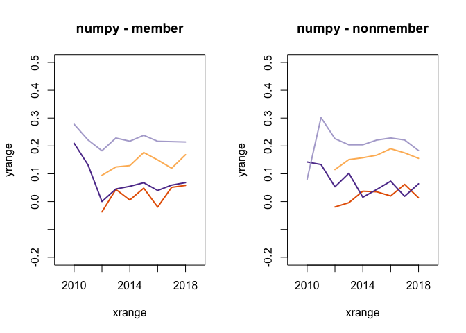
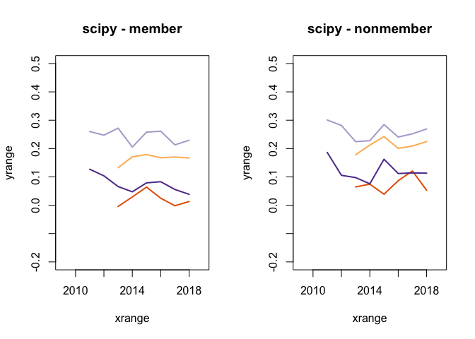
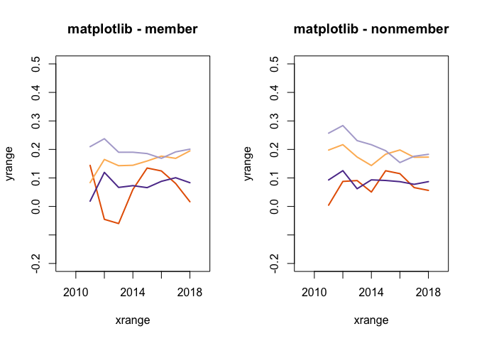
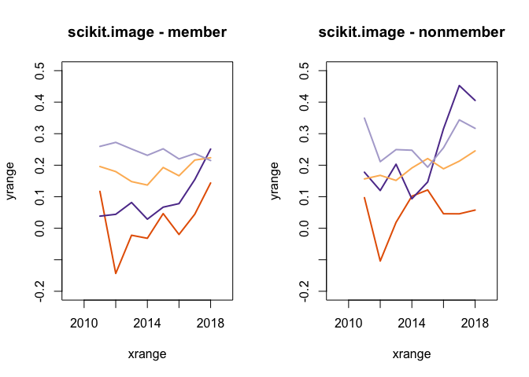
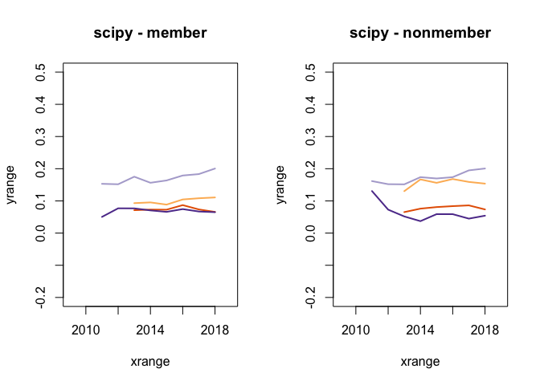
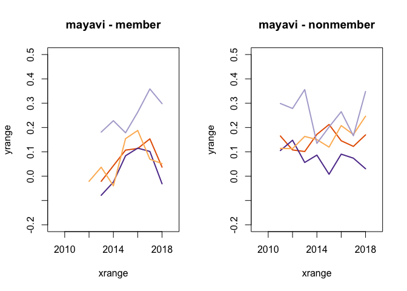
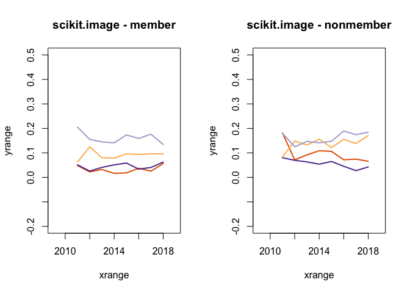

This R markdown provides the data preparation for our forthcoming manuscript
(Paxton, Varoquaux, Geiger, & Holdgraf, *in preparation*).

To run this from scratch, you will need the following files:

* `../../data/analysis_data/sentiment_frame_tickets-for_r.csv`: Contains cleaned
**tickets**-related data and derived variables from scraped GitHub data.
* `../../data/analysis_data/sentiment_frame_comments-for_r.csv`: Contains
cleaned **comments**-related data and derived variables from scraped GitHub
data.
* `./utils/ossc-libraries_and_functions.r`: Loads in necessary libraries and
creates new functions for our analyses.

**Code written by**: A. Paxton (University of Connecticut) & N. Varoquaux
(CNRS)

**Date last compiled**:  2020-01-09 12:00:45


***

# Preliminaries


```r
# clear everything
rm(list=ls())

# load libraries and add new functions
source('./utils/ossc-libraries_and_functions.r')
source("./utils/data-loading.R")
```

```r
# We are now going to select the dataset we'll be working on.
library(dplyr)
tickets_frame = loading_tickets_data(dataset="original")
comments_frame = loading_comments_data(dataset="original")
```

## Basic summary stats

Now that our data have been largely cleaned, let's take a look at some basic
patterns.


|    project     | unique_tickets | unique_comments |
|:--------------:|:--------------:|:---------------:|
|   matplotlib   |     12204      |      65592      |
|     mayavi     |      730       |      2104       |
|     numpy      |     10021      |      60973      |
|     pandas     |     23239      |     133950      |
|  scikit-image  |      3277      |      22602      |
|  scikit-learn  |     11649      |     107930      |
|     scipy      |      7142      |      42967      |
| sphinx-gallery |      409       |      2906       |

Our dataset includes 8 unique projects with a
total of 68671 unique tickets, with a
mean of 8583.875 tickets per project.

On these tickets, the dataset includes
439024 unique comments, with
5.4878\times 10^{4} average comments per project.

In total, we have 15560 unique commenters,
14147 unique ticket-creators, and
19430 overall unique users.

***

# Data analysis

***

### Data preparation

Before we can run Model Series 1, we need to combine `tickets_frame` and
`comments_frame` into a single dataframe. We do this using the
`combine_tickets_and_comments` function, `defined in utils/data-loading.R`


```r
sentiment_frame = combine_tickets_and_comments(tickets_frame, comments_frame)
```

```
## Warning in bind_rows_(x, .id): Unequal factor levels: coercing to character
```

```
## Warning in bind_rows_(x, .id): binding character and factor vector,
## coercing into character vector

## Warning in bind_rows_(x, .id): binding character and factor vector,
## coercing into character vector
```

```
## Warning in bind_rows_(x, .id): Unequal factor levels: coercing to character
```

```
## Warning in bind_rows_(x, .id): binding character and factor vector,
## coercing into character vector

## Warning in bind_rows_(x, .id): binding character and factor vector,
## coercing into character vector
```

```
## Warning in bind_rows_(x, .id): Unequal factor levels: coercing to character
```

```
## Warning in bind_rows_(x, .id): binding character and factor vector,
## coercing into character vector

## Warning in bind_rows_(x, .id): binding character and factor vector,
## coercing into character vector
```

```
## Warning in bind_rows_(x, .id): Unequal factor levels: coercing to character
```

```
## Warning in bind_rows_(x, .id): binding character and factor vector,
## coercing into character vector

## Warning in bind_rows_(x, .id): binding character and factor vector,
## coercing into character vector
```


### Model 1.2: Do tickets and comments materially differ in emotion over time?

Here, we are estimating the sentiment score per project, type of submission,
and membership for every year we have. It is a similar model to model 1.1b,
except the data is binned by year.


```r
sentiment_frame$year = as.factor(sentiment_frame$year)
timecourse_compound_emotion = lmer(
    compound_emotion ~ 0 + project:type:author_group:year + (1 | author_name),
    data=sentiment_frame,
    REML=FALSE)
```

```
## fixed-effect model matrix is rank deficient so dropping 96 columns / coefficients
```


```r
coefficients_and_se = data.frame(
    summary(timecourse_compound_emotion)$coefficients)

row_names = gsub(
    "project", "", gsub(
	"author_group", "", gsub(
	    "type", "", row.names(coefficients_and_se))))

row_names = gsub(
    "year", "", row_names)

# replace hyphens in project names with periods
row_names = gsub(
  "scikit-", "scikit.", gsub(
    "sphinx-", "sphinx.", row_names))

# convert model estimates to a dataframe
means = coefficients_and_se$Estimate
names(means) = row_names

# convert standard error to dataframe
se = coefficients_and_se$Std..Error
names(se) = row_names
```


```r
dir.create("results/models", showWarnings=FALSE)
write.table(coefficients_and_se,
	    file="results/models/model-1.2.tsv",
	    sep="\t")
```


#### Model 1.2: Visualizing the data.

Ok, so I don't really want to do any statistical tests yet here. I'm going to
visualize the timecourse coefficients here.


```r
source("utils/visualization.R")

plot_timecourse("numpy", means)
```

<!-- -->

```r
plot_timecourse("scipy", means)
```

<!-- -->

```r
plot_timecourse("mayavi", means)
```

<!-- -->

```r
plot_timecourse("matplotlib", means)
```

<!-- -->

```r
plot_timecourse("scikit.learn", means)
```

<!-- -->

```r
plot_timecourse("scikit.image", means)
```

<!-- -->

```r
plot_timecourse("sphinx.gallery", means)
```

<!-- -->

#### Model 1.2 Do project differ from one another across time.

The following is going to be a bit painful in terms of fitting the model...


```r
all_project_tests = NA
all_projects = unique(sentiment_frame$project)

# We're going to fit the model for each projects, and concatenate the results
# in a dataframe. Then, we'll apply multiple correction and display the
# results
for(project in all_projects){
    sentiment_frame$test_group = sentiment_frame$project == project
    one_versus_all_emotion = lmer(
	compound_emotion ~ 0 + type:author_group:test_group:year + (1|author_name),
	data=sentiment_frame,
	REML=FALSE)

    # Clean up mode
    coefficients_and_se = data.frame(
	summary(one_versus_all_emotion)$coefficients)
    row_names = gsub(
	"author_group", "", 
	    gsub("type", "",
		gsub("project", "", row.names(coefficients_and_se))))

    means = coefficients_and_se$Estimate
    names(means) = row_names
    se = coefficients_and_se$Std..Error
    names(se) = row_names

    template_contrasts = c(
	"issue_post:member:test_groupTRUE-issue_post:member:test_groupFALSE",
	"pr_post:member:test_groupTRUE-pr_post:member:test_groupFALSE",
	"issue_reply:member:test_groupTRUE-issue_reply:member:test_groupFALSE",
	"pr_reply:member:test_groupTRUE-pr_reply:member:test_groupFALSE",
	"issue_post:nonmember:test_groupTRUE-issue_post:nonmember:test_groupFALSE",
	"pr_post:nonmember:test_groupTRUE-pr_post:nonmember:test_groupFALSE",
	"issue_reply:nonmember:test_groupTRUE-issue_reply:nonmember:test_groupFALSE",
	"pr_reply:nonmember:test_groupTRUE-pr_reply:nonmember:test_groupFALSE"
	)

    # Now, extend this to all years.
    contrasts = c(
	unlist(
	    lapply(gsub("-", ":year2009-", template_contrasts),
		function(x) paste(x, ":year2009", sep=""))),
	unlist(
	    lapply(gsub("-", ":year2010-", template_contrasts),
		function(x) paste(x, ":year2010", sep=""))),
	unlist(
	    lapply(gsub("-", ":year2011-", template_contrasts),
		function(x) paste(x, ":year2011", sep=""))),
	unlist(
	    lapply(gsub("-", ":year2012-", template_contrasts),
		function(x) paste(x, ":year2012", sep=""))),
	unlist(
	    lapply(gsub("-", ":year2013-", template_contrasts),
		function(x) paste(x, ":year2013", sep=""))),
	unlist(
	    lapply(gsub("-", ":year2014-", template_contrasts),
		function(x) paste(x, ":year2014", sep=""))),
	unlist(
	    lapply(gsub("-", ":year2015-", template_contrasts),
		function(x) paste(x, ":year2015", sep=""))),
	unlist(
	    lapply(gsub("-", ":year2016-", template_contrasts),
		function(x) paste(x, ":year2016", sep=""))),
	unlist(
	    lapply(gsub("-", ":year2017-", template_contrasts),
		function(x) paste(x, ":year2017", sep=""))),
	unlist(
	    lapply(gsub("-", ":year2018-", template_contrasts),
		function(x) paste(x, ":year2018", sep=""))))

    one_versus_all_emotion_tests = compute_t_statistics(
	means, se,
	contrasts)
    one_versus_all_emotion_tests[, "p_value"] = compute_p_value_from_t_stats(
	one_versus_all_emotion_tests$t_stats)

    # Add unique identifier based on the project of interest in the table.
    row.names(one_versus_all_emotion_tests) = gsub(
	"test_group", project,
	row.names(one_versus_all_emotion_tests))

    if(is.null(dim(all_project_tests))){
	all_project_tests = one_versus_all_emotion_tests
    }else{
	all_project_tests = rbind(
	    all_project_tests, one_versus_all_emotion_tests)
    }
}
```

```
## fixed-effect model matrix is rank deficient so dropping 8 columns / coefficients
```

```
## fixed-effect model matrix is rank deficient so dropping 16 columns / coefficients
## fixed-effect model matrix is rank deficient so dropping 16 columns / coefficients
```

```
## fixed-effect model matrix is rank deficient so dropping 36 columns / coefficients
```

```
## fixed-effect model matrix is rank deficient so dropping 8 columns / coefficients
## fixed-effect model matrix is rank deficient so dropping 8 columns / coefficients
```

```
## fixed-effect model matrix is rank deficient so dropping 4 columns / coefficients
```


```r
all_project_tests = all_project_tests[!is.na(all_project_tests[, "p_value"]), ]
pander_clean_anova(all_project_tests, rename_columns=FALSE,
		   display_only_significant=TRUE)
```


|                                                &nbsp;                                                | t_stats | p_value | p_adj  | sig |
|:----------------------------------------------------------------------------------------------------:|:-------:|:-------:|:------:|:---:|
|            **issue_post:member:numpyTRUE:year2012-issue_post:member:numpyFALSE:year2012**            | -3.269  |  0.001  | 0.011  |  *  |
|               **pr_post:member:numpyTRUE:year2012-pr_post:member:numpyFALSE:year2012**               | -3.401  |  0.001  | 0.007  | **  |
|           **issue_reply:member:numpyTRUE:year2012-issue_reply:member:numpyFALSE:year2012**           |  -4.46  | 0.0001  | 0.0002 | *** |
|              **pr_reply:member:numpyTRUE:year2012-pr_reply:member:numpyFALSE:year2012**              | -6.185  | 0.0001  | 0.0001 | *** |
|        **issue_reply:nonmember:numpyTRUE:year2012-issue_reply:nonmember:numpyFALSE:year2012**        | -2.923  |  0.004  | 0.027  |  *  |
|           **issue_reply:member:numpyTRUE:year2013-issue_reply:member:numpyFALSE:year2013**           | -3.057  |  0.002  |  0.02  |  *  |
|         **issue_post:nonmember:numpyTRUE:year2013-issue_post:nonmember:numpyFALSE:year2013**         | -2.802  |  0.005  | 0.036  |  *  |
|        **issue_reply:nonmember:numpyTRUE:year2013-issue_reply:nonmember:numpyFALSE:year2013**        | -2.628  |  0.009  | 0.048  |  *  |
|           **issue_reply:member:numpyTRUE:year2014-issue_reply:member:numpyFALSE:year2014**           | -3.937  | 0.0001  | 0.001  | **  |
|            **issue_post:member:numpyTRUE:year2016-issue_post:member:numpyFALSE:year2016**            | -3.548  | 0.0004  | 0.005  | **  |
|         **issue_post:nonmember:numpyTRUE:year2016-issue_post:nonmember:numpyFALSE:year2016**         | -3.559  | 0.0004  | 0.005  | **  |
|            **issue_post:member:numpyTRUE:year2017-issue_post:member:numpyFALSE:year2017**            | -2.687  |  0.007  | 0.045  |  *  |
|           **issue_reply:member:numpyTRUE:year2017-issue_reply:member:numpyFALSE:year2017**           | -7.722  | 0.0001  | 0.0001 | *** |
|            **pr_post:nonmember:numpyTRUE:year2017-pr_post:nonmember:numpyFALSE:year2017**            | -2.804  |  0.005  | 0.036  |  *  |
|           **issue_reply:member:numpyTRUE:year2018-issue_reply:member:numpyFALSE:year2018**           | -3.469  |    0    | 0.006  | **  |
|         **issue_post:nonmember:numpyTRUE:year2018-issue_post:nonmember:numpyFALSE:year2018**         | -3.882  | 0.0001  | 0.002  | **  |
|            **pr_post:nonmember:numpyTRUE:year2018-pr_post:nonmember:numpyFALSE:year2018**            | -2.678  |  0.007  | 0.045  |  *  |
|        **issue_reply:nonmember:numpyTRUE:year2018-issue_reply:nonmember:numpyFALSE:year2018**        | -3.461  |    0    | 0.006  | **  |
|        **pr_post:member:scikit-learnTRUE:year2011-pr_post:member:scikit-learnFALSE:year2011**        |  5.644  | 0.0001  | 0.0001 | *** |
|        **pr_post:member:scikit-learnTRUE:year2012-pr_post:member:scikit-learnFALSE:year2012**        |  3.036  |  0.002  |  0.02  |  *  |
|    **issue_reply:member:scikit-learnTRUE:year2012-issue_reply:member:scikit-learnFALSE:year2012**    |  3.985  | 0.0001  | 0.001  | **  |
|       **pr_reply:member:scikit-learnTRUE:year2012-pr_reply:member:scikit-learnFALSE:year2012**       |  4.203  | 0.0001  |   0    | *** |
|     **pr_post:nonmember:scikit-learnTRUE:year2012-pr_post:nonmember:scikit-learnFALSE:year2012**     |  2.667  |  0.008  | 0.045  |  *  |
|        **pr_post:member:scikit-learnTRUE:year2013-pr_post:member:scikit-learnFALSE:year2013**        |  3.852  | 0.0001  | 0.002  | **  |
|       **pr_reply:member:scikit-learnTRUE:year2013-pr_reply:member:scikit-learnFALSE:year2013**       |  5.497  | 0.0001  | 0.0001 | *** |
|       **pr_reply:member:scikit-learnTRUE:year2014-pr_reply:member:scikit-learnFALSE:year2014**       |  3.418  |  0.001  | 0.007  | **  |
|    **issue_reply:member:scikit-learnTRUE:year2015-issue_reply:member:scikit-learnFALSE:year2015**    | -2.754  |  0.006  |  0.04  |  *  |
|     **pr_post:nonmember:scikit-learnTRUE:year2018-pr_post:nonmember:scikit-learnFALSE:year2018**     | -5.046  | 0.0001  | 0.0001 | *** |
| **issue_reply:nonmember:scikit-learnTRUE:year2018-issue_reply:nonmember:scikit-learnFALSE:year2018** |  2.801  |  0.005  | 0.036  |  *  |
|    **pr_reply:nonmember:scikit-learnTRUE:year2018-pr_reply:nonmember:scikit-learnFALSE:year2018**    |  3.284  |  0.001  | 0.011  |  *  |
|              **pr_reply:member:scipyTRUE:year2013-pr_reply:member:scipyFALSE:year2013**              |  6.321  | 0.0001  | 0.0001 | *** |
|              **pr_reply:member:scipyTRUE:year2015-pr_reply:member:scipyFALSE:year2015**              |  5.066  | 0.0001  | 0.0001 | *** |
|            **pr_post:nonmember:scipyTRUE:year2015-pr_post:nonmember:scipyFALSE:year2015**            |  2.742  |  0.006  | 0.041  |  *  |
|        **issue_reply:nonmember:scipyTRUE:year2015-issue_reply:nonmember:scipyFALSE:year2015**        |  3.083  |  0.002  | 0.018  |  *  |
|           **pr_reply:nonmember:scipyTRUE:year2015-pr_reply:nonmember:scipyFALSE:year2015**           |  4.199  | 0.0001  |   0    | *** |
|              **pr_reply:member:scipyTRUE:year2016-pr_reply:member:scipyFALSE:year2016**              |  7.714  | 0.0001  | 0.0001 | *** |
|            **issue_post:member:scipyTRUE:year2017-issue_post:member:scipyFALSE:year2017**            | -3.157  |  0.002  | 0.015  |  *  |
|              **pr_reply:member:scipyTRUE:year2018-pr_reply:member:scipyFALSE:year2018**              |  2.964  |  0.003  | 0.025  |  *  |
|        **issue_reply:nonmember:scipyTRUE:year2018-issue_reply:nonmember:scipyFALSE:year2018**        |  2.634  |  0.008  | 0.048  |  *  |
|           **pr_reply:nonmember:scipyTRUE:year2018-pr_reply:nonmember:scipyFALSE:year2018**           |  4.73   | 0.0001  | 0.0001 | *** |
|          **pr_reply:nonmember:mayaviTRUE:year2014-pr_reply:nonmember:mayaviFALSE:year2014**          | -2.745  |  0.006  | 0.041  |  *  |
|          **issue_reply:member:mayaviTRUE:year2017-issue_reply:member:mayaviFALSE:year2017**          | -2.689  |  0.007  | 0.045  |  *  |
|          **issue_reply:member:mayaviTRUE:year2018-issue_reply:member:mayaviFALSE:year2018**          | -3.807  | 0.0001  | 0.002  | **  |
|  **issue_reply:member:sphinx-galleryTRUE:year2017-issue_reply:member:sphinx-galleryFALSE:year2017**  |  2.672  |  0.008  | 0.045  |  *  |
|  **issue_reply:member:sphinx-galleryTRUE:year2018-issue_reply:member:sphinx-galleryFALSE:year2018**  |  3.503  |    0    | 0.006  | **  |
|          **pr_post:member:matplotlibTRUE:year2011-pr_post:member:matplotlibFALSE:year2011**          | -4.584  | 0.0001  | 0.0001 | *** |
|      **issue_reply:member:matplotlibTRUE:year2011-issue_reply:member:matplotlibFALSE:year2011**      | -4.037  | 0.0001  | 0.001  | **  |
|       **issue_post:member:matplotlibTRUE:year2013-issue_post:member:matplotlibFALSE:year2013**       |  -3.17  |  0.002  | 0.015  |  *  |
|         **pr_reply:member:matplotlibTRUE:year2013-pr_reply:member:matplotlibFALSE:year2013**         | -3.082  |  0.002  | 0.018  |  *  |
|         **pr_reply:member:matplotlibTRUE:year2014-pr_reply:member:matplotlibFALSE:year2014**         | -2.787  |  0.005  | 0.037  |  *  |
|   **issue_reply:nonmember:matplotlibTRUE:year2014-issue_reply:nonmember:matplotlibFALSE:year2014**   |  -3.46  |    0    | 0.006  | **  |
|         **pr_reply:member:matplotlibTRUE:year2015-pr_reply:member:matplotlibFALSE:year2015**         | -5.019  | 0.0001  | 0.0001 | *** |
|    **issue_post:nonmember:matplotlibTRUE:year2015-issue_post:nonmember:matplotlibFALSE:year2015**    |  2.627  |  0.009  | 0.048  |  *  |
|         **pr_reply:member:matplotlibTRUE:year2016-pr_reply:member:matplotlibFALSE:year2016**         | -4.489  | 0.0001  | 0.0001 | *** |
|      **pr_reply:nonmember:matplotlibTRUE:year2016-pr_reply:nonmember:matplotlibFALSE:year2016**      | -2.853  |  0.004  | 0.033  |  *  |
|      **pr_reply:nonmember:matplotlibTRUE:year2017-pr_reply:nonmember:matplotlibFALSE:year2017**      | -2.803  |  0.005  | 0.036  |  *  |
|       **issue_post:member:matplotlibTRUE:year2018-issue_post:member:matplotlibFALSE:year2018**       | -2.649  |  0.008  | 0.047  |  *  |
|       **pr_reply:member:scikit-imageTRUE:year2013-pr_reply:member:scikit-imageFALSE:year2013**       |  2.952  |  0.003  | 0.026  |  *  |
|       **pr_reply:member:scikit-imageTRUE:year2015-pr_reply:member:scikit-imageFALSE:year2015**       |  2.706  |  0.007  | 0.045  |  *  |
|     **issue_post:member:scikit-imageTRUE:year2016-issue_post:member:scikit-imageFALSE:year2016**     |  -2.67  |  0.008  | 0.045  |  *  |
|     **pr_post:nonmember:scikit-imageTRUE:year2016-pr_post:nonmember:scikit-imageFALSE:year2016**     |  5.06   | 0.0001  | 0.0001 | *** |
|     **pr_post:nonmember:scikit-imageTRUE:year2017-pr_post:nonmember:scikit-imageFALSE:year2017**     |  8.701  | 0.0001  | 0.0001 | *** |
|    **pr_reply:nonmember:scikit-imageTRUE:year2017-pr_reply:nonmember:scikit-imageFALSE:year2017**    |  5.54   | 0.0001  | 0.0001 | *** |
|        **pr_post:member:scikit-imageTRUE:year2018-pr_post:member:scikit-imageFALSE:year2018**        |  6.409  | 0.0001  | 0.0001 | *** |
|     **pr_post:nonmember:scikit-imageTRUE:year2018-pr_post:nonmember:scikit-imageFALSE:year2018**     |  6.175  | 0.0001  | 0.0001 | *** |
|    **pr_reply:nonmember:scikit-imageTRUE:year2018-pr_reply:nonmember:scikit-imageFALSE:year2018**    |  6.461  | 0.0001  | 0.0001 | *** |
|       **issue_reply:nonmember:pandasTRUE:year2012-issue_reply:nonmember:pandasFALSE:year2012**       |  2.873  |  0.004  | 0.032  |  *  |
|           **issue_post:member:pandasTRUE:year2013-issue_post:member:pandasFALSE:year2013**           |  3.227  |  0.001  | 0.012  |  *  |
|             **pr_reply:member:pandasTRUE:year2013-pr_reply:member:pandasFALSE:year2013**             | -8.065  | 0.0001  | 0.0001 | *** |
|       **issue_reply:nonmember:pandasTRUE:year2013-issue_reply:nonmember:pandasFALSE:year2013**       |  5.223  | 0.0001  | 0.0001 | *** |
|           **issue_post:member:pandasTRUE:year2014-issue_post:member:pandasFALSE:year2014**           |  3.116  |  0.002  | 0.017  |  *  |
|          **issue_reply:member:pandasTRUE:year2014-issue_reply:member:pandasFALSE:year2014**          |  2.786  |  0.005  | 0.037  |  *  |
|       **issue_reply:nonmember:pandasTRUE:year2014-issue_reply:nonmember:pandasFALSE:year2014**       |  4.586  | 0.0001  | 0.0001 | *** |
|           **issue_post:member:pandasTRUE:year2016-issue_post:member:pandasFALSE:year2016**           |  2.697  |  0.007  | 0.045  |  *  |
|              **pr_post:member:pandasTRUE:year2016-pr_post:member:pandasFALSE:year2016**              | -2.649  |  0.008  | 0.047  |  *  |
|        **issue_post:nonmember:pandasTRUE:year2016-issue_post:nonmember:pandasFALSE:year2016**        |  4.027  | 0.0001  | 0.001  | **  |
|           **pr_post:nonmember:pandasTRUE:year2016-pr_post:nonmember:pandasFALSE:year2016**           | -3.019  |  0.002  | 0.021  |  *  |
|          **pr_reply:nonmember:pandasTRUE:year2016-pr_reply:nonmember:pandasFALSE:year2016**          | -2.937  |  0.003  | 0.026  |  *  |
|           **issue_post:member:pandasTRUE:year2017-issue_post:member:pandasFALSE:year2017**           |  3.436  |  0.001  | 0.007  | **  |
|          **issue_reply:member:pandasTRUE:year2017-issue_reply:member:pandasFALSE:year2017**          |  3.265  |  0.001  | 0.011  |  *  |
|        **issue_post:nonmember:pandasTRUE:year2017-issue_post:nonmember:pandasFALSE:year2017**        |  3.563  | 0.0004  | 0.005  | **  |
|           **pr_post:nonmember:pandasTRUE:year2017-pr_post:nonmember:pandasFALSE:year2017**           | -2.687  |  0.007  | 0.045  |  *  |
|           **issue_post:member:pandasTRUE:year2018-issue_post:member:pandasFALSE:year2018**           |  3.916  | 0.0001  | 0.001  | **  |
|        **issue_post:nonmember:pandasTRUE:year2018-issue_post:nonmember:pandasFALSE:year2018**        |  3.339  |  0.001  | 0.009  | **  |
|           **pr_post:nonmember:pandasTRUE:year2018-pr_post:nonmember:pandasFALSE:year2018**           |  4.684  | 0.0001  | 0.0001 | *** |
|          **pr_reply:nonmember:pandasTRUE:year2018-pr_reply:nonmember:pandasFALSE:year2018**          | -7.995  | 0.0001  | 0.0001 | *** |


```r
all_project_tests$p_val_adjusted = p.adjust(all_project_tests$p_value, method="BH")
write.table(all_project_tests,
	    file="results/models/model-timecourse-emotion-pvalues.tsv")
```

### Model 1.4: Do tickets and comments materially differ in gratitude over time?


```r
sentiment_frame$year = as.factor(sentiment_frame$year)
timecourse_grateful_counts = lmer(
    log(grateful_count + 1) ~ 0 + project:type:author_group:year + (1 | author_name),
    data=sentiment_frame,
    REML=FALSE)
```

```
## fixed-effect model matrix is rank deficient so dropping 96 columns / coefficients
```


```r
coefficients_and_se = data.frame(
    summary(timecourse_grateful_counts)$coefficients)

row_names = gsub(
    "project", "", gsub(
	"author_group", "", gsub(
	    "type", "", row.names(coefficients_and_se))))

row_names = gsub(
    "year", "", row_names)

# replace hyphens in project names with periods
row_names = gsub(
  "scikit-", "scikit.", gsub(
    "sphinx-", "sphinx.", row_names))

# convert model estimates to a dataframe
means = coefficients_and_se$Estimate
names(means) = row_names

# convert standard error to dataframe
se = coefficients_and_se$Std..Error
names(se) = row_names
```


```r
dir.create("results/models", showWarnings=FALSE)
write.table(coefficients_and_se,
	    file="results/models/model-1.4.tsv",
	    sep="\t")
```


#### Model 1.4: Visualizing the data.


```r
source("utils/visualization.R")

plot_timecourse("numpy", means)
```

<!-- -->

```r
plot_timecourse("scipy", means)
```

<!-- -->

```r
plot_timecourse("mayavi", means)
```

<!-- -->

```r
plot_timecourse("matplotlib", means)
```

<!-- -->

```r
plot_timecourse("scikit.learn", means)
```

<!-- -->

```r
plot_timecourse("scikit.image", means)
```

<!-- -->

```r
plot_timecourse("sphinx.gallery", means)
```

<!-- -->

### Model 1.4 Do project differ from one another across time in terms of gratefulness?


```r
all_project_tests = NA
all_projects = unique(sentiment_frame$project)

# We're going to fit the model for each projects, and concatenate the results
# in a dataframe. Then, we'll apply multiple correction and display the
# results
for(project in all_projects){
    sentiment_frame$test_group = sentiment_frame$project == project
    one_versus_all_emotion = lmer(
	log(grateful_count + 1) ~ 0 + type:author_group:test_group:year + (1|author_name),
	data=sentiment_frame,
	REML=FALSE)

    # Clean up mode
    coefficients_and_se = data.frame(
	summary(one_versus_all_emotion)$coefficients)
    row_names = gsub(
	"author_group", "", 
	    gsub("type", "",
		gsub("project", "", row.names(coefficients_and_se))))

    means = coefficients_and_se$Estimate
    names(means) = row_names
    se = coefficients_and_se$Std..Error
    names(se) = row_names

    template_contrasts = c(
	"issue_post:member:test_groupTRUE-issue_post:member:test_groupFALSE",
	"pr_post:member:test_groupTRUE-pr_post:member:test_groupFALSE",
	"issue_reply:member:test_groupTRUE-issue_reply:member:test_groupFALSE",
	"pr_reply:member:test_groupTRUE-pr_reply:member:test_groupFALSE",
	"issue_post:nonmember:test_groupTRUE-issue_post:nonmember:test_groupFALSE",
	"pr_post:nonmember:test_groupTRUE-pr_post:nonmember:test_groupFALSE",
	"issue_reply:nonmember:test_groupTRUE-issue_reply:nonmember:test_groupFALSE",
	"pr_reply:nonmember:test_groupTRUE-pr_reply:nonmember:test_groupFALSE"
	)

    # Now, extend this to all years.
    contrasts = c(
	unlist(
	    lapply(gsub("-", ":year2009-", template_contrasts),
		function(x) paste(x, ":year2009", sep=""))),
	unlist(
	    lapply(gsub("-", ":year2010-", template_contrasts),
		function(x) paste(x, ":year2010", sep=""))),
	unlist(
	    lapply(gsub("-", ":year2011-", template_contrasts),
		function(x) paste(x, ":year2011", sep=""))),
	unlist(
	    lapply(gsub("-", ":year2012-", template_contrasts),
		function(x) paste(x, ":year2012", sep=""))),
	unlist(
	    lapply(gsub("-", ":year2013-", template_contrasts),
		function(x) paste(x, ":year2013", sep=""))),
	unlist(
	    lapply(gsub("-", ":year2014-", template_contrasts),
		function(x) paste(x, ":year2014", sep=""))),
	unlist(
	    lapply(gsub("-", ":year2015-", template_contrasts),
		function(x) paste(x, ":year2015", sep=""))),
	unlist(
	    lapply(gsub("-", ":year2016-", template_contrasts),
		function(x) paste(x, ":year2016", sep=""))),
	unlist(
	    lapply(gsub("-", ":year2017-", template_contrasts),
		function(x) paste(x, ":year2017", sep=""))),
	unlist(
	    lapply(gsub("-", ":year2018-", template_contrasts),
		function(x) paste(x, ":year2018", sep=""))))

    one_versus_all_emotion_tests = compute_t_statistics(
	means, se,
	contrasts)
    one_versus_all_emotion_tests[, "p_value"] = compute_p_value_from_t_stats(
	one_versus_all_emotion_tests$t_stats)

    # Add unique identifier based on the project of interest in the table.
    row.names(one_versus_all_emotion_tests) = gsub(
	"test_group", project,
	row.names(one_versus_all_emotion_tests))

    if(is.null(dim(all_project_tests))){
	all_project_tests = one_versus_all_emotion_tests
    }else{
	all_project_tests = rbind(
	    all_project_tests, one_versus_all_emotion_tests)
    }
}
```

```
## fixed-effect model matrix is rank deficient so dropping 8 columns / coefficients
```

```
## fixed-effect model matrix is rank deficient so dropping 16 columns / coefficients
## fixed-effect model matrix is rank deficient so dropping 16 columns / coefficients
```

```
## fixed-effect model matrix is rank deficient so dropping 36 columns / coefficients
```

```
## fixed-effect model matrix is rank deficient so dropping 8 columns / coefficients
## fixed-effect model matrix is rank deficient so dropping 8 columns / coefficients
```

```
## fixed-effect model matrix is rank deficient so dropping 4 columns / coefficients
```


```r
all_project_tests = all_project_tests[!is.na(all_project_tests[, "p_value"]), ]
pander_clean_anova(all_project_tests, rename_columns=FALSE,
		   display_only_significant=TRUE)
```


|                                                  &nbsp;                                                  | t_stats | p_value | p_adj  | sig |
|:--------------------------------------------------------------------------------------------------------:|:-------:|:-------:|:------:|:---:|
|                **pr_reply:member:numpyTRUE:year2011-pr_reply:member:numpyFALSE:year2011**                | -5.381  | 0.0001  | 0.0001 | *** |
|                 **pr_post:member:numpyTRUE:year2012-pr_post:member:numpyFALSE:year2012**                 | -2.756  |  0.006  | 0.033  |  *  |
|             **issue_reply:member:numpyTRUE:year2012-issue_reply:member:numpyFALSE:year2012**             | -4.025  | 0.0001  | 0.001  | **  |
|                **pr_reply:member:numpyTRUE:year2012-pr_reply:member:numpyFALSE:year2012**                | -9.248  | 0.0001  | 0.0001 | *** |
|             **issue_reply:member:numpyTRUE:year2013-issue_reply:member:numpyFALSE:year2013**             | -4.751  | 0.0001  | 0.0001 | *** |
|                **pr_reply:member:numpyTRUE:year2013-pr_reply:member:numpyFALSE:year2013**                | -4.219  | 0.0001  | 0.0003 | *** |
|             **issue_reply:member:numpyTRUE:year2014-issue_reply:member:numpyFALSE:year2014**             | -5.043  | 0.0001  | 0.0001 | *** |
|           **issue_post:nonmember:numpyTRUE:year2014-issue_post:nonmember:numpyFALSE:year2014**           | -2.816  |  0.005  | 0.029  |  *  |
|                **pr_reply:member:numpyTRUE:year2015-pr_reply:member:numpyFALSE:year2015**                |  2.704  |  0.007  | 0.037  |  *  |
|             **issue_reply:member:numpyTRUE:year2016-issue_reply:member:numpyFALSE:year2016**             | -3.077  |  0.002  | 0.015  |  *  |
|             **issue_reply:member:numpyTRUE:year2017-issue_reply:member:numpyFALSE:year2017**             | -4.283  | 0.0001  | 0.0003 | *** |
|                **pr_reply:member:numpyTRUE:year2017-pr_reply:member:numpyFALSE:year2017**                | -5.809  | 0.0001  | 0.0001 | *** |
|             **issue_reply:member:numpyTRUE:year2018-issue_reply:member:numpyFALSE:year2018**             | -2.714  |  0.007  | 0.036  |  *  |
|          **issue_reply:nonmember:numpyTRUE:year2018-issue_reply:nonmember:numpyFALSE:year2018**          |  3.663  | 0.0002  | 0.003  | **  |
|      **issue_reply:member:scikit-learnTRUE:year2012-issue_reply:member:scikit-learnFALSE:year2012**      |  4.909  | 0.0001  | 0.0001 | *** |
|         **pr_reply:member:scikit-learnTRUE:year2012-pr_reply:member:scikit-learnFALSE:year2012**         |  3.237  |  0.001  |  0.01  |  *  |
|      **issue_reply:member:scikit-learnTRUE:year2013-issue_reply:member:scikit-learnFALSE:year2013**      |  3.104  |  0.002  | 0.014  |  *  |
|         **pr_reply:member:scikit-learnTRUE:year2013-pr_reply:member:scikit-learnFALSE:year2013**         |  4.758  | 0.0001  | 0.0001 | *** |
|         **pr_reply:member:scikit-learnTRUE:year2015-pr_reply:member:scikit-learnFALSE:year2015**         | -3.047  |  0.002  | 0.016  |  *  |
|    **issue_post:nonmember:scikit-learnTRUE:year2015-issue_post:nonmember:scikit-learnFALSE:year2015**    |  3.691  | 0.0002  | 0.002  | **  |
|   **issue_reply:nonmember:scikit-learnTRUE:year2016-issue_reply:nonmember:scikit-learnFALSE:year2016**   |  -3.25  |  0.001  |  0.01  |  *  |
|          **pr_post:member:scikit-learnTRUE:year2017-pr_post:member:scikit-learnFALSE:year2017**          | -3.092  |  0.002  | 0.014  |  *  |
|       **issue_post:member:scikit-learnTRUE:year2018-issue_post:member:scikit-learnFALSE:year2018**       |  -2.81  |  0.005  | 0.029  |  *  |
|          **pr_post:member:scikit-learnTRUE:year2018-pr_post:member:scikit-learnFALSE:year2018**          | -4.746  | 0.0001  | 0.0001 | *** |
|      **issue_reply:member:scikit-learnTRUE:year2018-issue_reply:member:scikit-learnFALSE:year2018**      | -5.589  | 0.0001  | 0.0001 | *** |
|         **pr_reply:member:scikit-learnTRUE:year2018-pr_reply:member:scikit-learnFALSE:year2018**         | -11.18  | 0.0001  | 0.0001 | *** |
|   **issue_reply:nonmember:scikit-learnTRUE:year2018-issue_reply:nonmember:scikit-learnFALSE:year2018**   | -4.177  | 0.0001  | 0.0004 | *** |
|      **pr_reply:nonmember:scikit-learnTRUE:year2018-pr_reply:nonmember:scikit-learnFALSE:year2018**      | -4.486  | 0.0001  | 0.0001 | *** |
|                **pr_reply:member:scipyTRUE:year2013-pr_reply:member:scipyFALSE:year2013**                |  8.729  | 0.0001  | 0.0001 | *** |
|                **pr_reply:member:scipyTRUE:year2014-pr_reply:member:scipyFALSE:year2014**                |  3.37   |  0.001  | 0.007  | **  |
|             **pr_reply:nonmember:scipyTRUE:year2014-pr_reply:nonmember:scipyFALSE:year2014**             |  3.155  |  0.002  | 0.012  |  *  |
|                **pr_reply:member:scipyTRUE:year2015-pr_reply:member:scipyFALSE:year2015**                |  3.172  |  0.002  | 0.012  |  *  |
|                **pr_reply:member:scipyTRUE:year2016-pr_reply:member:scipyFALSE:year2016**                |  5.637  | 0.0001  | 0.0001 | *** |
|                **pr_reply:member:scipyTRUE:year2017-pr_reply:member:scipyFALSE:year2017**                |  4.499  | 0.0001  | 0.0001 | *** |
|                **pr_reply:member:scipyTRUE:year2018-pr_reply:member:scipyFALSE:year2018**                |  7.312  | 0.0001  | 0.0001 | *** |
|             **pr_reply:nonmember:scipyTRUE:year2018-pr_reply:nonmember:scipyFALSE:year2018**             |  3.027  |  0.002  | 0.016  |  *  |
|            **pr_reply:nonmember:mayaviTRUE:year2012-pr_reply:nonmember:mayaviFALSE:year2012**            |  2.84   |  0.004  | 0.027  |  *  |
|            **pr_reply:nonmember:mayaviTRUE:year2013-pr_reply:nonmember:mayaviFALSE:year2013**            |  3.672  | 0.0002  | 0.003  | **  |
|            **issue_reply:member:mayaviTRUE:year2014-issue_reply:member:mayaviFALSE:year2014**            | -2.992  |  0.003  | 0.018  |  *  |
|          **issue_post:nonmember:mayaviTRUE:year2015-issue_post:nonmember:mayaviFALSE:year2015**          |  3.641  | 0.0003  | 0.003  | **  |
|            **issue_reply:member:mayaviTRUE:year2016-issue_reply:member:mayaviFALSE:year2016**            |  3.713  | 0.0002  | 0.002  | **  |
|               **pr_reply:member:mayaviTRUE:year2016-pr_reply:member:mayaviFALSE:year2016**               |  4.453  | 0.0001  | 0.0001 | *** |
|          **issue_post:nonmember:mayaviTRUE:year2016-issue_post:nonmember:mayaviFALSE:year2016**          |  2.795  |  0.005  |  0.03  |  *  |
|         **issue_reply:nonmember:mayaviTRUE:year2016-issue_reply:nonmember:mayaviFALSE:year2016**         |  2.849  |  0.004  | 0.027  |  *  |
|               **pr_reply:member:mayaviTRUE:year2017-pr_reply:member:mayaviFALSE:year2017**               |  5.386  | 0.0001  | 0.0001 | *** |
|                **pr_post:member:mayaviTRUE:year2018-pr_post:member:mayaviFALSE:year2018**                | -3.214  |  0.001  |  0.01  |  *  |
|               **pr_reply:member:mayaviTRUE:year2018-pr_reply:member:mayaviFALSE:year2018**               |  3.407  |  0.001  | 0.006  | **  |
|          **issue_post:nonmember:mayaviTRUE:year2018-issue_post:nonmember:mayaviFALSE:year2018**          |  4.251  | 0.0001  | 0.0003 | *** |
|         **issue_reply:nonmember:mayaviTRUE:year2018-issue_reply:nonmember:mayaviFALSE:year2018**         |  5.882  | 0.0001  | 0.0001 | *** |
|       **pr_reply:member:sphinx-galleryTRUE:year2015-pr_reply:member:sphinx-galleryFALSE:year2015**       | -2.683  |  0.007  | 0.038  |  *  |
|    **pr_reply:nonmember:sphinx-galleryTRUE:year2015-pr_reply:nonmember:sphinx-galleryFALSE:year2015**    | -2.797  |  0.005  |  0.03  |  *  |
|       **pr_reply:member:sphinx-galleryTRUE:year2017-pr_reply:member:sphinx-galleryFALSE:year2017**       | -3.609  | 0.0003  | 0.003  | **  |
|  **issue_post:nonmember:sphinx-galleryTRUE:year2017-issue_post:nonmember:sphinx-galleryFALSE:year2017**  |  2.655  |  0.008  | 0.041  |  *  |
| **issue_reply:nonmember:sphinx-galleryTRUE:year2018-issue_reply:nonmember:sphinx-galleryFALSE:year2018** |  3.238  |  0.001  |  0.01  |  *  |
|         **issue_post:member:matplotlibTRUE:year2011-issue_post:member:matplotlibFALSE:year2011**         |  6.754  | 0.0001  | 0.0001 | *** |
|            **pr_post:member:matplotlibTRUE:year2012-pr_post:member:matplotlibFALSE:year2012**            |  5.482  | 0.0001  | 0.0001 | *** |
|        **pr_reply:nonmember:matplotlibTRUE:year2012-pr_reply:nonmember:matplotlibFALSE:year2012**        |  2.967  |  0.003  | 0.019  |  *  |
|        **issue_reply:member:matplotlibTRUE:year2013-issue_reply:member:matplotlibFALSE:year2013**        |  3.06   |  0.002  | 0.015  |  *  |
|            **pr_post:member:matplotlibTRUE:year2015-pr_post:member:matplotlibFALSE:year2015**            |  2.898  |  0.004  | 0.023  |  *  |
|        **issue_reply:member:matplotlibTRUE:year2015-issue_reply:member:matplotlibFALSE:year2015**        |  3.845  | 0.0001  | 0.001  | **  |
|           **pr_reply:member:matplotlibTRUE:year2015-pr_reply:member:matplotlibFALSE:year2015**           | -3.106  |  0.002  | 0.014  |  *  |
|         **issue_post:member:matplotlibTRUE:year2016-issue_post:member:matplotlibFALSE:year2016**         |  2.614  |  0.009  | 0.046  |  *  |
|            **pr_post:member:matplotlibTRUE:year2016-pr_post:member:matplotlibFALSE:year2016**            |  3.891  | 0.0001  | 0.001  | **  |
|        **issue_reply:member:matplotlibTRUE:year2016-issue_reply:member:matplotlibFALSE:year2016**        |  3.633  | 0.0003  | 0.003  | **  |
|           **pr_reply:member:matplotlibTRUE:year2016-pr_reply:member:matplotlibFALSE:year2016**           | -2.742  |  0.006  | 0.034  |  *  |
|            **pr_post:member:matplotlibTRUE:year2017-pr_post:member:matplotlibFALSE:year2017**            |  3.508  |    0    | 0.004  | **  |
|        **issue_reply:member:matplotlibTRUE:year2017-issue_reply:member:matplotlibFALSE:year2017**        |  3.031  |  0.002  | 0.016  |  *  |
|           **pr_reply:member:matplotlibTRUE:year2017-pr_reply:member:matplotlibFALSE:year2017**           | -3.346  |  0.001  | 0.007  | **  |
|            **pr_post:member:matplotlibTRUE:year2018-pr_post:member:matplotlibFALSE:year2018**            |  4.079  | 0.0001  | 0.001  | **  |
|        **issue_reply:member:matplotlibTRUE:year2018-issue_reply:member:matplotlibFALSE:year2018**        |  4.867  | 0.0001  | 0.0001 | *** |
|           **pr_reply:member:matplotlibTRUE:year2018-pr_reply:member:matplotlibFALSE:year2018**           | -4.343  | 0.0001  | 0.0002 | *** |
|     **issue_reply:nonmember:matplotlibTRUE:year2018-issue_reply:nonmember:matplotlibFALSE:year2018**     |  2.718  |  0.007  | 0.036  |  *  |
|         **pr_reply:member:scikit-imageTRUE:year2011-pr_reply:member:scikit-imageFALSE:year2011**         |  3.652  | 0.0003  | 0.003  | **  |
|          **pr_post:member:scikit-imageTRUE:year2012-pr_post:member:scikit-imageFALSE:year2012**          | -3.137  |  0.002  | 0.013  |  *  |
|         **pr_reply:member:scikit-imageTRUE:year2015-pr_reply:member:scikit-imageFALSE:year2015**         |  3.072  |  0.002  | 0.015  |  *  |
|         **pr_reply:member:scikit-imageTRUE:year2018-pr_reply:member:scikit-imageFALSE:year2018**         | -5.431  | 0.0001  | 0.0001 | *** |
|             **issue_post:member:pandasTRUE:year2011-issue_post:member:pandasFALSE:year2011**             | -3.969  | 0.0001  | 0.001  | **  |
|               **pr_reply:member:pandasTRUE:year2011-pr_reply:member:pandasFALSE:year2011**               |  8.185  | 0.0001  | 0.0001 | *** |
|             **issue_post:member:pandasTRUE:year2012-issue_post:member:pandasFALSE:year2012**             | -4.272  | 0.0001  | 0.0003 | *** |
|                **pr_post:member:pandasTRUE:year2012-pr_post:member:pandasFALSE:year2012**                | -2.687  |  0.007  | 0.038  |  *  |
|            **issue_reply:member:pandasTRUE:year2012-issue_reply:member:pandasFALSE:year2012**            |  -3.54  | 0.0004  | 0.004  | **  |
|               **pr_reply:member:pandasTRUE:year2012-pr_reply:member:pandasFALSE:year2012**               |  7.451  | 0.0001  | 0.0001 | *** |
|         **issue_reply:nonmember:pandasTRUE:year2012-issue_reply:nonmember:pandasFALSE:year2012**         |  3.458  |    0    | 0.005  | **  |
|               **pr_reply:member:pandasTRUE:year2013-pr_reply:member:pandasFALSE:year2013**               | -7.231  | 0.0001  | 0.0001 | *** |
|         **issue_reply:nonmember:pandasTRUE:year2013-issue_reply:nonmember:pandasFALSE:year2013**         |  4.576  | 0.0001  | 0.0001 | *** |
|         **issue_reply:nonmember:pandasTRUE:year2014-issue_reply:nonmember:pandasFALSE:year2014**         |  3.234  |  0.001  |  0.01  |  *  |
|          **issue_post:nonmember:pandasTRUE:year2016-issue_post:nonmember:pandasFALSE:year2016**          | -3.975  | 0.0001  | 0.001  | **  |
|            **pr_reply:nonmember:pandasTRUE:year2016-pr_reply:nonmember:pandasFALSE:year2016**            | -2.669  |  0.008  |  0.04  |  *  |
|               **pr_reply:member:pandasTRUE:year2017-pr_reply:member:pandasFALSE:year2017**               |  5.417  | 0.0001  | 0.0001 | *** |
|          **issue_post:nonmember:pandasTRUE:year2017-issue_post:nonmember:pandasFALSE:year2017**          | -3.664  | 0.0002  | 0.003  | **  |
|            **issue_reply:member:pandasTRUE:year2018-issue_reply:member:pandasFALSE:year2018**            |  2.906  |  0.004  | 0.023  |  *  |
|               **pr_reply:member:pandasTRUE:year2018-pr_reply:member:pandasFALSE:year2018**               |  11.18  | 0.0001  | 0.0001 | *** |
|          **issue_post:nonmember:pandasTRUE:year2018-issue_post:nonmember:pandasFALSE:year2018**          | -2.958  |  0.003  |  0.02  |  *  |
|         **issue_reply:nonmember:pandasTRUE:year2018-issue_reply:nonmember:pandasFALSE:year2018**         | -5.942  | 0.0001  | 0.0001 | *** |

Still painful in terms of fitting the models…


```r
all_project_tests$p_val_adjusted = p.adjust(all_project_tests$p_value, method="BH")
write.table(all_project_tests,
	    file="results/models/model-timecourse-gratitude-pvalues.tsv")
```
