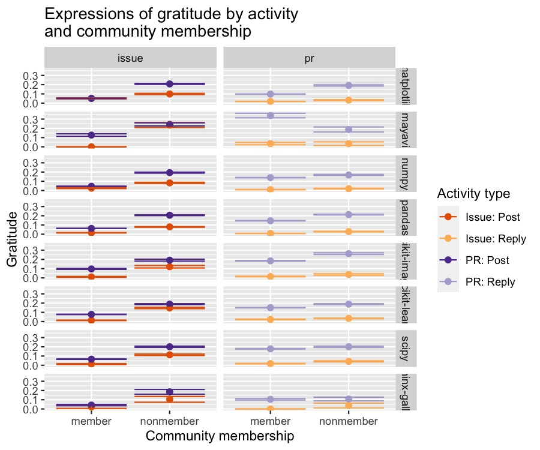

This R markdown provides the data preparation for our forthcoming manuscript
(Paxton, Varoquaux, Geiger, & Holdgraf, *in preparation*). 

To run this from scratch, you will need the following files:

* `../../data/analysis_data/sentiment_frame_issues-for_r.csv`: Contains cleaned
  **tickets**-related data and derived variables from scraped GitHub data.
* `../../data/analysis_data/sentiment_frame_comments-for_r.csv`: Contains 
  cleaned **comments**-related data and derived variables from scraped GitHub 
  data.
* `./utils/ossc-libraries_and_functions.r`: Loads in necessary libraries and 
  creates new functions for our analyses.

**Code written by**: A. Paxton (University of Connecticut) & N. Varoquaux 
(University of California, Berkeley)

**Date last modified**: 30 May 2019

```{r silent-preparations, echo=FALSE, include=FALSE}
library(knitr)
knitr::opts_chunk$set(cache=TRUE, autodep=TRUE)
```

***

# Preliminaries

```{r prelim, warning = FALSE, error = FALSE, message = FALSE}

# clear everything
rm(list=ls())

# load libraries and add new functions
source('./utils/ossc-libraries_and_functions.r')

# load data
tickets_frame = read.table('../../data/analysis_data/sentiment_frame_issues-for_r.csv', 
                          sep = ',', header=TRUE, fill=TRUE, stringsAsFactors = FALSE)
comments_frame = read.table('../../data/analysis_data/sentiment_frame_comments-for_r.csv', 
                            sep = ',', header=TRUE, fill=TRUE, stringsAsFactors = FALSE)

```

***

## Remove bots and clean up dates

Here, we ensure that all the users identified to be bots have been removed 
and convert the dates to a more interpretable format.

```{r dates-and-bots}

# fix tickets dataframe
tickets_frame = tickets_frame %>% ungroup() %>%
  
  # filter out bots
  dplyr::filter(bot_flag == "False") %>%
  select(-bot_flag) %>%
  
  # get time in days
  mutate(open_time = strsplit(as.character(open_duration), ' ') %>%
           sapply(magrittr::extract2, 1) %>%
           as.numeric()) %>%
  
  # get the year and month it was created 
  mutate(year = as.numeric(format(as.Date(created_at), "%Y"))) %>%
  mutate(month = as.numeric(format(as.Date(created_at), "%m"))) %>%
  mutate(date = as.numeric(as.Date(created_at))) %>%
  
  # drop old columns
  select(-ends_with('_at'))

# fix comments dataframe
comments_frame = comments_frame %>% ungroup() %>%
  
  # filter out bots
  dplyr::filter(bot_flag == "False") %>%
  select(-bot_flag) %>%
  
  # get the year and month it was created 
  mutate(year = as.numeric(format(as.Date(created_at), "%Y"))) %>%
  mutate(month = as.numeric(format(as.Date(created_at), "%m"))) %>%
  mutate(date = as.numeric(as.Date(created_at))) %>%
  
  # drop old columns
  select(-ends_with('_at'))
```

***

## Basic summary stats

Now that our data have been largely cleaned, let's take a look at some basic
patterns.

```{r user-stats, include=FALSE, echo=FALSE, eval=TRUE}

# get unique values
unique_commenters = as.character(unique(comments_frame$author_name))
unique_ticketers = as.character(unique(tickets_frame$author_name))
unique_users = as.character(unique(append(unique_commenters, unique_ticketers)))

```

```{r activity-stats, include=FALSE, echo=FALSE, eval=TRUE}

# get counts of ticket activity per project
ticket_counts = tickets_frame %>% ungroup() %>%
  dplyr::select(project, id) %>%
  distinct() %>%
  group_by(project) %>%
  summarize(unique_tickets = n())

# get counts of comment activity per project
comment_counts = comments_frame %>% ungroup() %>%
  dplyr::select(project, id, ticket_id) %>%
  distinct() %>%
  group_by(project) %>%
  summarize(unique_comments = n())

# bind the two
contribution_counts = dplyr::full_join(ticket_counts, comment_counts,
                                        by='project')
pander(contribution_counts)
rm(ticket_counts, comment_counts)

```

Our dataset includes `r dim(contribution_counts)[1]` unique projects with a 
total of `r sum(contribution_counts$unique_tickets)` unique tickets, with a 
mean of `r mean(contribution_counts$unique_tickets)` tickets per project.

On these tickets, the dataset includes 
`r sum(contribution_counts$unique_comments)` unique comments, with 
`r mean(contribution_counts$unique_comments)` average comments per ticket.

In total, we have `r length(unique_commenters)` unique commenters, 
`r length(unique_ticketers)` unique ticket-creators, and 
`r length(unique_users)` overall unique users.

***

# Data analysis

***

## Model Series 1: Sentiment analysis

### Data preparation

Before we can run Model Series 1, we need to combine `tickets_frame` and
`comments_frame` into a single dataframe.

```{r prepare-data-for-sentiment-analysis}

# add some type and ticket family information to each dataframe
tickets_frame = tickets_frame %>%
  mutate(type_family = 'post')
comments_frame = comments_frame %>%
  mutate(type_family = 'reply') %>%
  
# merge tickets and comments into a single frame
joined_frame = tickets_frame %>% 
  dplyr::bind_rows(., comments_frame) %>%
  dplyr::rename(ticket_family = type) %>%
  mutate(ticket_family = recode(ticket_family, pull_request = "pr")) %>%
  mutate(type = paste0(ticket_family,'_',type_family))

# mutate wide-form into long-form data
body_sentiment_df = joined_frame %>% ungroup() %>%
  select(contains('author'), 
         contains('grateful_count'),
         contains('emotion'),
         contains('id_'),
         contains('date_'),
         contains('open_'),
         contains('num_PR_'),
         contains('type_'),
         -contains('ticket_id'))

# separate out comments, tickets, and last activity counters
comment_sentiment_df = body_sentiment_df %>% ungroup() %>%
  select(ends_with('_comment')) %>%
  rename_all(funs(gsub('_comment','',.)))
ticket_sentiment_df = body_sentiment_df %>% ungroup() %>%
  select(ends_with('_ticket')) %>%
  rename_all(funs(gsub('_ticket','',.)))
last_counters = joined_frame %>% ungroup() %>%
  select(id_ticket, id_comment, project, bus_factor,
         issue_author_last_issue, issue_author_last_comment)

# merge tickets and comments separately with last comments
comment_sentiment_df = full_join(comment_sentiment_df,
                                 last_counters,
                                 by=c('id' = 'id_comment')) %>%
  select(-id_ticket) %>%
  mutate(ticket_family = type,
         type = paste0(type,"_reply"),
         type_family = 'reply') %>%
  distinct()
ticket_sentiment_df = full_join(ticket_sentiment_df,
                               distinct(select(last_counters,
                                               -id_comment)),
                               by=c('id' = 'id_ticket')) %>%
  mutate(ticket_family = type,
         type = paste0(type,"_post"),
         type_family = 'post') %>%
  distinct()

# append the dataframes
sentiment_frame = rbind.data.frame(comment_sentiment_df, ticket_sentiment_df)

# concatenate association groups
sentiment_frame = sentiment_frame %>% ungroup() %>%
  mutate(author_group = dplyr::if_else(author_association=='MEMBER',
                               'member',
                               ifelse(author_association=='CONTRIBUTOR',
                                      'member',
                                      ifelse(author_association=='OWNER',
                                             'member',
                                             'nonmember')))) %>%
  
  # convert to factors (as needed) for proper modeling
  mutate(author_group = as.factor(author_group),
         type = as.factor(type),
         type_family = as.factor(type_family),
         ticket_family = as.factor(ticket_family))

```

#### Rationale for simplifying associations

Although we are eventually interested in studying first-time contributors,
we group everyone only into one of two categories for Model Series 1---either
`member` or `nonmember`. 

This is partly because the "first" tags are only applied in very specific
circumstances related to pull requests and tickets. As a result, if we were 
going to keep original author associations, we would have to remove first-time
contributors and first-timers from the dataset when we're analyzing `type` 
as a covariate, since both types of users only ever submitted tickets. However, 
because we are grouping simply by members and non-members, we can retain them 
in the dataset.

Here, we just confirm that this is the case.

```{r rationale-for-dropping-firsters, eval=TRUE}

# first time contributors
first_time_contrib_df = sentiment_frame %>%
  filter(author_association=='FIRST_TIME_CONTRIBUTOR')

# first time contributors
first_timers_df = sentiment_frame %>%
  filter(author_association=='FIRST_TIMER')

```

```{r print-rationale-for-droping-firsters, eval=TRUE, echo=FALSE, include=FALSE}

# print the output
print(paste0("Unique contribution types for first-timers: ",
             unique(first_timers_df$type)))
print(paste0("Unique contribution types for first-time contributors: ",
             unique(first_time_contrib_df$type)))

```

### Model 1.1: Do different kinds of user contributions materially differ in emotion?

Now we begin the actual modeling. Our first general question is whether users'
patterns of sentiment differ materially by whether they are a member of the
community versus a nonmember of the community and by their different kinds of
possible contributions (i.e., a posted pull request, a reply to a pull request,
a posted ticket, or a reply to an ticket).

```{r model-emotion-by-type-and-author-and-project}

# do tickets and comments materially differ in emotion?
creators_v_commenters_emotion_by_project = lmer(compound_emotion ~ project + type * author_group  +
                                                  (1 | author_name),
                                                data = sentiment_frame,
                                                REML = TRUE)

# print results
pander_lme(creators_v_commenters_emotion_by_project)

```

These results are quite different from our results conducted over a smaller
dataset last year. One potential reason is that these effects may be 
time-dependent. Our next model explores this possibility by adding a time term.

```{r plot-model-emotion-by-type-and-author, echo=FALSE, include=FALSE, eval=TRUE}

sentiment_plot = ggplot(data=sentiment_frame,
                        aes(x=author_group,
                            y=compound_emotion,
                            colour=type)) +
  stat_summary(fun.y=mean, geom="point", size=2) + 
  stat_summary(fun.data = mean_se, geom = "errorbar") +
  #coord_cartesian(ylim=c(0,.5)) +
  facet_grid(cols=vars(ticket_family),
             rows=vars(project)) +
  ggtitle('Message sentiment by contribution\nand community membership') +
  ylab('Sentiment score') +
  xlab('Community membership') +
  labs(color='Contribution type') +
  scale_color_manual(labels = c("Issue: Post",
                                "Issue: Reply",
                                "PR: Post",
                                "PR: Reply"), 
                     values = c("#e66101", # issue: post (darker)
                                "#fdb863", # issue: reply (lighter)
                                "#5e3c99", # PR: post (darker)
                                "#b2abd2")) # PR: reply (lighter)

# another possible color scheme: #ca0020, #f4a582, #92c5de, #0571b0 (red to blue)

# plot a full-size version
ggsave(plot = sentiment_plot,
       height = 4,
       width = 10,
       filename = '../../figures/sentiment_analysis/ossc-sentiment_membership_contribution.jpg')

# plot a smaller one for knitr
ggsave(plot = sentiment_plot,
       height = 4,
       width = 10,
       dpi = 150,
       filename = '../../figures/sentiment_analysis/ossc-sentiment_membership_contribution-knitr.jpg')

```


### Model 1.2: Do tickets and comments materially differ in emotion over time?

```{r model-emotion-by-type-author-project-time}

# do tickets and comments materially differ in emotion over time?
creators_v_commenters_emotion_by_project_time = lmer(compound_emotion ~ project + type * author_group * ns(date, 8) +
                                                       (1 | author_name),
                                                     data = sentiment_frame,
                                                     REML=TRUE)

# print results
pander_lme(creators_v_commenters_emotion_by_project_time)

```

Interestingly, we see much more volatility here in the emotion dynamics
of community members relative to the community nonmembers over time, even
when we collapse across all projects.

Perhaps more interestingly, we see a difference in the affect dynamics
only in the last year: Members' tickets are becoming more positive, while
nonmembers' tickets are becoming more negative.

We'll need to do an analysis to follow up on this.

```{r plot-model-emotion-by-type-author-time, include=FALSE, echo=FALSE, eval=TRUE}

# split by membership type
member_frame = sentiment_frame %>% filter(author_group == 'member')
nonmember_frame = sentiment_frame %>% filter(author_group == 'nonmember')

# membership plot
sentiment_time_member_plot = ggplot(data=member_frame,
                                    aes(x=date,
                                        y=compound_emotion,
                                        colour=type)) +
  # geom_smooth(method=lm, formula=y ~ bs(x, df=8)) +
  stat_smooth()+
  coord_cartesian(ylim=c(-1.0,1.0)) +
  facet_grid(cols = vars(ticket_family),
             rows = vars(project)) +
  theme(legend.position = "none") +
  ggtitle('For members') +
  ylab('Sentiment score') +
  scale_x_continuous(name = 'Date',
                     breaks = c(as.numeric(as.Date("2010-01-01")),
                                as.numeric(as.Date("2012-01-01")),
                                as.numeric(as.Date("2014-01-01")),
                                as.numeric(as.Date("2016-01-01")),
                                as.numeric(as.Date("2018-01-01"))),
                     labels = c("2010", 
                                "2012",
                                "2014", 
                                "2016",
                                "2018")) +
  labs(color='Contribution type') +
  scale_color_manual(labels = c("Issue: Post",
                                "Issue: Reply",
                                "PR: Post",
                                "PR: Reply"), 
                     values = c("#e66101", # issue: post (darker)
                                "#fdb863", # issue: reply (lighter)
                                "#5e3c99", # PR: post (darker)
                                "#b2abd2")) # PR: reply (lighter)
  

# nonmembership plot
sentiment_time_nonmember_plot = ggplot(data=nonmember_frame,
                                       aes(x=date,
                                           y=compound_emotion,
                                           colour=type)) +
  #stat_smooth() +
  # stat_summary(alpha=0.5, size=.1) +
  geom_smooth(method=lm, formula=y ~ bs(x, df=4)) +
  coord_cartesian(ylim=c(-1.0,1.0)) +
  facet_grid(cols = vars(ticket_family),
             rows = vars(project)) +
  ggtitle('For nonmembers') +
  theme(legend.position = "none") +
  ylab('Sentiment score') +
  scale_x_continuous(name = 'Date',
                     breaks = c(as.numeric(as.Date("2010-01-01")),
                                as.numeric(as.Date("2012-01-01")),
                                as.numeric(as.Date("2014-01-01")),
                                as.numeric(as.Date("2016-01-01")),
                                as.numeric(as.Date("2018-01-01"))),
                     labels = c("2010", "2012",
                                "2014", "2016",
                                "2018")) +
  labs(color='Contribution type') +
  scale_color_manual(labels = c("Issue: Post",
                                "Issue: Reply",
                                "PR: Post",
                                "PR: Reply"), 
                     values = c("#e66101", # issue: post (darker)
                                "#fdb863", # issue: reply (lighter)
                                "#5e3c99", # PR: post (darker)
                                "#b2abd2")) # PR: reply (lighter)

# create another nonmember plot just for the legend
sentiment_time_nonmember_legend = ggplot(data=nonmember_frame,
                                         aes(x=date,
                                             y=compound_emotion,
                                             colour=type)) +
  #stat_smooth() +
  # stat_summary(alpha=0.5, size=.1) +
  geom_smooth(method=lm, formula=y ~ bs(x, df=4)) +
  coord_cartesian(ylim=c(-1.0,1.0)) +
  facet_grid(cols = vars(ticket_family),
             rows = vars(project)) +
  ggtitle('For nonmembers') +
  theme(legend.position = "none") +
  ylab('Sentiment score') +
  scale_x_continuous(name = 'Date',
                     breaks = c(as.numeric(as.Date("2010-01-01")),
                                as.numeric(as.Date("2012-01-01")),
                                as.numeric(as.Date("2014-01-01")),
                                as.numeric(as.Date("2016-01-01")),
                                as.numeric(as.Date("2018-01-01"))),
                     labels = c("2010", "2012",
                                "2014", "2016",
                                "2018")) +
  labs(color='Contribution type') +
  scale_color_manual(labels = c("Issue: Post",
                                "Issue: Reply",
                                "PR: Post",
                                "PR: Reply"), 
                     values = c("#e66101", # issue: post (darker)
                                "#fdb863", # issue: reply (lighter)
                                "#5e3c99", # PR: post (darker)
                                "#b2abd2")) # PR: reply (lighter)

# create a master legend
master_legend = gtable_filter(ggplot_gtable(
  ggplot_build(sentiment_time_nonmember_legend + 
                 theme(legend.position="bottom"))),
  "guide-box")

# save full version
ggsave(filename = '../../figures/sentiment_analysis/ossc-sentiment_membership_contribution_time.jpg',
       units = "in", height = 8, width = 12,
       grid.arrange(
         top=grid::textGrob("Message sentiment by contribution\nand community membership",
                      gp=grid::gpar(fontsize=14)),
         sentiment_time_member_plot,
         sentiment_time_nonmember_plot,
         bottom=master_legend,
         ncol = 1,
         nrow = 2
       ))

# save smaller version for knitr
ggsave(filename = '../../figures/sentiment_analysis/ossc-sentiment_membership_contribution_time-knitr.jpg',
       dpi = 150, height = 8, width = 12,
       grid.arrange(
         top=grid::textGrob("Message sentiment by contribution\nand community membership",
                      gp=grid::gpar(fontsize=14)),
         sentiment_time_member_plot,
         sentiment_time_nonmember_plot,
         bottom=master_legend,
         ncol = 1,
         nrow = 2
       ))

```


### Model 1.3: Do tickets and comments materially differ in gratitude?

```{r gratitude-summary-stats}

# create a summary table of gratitude by type and author association
gratitude_summary_stats = sentiment_frame %>% ungroup() %>%
  group_by(author_group, type, grateful_count) %>%
  summarise(n = n())
pander(gratitude_summary_stats)

```

```{r gratitude-predictors}

# do users tend to express appreciation and gratitude differently by group and content?
creators_v_commenters_gratitude = glmer(grateful_count ~ project + author_group * type +
                                          (1 | author_name),
                                        data=sentiment_frame,
                                        family=poisson)

# print results
summary(creators_v_commenters_gratitude)

```

```{r plot-gratitude-predictors, include=FALSE, echo=FALSE, eval=TRUE}

grateful_plot = ggplot(data=sentiment_frame,
                       aes(colour=type,
                           y=grateful_count,
                           x=author_group)) +
  stat_summary(fun.y=mean, geom="point", size=2) + 
  stat_summary(fun.data = mean_se, geom = "errorbar") +
  facet_grid(cols = vars(ticket_family),
             rows = vars(project)) +
  ggtitle('Expressions of gratitude by contribution\nand community membership') +
  ylab('Gratitude') +
  xlab('Community membership') +
  labs(color='Contribution type') +
  scale_color_manual(labels = c("Issue: Post",
                                "Issue: Reply",
                                "PR: Post",
                                "PR: Reply"), 
                     values = c("#e66101", # issue: post (darker)
                                "#fdb863", # issue: reply (lighter)
                                "#5e3c99", # PR: post (darker)
                                "#b2abd2")) # PR: reply (lighter)

# save full version
ggsave(plot = grateful_plot,
       height = 4,
       width = 10,
       filename = '../../figures/sentiment_analysis/ossc-grateful_membership_contribution.jpg')

# save smaller version for knitr
ggsave(plot = grateful_plot,
       height = 4,
       width = 10,
       dpi = 150,
       filename = '../../figures/sentiment_analysis/ossc-grateful_membership_contribution-knitr.jpg')

```



### Model 1.4: Do tickets and comments materially differ in gratitude over time?

**Note**: Having difficulty getting this to converge.

```{r gratitude-predictors-time}

# do users tend to express appreciation and gratitude differently by group and content?
creators_v_commenters_gratitude_time = glmer(grateful_count ~ project + (author_group + type) * ns(date, df=8) +
                                               (1 | author_name),
                                             data=sentiment_frame,
                                             family=poisson)

# print results
summary(creators_v_commenters_gratitude_time)

```

```{r plot-gratitude-predictors-time, echo=FALSE, eval=TRUE}

# split by membership type
member_frame = sentiment_frame %>% filter(author_group == 'member')
nonmember_frame = sentiment_frame %>% filter(author_group == 'nonmember')

# membership plot
gratitude_time_member_plot = ggplot(data=member_frame,
                                    aes(x=date,
                                        y=grateful_count,
                                        colour=type)) +
  stat_smooth() +
  # stat_summary(alpha=0.5, size=.1) +
  facet_grid(cols = vars(ticket_family),
             rows = vars(project)) +
  coord_cartesian(ylim=c(0,1.0)) +
  theme(legend.position = "none") +
  ggtitle('For members') +
  ylab('Mean expressions of gratitude') +
  scale_x_continuous(name = 'Date',
                     breaks = c(as.numeric(as.Date("2010-01-01")),
                                as.numeric(as.Date("2012-01-01")),
                                as.numeric(as.Date("2014-01-01")),
                                as.numeric(as.Date("2016-01-01")),
                                as.numeric(as.Date("2018-01-01"))),
                     labels = c("2010", 
                                "2012",
                                "2014",
                                "2016",
                                "2018")) +
  labs(color='Contribution type') +
  scale_color_manual(labels = c("Issue: Post",
                                "Issue: Reply",
                                "PR: Post",
                                "PR: Reply"), 
                     values = c("#e66101", # issue: post (darker)
                                "#fdb863", # issue: reply (lighter)
                                "#5e3c99", # PR: post (darker)
                                "#b2abd2")) # PR: reply (lighter)

# nonmembership plot
gratitude_time_nonmember_plot = ggplot(data=nonmember_frame,
                                       aes(x=date,
                                           y=grateful_count,
                                           colour=type)) +
  stat_smooth() +
  # stat_summary(alpha=0.5, size=.1) +
  facet_grid(cols = vars(ticket_family),
             rows = vars(project)) +
  coord_cartesian(ylim=c(0,1.0)) +
  theme(legend.position = "none") +
  ggtitle('For members') +
  ylab('Mean expressions of gratitude') +
  scale_x_continuous(name = 'Date',
                     breaks = c(as.numeric(as.Date("2010-01-01")),
                                as.numeric(as.Date("2012-01-01")),
                                as.numeric(as.Date("2014-01-01")),
                                as.numeric(as.Date("2016-01-01")),
                                as.numeric(as.Date("2018-01-01"))),
                     labels = c("2010", 
                                "2012",
                                "2014",
                                "2016",
                                "2018")) +
  labs(color='Contribution type') +
  scale_color_manual(labels = c("Issue: Post",
                                "Issue: Reply",
                                "PR: Post",
                                "PR: Reply"), 
                     values = c("#e66101", # issue: post (darker)
                                "#fdb863", # issue: reply (lighter)
                                "#5e3c99", # PR: post (darker)
                                "#b2abd2")) # PR: reply (lighter)

# create another nonmember plot just for the legend
gratitude_time_nonmember_legend = ggplot(data=nonmember_frame,
                                       aes(x=date,
                                           y=grateful_count,
                                           colour=type)) +
  stat_smooth() +
  # stat_summary(alpha=0.5, size=.1) +
  facet_grid(cols = vars(ticket_family),
             rows = vars(project)) +
  coord_cartesian(ylim=c(0,1.0)) +
  theme(legend.position = "none") +
  ggtitle('For members') +
  ylab('Mean expressions of gratitude') +
  scale_x_continuous(name = 'Date',
                     breaks = c(as.numeric(as.Date("2010-01-01")),
                                as.numeric(as.Date("2012-01-01")),
                                as.numeric(as.Date("2014-01-01")),
                                as.numeric(as.Date("2016-01-01")),
                                as.numeric(as.Date("2018-01-01"))),
                     labels = c("2010", 
                                "2012",
                                "2014",
                                "2016",
                                "2018")) +
  labs(color='Contribution type') +
  scale_color_manual(labels = c("Issue: Post",
                                "Issue: Reply",
                                "PR: Post",
                                "PR: Reply"), 
                     values = c("#e66101", # issue: post (darker)
                                "#fdb863", # issue: reply (lighter)
                                "#5e3c99", # PR: post (darker)
                                "#b2abd2")) # PR: reply (lighter)

# create a master legend
gratitude_master_legend = gtable_filter(ggplot_gtable(
  ggplot_build(gratitude_time_nonmember_legend + 
                 theme(legend.position="bottom"))),
  "guide-box")

# save full version
ggsave(filename = '../../figures/sentiment_analysis/ossc-gratitude_membership_contribution_time.jpg',
       units = "in", height = 8, width = 12,
       grid.arrange(
         top=grid::textGrob("Gratitude by contribution\nand community membership",
                      gp=grid::gpar(fontsize=14)),
         gratitude_time_member_plot,
         gratitude_time_nonmember_plot,
         bottom=gratitude_master_legend,
         ncol = 1,
         nrow = 2
       ))

# save smaller version for knitr
ggsave(filename = '../../figures/sentiment_analysis/ossc-gratitude_membership_contribution_time-knitr.jpg',
       dpi = 150, height = 8, width = 12,
       grid.arrange(
         top=grid::textGrob("Gratitude by contribution\nand community membership",
                      gp=grid::gpar(fontsize=14)),
         gratitude_time_member_plot,
         gratitude_time_nonmember_plot,
         bottom=gratitude_master_legend,
         ncol = 1,
         nrow = 2
       ))

```


## Model Series 2: Retention

- **FIXME** we're using several times the same predictor observations, which
  means they are not IID. Here, we'll probably have to pull together all
  comments associated to one ticket.

### Data preparation

```{r prep-analysis}

# combine information by ticket
retention_frame = joined_frame %>% ungroup() %>%
  group_by(project, id_ticket) %>%
  summarize_if(is.numeric, mean, na.rm=TRUE) %>%
  ungroup() %>%
  left_join(., ticket_sentiment_df,
            by=c('project', 'bus_factor',
                 'id_ticket' = 'id'))

# normalize
retention_frame_st = retention_frame %>%
  mutate_all(funs(as.numeric(scale(as.numeric(.))))) %>%
  mutate(issue_author_last_issue = as.factor(issue_author_last_issue)) %>%
  mutate(project = as.factor(project))

```

```{r predicting-retention}

# what predicts continuing retention?
dropout_predictors = glmer(issue_author_last_issue ~ compound_emotion + grateful_count_comment + open_time +
                             (1 + grateful_count_comment | project),
                           data=retention_frame_st,
                           family=binomial)

# print it
summary(dropout_predictors)

```

**Note**. Need to fix this. Not really sure how best to demonstrate this given the limits of the linear fit...

```{r plot-predicting-retention, echo=FALSE, include=FALSE, eval=TRUE}

retention_plot = ggplot(data=retention_frame,
       aes(y=open_time,
           x=grateful_count_comment,
           color=issue_author_last_issue)) +
  stat_smooth(alpha=.5, geom='line', method=lm, formula = y ~ splines::bs(x, 3), se=TRUE) +
  geom_point(alpha=0.3, size=.1) +
  stat_smooth(method=lm) +
  ggtitle("Newcomer retention by gratitude\nand community attentiveness") +
  ylab('Time open (in days)') +
  xlab('Expressions of gratitude in comments') +
  labs(color='Newcomer') +
  scale_color_manual(labels = c("Retained", "Lost"), 
                     values = c("blue", "red"))

# save full version
ggsave(plot = retention_plot,
       height = 4,
       width = 5,
       filename = '../../figures/sentiment_analysis/ossc-retention_emotion.jpg')

# save smaller version for knitr
ggsave(plot = retention_plot,
       height = 4,
       width = 5,
       dpi = 150,
       filename = '../../figures/sentiment_analysis/ossc-retention_emotion-knitr.jpg')

```


***

# Future directions

Ideas:

* Do comments, generally, get more friendly or more hostile over time?
* Does the emotional valence of a contributor's first ticket predict whether 
  they'll come back to make a second one?
* Are requesters more or less polite?
* Does friendliness bring people back?
* Does the number and intensity of negative and positive comments on a 
  first-time contributor's ticket change whether they come back to make another 
  ticket?