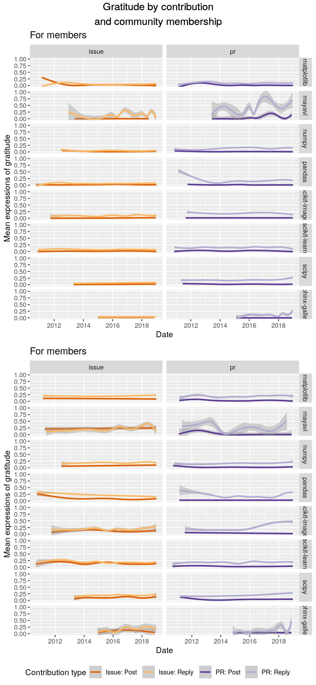

This R markdown provides the data preparation for our forthcoming manuscript
(Paxton, Varoquaux, Geiger, & Holdgraf, *in preparation*). 

To run this from scratch, you will need the following files:

* `../../data/analysis_data/all-sentiment_frame.csv`: Contains cleaned data and derived 
  variables from scraped GitHub data.
* `./utils/ossc-libraries_and_functions.r`: Loads in necessary libraries and creates 
  new functions for our analyses.

**Code written by**: A. Paxton (University of Connecticut)

**Date last modified**: 22 May 2019

***

# Preliminaries


```r
# clear everything
rm(list=ls())

# load libraries and add new functions
source('./utils/ossc-libraries_and_functions.r')
library(jtools)
library(magrittr)

library(splines)

# load data
joined_frame = read.table('../../data/analysis_data/all-sentiment_frame-for_r.csv', 
                          sep = ',', header=TRUE, fill=TRUE)
bot_names = read.table('../bot_names.txt') %>% .$V1 %>% as.character(.)
```

***

# Data preparation

## Identify potential remaining bots

**Note**: This is useful to run if more data are collected. The results
should be manually inspected, and any additional bots detected should
be added to the `../bot_names.txt` file. Otherwise, it does not need 
to be run.


```r
# # identify potential bots based on who uses "bot" in their names
# potential_bot_df = joined_frame %>% ungroup() %>%
#   filter(grepl("bot",author_name_issue)) %>% 
#   filter(grepl("bot",author_name_comment)) %>%
#   select(author_name_issue, author_name_comment)
# 
# # find all unique instances
# bot_issues = as.character(unique(potential_bot_df$author_name_issue))
# bot_comments = as.character(unique(potential_bot_df$author_name_comment))
# potential_bots = unique(c(bot_issues,bot_comments))
# potential_bots = potential_bots[grepl("bot",potential_bots)]
# 
# # save to file
# write.table(potential_bots, file="ossc-potential_bots.csv",
#           col.names=FALSE, row.names=FALSE)
```

## Convert time to numbers


```r
# fix time
joined_frame = joined_frame %>% ungroup() %>%
  
  # filter out bots
  filter(!author_name_issue %in% bot_names) %>% 
  filter(!author_name_comment %in% bot_names) %>% 
  
  # get time in days
  mutate(open_time_comment = strsplit(as.character(open_duration), ' ') %>%
           sapply(magrittr::extract2, 1) %>%
           as.numeric()) %>%
  mutate(open_time_issue = open_time_comment) %>%
  
  # get the year and month it was created 
  mutate(year_comment = as.numeric(format(as.Date(created_at_comment), "%Y"))) %>%
  mutate(year_issue = as.numeric(format(as.Date(created_at_issue), "%Y"))) %>%
  mutate(month_comment = as.numeric(format(as.Date(created_at_comment), "%m"))) %>%
  mutate(month_issue = as.numeric(format(as.Date(created_at_issue), "%m"))) %>%
  mutate(date_comment = as.numeric(as.Date(created_at_comment))) %>%
  mutate(date_issue = as.numeric(as.Date(created_at_issue))) %>%
  
  # drop old columns
  select(-ends_with('_at'), -contains('_at_'),
         -contains('month'), -contains('year'),
         -open_duration)
```


***

# Basic summary stats


Our dataset includes 8 unique projects with a total 
of 62304 unique issues, with a mean of `
r mean(activity_counts$unique_issues)` issues per project.

On these issues, the dataset includes 408963 
unique comments, with 6.5639927 average comments 
per issue.

In total, we have 14259 unique commenters, 
14133 unique issue-creators, and 18012 
overall unique users.

***

# Data analysis

Ideas:
* Do comments, generally, get more friendly or more hostile over time?
* Does the emotional valence of a contributor's first ticket predict whether they'll come 
back to make a second one?
* Are requesters more or less polite?
* Does friendliness bring people back?
* Does the number and intensity of negative and positive comments on a first-time contributor's issue 
change whether they come back to make another ticket?

## Model Series 1: Survivor curves

**To do**: See whether this can be modeled against a Poisson distribution, then see whether the
communities tend to be more similar or different to one another.
* Need to figure out how to do this (cf. orthogonal polynomials)


## Model Series 2: Sentiment analysis


```r
# mutate wide-form into long-form data
body_sentiment_df = joined_frame %>% ungroup() %>%
  select(contains('author'), 
         contains('grateful_count'),
         contains('emotion'),
         contains('id_'),
         contains('date_'),
         contains('open_'),
         contains('num_PR_'),
         -contains('ticket_id'))

# separate out comments, issues, and last activity counters
comment_sentiment_df = body_sentiment_df %>% ungroup() %>%
  select(ends_with('_comment')) %>%
  rename_all(funs(gsub('_comment','',.)))
issue_sentiment_df = body_sentiment_df %>% ungroup() %>%
  select(ends_with('_issue')) %>%
  rename_all(funs(gsub('_issue','',.)))
last_counters = joined_frame %>% ungroup() %>%
  select(id_issue, id_comment, project, bus_factor,
         issue_author_last_issue, issue_author_last_comment)

# merge counters
comment_sentiment_df = full_join(comment_sentiment_df,
                                 last_counters,
                                 by=c('id' = 'id_comment')) %>%
  select(-id_issue) %>%
  mutate(type = 'comment') %>%
  distinct()
issue_sentiment_df = full_join(issue_sentiment_df,
                               distinct(select(last_counters,
                                               -id_comment)),
                               by=c('id' = 'id_issue')) %>%
  mutate(type = 'issue') %>%
  distinct()

# append the dataframes
sentiment_frame = rbind.data.frame(comment_sentiment_df, issue_sentiment_df)

# concatenate association groups
sentiment_frame = sentiment_frame %>% ungroup() %>%
  mutate(author_group = ifelse(author_association=='MEMBER',
                               'member',
                               ifelse(author_association=='CONTRIBUTOR',
                                      'member',
                                      ifelse(author_association=='OWNER',
                                             'member',
                                             'nonmember')))) %>%
  
  # convert to factors
  mutate(author_group = as.factor(author_group)) %>%
  mutate(type = as.factor(type))
```

For Model 2, if we were going to keep original author associations,
we would have to remove first-time contributors and first-timers from 
the dataset when we're analyzing `type` as a covariate, since both types
of users only ever submitted issues.


```r
# first time contributors
first_time_contrib_df = sentiment_frame %>%
  filter(author_association=='FIRST_TIME_CONTRIBUTOR')
print(paste0("Unique contribution types for first-time contributors: ",
             unique(first_time_contrib_df$type)))
```

```
## [1] "Unique contribution types for first-time contributors: issue"
```

```r
# first time contributors
first_timers_df = sentiment_frame %>%
  filter(author_association=='FIRST_TIMER')
print(paste0("Unique contribution types for first-timers: ",
             unique(first_timers_df$type)))
```

```
## [1] "Unique contribution types for first-timers: issue"
```

However, because we are grouping simply by members and non-members,
we can retain them in the dataset.

### Model 2.1: Do issues and comments materially differ in emotion?


```r
# do issues and comments materially differ in emotion?
creators_v_commenters_emotion = lmer(compound_emotion ~ type * author_group +
                                       (1 | project) +
                                       (1 | author_name),
                                     data = sentiment_frame,
                                     REML=FALSE)

# print results
pander_lme(creators_v_commenters_emotion)
```


|               &nbsp;                | Estimate  | Std..Error | t.value |   p    | sig |
|:-----------------------------------:|:---------:|:----------:|:-------:|:------:|:---:|
|           **(Intercept)**           |  0.2098   |  0.01092   |  19.22  | 0.0001 | *** |
|            **typeissue**            | -0.07926  |  0.00218   | -36.36  | 0.0001 | *** |
|      **author_groupnonmember**      | -0.006838 |  0.003744  | -1.826  | 0.068  |  .  |
| **typeissue:author_groupnonmember** |  0.01139  |  0.004455  |  2.557  | 0.011  |  *  |

These results are quite different from our results conducted
over a smaller dataset last year. One potential reason is
that these effects may be time-dependent. Our next model
explores this possibility by adding a time term.


### Model 2.2: Do issues and comments materially differ in emotion over time?


```r
# do issues and comments materially differ in emotion over time?
creators_v_commenters_emotion_time = lmer(compound_emotion ~ type * author_group * ns(date) +
                                            (1 | project) +
                                            (1 | author_name),
                                          data = sentiment_frame,
                                          REML=FALSE)

# print results
pander_lme(creators_v_commenters_emotion_time)
```


|                    &nbsp;                    | Estimate | Std..Error | t.value |   p    | sig |
|:--------------------------------------------:|:--------:|:----------:|:-------:|:------:|:---:|
|               **(Intercept)**                |  0.2249  |  0.01132   |  19.86  | 0.0001 | *** |
|                **typeissue**                 | -0.1865  |  0.005778  | -32.29  | 0.0001 | *** |
|          **author_groupnonmember**           | 0.02776  |  0.008433  |  3.292  | 0.001  | **  |
|                 **ns(date)**                 | -0.03248 |  0.004935  | -6.581  | 0.0001 | *** |
|     **typeissue:author_groupnonmember**      | -0.0586  |  0.01305   | -4.489  | 0.0001 | *** |
|            **typeissue:ns(date)**            |  0.2179  |  0.01088   |  20.02  | 0.0001 | *** |
|      **author_groupnonmember:ns(date)**      | -0.0623  |  0.01423   | -4.379  | 0.0001 | *** |
| **typeissue:author_groupnonmember:ns(date)** |  0.1206  |  0.02372   |  5.085  | 0.0001 | *** |

Interestingly, we see much more volatility here in the emotion dynamics
of community members relative to the community nonmembers over time, even
when we collapse across all projects.

Perhaps more interestingly, we see a difference in the affect dynamics
only in the last year: Members' issues are becoming more positive, while
nonmembers' issues are becoming more negative.

We'll need to do an analysis to follow up on this.


```
## `geom_smooth()` using method = 'gam' and formula 'y ~ s(x, bs = "cs")'
## `geom_smooth()` using method = 'gam' and formula 'y ~ s(x, bs = "cs")'
## `geom_smooth()` using method = 'gam' and formula 'y ~ s(x, bs = "cs")'
## `geom_smooth()` using method = 'gam' and formula 'y ~ s(x, bs = "cs")'
## `geom_smooth()` using method = 'gam' and formula 'y ~ s(x, bs = "cs")'
```


### Model 2.3: Do issues and comments materially differ in gratitude?


```r
# create a summary table of gratitude by type and author association
gratitude_summary_stats = sentiment_frame %>% ungroup() %>%
  group_by(author_group, type, grateful_count) %>%
  summarise(n = n())

pander(gratitude_summary_stats)
```


--------------------------------------------------
 author_group    type     grateful_count     n    
-------------- --------- ---------------- --------
    member      comment         0          318300 

    member      comment         1          40406  

    member      comment         2           1082  

    member      comment         3            75   

    member      comment         4            2    

    member       issue          0          41934  

    member       issue          1           1907  

    member       issue          2           746   

    member       issue          3            25   

  nonmember     comment         0          39330  

  nonmember     comment         1           9103  

  nonmember     comment         2           622   

  nonmember     comment         3            42   

  nonmember     comment         4            1    

  nonmember      issue          0          15480  

  nonmember      issue          1           1886  

  nonmember      issue          2           320   

  nonmember      issue          3            6    
--------------------------------------------------

```r
# do users tend to express appreciation and gratitude differently by group and content?
creators_v_commenters_gratitude = glmer(grateful_count ~ author_group * type +
                                          (1 | project) +
                                          (1 | author_name),
                                        data=sentiment_frame,
                                        family=poisson)

# print results
summary(creators_v_commenters_gratitude)
```

```
## Generalized linear mixed model fit by maximum likelihood (Laplace
##   Approximation) [glmerMod]
##  Family: poisson  ( log )
## Formula: 
## grateful_count ~ author_group * type + (1 | project) + (1 | author_name)
##    Data: sentiment_frame
## 
##       AIC       BIC    logLik  deviance  df.resid 
##  345477.9  345544.3 -172733.0  345465.9    471261 
## 
## Scaled residuals: 
##     Min      1Q  Median      3Q     Max 
## -1.0216 -0.3623 -0.3124 -0.2255 19.2207 
## 
## Random effects:
##  Groups      Name        Variance Std.Dev.
##  author_name (Intercept) 0.590401 0.76838 
##  project     (Intercept) 0.001576 0.03969 
## Number of obs: 471267, groups:  author_name, 18012; project, 8
## 
## Fixed effects:
##                                 Estimate Std. Error z value
## (Intercept)                     -1.92452    0.02362 -81.474
## author_groupnonmember            0.23918    0.02103  11.373
## typeissue                       -0.51398    0.01809 -28.406
## author_groupnonmember:typeissue  0.03485    0.02927   1.191
##                                            Pr(>|z|)    
## (Intercept)                     <0.0000000000000002 ***
## author_groupnonmember           <0.0000000000000002 ***
## typeissue                       <0.0000000000000002 ***
## author_groupnonmember:typeissue               0.234    
## ---
## Signif. codes:  0 '***' 0.001 '**' 0.01 '*' 0.05 '.' 0.1 ' ' 1
## 
## Correlation of Fixed Effects:
##             (Intr) athr_g typess
## athr_grpnnm -0.522              
## typeissue   -0.140  0.160       
## athr_grpnn:  0.072 -0.291 -0.609
```


### Model 2.4: Do issues and comments materially differ in gratitude over time?

**Note**: Having difficulty getting this to converge.


```r
library(splines)
# do users tend to express appreciation and gratitude differently by group and content?
creators_v_commenters_gratitude_time = glmer(grateful_count ~ (author_group + type) * ns(date) +
                                               (1 | project),
                                             data=sentiment_frame,
                                             family=poisson)

# print results
summary(creators_v_commenters_gratitude_time)
```

```
## Generalized linear mixed model fit by maximum likelihood (Laplace
##   Approximation) [glmerMod]
##  Family: poisson  ( log )
## Formula: grateful_count ~ (author_group + type) * ns(date) + (1 | project)
##    Data: sentiment_frame
## 
##       AIC       BIC    logLik  deviance  df.resid 
##  362043.9  362121.4 -181015.0  362029.9    471260 
## 
## Scaled residuals: 
##     Min      1Q  Median      3Q     Max 
## -0.5983 -0.3740 -0.3327 -0.3052 22.7266 
## 
## Random effects:
##  Groups  Name        Variance Std.Dev.
##  project (Intercept) 0.05404  0.2325  
## Number of obs: 471267, groups:  project, 8
## 
## Fixed effects:
##                                Estimate Std. Error z value
## (Intercept)                    -2.35710    0.08183 -28.805
## author_groupnonmember           0.85114    0.03180  26.764
## typeissue                      -1.74778    0.04963 -35.218
## ns(date)                        0.47092    0.02562  18.378
## author_groupnonmember:ns(date) -0.48119    0.05494  -8.758
## typeissue:ns(date)              2.42027    0.08130  29.769
##                                           Pr(>|z|)    
## (Intercept)                    <0.0000000000000002 ***
## author_groupnonmember          <0.0000000000000002 ***
## typeissue                      <0.0000000000000002 ***
## ns(date)                       <0.0000000000000002 ***
## author_groupnonmember:ns(date) <0.0000000000000002 ***
## typeissue:ns(date)             <0.0000000000000002 ***
## ---
## Signif. codes:  0 '***' 0.001 '**' 0.01 '*' 0.05 '.' 0.1 ' ' 1
## 
## Correlation of Fixed Effects:
##             (Intr) athr_g typess ns(dt) at_:()
## athr_grpnnm -0.059                            
## typeissue   -0.040 -0.136                     
## ns(date)    -0.158  0.365  0.172              
## athr_grp:()  0.058 -0.948  0.125 -0.408       
## typss:ns(d)  0.042  0.134 -0.960 -0.204 -0.137
```


```
## `geom_smooth()` using method = 'gam' and formula 'y ~ s(x, bs = "cs")'
## `geom_smooth()` using method = 'gam' and formula 'y ~ s(x, bs = "cs")'
## `geom_smooth()` using method = 'gam' and formula 'y ~ s(x, bs = "cs")'
## `geom_smooth()` using method = 'gam' and formula 'y ~ s(x, bs = "cs")'
## `geom_smooth()` using method = 'gam' and formula 'y ~ s(x, bs = "cs")'
```



## Model Series 3: Retention


```r
# combine information by issue
retention_frame = joined_frame %>% ungroup() %>%
  group_by(project, id_issue) %>%
  summarize_if(is.numeric, mean, na.rm=TRUE) %>%
  ungroup() %>%
  left_join(., issue_sentiment_df,
            by=c('project', 'bus_factor',
                 'id_issue' = 'id'))

# normalize
retention_frame_st = retention_frame %>%
  mutate_all(funs(as.numeric(scale(as.numeric(.))))) %>%
  mutate(issue_author_last_issue = as.factor(issue_author_last_issue)) %>%
  mutate(project = as.factor(project))
```

```
## Warning in scale(as.numeric(type)): NAs introduced by coercion
```


```r
# what predicts continuing retention?
dropout_predictors = glmer(issue_author_last_issue ~ compound_emotion + grateful_count_comment + open_time +
                             (1 + grateful_count_comment | project),
                           data=retention_frame_st,
                           family=binomial)

# print it
summary(dropout_predictors)
```

```
## Generalized linear mixed model fit by maximum likelihood (Laplace
##   Approximation) [glmerMod]
##  Family: binomial  ( logit )
## Formula: 
## issue_author_last_issue ~ compound_emotion + grateful_count_comment +  
##     open_time + (1 + grateful_count_comment | project)
##    Data: retention_frame_st
## 
##      AIC      BIC   logLik deviance df.resid 
##  72926.3  72989.6 -36456.2  72912.3    62297 
## 
## Scaled residuals: 
##     Min      1Q  Median      3Q     Max 
## -1.5076 -0.6369 -0.5652  1.3507  2.6214 
## 
## Random effects:
##  Groups  Name                   Variance Std.Dev. Corr 
##  project (Intercept)            0.12799  0.3578        
##          grateful_count_comment 0.01585  0.1259   -0.68
## Number of obs: 62304, groups:  project, 8
## 
## Fixed effects:
##                         Estimate Std. Error z value             Pr(>|z|)
## (Intercept)            -0.927967   0.128094  -7.244 0.000000000000434370
## compound_emotion        0.073806   0.009065   8.142 0.000000000000000389
## grateful_count_comment  0.146308   0.047493   3.081              0.00207
## open_time               0.101775   0.008719  11.673 < 0.0000000000000002
##                           
## (Intercept)            ***
## compound_emotion       ***
## grateful_count_comment ** 
## open_time              ***
## ---
## Signif. codes:  0 '***' 0.001 '**' 0.01 '*' 0.05 '.' 0.1 ' ' 1
## 
## Correlation of Fixed Effects:
##             (Intr) cmpnd_ grtf__
## compond_mtn -0.001              
## grtfl_cnt_c -0.642 -0.003       
## open_time   -0.005 -0.053  0.035
```

**Note**. Need to fix this. Not really sure how best to demonstrate this given the limits of the linear fit...


