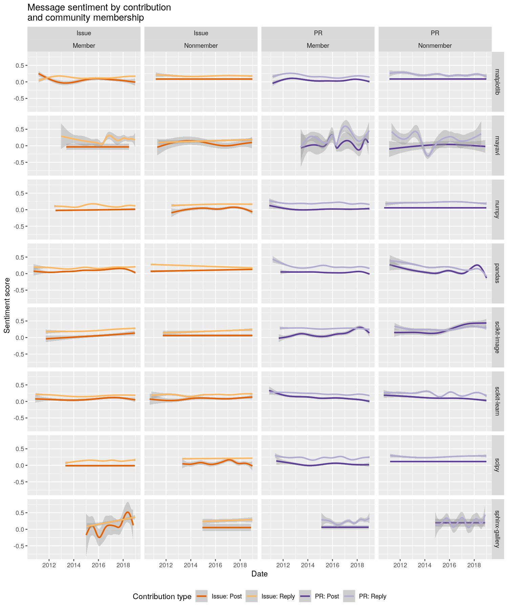

This R markdown provides the data preparation for our forthcoming manuscript
(Paxton, Varoquaux, Geiger, & Holdgraf, *in preparation*).

To run this from scratch, you will need the following files:

* `../../data/analysis_data/sentiment_frame_tickets-for_r.csv`: Contains cleaned
  **tickets**-related data and derived variables from scraped GitHub data.
* `../../data/analysis_data/sentiment_frame_comments-for_r.csv`: Contains
  cleaned **comments**-related data and derived variables from scraped GitHub
  data.
* `./utils/ossc-libraries_and_functions.r`: Loads in necessary libraries and
  creates new functions for our analyses.

**Code written by**: A. Paxton (University of Connecticut) & N. Varoquaux
(University of California, Berkeley)

**Date last modified**: 30 May 2019


***

# Preliminaries


```r
# clear everything
rm(list=ls())

# load libraries and add new functions
source('./utils/ossc-libraries_and_functions.r')

# load data
tickets_frame = read.table('../../data/analysis_data/dataset_upto2019/sentiment_frame_tickets-for_r.csv',
                          sep = ',', header=TRUE, fill=TRUE, stringsAsFactors = FALSE)
comments_frame = read.table('../../data/analysis_data/dataset_upto2019/sentiment_frame_comments-for_r.csv',
                            sep = ',', header=TRUE, fill=TRUE, stringsAsFactors = FALSE)

ticket_frame_preserve = tickets_frame
tickets_frame = ticket_frame_preserve
comment_frame_preserve = comments_frame
comments_frame = comment_frame_preserve
```

***

## Clean up dataframes

Here, we run a number of cleanup stages to ensure that we have the data we need
(and in the right format) for our models.


```r
# fix tickets dataframe
tickets_frame = tickets_frame %>% ungroup() %>%
  
  # filter out bots
  dplyr::filter(bot_flag == "False") %>%
  dplyr::select(-bot_flag) %>%
  
  # get time in seconds, read creation date properly, and specify contribution type
  dplyr::rename(open_time = open_duration) %>%
  mutate(date = as.numeric(as.Date(created_at))) %>%
  mutate(type_family = 'post') %>%
  
  # figure out author associations
  mutate(total_tickets = num_PR_created + num_issue_created) %>%
  mutate(author_group = dplyr::if_else(total_tickets < 5,
                                       'nonmember',
                                       'member')) %>%
  
  # rename variables associated with type of ticket and type of contribution
  dplyr::rename(ticket_family = type) %>%
  mutate(ticket_family = recode(ticket_family, pull_request = "pr")) %>%
  mutate(type = paste0(ticket_family,'_',type_family)) %>%
  
  # convert to factors (as needed) for proper modeling
  mutate_at(vars(first_ticket),
            as.logical) %>%
  mutate_at(vars(project,
                 author_name,
                 author_group,
                 author_association,
                 type,
                 type_family,
                 ticket_family),
            as.factor) %>%
  
  # drop old columns
  dplyr::select(-ends_with('_at'))
```


```r
# fix comments dataframe
comments_frame = comments_frame %>% ungroup() %>%
  
  # filter out bots and comments on tickets that have been filtered out (due to modification date)
  dplyr::filter(bot_flag == "False") %>%
  dplyr::select(-bot_flag) %>%
  dplyr::filter(!type == "") %>%
  
  # read creation date properly and add contribution type
  mutate(date = as.numeric(as.Date(created_at))) %>%
  mutate(type_family = 'reply') %>%
  
  # figure out author associations
  mutate(total_tickets = num_PR_created + num_issue_created) %>%
  mutate(author_group = dplyr::if_else(total_tickets < 5,
                                       'nonmember',
                                       'member')) %>%
  
  # rename variables associated with type of ticket and type of contribution
  dplyr::rename(ticket_family = type) %>%
  mutate(ticket_family = recode(ticket_family, pull_request = "pr")) %>%
  mutate(type = paste0(ticket_family,'_',type_family)) %>%
  
  # convert to factors (as needed) for proper modeling
  mutate_at(vars(project,
                 author_name,
                 author_group,
                 author_association,
                 type,
                 type_family,
                 ticket_family),
            as.factor) %>%

  # drop old columns
  dplyr::select(-ends_with('_at')) 
```

***

## Basic summary stats

Now that our data have been largely cleaned, let's take a look at some basic
patterns.


Our dataset includes 8 unique projects with a
total of 70548 unique tickets, with a
mean of 8818.5 tickets per project.

On these tickets, the dataset includes
411180 unique comments, with
5.13975\times 10^{4} average comments per project.

In total, we have 14338 unique commenters,
14565 unique ticket-creators, and
18471 overall unique users.

***

# Data analysis

***

## Model Series 1: Sentiment analysis

### Data preparation

Before we can run Model Series 1, we need to combine `tickets_frame` and
`comments_frame` into a single dataframe.


```r
# merge tickets and comments into a single frame
sentiment_frame = tickets_frame %>%
  dplyr::bind_rows(., comments_frame) %>%
  
  # keep only select variables
  dplyr::select(project,
                date,
                contains('author'),
                first_ticket,
                contains('num_'),
                contains('ticket'),
                contains('type'),
                contains('grateful_count'),
                contains('emotion'),
                contains('open_'),
                -contains('ticket_author_')) %>%
  
  # convert to factors (as needed) for proper modeling
  mutate_at(vars(first_ticket),
            as.logical) %>%
  mutate_at(vars(project,
                 author_name,
                 author_group,
                 author_association,
                 type,
                 type_family,
                 ticket_family),
            as.factor)
```

```
## Warning in bind_rows_(x, .id): Unequal factor levels: coercing to character
```

```
## Warning in bind_rows_(x, .id): binding character and factor vector,
## coercing into character vector

## Warning in bind_rows_(x, .id): binding character and factor vector,
## coercing into character vector
```

```
## Warning in bind_rows_(x, .id): Unequal factor levels: coercing to character
```

```
## Warning in bind_rows_(x, .id): binding character and factor vector,
## coercing into character vector

## Warning in bind_rows_(x, .id): binding character and factor vector,
## coercing into character vector
```

```
## Warning in bind_rows_(x, .id): Unequal factor levels: coercing to character
```

```
## Warning in bind_rows_(x, .id): binding character and factor vector,
## coercing into character vector

## Warning in bind_rows_(x, .id): binding character and factor vector,
## coercing into character vector
```

```
## Warning in bind_rows_(x, .id): Unequal factor levels: coercing to character
```

```
## Warning in bind_rows_(x, .id): binding character and factor vector,
## coercing into character vector

## Warning in bind_rows_(x, .id): binding character and factor vector,
## coercing into character vector
```

### Model 1.1: Do different kinds of user contributions materially differ in emotion?

Now we begin the actual modeling. Our first general question is whether users'
patterns of sentiment differ materially by whether they are a member of the
community versus a nonmember of the community and by their different kinds of
possible contributions (i.e., a posted pull request, a reply to a pull request,
a posted issue, or a reply to an issue).

#### Model 1.1a: Overall effects with linear mixed-effects models

This model presents the analyses in a way that is typical of psychological
analyses. We predict the changes in emotion by community membership and 
contribution type, including random effects for project and for author. This
allows us to explore the general patterns of the main and interaction terms,
rather than focusing in on the project-specific variability.


```r
# do tickets and comments materially differ in emotion?
creators_v_commenters_emotion_by_project = lmer(compound_emotion ~ type * author_group  +
                                                  (1 | project) + (1 | author_name),
                                                data = sentiment_frame,
                                                REML = FALSE)
```


While we see significant differences in the model, interpreting the results is
difficult because of the way that `lmer` handles factor comparisons. All 
factors are compared against a "reference level," the first level in the model.
This makes intepreting models with factors that include more than two levels
incredibly difficult, because the intercept is essentially an interaction term
among all reference levels of all factors.

As a result, we turn to the biostatistics approach of multiple *t*-tests 
(corrected for comparisons) of the model estimates to better understand the 
effects.

#### Model 1.1b: In-depth investigation through *t*-tests of model estimates

First, we build a series of linear mixed-effects models with one term included
in each model (either main term or interaction term). We then use the estimates
from those models to perform *t*-tests to investigate how different levels of
the effects differ from one another (and not just from the model-level 
intercept).

Projects here are random effects, but the rest of the model is the same as 
before. This allows us to do pairwise testing of main and interaction terms,
along with better exploring inter-project variability.

##### Model 1.1b.1: Does sentiment vary significantly by community membership?

First, look at whether there are differences in sentiment between author 
groups.


```r
# do members and nonmembers materially differ in emotion?
fixed_creators_v_commenters_emotion = lmer(
  compound_emotion ~ 0 + author_group + (1 | author_name) + (1 | project),
  data=sentiment_frame,
  REML=FALSE)
```

Run *t*-tests among levels and prepare for the Model 1.1b table later.


```r
# convert Model 1.1b1 output to dataframe
coefficients_and_se = data.frame(
  summary(fixed_creators_v_commenters_emotion)$coefficients)

# get comparison names as rownames
row_names = gsub("author_group", "", 
                 gsub("type", "", row.names(coefficients_and_se)))

# convert model estimates to a dataframe
means = coefficients_and_se$Estimate
names(means) = row_names

# convert standard error to dataframe
se = coefficients_and_se$Std..Error
names(se) = row_names

# compute t-statistics and p-values for desired contrasts
contrasts = c("member-nonmember")
author_groups_tests = compute_t_statistics(
  means, se,
  contrasts)
author_groups_tests[, "p_value"] = compute_p_value_from_t_stats(
  author_groups_tests$t_stats)
```

##### Model 1.1b.2: Does sentiment vary significantly across contribution types?

Now, look at whether there are differences in sentiment between contribution
types.


```r
# do tickets and comments materially differ in emotion?
fixed_types_emotion = lmer(
  compound_emotion ~ 0 + type + (1 | author_name) + (1 | project),
  data=sentiment_frame,
  REML=FALSE)
```

Run *t*-tests among levels and prepare for the Model 1.1b table later.


```r
# convert Model 1.1b2 output to dataframe
coefficients_and_se = data.frame(
  summary(fixed_types_emotion)$coefficients)

# get comparison names as rownames
row_names = gsub("author_group", "", 
                 gsub("type", "", row.names(coefficients_and_se)))

# convert model estimates to a dataframe
means = coefficients_and_se$Estimate
names(means) = row_names

# convert standard error to dataframe
se = coefficients_and_se$Std..Error
names(se) = row_names

# compute t-statistics and p-values for desired contrasts
contrasts = c("issue_post-issue_reply", # issues: posts vs. replies
              "pr_post-pr_reply",       # PRs: posts vs. replies
              "issue_post-pr_post",     # posts: issues vs. PRs
              "issue_reply-pr_reply")   # replies: issues vs. PRs
types_tests = compute_t_statistics(
  means, se,
  contrasts)
types_tests[, "p_value"] = compute_p_value_from_t_stats(types_tests$t_stats)
```

##### Model 1.1b.3: Does sentiment vary significantly across community memberships and contribution types?

Finally, let's look at the interaction between membership and contribution.


```r
# does emotion differ by the interaction between contribution and authorship group?
community_contribution_emotion = lmer(
  compound_emotion ~ 0 + type:author_group + (1 | author_name) + (1 | project),
  data=sentiment_frame,
  REML=FALSE)
```

Run *t*-tests among levels and prepare for the Model 1.1b table later.


```r
# convert Model 1.1b3 output to dataframe
coefficients_and_se = data.frame(
    summary(community_contribution_emotion)$coefficients)

# get comparison names as rownames
row_names = gsub("author_group", "", gsub("type", "", row.names(coefficients_and_se)))

# convert model estimates to a dataframe
means = coefficients_and_se$Estimate
names(means) = row_names

# convert standard error to dataframe
se = coefficients_and_se$Std..Error
names(se) = row_names

# compute t-statistics and p-values for desired contrasts
contrasts = c(
    "issue_post:member-issue_post:nonmember",     # contribution static (issue posts); membership varies (members v. nonmembers)
    "issue_reply:member-issue_reply:nonmember",   # contribution static (issue replies); membership varies (members v. nonmembers)
    "pr_post:member-pr_post:nonmember",           # contribution static (PR posts); membership varies (members v. nonmembers)
    "pr_reply:member-pr_reply:nonmember",         # contribution static (PR replies); membership varies (members v. nonmembers)
    "issue_post:member-issue_reply:member",       # contribution varies (issue posts vs. issue replies); membership static (members)
    "issue_post:nonmember-issue_reply:nonmember", # contribution varies (issue posts vs. issue replies); membership static (nonmembers)
    "pr_post:member-pr_reply:member",             # contribution varies (PR posts vs. PR replies); membership static (members)
    "pr_post:nonmember-pr_reply:nonmember",       # contribution varies (PR posts vs. PR replies); membership static (nonmembers)
    "issue_post:member-pr_post:member",           # contribution varies (issue posts vs. PR posts); membership static (members)
    "issue_post:nonmember-pr_post:nonmember",     # contribution varies (issue posts vs. PR posts); membership static (nonmembers)
    "issue_reply:member-pr_reply:member",         # contribution varies (issue replies vs. PR replies); membership static (members)
    "issue_reply:nonmember-pr_reply:nonmember")   # contribution varies (issue replies vs. PR replies); membership static (nonmembers)
types_author_groups_tests = compute_t_statistics(
    means, se,
    contrasts)
types_author_groups_tests[, "p_value"] = compute_p_value_from_t_stats(
    types_author_groups_tests$"t_stats")
```

##### Model 1.1b.4 : Do different kinds of user contributions differ in emotion by projects?

Now adding projects into the mix to understand how the previous analysis
varies across projects.


```r
# do tickets and comments materially differ in emotion by projects?
creators_v_commenters_emotion_by_project = lmer(
  compound_emotion ~ 0 + project:type:author_group + (1 | author_name),
  data = sentiment_frame,
  REML = FALSE)
```

Run *t*-tests among levels and prepare for the Model 1.1b table later.


```r
# convert Model 1.1c output to dataframe
coefficients_and_se = data.frame(
    summary(creators_v_commenters_emotion_by_project)$coefficients)

# get comparison names as rownames
row_names = gsub(
  "project", "", gsub(
    "author_group", "", gsub(
      "type", "", row.names(coefficients_and_se))))

# replace hyphens in project names with periods
row_names = gsub(
  "scikit-", "scikit.", gsub(
    "sphinx-", "sphinx.", row_names))

# convert model estimates to a dataframe
means = coefficients_and_se$Estimate
names(means) = row_names

# convert standard error to dataframe
se = coefficients_and_se$Std..Error
names(se) = row_names

# compute t-statistics and p-values for desired contrasts
# (note: ordering of contrasts within each project is identical to Model 1.1b.3)
contrasts = c(
  
  # scikit-learn
  "scikit.learn:issue_post:member-scikit.learn:issue_post:nonmember",   
  "scikit.learn:issue_reply:member-scikit.learn:issue_reply:nonmember",
  "scikit.learn:pr_post:member-scikit.learn:pr_post:nonmember",
  "scikit.learn:pr_reply:member-scikit.learn:pr_reply:nonmember",
  "scikit.learn:issue_post:member-scikit.learn:issue_reply:member",
  "scikit.learn:issue_post:nonmember-scikit.learn:issue_reply:nonmember",
  "scikit.learn:pr_post:member-scikit.learn:pr_reply:member",
  "scikit.learn:pr_post:nonmember-scikit.learn:pr_reply:nonmember",
  "scikit.learn:issue_post:member-scikit.learn:pr_post:member",
  "scikit.learn:issue_post:nonmember-scikit.learn:pr_post:nonmember",    
  "scikit.learn:issue_reply:member-scikit.learn:pr_reply:member",  
  "scikit.learn:issue_reply:nonmember-scikit.learn:pr_reply:nonmember",
  
  # scikit-image
  "scikit.image:issue_post:member-scikit.image:issue_post:nonmember", 
  "scikit.image:issue_reply:member-scikit.image:issue_reply:nonmember",
  "scikit.image:pr_post:member-scikit.image:pr_post:nonmember",       
  "scikit.image:pr_reply:member-scikit.image:pr_reply:nonmember",     
  "scikit.image:issue_post:member-scikit.image:issue_reply:member",
  "scikit.image:issue_post:nonmember-scikit.image:issue_reply:nonmember",
  "scikit.image:pr_post:member-scikit.image:pr_reply:member",     
  "scikit.image:pr_post:nonmember-scikit.image:pr_reply:nonmember",    
  "scikit.image:issue_post:member-scikit.image:pr_post:member",   
  "scikit.image:issue_post:nonmember-scikit.image:pr_post:nonmember",    
  "scikit.image:issue_reply:member-scikit.image:pr_reply:member",  
  "scikit.image:issue_reply:nonmember-scikit.image:pr_reply:nonmember",
  
  # matplotlib
  "matplotlib:issue_post:member-matplotlib:issue_post:nonmember", 
  "matplotlib:issue_reply:member-matplotlib:issue_reply:nonmember",
  "matplotlib:pr_post:member-matplotlib:pr_post:nonmember",       
  "matplotlib:pr_reply:member-matplotlib:pr_reply:nonmember",     
  "matplotlib:issue_post:member-matplotlib:issue_reply:member",
  "matplotlib:issue_post:nonmember-matplotlib:issue_reply:nonmember",
  "matplotlib:pr_post:member-matplotlib:pr_reply:member",     
  "matplotlib:pr_post:nonmember-matplotlib:pr_reply:nonmember",    
  "matplotlib:issue_post:member-matplotlib:pr_post:member",   
  "matplotlib:issue_post:nonmember-matplotlib:pr_post:nonmember",    
  "matplotlib:issue_reply:member-matplotlib:pr_reply:member",  
  "matplotlib:issue_reply:nonmember-matplotlib:pr_reply:nonmember",
  
  # mayavi
  "mayavi:issue_post:member-mayavi:issue_post:nonmember", 
  "mayavi:issue_reply:member-mayavi:issue_reply:nonmember",
  "mayavi:pr_post:member-mayavi:pr_post:nonmember",       
  "mayavi:pr_reply:member-mayavi:pr_reply:nonmember",     
  "mayavi:issue_post:member-mayavi:issue_reply:member",
  "mayavi:issue_post:nonmember-mayavi:issue_reply:nonmember",
  "mayavi:pr_post:member-mayavi:pr_reply:member",     
  "mayavi:pr_post:nonmember-mayavi:pr_reply:nonmember",    
  "mayavi:issue_post:member-mayavi:pr_post:member",   
  "mayavi:issue_post:nonmember-mayavi:pr_post:nonmember",    
  "mayavi:issue_reply:member-mayavi:pr_reply:member",  
  "mayavi:issue_reply:nonmember-mayavi:pr_reply:nonmember",
  
  # pandas
  "pandas:issue_post:member-pandas:issue_post:nonmember", 
  "pandas:issue_reply:member-pandas:issue_reply:nonmember",
  "pandas:pr_post:member-pandas:pr_post:nonmember",       
  "pandas:pr_reply:member-pandas:pr_reply:nonmember",     
  "pandas:issue_post:member-pandas:issue_reply:member",
  "pandas:issue_post:nonmember-pandas:issue_reply:nonmember",
  "pandas:pr_post:member-pandas:pr_reply:member",     
  "pandas:pr_post:nonmember-pandas:pr_reply:nonmember",    
  "pandas:issue_post:member-pandas:pr_post:member",   
  "pandas:issue_post:nonmember-pandas:pr_post:nonmember",    
  "pandas:issue_reply:member-pandas:pr_reply:member",  
  "pandas:issue_reply:nonmember-pandas:pr_reply:nonmember",
  
  # scipy
  "scipy:issue_post:member-scipy:issue_post:nonmember", 
  "scipy:issue_reply:member-scipy:issue_reply:nonmember",
  "scipy:pr_post:member-scipy:pr_post:nonmember",       
  "scipy:pr_reply:member-scipy:pr_reply:nonmember",     
  "scipy:issue_post:member-scipy:issue_reply:member",
  "scipy:issue_post:nonmember-scipy:issue_reply:nonmember",
  "scipy:pr_post:member-scipy:pr_reply:member",     
  "scipy:pr_post:nonmember-scipy:pr_reply:nonmember",    
  "scipy:issue_post:member-scipy:pr_post:member",   
  "scipy:issue_post:nonmember-scipy:pr_post:nonmember",    
  "scipy:issue_reply:member-scipy:pr_reply:member",  
  "scipy:issue_reply:nonmember-scipy:pr_reply:nonmember",
  
  # numpy
  "numpy:issue_post:member-numpy:issue_post:nonmember", 
  "numpy:issue_reply:member-numpy:issue_reply:nonmember",
  "numpy:pr_post:member-numpy:pr_post:nonmember",       
  "numpy:pr_reply:member-numpy:pr_reply:nonmember",     
  "numpy:issue_post:member-numpy:issue_reply:member",
  "numpy:issue_post:nonmember-numpy:issue_reply:nonmember",
  "numpy:pr_post:member-numpy:pr_reply:member",     
  "numpy:pr_post:nonmember-numpy:pr_reply:nonmember",    
  "numpy:issue_post:member-numpy:pr_post:member",   
  "numpy:issue_post:nonmember-numpy:pr_post:nonmember",    
  "numpy:issue_reply:member-numpy:pr_reply:member",  
  "numpy:issue_reply:nonmember-numpy:pr_reply:nonmember",
  
  # sphinx-gallery
  "sphinx.gallery:issue_post:member-sphinx.gallery:issue_post:nonmember", 
  "sphinx.gallery:issue_reply:member-sphinx.gallery:issue_reply:nonmember",
  "sphinx.gallery:pr_post:member-sphinx.gallery:pr_post:nonmember",       
  "sphinx.gallery:pr_reply:member-sphinx.gallery:pr_reply:nonmember",     
  "sphinx.gallery:issue_post:member-sphinx.gallery:issue_reply:member",
  "sphinx.gallery:issue_post:nonmember-sphinx.gallery:issue_reply:nonmember",
  "sphinx.gallery:pr_post:member-sphinx.gallery:pr_reply:member",     
  "sphinx.gallery:pr_post:nonmember-sphinx.gallery:pr_reply:nonmember",    
  "sphinx.gallery:issue_post:member-sphinx.gallery:pr_post:member",   
  "sphinx.gallery:issue_post:nonmember-sphinx.gallery:pr_post:nonmember",    
  "sphinx.gallery:issue_reply:member-sphinx.gallery:pr_reply:member",  
  "sphinx.gallery:issue_reply:nonmember-sphinx.gallery:pr_reply:nonmember"
)
project_types_author_group_tests = compute_t_statistics(
  means, se,
  contrasts)
project_types_author_group_tests[, "p_value"] = compute_p_value_from_t_stats(
  project_types_author_group_tests$t_stats) 
```

#### Model 1.1b: Overall results

Now we bring together all analyses from Model 1.1b.


```r
# specify main terms
author_groups_tests["contrast"] = row.names(author_groups_tests)
types_tests["contrast"] = row.names(types_tests)
all_tests = merge(author_groups_tests, types_tests, all=TRUE, sort=FALSE)
all_tests["model"] = "Main Terms"

# specify 2-way interactions
types_author_groups_tests["contrast"] = row.names(types_author_groups_tests)
types_author_groups_tests["model"] = "2W: Types x Author Groups"
all_tests = merge(all_tests, types_author_groups_tests, all=TRUE, sort=FALSE)

# specify 3-way interactions
project_types_author_group_tests["contrast"] = row.names(project_types_author_group_tests)
project_types_author_group_tests["model"] = "3W: Types x Author Groups x Project"
all_tests = merge(all_tests, project_types_author_group_tests, all=TRUE,
		  sort=FALSE)
```

Let's correct all tests at once for multiple comparisons.


```r
# specify all contrasts
row.names(all_tests) = all_tests$contrast
all_tests = subset(all_tests, select=-c(contrast))

# print the table (reordering columns for readibility)
all_tests = all_tests[c("model", "t_stats", "p_value")]
pander_clean_anova(all_tests, rename_columns=FALSE)
```


|                                    &nbsp;                                    |                model                | t_stats  | p_value | p_adj  | sig |
|:----------------------------------------------------------------------------:|:-----------------------------------:|:--------:|:-------:|:------:|:---:|
|                             **member-nonmember**                             |             Main Terms              | -0.2866  |  0.77   |  0.84  |     |
|                          **issue_post-issue_reply**                          |             Main Terms              |   -6.1   | 0.0001  | 0.0001 | *** |
|                             **pr_post-pr_reply**                             |             Main Terms              |  -5.863  | 0.0001  | 0.0001 | *** |
|                            **issue_post-pr_post**                            |             Main Terms              |  -3.397  |  0.001  | 0.001  | **  |
|                           **issue_reply-pr_reply**                           |             Main Terms              |  -3.239  |  0.001  | 0.002  | **  |
|                  **issue_post:member-issue_post:nonmember**                  |      2W: Types x Author Groups      |  -1.706  |  0.088  | 0.126  |     |
|                 **issue_reply:member-issue_reply:nonmember**                 |      2W: Types x Author Groups      |  -1.676  |  0.094  | 0.132  |     |
|                     **pr_post:member-pr_post:nonmember**                     |      2W: Types x Author Groups      |  -3.788  | 0.0002  | 0.0003 | *** |
|                    **pr_reply:member-pr_reply:nonmember**                    |      2W: Types x Author Groups      |  0.1261  |   0.9   |  0.93  |     |
|                   **issue_post:member-issue_reply:member**                   |      2W: Types x Author Groups      |  -5.726  | 0.0001  | 0.0001 | *** |
|                **issue_post:nonmember-issue_reply:nonmember**                |      2W: Types x Author Groups      |  -5.889  | 0.0001  | 0.0001 | *** |
|                      **pr_post:member-pr_reply:member**                      |      2W: Types x Author Groups      |  -6.459  | 0.0001  | 0.0001 | *** |
|                   **pr_post:nonmember-pr_reply:nonmember**                   |      2W: Types x Author Groups      |  -2.508  |  0.012  |  0.02  |  *  |
|                     **issue_post:member-pr_post:member**                     |      2W: Types x Author Groups      |  -2.475  |  0.013  | 0.022  |  *  |
|                  **issue_post:nonmember-pr_post:nonmember**                  |      2W: Types x Author Groups      |  -4.669  | 0.0001  | 0.0001 | *** |
|                    **issue_reply:member-pr_reply:member**                    |      2W: Types x Author Groups      |  -3.241  |  0.001  | 0.002  | **  |
|                 **issue_reply:nonmember-pr_reply:nonmember**                 |      2W: Types x Author Groups      |  -1.495  |  0.135  | 0.181  |     |
|     **scikit.learn:issue_post:member-scikit.learn:issue_post:nonmember**     | 3W: Types x Author Groups x Project |  -4.552  | 0.0001  | 0.0001 | *** |
|    **scikit.learn:issue_reply:member-scikit.learn:issue_reply:nonmember**    | 3W: Types x Author Groups x Project |  -1.497  |  0.134  | 0.181  |     |
|        **scikit.learn:pr_post:member-scikit.learn:pr_post:nonmember**        | 3W: Types x Author Groups x Project |  -12.35  | 0.0001  | 0.0001 | *** |
|       **scikit.learn:pr_reply:member-scikit.learn:pr_reply:nonmember**       | 3W: Types x Author Groups x Project |  0.5509  |  0.58   |  0.66  |     |
|      **scikit.learn:issue_post:member-scikit.learn:issue_reply:member**      | 3W: Types x Author Groups x Project |  -7.604  | 0.0001  | 0.0001 | *** |
|   **scikit.learn:issue_post:nonmember-scikit.learn:issue_reply:nonmember**   | 3W: Types x Author Groups x Project |  -4.248  | 0.0001  | 0.0001 | *** |
|         **scikit.learn:pr_post:member-scikit.learn:pr_reply:member**         | 3W: Types x Author Groups x Project |  -4.709  | 0.0001  | 0.0001 | *** |
|      **scikit.learn:pr_post:nonmember-scikit.learn:pr_reply:nonmember**      | 3W: Types x Author Groups x Project |  10.34   | 0.0001  | 0.0001 | *** |
|        **scikit.learn:issue_post:member-scikit.learn:pr_post:member**        | 3W: Types x Author Groups x Project |  -6.994  | 0.0001  | 0.0001 | *** |
|     **scikit.learn:issue_post:nonmember-scikit.learn:pr_post:nonmember**     | 3W: Types x Author Groups x Project |  -15.64  | 0.0001  | 0.0001 | *** |
|       **scikit.learn:issue_reply:member-scikit.learn:pr_reply:member**       | 3W: Types x Author Groups x Project |  -6.581  | 0.0001  | 0.0001 | *** |
|    **scikit.learn:issue_reply:nonmember-scikit.learn:pr_reply:nonmember**    | 3W: Types x Author Groups x Project |  -4.607  | 0.0001  | 0.0001 | *** |
|     **scikit.image:issue_post:member-scikit.image:issue_post:nonmember**     | 3W: Types x Author Groups x Project | -0.6335  |  0.53   |  0.62  |     |
|    **scikit.image:issue_reply:member-scikit.image:issue_reply:nonmember**    | 3W: Types x Author Groups x Project | -0.2443  |  0.81   |  0.86  |     |
|        **scikit.image:pr_post:member-scikit.image:pr_post:nonmember**        | 3W: Types x Author Groups x Project |  -6.301  | 0.0001  | 0.0001 | *** |
|       **scikit.image:pr_reply:member-scikit.image:pr_reply:nonmember**       | 3W: Types x Author Groups x Project | -0.5555  |  0.58   |  0.66  |     |
|      **scikit.image:issue_post:member-scikit.image:issue_reply:member**      | 3W: Types x Author Groups x Project |  -7.138  | 0.0001  | 0.0001 | *** |
|   **scikit.image:issue_post:nonmember-scikit.image:issue_reply:nonmember**   | 3W: Types x Author Groups x Project |  -6.794  | 0.0001  | 0.0001 | *** |
|         **scikit.image:pr_post:member-scikit.image:pr_reply:member**         | 3W: Types x Author Groups x Project |  -8.621  | 0.0001  | 0.0001 | *** |
|      **scikit.image:pr_post:nonmember-scikit.image:pr_reply:nonmember**      | 3W: Types x Author Groups x Project |  -0.454  |  0.65   |  0.73  |     |
|        **scikit.image:issue_post:member-scikit.image:pr_post:member**        | 3W: Types x Author Groups x Project |  -3.192  |  0.001  | 0.003  | **  |
|     **scikit.image:issue_post:nonmember-scikit.image:pr_post:nonmember**     | 3W: Types x Author Groups x Project |  -8.013  | 0.0001  | 0.0001 | *** |
|       **scikit.image:issue_reply:member-scikit.image:pr_reply:member**       | 3W: Types x Author Groups x Project |  -4.299  | 0.0001  | 0.0001 | *** |
|    **scikit.image:issue_reply:nonmember-scikit.image:pr_reply:nonmember**    | 3W: Types x Author Groups x Project |  -3.911  | 0.0001  | 0.0002 | *** |
|       **matplotlib:issue_post:member-matplotlib:issue_post:nonmember**       | 3W: Types x Author Groups x Project |  -4.763  | 0.0001  | 0.0001 | *** |
|      **matplotlib:issue_reply:member-matplotlib:issue_reply:nonmember**      | 3W: Types x Author Groups x Project |  -2.077  |  0.038  | 0.058  |  .  |
|          **matplotlib:pr_post:member-matplotlib:pr_post:nonmember**          | 3W: Types x Author Groups x Project |   3.75   | 0.0002  | 0.0004 | *** |
|         **matplotlib:pr_reply:member-matplotlib:pr_reply:nonmember**         | 3W: Types x Author Groups x Project |  -1.714  |  0.087  | 0.125  |     |
|        **matplotlib:issue_post:member-matplotlib:issue_reply:member**        | 3W: Types x Author Groups x Project |  -2.96   |  0.003  | 0.005  | **  |
|     **matplotlib:issue_post:nonmember-matplotlib:issue_reply:nonmember**     | 3W: Types x Author Groups x Project |  0.9657  |  0.33   |  0.41  |     |
|           **matplotlib:pr_post:member-matplotlib:pr_reply:member**           | 3W: Types x Author Groups x Project |  4.488   | 0.0001  | 0.0001 | *** |
|        **matplotlib:pr_post:nonmember-matplotlib:pr_reply:nonmember**        | 3W: Types x Author Groups x Project |  -1.651  |  0.099  | 0.138  |     |
|          **matplotlib:issue_post:member-matplotlib:pr_post:member**          | 3W: Types x Author Groups x Project |  -8.119  | 0.0001  | 0.0001 | *** |
|       **matplotlib:issue_post:nonmember-matplotlib:pr_post:nonmember**       | 3W: Types x Author Groups x Project |  0.2639  |  0.79   |  0.85  |     |
|         **matplotlib:issue_reply:member-matplotlib:pr_reply:member**         | 3W: Types x Author Groups x Project |  -3.27   |  0.001  | 0.002  | **  |
|      **matplotlib:issue_reply:nonmember-matplotlib:pr_reply:nonmember**      | 3W: Types x Author Groups x Project |  -2.849  |  0.004  | 0.008  | **  |
|           **mayavi:issue_post:member-mayavi:issue_post:nonmember**           | 3W: Types x Author Groups x Project |  -1.529  |  0.126  | 0.174  |     |
|          **mayavi:issue_reply:member-mayavi:issue_reply:nonmember**          | 3W: Types x Author Groups x Project |  -1.334  |  0.182  | 0.237  |     |
|              **mayavi:pr_post:member-mayavi:pr_post:nonmember**              | 3W: Types x Author Groups x Project | -0.4235  |  0.67   |  0.74  |     |
|             **mayavi:pr_reply:member-mayavi:pr_reply:nonmember**             | 3W: Types x Author Groups x Project |  -2.057  |  0.04   |  0.06  |  .  |
|            **mayavi:issue_post:member-mayavi:issue_reply:member**            | 3W: Types x Author Groups x Project |  -1.914  |  0.056  | 0.083  |  .  |
|         **mayavi:issue_post:nonmember-mayavi:issue_reply:nonmember**         | 3W: Types x Author Groups x Project |  -2.969  |  0.003  | 0.005  | **  |
|               **mayavi:pr_post:member-mayavi:pr_reply:member**               | 3W: Types x Author Groups x Project |  -2.242  |  0.025  | 0.039  |  *  |
|            **mayavi:pr_post:nonmember-mayavi:pr_reply:nonmember**            | 3W: Types x Author Groups x Project |  -3.473  |    0    | 0.001  | **  |
|              **mayavi:issue_post:member-mayavi:pr_post:member**              | 3W: Types x Author Groups x Project | -0.06091 |  0.95   |  0.95  |     |
|           **mayavi:issue_post:nonmember-mayavi:pr_post:nonmember**           | 3W: Types x Author Groups x Project |  1.154   |  0.249  |  0.31  |     |
|             **mayavi:issue_reply:member-mayavi:pr_reply:member**             | 3W: Types x Author Groups x Project | -0.1032  |  0.92   |  0.94  |     |
|          **mayavi:issue_reply:nonmember-mayavi:pr_reply:nonmember**          | 3W: Types x Author Groups x Project |  -1.483  |  0.138  | 0.183  |     |
|           **pandas:issue_post:member-pandas:issue_post:nonmember**           | 3W: Types x Author Groups x Project |  -0.144  |  0.89   |  0.93  |     |
|          **pandas:issue_reply:member-pandas:issue_reply:nonmember**          | 3W: Types x Author Groups x Project |  -4.628  | 0.0001  | 0.0001 | *** |
|              **pandas:pr_post:member-pandas:pr_post:nonmember**              | 3W: Types x Author Groups x Project |  -3.938  | 0.0001  | 0.0002 | *** |
|             **pandas:pr_reply:member-pandas:pr_reply:nonmember**             | 3W: Types x Author Groups x Project |  3.558   | 0.0004  | 0.001  | **  |
|            **pandas:issue_post:member-pandas:issue_reply:member**            | 3W: Types x Author Groups x Project |  -9.136  | 0.0001  | 0.0001 | *** |
|         **pandas:issue_post:nonmember-pandas:issue_reply:nonmember**         | 3W: Types x Author Groups x Project |  -14.74  | 0.0001  | 0.0001 | *** |
|               **pandas:pr_post:member-pandas:pr_reply:member**               | 3W: Types x Author Groups x Project |  -17.98  | 0.0001  | 0.0001 | *** |
|            **pandas:pr_post:nonmember-pandas:pr_reply:nonmember**            | 3W: Types x Author Groups x Project |  -8.129  | 0.0001  | 0.0001 | *** |
|              **pandas:issue_post:member-pandas:pr_post:member**              | 3W: Types x Author Groups x Project |  4.586   | 0.0001  | 0.0001 | *** |
|           **pandas:issue_post:nonmember-pandas:pr_post:nonmember**           | 3W: Types x Author Groups x Project |  0.3306  |  0.74   |  0.81  |     |
|             **pandas:issue_reply:member-pandas:pr_reply:member**             | 3W: Types x Author Groups x Project |  -4.361  | 0.0001  | 0.0001 | *** |
|          **pandas:issue_reply:nonmember-pandas:pr_reply:nonmember**          | 3W: Types x Author Groups x Project |  3.736   | 0.0002  | 0.0004 | *** |
|            **scipy:issue_post:member-scipy:issue_post:nonmember**            | 3W: Types x Author Groups x Project |  -2.507  |  0.012  |  0.02  |  *  |
|           **scipy:issue_reply:member-scipy:issue_reply:nonmember**           | 3W: Types x Author Groups x Project |  -4.84   | 0.0001  | 0.0001 | *** |
|               **scipy:pr_post:member-scipy:pr_post:nonmember**               | 3W: Types x Author Groups x Project |  -3.394  |  0.001  | 0.001  | **  |
|              **scipy:pr_reply:member-scipy:pr_reply:nonmember**              | 3W: Types x Author Groups x Project |  -1.327  |  0.184  | 0.237  |     |
|             **scipy:issue_post:member-scipy:issue_reply:member**             | 3W: Types x Author Groups x Project |  -8.081  | 0.0001  | 0.0001 | *** |
|          **scipy:issue_post:nonmember-scipy:issue_reply:nonmember**          | 3W: Types x Author Groups x Project |  -11.1   | 0.0001  | 0.0001 | *** |
|                **scipy:pr_post:member-scipy:pr_reply:member**                | 3W: Types x Author Groups x Project |  -16.05  | 0.0001  | 0.0001 | *** |
|             **scipy:pr_post:nonmember-scipy:pr_reply:nonmember**             | 3W: Types x Author Groups x Project |  -10.14  | 0.0001  | 0.0001 | *** |
|               **scipy:issue_post:member-scipy:pr_post:member**               | 3W: Types x Author Groups x Project |  -1.72   |  0.085  | 0.125  |     |
|            **scipy:issue_post:nonmember-scipy:pr_post:nonmember**            | 3W: Types x Author Groups x Project |  -2.427  |  0.015  | 0.024  |  *  |
|              **scipy:issue_reply:member-scipy:pr_reply:member**              | 3W: Types x Author Groups x Project |  -8.89   | 0.0001  | 0.0001 | *** |
|           **scipy:issue_reply:nonmember-scipy:pr_reply:nonmember**           | 3W: Types x Author Groups x Project |  -4.127  | 0.0001  | 0.0001 | *** |
|            **numpy:issue_post:member-numpy:issue_post:nonmember**            | 3W: Types x Author Groups x Project | -0.0741  |  0.94   |  0.95  |     |
|           **numpy:issue_reply:member-numpy:issue_reply:nonmember**           | 3W: Types x Author Groups x Project |  -2.672  |  0.008  | 0.013  |  *  |
|               **numpy:pr_post:member-numpy:pr_post:nonmember**               | 3W: Types x Author Groups x Project |  0.7193  |  0.47   |  0.57  |     |
|              **numpy:pr_reply:member-numpy:pr_reply:nonmember**              | 3W: Types x Author Groups x Project |  1.212   |  0.226  |  0.28  |     |
|             **numpy:issue_post:member-numpy:issue_reply:member**             | 3W: Types x Author Groups x Project |  -9.651  | 0.0001  | 0.0001 | *** |
|          **numpy:issue_post:nonmember-numpy:issue_reply:nonmember**          | 3W: Types x Author Groups x Project |   -13    | 0.0001  | 0.0001 | *** |
|                **numpy:pr_post:member-numpy:pr_reply:member**                | 3W: Types x Author Groups x Project |  -13.97  | 0.0001  | 0.0001 | *** |
|             **numpy:pr_post:nonmember-numpy:pr_reply:nonmember**             | 3W: Types x Author Groups x Project |  -10.14  | 0.0001  | 0.0001 | *** |
|               **numpy:issue_post:member-numpy:pr_post:member**               | 3W: Types x Author Groups x Project |  -4.311  | 0.0001  | 0.0001 | *** |
|            **numpy:issue_post:nonmember-numpy:pr_post:nonmember**            | 3W: Types x Author Groups x Project |  -3.352  |  0.001  | 0.002  | **  |
|              **numpy:issue_reply:member-numpy:pr_reply:member**              | 3W: Types x Author Groups x Project |  -9.969  | 0.0001  | 0.0001 | *** |
|           **numpy:issue_reply:nonmember-numpy:pr_reply:nonmember**           | 3W: Types x Author Groups x Project |  -4.564  | 0.0001  | 0.0001 | *** |
|   **sphinx.gallery:issue_post:member-sphinx.gallery:issue_post:nonmember**   | 3W: Types x Author Groups x Project |  1.071   |  0.28   |  0.35  |     |
|  **sphinx.gallery:issue_reply:member-sphinx.gallery:issue_reply:nonmember**  | 3W: Types x Author Groups x Project | -0.5578  |  0.58   |  0.66  |     |
|      **sphinx.gallery:pr_post:member-sphinx.gallery:pr_post:nonmember**      | 3W: Types x Author Groups x Project |  -1.362  |  0.173  | 0.228  |     |
|     **sphinx.gallery:pr_reply:member-sphinx.gallery:pr_reply:nonmember**     | 3W: Types x Author Groups x Project |  0.6198  |  0.54   |  0.62  |     |
|    **sphinx.gallery:issue_post:member-sphinx.gallery:issue_reply:member**    | 3W: Types x Author Groups x Project |  -3.049  |  0.002  | 0.004  | **  |
| **sphinx.gallery:issue_post:nonmember-sphinx.gallery:issue_reply:nonmember** | 3W: Types x Author Groups x Project |  -4.317  | 0.0001  | 0.0001 | *** |
|       **sphinx.gallery:pr_post:member-sphinx.gallery:pr_reply:member**       | 3W: Types x Author Groups x Project |  -3.424  |  0.001  | 0.001  | **  |
|    **sphinx.gallery:pr_post:nonmember-sphinx.gallery:pr_reply:nonmember**    | 3W: Types x Author Groups x Project | -0.2188  |  0.83   |  0.87  |     |
|      **sphinx.gallery:issue_post:member-sphinx.gallery:pr_post:member**      | 3W: Types x Author Groups x Project | -0.06205 |  0.95   |  0.95  |     |
|   **sphinx.gallery:issue_post:nonmember-sphinx.gallery:pr_post:nonmember**   | 3W: Types x Author Groups x Project |  -2.221  |  0.026  | 0.041  |  *  |
|     **sphinx.gallery:issue_reply:member-sphinx.gallery:pr_reply:member**     | 3W: Types x Author Groups x Project |  0.6627  |  0.51   |  0.6   |     |
|  **sphinx.gallery:issue_reply:nonmember-sphinx.gallery:pr_reply:nonmember**  | 3W: Types x Author Groups x Project |  1.285   |  0.199  |  0.25  |     |

Finally, let's plot these effects.


### Model 1.2: Do tickets and comments materially differ in emotion over time?


```r
# specify number of splines basis to use
degrees_of_freedom = 4
```

In this model, we explore whether there are time-based splines in the
observations from Model 1.1. First, let's look at the splines basis functions,
and which time points they span by default.


Now, let us use these splines model to model the time variation of the 3-way
interaction terms. We model the intercept for the three way interaction
separately from the splines: This allows us to only look at changes over time
and not changes in intercept.

Note that we cannot use too many degrees of freedom, as sphinx-gallery spans a
shorter time period than other projects. Any spline basis function that covers
only the 2012 to 2015 cannot be estimated on sphinx-gallery.


```r
# do tickets and comments materially differ in emotion over time?
formula = (
  compound_emotion ~ 0 + project:type:author_group + 
    project:type:author_group:ns(date, df=degrees_of_freedom) +
    (1 | author_name))

creators_v_commenters_emotion_by_project_time = lmer(
  formula,
  data = sentiment_frame,
  REML=FALSE)
```

We'll do another table to display all results.


```r
# convert Model 1.2 output to dataframe
coefficients_and_se = data.frame(
    summary(creators_v_commenters_emotion_by_project_time)$coefficients)

# get comparison names as rownames
row_names = gsub(
    "project", "", gsub(
	"author_group", "", gsub("type", "", row.names(coefficients_and_se))))

# Now deal with the very annoying splines coefficient row.names
row_names = gsub(
    "ns(date, df = degrees_of_freedom)", "coef", row_names, fixed=TRUE)

# replace hyphens in project names with periods
row_names = gsub(
    "scikit-", "scikit.", gsub(
	"sphinx-", "sphinx.", row_names))

# convert model estimates to a dataframe
means = coefficients_and_se$Estimate
names(means) = row_names

# convert standard error to dataframe
se = coefficients_and_se$Std..Error
names(se) = row_names

# we're interested in looking at the coefficients of the splines.
time_contrasts = c(
    gsub("member", "member:coef1", contrasts),
    gsub("member", "member:coef2", contrasts),
    gsub("member", "member:coef3", contrasts),
    gsub("member", "member:coef4", contrasts))

# compute statistics over specified contrast areas
project_type_author_group_time_tests = compute_t_statistics(
    means, se, time_contrasts)
project_type_author_group_time_tests[, "p_value"] = compute_p_value_from_t_stats(
    project_type_author_group_time_tests$t_stats)
```

Because we have so many tests, we'll only display the ones that are significant
(after adjusting for multiple comparisons).




### Model 1.3: Do tickets and comments materially differ in gratitude?

First, let's take a look at a summary table of expressions of gratitude by
membership status and contribution type.


Now that we have a better idea of how the underlying data look, let's go ahead
and build our model.


```r
# do users tend to express appreciation and gratitude differently by group and content?
creators_v_commenters_gratitude_by_project = lmer(log(grateful_count + 1) ~ project * author_group * type +
                                          (1 | author_name),
                                        data=sentiment_frame)

# print results
pander_lme(creators_v_commenters_gratitude_by_project)
```


|                             &nbsp;                              | Estimate  | Std..Error |   df   | t.value  |   p    | p_adj  | sig |
|:---------------------------------------------------------------:|:---------:|:----------:|:------:|:--------:|:------:|:------:|:---:|
|                         **(Intercept)**                         |  0.09239  |  0.006063  | 445467 |  15.24   | 0.0001 | 0.0001 | *** |
|                        **projectmayavi**                        | 0.0007727 |  0.03017   | 469646 | 0.02561  |  0.98  |  0.98  |     |
|                        **projectnumpy**                         | -0.01311  |  0.007818  | 470511 |  -1.677  | 0.094  | 0.133  |     |
|                        **projectpandas**                        | -0.02461  |  0.006717  | 479317 |  -3.664  | 0.0002 |   0    | *** |
|                     **projectscikit-image**                     | -0.04424  |  0.01153   | 469885 |  -3.837  | 0.0001 | 0.0003 | *** |
|                     **projectscikit-learn**                     | -0.01302  |  0.00772   | 476407 |  -1.687  | 0.092  | 0.133  |     |
|                        **projectscipy**                         | -0.006395 |  0.009436  | 468854 | -0.6777  |  0.5   |  0.56  |     |
|                    **projectsphinx-gallery**                    | -0.005051 |  0.02315   | 464111 | -0.2181  |  0.83  |  0.85  |     |
|                    **author_groupnonmember**                    | -0.02154  |  0.007236  | 466450 |  -2.977  | 0.003  | 0.006  | **  |
|                       **typeissue_reply**                       |  0.03041  |  0.005603  | 464477 |  5.428   | 0.0001 | 0.0001 | *** |
|                         **typepr_post**                         |  0.1373   |  0.006147  | 464744 |  22.34   | 0.0001 | 0.0001 | *** |
|                        **typepr_reply**                         |  0.0603   |  0.005529  | 464761 |  10.91   | 0.0001 | 0.0001 | *** |
|             **projectmayavi:author_groupnonmember**             |  0.07983  |  0.03245   | 464170 |   2.46   | 0.014  | 0.023  |  *  |
|             **projectnumpy:author_groupnonmember**              | 0.008166  |  0.009992  | 465201 |  0.8172  |  0.41  |  0.5   |     |
|             **projectpandas:author_groupnonmember**             | 0.009659  |  0.008408  | 460362 |  1.149   |  0.25  |  0.32  |     |
|          **projectscikit-image:author_groupnonmember**          |  0.06146  |  0.01544   | 452013 |  3.981   | 0.0001 | 0.0002 | *** |
|          **projectscikit-learn:author_groupnonmember**          |  0.1131   |  0.009737  | 458960 |  11.61   | 0.0001 | 0.0001 | *** |
|             **projectscipy:author_groupnonmember**              |  0.02466  |  0.01151   | 471010 |  2.142   | 0.032  | 0.051  |  .  |
|         **projectsphinx-gallery:author_groupnonmember**         |  0.05737  |   0.0326   | 476585 |   1.76   | 0.078  | 0.119  |     |
|                **projectmayavi:typeissue_reply**                | -0.001663 |  0.02691   | 463928 | -0.06179 |  0.95  |  0.97  |     |
|                **projectnumpy:typeissue_reply**                 |  -0.0106  |  0.007648  | 463876 |  -1.386  | 0.166  | 0.217  |     |
|                **projectpandas:typeissue_reply**                | 0.009474  |  0.006295  | 464390 |  1.505   | 0.132  | 0.176  |     |
|             **projectscikit-image:typeissue_reply**             |  0.02991  |  0.01131   | 463135 |  2.645   | 0.008  | 0.014  |  *  |
|             **projectscikit-learn:typeissue_reply**             | 0.006799  |  0.007354  | 463891 |  0.9245  |  0.36  |  0.44  |     |
|                **projectscipy:typeissue_reply**                 | -0.003274 |  0.009403  | 463572 | -0.3481  |  0.73  |  0.79  |     |
|            **projectsphinx-gallery:typeissue_reply**            | -0.007021 |  0.02431   | 462954 | -0.2889  |  0.77  |  0.82  |     |
|                  **projectmayavi:typepr_post**                  |  -0.1726  |  0.02964   | 463170 |  -5.822  | 0.0001 | 0.0001 | *** |
|                  **projectnumpy:typepr_post**                   |  -0.1207  |  0.008693  | 463981 |  -13.89  | 0.0001 | 0.0001 | *** |
|                  **projectpandas:typepr_post**                  |  -0.1318  |  0.007211  | 464701 |  -18.27  | 0.0001 | 0.0001 | *** |
|               **projectscikit-image:typepr_post**               |  -0.1215  |  0.01255   | 463292 |  -9.675  | 0.0001 | 0.0001 | *** |
|               **projectscikit-learn:typepr_post**               | -0.06229  |  0.008488  | 464066 |  -7.338  | 0.0001 | 0.0001 | *** |
|                  **projectscipy:typepr_post**                   |  -0.1404  |  0.01037   | 463698 |  -13.54  | 0.0001 | 0.0001 | *** |
|              **projectsphinx-gallery:typepr_post**              |  -0.1396  |  0.02877   | 462972 |  -4.851  | 0.0001 | 0.0001 | *** |
|                 **projectmayavi:typepr_reply**                  |  0.1066   |  0.02738   | 463490 |  3.894   | 0.0001 | 0.0002 | *** |
|                  **projectnumpy:typepr_reply**                  |  0.02465  |  0.00763   | 464124 |  3.231   | 0.001  | 0.002  | **  |
|                 **projectpandas:typepr_reply**                  |  0.04145  |  0.006238  | 464764 |  6.644   | 0.0001 | 0.0001 | *** |
|              **projectscikit-image:typepr_reply**               |  0.06525  |  0.01101   | 463282 |  5.924   | 0.0001 | 0.0001 | *** |
|              **projectscikit-learn:typepr_reply**               |  0.02599  |  0.007237  | 464163 |  3.592   | 0.0003 | 0.001  | **  |
|                  **projectscipy:typepr_reply**                  |  0.04082  |  0.009265  | 463755 |  4.406   | 0.0001 | 0.0001 | *** |
|             **projectsphinx-gallery:typepr_reply**              | 0.006141  |  0.02361   | 463075 |  0.2601  |  0.8   |  0.83  |     |
|            **author_groupnonmember:typeissue_reply**            |  0.05736  |  0.007502  | 481487 |  7.645   | 0.0001 | 0.0001 | *** |
|              **author_groupnonmember:typepr_post**              | -0.07588  |  0.009344  | 462793 |  -8.121  | 0.0001 | 0.0001 | *** |
|             **author_groupnonmember:typepr_reply**              |  0.03452  |  0.008101  | 446935 |  4.261   | 0.0001 | 0.0001 | *** |
|     **projectmayavi:author_groupnonmember:typeissue_reply**     | -0.04878  |  0.03109   | 480921 |  -1.569  | 0.117  | 0.159  |     |
|     **projectnumpy:author_groupnonmember:typeissue_reply**      |  0.01883  |  0.01062   | 480560 |  1.773   | 0.076  | 0.119  |     |
|     **projectpandas:author_groupnonmember:typeissue_reply**     | 0.005965  |  0.008782  | 480576 |  0.6793  |  0.5   |  0.56  |     |
|  **projectscikit-image:author_groupnonmember:typeissue_reply**  | -0.05448  |  0.01641   | 480061 |  -3.32   | 0.001  | 0.002  | **  |
|  **projectscikit-learn:author_groupnonmember:typeissue_reply**  |  -0.1279  |  0.01013   | 479657 |  -12.63  | 0.0001 | 0.0001 | *** |
|     **projectscipy:author_groupnonmember:typeissue_reply**      | -0.009138 |  0.01223   | 481574 |  -0.747  |  0.46  |  0.54  |     |
| **projectsphinx-gallery:author_groupnonmember:typeissue_reply** | -0.01993  |  0.03654   | 472668 | -0.5453  |  0.59  |  0.65  |     |
|       **projectmayavi:author_groupnonmember:typepr_post**       |  0.04818  |  0.04133   | 476540 |  1.166   | 0.244  |  0.31  |     |
|       **projectnumpy:author_groupnonmember:typepr_post**        |  0.0568   |  0.01339   | 466368 |  4.241   | 0.0001 | 0.0001 | *** |
|       **projectpandas:author_groupnonmember:typepr_post**       |  0.06412  |  0.01133   | 459045 |  5.661   | 0.0001 | 0.0001 | *** |
|    **projectscikit-image:author_groupnonmember:typepr_post**    |  0.03275  |  0.01938   | 465729 |   1.69   | 0.091  | 0.133  |     |
|    **projectscikit-learn:author_groupnonmember:typepr_post**    |   0.139   |  0.01251   | 464038 |  11.11   | 0.0001 | 0.0001 | *** |
|       **projectscipy:author_groupnonmember:typepr_post**        |  0.05548  |  0.01474   | 472282 |  3.763   | 0.0002 | 0.0004 | *** |
|   **projectsphinx-gallery:author_groupnonmember:typepr_post**   |  0.03353  |  0.04774   | 478672 |  0.7024  |  0.48  |  0.56  |     |
|      **projectmayavi:author_groupnonmember:typepr_reply**       |  -0.1029  |  0.03622   | 475510 |  -2.84   | 0.004  | 0.008  | **  |
|       **projectnumpy:author_groupnonmember:typepr_reply**       |  -0.0183  |  0.01139   | 455294 |  -1.606  | 0.108  | 0.151  |     |
|      **projectpandas:author_groupnonmember:typepr_reply**       | -0.02323  |  0.009582  | 439945 |  -2.424  | 0.015  | 0.025  |  *  |
|   **projectscikit-image:author_groupnonmember:typepr_reply**    | -0.08038  |  0.01652   | 451532 |  -4.866  | 0.0001 | 0.0001 | *** |
|   **projectscikit-learn:author_groupnonmember:typepr_reply**    |  -0.1305  |  0.01065   | 446457 |  -12.25  | 0.0001 | 0.0001 | *** |
|       **projectscipy:author_groupnonmember:typepr_reply**       | -0.04235  |  0.01268   | 464221 |  -3.339  | 0.001  | 0.002  | **  |
|  **projectsphinx-gallery:author_groupnonmember:typepr_reply**   | -0.09107  |  0.03624   | 477421 |  -2.513  | 0.012  | 0.021  |  *  |


### Model 1.4: Do tickets and comments materially differ in gratitude over time?

**Note**: Having difficulty getting this to converge.


```r
# do users tend to express appreciation and gratitude differently by group and content?
creators_v_commenters_gratitude_time = lmer(log(grateful_count + 1) ~ project + 
                                              (author_group + type) * ns(date, df=degrees_of_freedom) +
                                               (1 | author_name),
                                             data=sentiment_frame)
                                             #family=poisson)

# print results
pander_lme(creators_v_commenters_gratitude_time)
```


|                            &nbsp;                            | Estimate  | Std..Error |   df   | t.value |   p    | p_adj  | sig |
|:------------------------------------------------------------:|:---------:|:----------:|:------:|:-------:|:------:|:------:|:---:|
|                       **(Intercept)**                        |  0.07927  |  0.01137   | 468872 |  6.975  | 0.0001 | 0.0001 | *** |
|                      **projectmayavi**                       |  0.04175  |  0.007716  | 113551 |  5.41   | 0.0001 | 0.0001 | *** |
|                       **projectnumpy**                       | -0.01353  |  0.002492  | 238400 | -5.429  | 0.0001 | 0.0001 | *** |
|                      **projectpandas**                       | -0.01372  |  0.002491  | 138209 |  -5.51  | 0.0001 | 0.0001 | *** |
|                   **projectscikit-image**                    | -0.01137  |  0.003596  | 258295 | -3.162  | 0.002  | 0.004  | **  |
|                   **projectscikit-learn**                    |  0.0142   |  0.002641  | 135298 |  5.376  | 0.0001 | 0.0001 | *** |
|                       **projectscipy**                       | 0.002477  |  0.002611  | 236913 | 0.9489  |  0.34  |  0.42  |     |
|                  **projectsphinx-gallery**                   | -0.009757 |  0.005223  | 472455 | -1.868  | 0.062  | 0.094  |  .  |
|                  **author_groupnonmember**                   |  0.03654  |  0.007521  | 434494 |  4.858  | 0.0001 | 0.0001 | *** |
|                     **typeissue_reply**                      |  0.05205  |   0.0117   | 479716 |  4.45   | 0.0001 | 0.0001 | *** |
|                       **typepr_post**                        | -0.01768  |  0.01392   | 481577 |  -1.27  | 0.204  |  0.27  |     |
|                       **typepr_reply**                       |  0.07356  |  0.01129   | 481441 |  6.513  | 0.0001 | 0.0001 | *** |
|            **ns(date, df = degrees_of_freedom)1**            | -0.01413  |  0.01021   | 481671 | -1.383  | 0.167  | 0.232  |     |
|            **ns(date, df = degrees_of_freedom)2**            | 0.003694  |  0.009434  | 479066 | 0.3916  |  0.7   |  0.74  |     |
|            **ns(date, df = degrees_of_freedom)3**            | -0.004628 |   0.0253   | 481648 | -0.1829 |  0.86  |  0.86  |     |
|            **ns(date, df = degrees_of_freedom)4**            |  0.02079  |  0.006617  | 465445 |  3.142  | 0.002  | 0.004  | **  |
| **author_groupnonmember:ns(date, df = degrees_of_freedom)1** | -0.01732  |  0.007239  | 387423 | -2.392  | 0.017  |  0.03  |  *  |
| **author_groupnonmember:ns(date, df = degrees_of_freedom)2** | -0.003162 |  0.006457  | 335775 | -0.4896 |  0.62  |  0.71  |     |
| **author_groupnonmember:ns(date, df = degrees_of_freedom)3** | -0.03583  |  0.01734   | 400994 | -2.066  | 0.039  | 0.065  |  .  |
| **author_groupnonmember:ns(date, df = degrees_of_freedom)4** | -0.02107  |  0.004846  | 174298 | -4.348  | 0.0001 | 0.0001 | *** |
|    **typeissue_reply:ns(date, df = degrees_of_freedom)1**    | -0.00472  |   0.0107   | 479963 | -0.4412 |  0.66  |  0.73  |     |
|      **typepr_post:ns(date, df = degrees_of_freedom)1**      | -0.01141  |  0.01295   | 481529 | -0.881  |  0.38  |  0.45  |     |
|     **typepr_reply:ns(date, df = degrees_of_freedom)1**      |   0.029   |  0.01043   | 481334 |  2.78   | 0.005  | 0.011  |  *  |
|    **typeissue_reply:ns(date, df = degrees_of_freedom)2**    | -0.01047  |  0.009881  | 481513 | -1.059  |  0.29  |  0.37  |     |
|      **typepr_post:ns(date, df = degrees_of_freedom)2**      |  0.1422   |  0.01192   | 478987 |  11.93  | 0.0001 | 0.0001 | *** |
|     **typepr_reply:ns(date, df = degrees_of_freedom)2**      |  0.01973  |  0.009642  | 477025 |  2.046  | 0.041  | 0.065  |  .  |
|    **typeissue_reply:ns(date, df = degrees_of_freedom)3**    | -0.009209 |  0.02675   | 480614 | -0.3442 |  0.73  |  0.75  |     |
|      **typepr_post:ns(date, df = degrees_of_freedom)3**      |  0.1947   |  0.03186   | 481444 |  6.111  | 0.0001 | 0.0001 | *** |
|     **typepr_reply:ns(date, df = degrees_of_freedom)3**      |  0.04265  |  0.02586   | 481191 |  1.65   | 0.099  | 0.144  |     |
|    **typeissue_reply:ns(date, df = degrees_of_freedom)4**    | -0.01666  |  0.00674   | 470351 | -2.472  | 0.013  | 0.025  |  *  |
|      **typepr_post:ns(date, df = degrees_of_freedom)4**      |  0.1344   |  0.00835   | 469886 |  16.09  | 0.0001 | 0.0001 | *** |
|     **typepr_reply:ns(date, df = degrees_of_freedom)4**      |  0.02716  |  0.006734  | 461058 |  4.033  | 0.0001 | 0.0001 | *** |


```
## `geom_smooth()` using method = 'gam' and formula 'y ~ s(x, bs = "cs")'
## `geom_smooth()` using method = 'gam' and formula 'y ~ s(x, bs = "cs")'
## `geom_smooth()` using method = 'gam' and formula 'y ~ s(x, bs = "cs")'
## `geom_smooth()` using method = 'gam' and formula 'y ~ s(x, bs = "cs")'
## `geom_smooth()` using method = 'gam' and formula 'y ~ s(x, bs = "cs")'
```


## Model Series 2: Retention

Our second set of models investigates what aspects of the response to a 
newcomer's first contribution might predict their likelihood to come back
to contribute a second time.

### Data preparation

Because each ticket has multiple comments, we cannot use the standard long-form
format for the dataset, or we would lead to (uneven) duplication of tickets
based on the varying numbers of comments. As a result, we pull metrics of the
whole comment chain and use them as our measures of the community's response
to the newcomer's contribution.


```r
# aggregate ticket-level metrics for comments
aggregated_comments = comments_frame %>% ungroup() %>%
  
  # convert author group to numeric
  mutate(author_group_numeric = dplyr::if_else(author_group=='member',
                                                          1,
                                                          0)) %>%

  # create metrics for each unique ticket in each project
  dplyr::group_by(project, ticket_id) %>%
  dplyr::summarise(number_of_comments = n(),
                   comment_sentiment_mean = mean(compound_emotion, na.rm=TRUE),
                   comment_sentiment_variance = var(compound_emotion),
                   comment_sentiment_max_negative = max(negative_emotion),
                   comment_sentiment_max_positive = max(positive_emotion),
                   comment_grateful_cumulative = sum(grateful_count),
                   comment_first_response = min(date),
                   comment_member_ratio = sum(author_group_numeric)/n())
```

After we've summarized the comment threads, we next join those metrics with the
tickets dataframe in preparation for our models.


```r
# create joint dataframe
retention_frame = tickets_frame %>%
  dplyr::left_join(., aggregated_comments,
                   by=c('project', 'ticket_id')) %>%
  
  # keep only newcomers
  dplyr::filter(first_ticket == TRUE) %>%
  
  # keep only select variables
  dplyr::select(project,
                date,
                contains('author'),
                first_ticket,
                contains('num_'),
                contains('ticket'),
                contains('type'),
                contains('grateful_count'),
                contains('emotion'),
                open_time,
                contains('comment_'),
                number_of_comments,
                -contains('stamp'),
                -contains('last_comment')) %>%
  
  # read appropriate variables as logical
  mutate_at(vars(first_ticket,
                 ticket_author_last_ticket),
            as.logical) %>%
  
  # recode and rename retention variable so that it reflects continued engagement
  dplyr::rename(retained_newcomer = ticket_author_last_ticket) %>%
  mutate(retained_newcomer = dplyr::if_else(retained_newcomer==TRUE,
                                            FALSE,
                                            TRUE)) %>%
  
  # recode ticket group as two-level numeric factor
  mutate(ticket_family_numeric = dplyr::if_else(ticket_family=='issue',
                                                -.5,
                                                .5)) %>%
  
  #convert to factors (as needed) for proper modeling
  mutate_at(vars(project,
                 author_name,
                 author_group,
                 author_association,
                 type,
                 type_family,
                 ticket_family,
                 ticket_family_numeric,
                 retained_newcomer),
            as.factor)
```

### Model 2.1: How does a community's response to newcomers predict the newcomer's decision to return?


```r
# what predicts continuing retention?
retention_predictors = glm(retained_newcomer ~ 0 + ticket_family_numeric * (project +
                                                                              open_time +
                                                                              comment_sentiment_mean + 
                                                                              comment_sentiment_max_negative + 
                                                                              comment_grateful_cumulative +
                                                                              number_of_comments +
                                                                              comment_member_ratio),
                           data=retention_frame,
                           family=binomial)

# print it
summary(retention_predictors)
```

```
## 
## Call:
## glm(formula = retained_newcomer ~ 0 + ticket_family_numeric * 
##     (project + open_time + comment_sentiment_mean + comment_sentiment_max_negative + 
##         comment_grateful_cumulative + number_of_comments + comment_member_ratio), 
##     family = binomial, data = retention_frame)
## 
## Deviance Residuals: 
##     Min       1Q   Median       3Q      Max  
## -2.3499  -0.8983  -0.7522   1.3096   2.3341  
## 
## Coefficients:
##                                                                 Estimate
## ticket_family_numeric-0.5                               -0.7274080957937
## ticket_family_numeric0.5                                 0.2302003975911
## projectmayavi                                           -0.2795739475825
## projectnumpy                                            -0.5213276214793
## projectpandas                                            0.2278888256871
## projectscikit-image                                     -0.0773393060764
## projectscikit-learn                                     -0.0813432838562
## projectscipy                                            -0.4853302048485
## projectsphinx-gallery                                    0.8393223405582
## open_time                                                0.0000000021581
## comment_sentiment_mean                                   0.3129885143643
## comment_sentiment_max_negative                          -0.2820849651052
## comment_grateful_cumulative                             -0.0949692092659
## number_of_comments                                       0.0197377606244
## comment_member_ratio                                    -0.3552845599634
## ticket_family_numeric0.5:projectmayavi                   0.0569337929438
## ticket_family_numeric0.5:projectnumpy                    0.5171229250571
## ticket_family_numeric0.5:projectpandas                  -0.2726785432337
## ticket_family_numeric0.5:projectscikit-image             0.0906546834657
## ticket_family_numeric0.5:projectscikit-learn             0.1713966905028
## ticket_family_numeric0.5:projectscipy                    0.5847244745321
## ticket_family_numeric0.5:projectsphinx-gallery          -0.3810847789655
## ticket_family_numeric0.5:open_time                      -0.0000000122038
## ticket_family_numeric0.5:comment_sentiment_mean         -0.0137380285665
## ticket_family_numeric0.5:comment_sentiment_max_negative  0.3171224882578
## ticket_family_numeric0.5:comment_grateful_cumulative     0.0009006914348
## ticket_family_numeric0.5:number_of_comments              0.0115651717206
## ticket_family_numeric0.5:comment_member_ratio           -0.6340458454493
##                                                               Std. Error
## ticket_family_numeric-0.5                                0.0850608637615
## ticket_family_numeric0.5                                 0.1307325495182
## projectmayavi                                            0.1640557235907
## projectnumpy                                             0.0760006495952
## projectpandas                                            0.0598469566457
## projectscikit-image                                      0.1171339111667
## projectscikit-learn                                      0.0690284516709
## projectscipy                                             0.0793887021142
## projectsphinx-gallery                                    0.3067589721576
## open_time                                                0.0000000005232
## comment_sentiment_mean                                   0.0875491876164
## comment_sentiment_max_negative                           0.2039235867851
## comment_grateful_cumulative                              0.0229019877705
## number_of_comments                                       0.0039542504019
## comment_member_ratio                                     0.0815153776822
## ticket_family_numeric0.5:projectmayavi                   0.4113917675640
## ticket_family_numeric0.5:projectnumpy                    0.1344831245802
## ticket_family_numeric0.5:projectpandas                   0.1148395073725
## ticket_family_numeric0.5:projectscikit-image             0.1922993588631
## ticket_family_numeric0.5:projectscikit-learn             0.1181806309537
## ticket_family_numeric0.5:projectscipy                    0.1387757455915
## ticket_family_numeric0.5:projectsphinx-gallery           0.5848318848951
## ticket_family_numeric0.5:open_time                       0.0000000015883
## ticket_family_numeric0.5:comment_sentiment_mean          0.1787182854048
## ticket_family_numeric0.5:comment_sentiment_max_negative  0.3273604565686
## ticket_family_numeric0.5:comment_grateful_cumulative     0.0318370326613
## ticket_family_numeric0.5:number_of_comments              0.0060364050337
## ticket_family_numeric0.5:comment_member_ratio            0.1478891281137
##                                                         z value
## ticket_family_numeric-0.5                                -8.552
## ticket_family_numeric0.5                                  1.761
## projectmayavi                                            -1.704
## projectnumpy                                             -6.860
## projectpandas                                             3.808
## projectscikit-image                                      -0.660
## projectscikit-learn                                      -1.178
## projectscipy                                             -6.113
## projectsphinx-gallery                                     2.736
## open_time                                                 4.125
## comment_sentiment_mean                                    3.575
## comment_sentiment_max_negative                           -1.383
## comment_grateful_cumulative                              -4.147
## number_of_comments                                        4.992
## comment_member_ratio                                     -4.358
## ticket_family_numeric0.5:projectmayavi                    0.138
## ticket_family_numeric0.5:projectnumpy                     3.845
## ticket_family_numeric0.5:projectpandas                   -2.374
## ticket_family_numeric0.5:projectscikit-image              0.471
## ticket_family_numeric0.5:projectscikit-learn              1.450
## ticket_family_numeric0.5:projectscipy                     4.213
## ticket_family_numeric0.5:projectsphinx-gallery           -0.652
## ticket_family_numeric0.5:open_time                       -7.684
## ticket_family_numeric0.5:comment_sentiment_mean          -0.077
## ticket_family_numeric0.5:comment_sentiment_max_negative   0.969
## ticket_family_numeric0.5:comment_grateful_cumulative      0.028
## ticket_family_numeric0.5:number_of_comments               1.916
## ticket_family_numeric0.5:comment_member_ratio            -4.287
##                                                                     Pr(>|z|)
## ticket_family_numeric-0.5                               < 0.0000000000000002
## ticket_family_numeric0.5                                             0.07826
## projectmayavi                                                        0.08835
## projectnumpy                                              0.0000000000069095
## projectpandas                                                        0.00014
## projectscikit-image                                                  0.50908
## projectscikit-learn                                                  0.23864
## projectscipy                                              0.0000000009756660
## projectsphinx-gallery                                                0.00622
## open_time                                                 0.0000370397251684
## comment_sentiment_mean                                               0.00035
## comment_sentiment_max_negative                                       0.16658
## comment_grateful_cumulative                               0.0000337202765435
## number_of_comments                                        0.0000005990278877
## comment_member_ratio                                      0.0000130958490640
## ticket_family_numeric0.5:projectmayavi                               0.88993
## ticket_family_numeric0.5:projectnumpy                                0.00012
## ticket_family_numeric0.5:projectpandas                               0.01758
## ticket_family_numeric0.5:projectscikit-image                         0.63734
## ticket_family_numeric0.5:projectscikit-learn                         0.14698
## ticket_family_numeric0.5:projectscipy                     0.0000251500813100
## ticket_family_numeric0.5:projectsphinx-gallery                       0.51465
## ticket_family_numeric0.5:open_time                        0.0000000000000155
## ticket_family_numeric0.5:comment_sentiment_mean                      0.93873
## ticket_family_numeric0.5:comment_sentiment_max_negative              0.33268
## ticket_family_numeric0.5:comment_grateful_cumulative                 0.97743
## ticket_family_numeric0.5:number_of_comments                          0.05538
## ticket_family_numeric0.5:comment_member_ratio             0.0000180853638811
##                                                            
## ticket_family_numeric-0.5                               ***
## ticket_family_numeric0.5                                .  
## projectmayavi                                           .  
## projectnumpy                                            ***
## projectpandas                                           ***
## projectscikit-image                                        
## projectscikit-learn                                        
## projectscipy                                            ***
## projectsphinx-gallery                                   ** 
## open_time                                               ***
## comment_sentiment_mean                                  ***
## comment_sentiment_max_negative                             
## comment_grateful_cumulative                             ***
## number_of_comments                                      ***
## comment_member_ratio                                    ***
## ticket_family_numeric0.5:projectmayavi                     
## ticket_family_numeric0.5:projectnumpy                   ***
## ticket_family_numeric0.5:projectpandas                  *  
## ticket_family_numeric0.5:projectscikit-image               
## ticket_family_numeric0.5:projectscikit-learn               
## ticket_family_numeric0.5:projectscipy                   ***
## ticket_family_numeric0.5:projectsphinx-gallery             
## ticket_family_numeric0.5:open_time                      ***
## ticket_family_numeric0.5:comment_sentiment_mean            
## ticket_family_numeric0.5:comment_sentiment_max_negative    
## ticket_family_numeric0.5:comment_grateful_cumulative       
## ticket_family_numeric0.5:number_of_comments             .  
## ticket_family_numeric0.5:comment_member_ratio           ***
## ---
## Signif. codes:  0 '***' 0.001 '**' 0.01 '*' 0.05 '.' 0.1 ' ' 1
## 
## (Dispersion parameter for binomial family taken to be 1)
## 
##     Null deviance: 23592  on 17018  degrees of freedom
## Residual deviance: 20659  on 16990  degrees of freedom
##   (905 observations deleted due to missingness)
## AIC: 20715
## 
## Number of Fisher Scoring iterations: 4
```


***

# Future directions

Ideas:

* Do comments, generally, get more friendly or more hostile over time?
* Does the emotional valence of a contributor's first ticket predict whether
  they'll come back to make a second one?
* Are requesters more or less polite?
* Does friendliness bring people back?
* Does the number and intensity of negative and positive comments on a
  first-time contributor's ticket change whether they come back to make another
  ticket?
