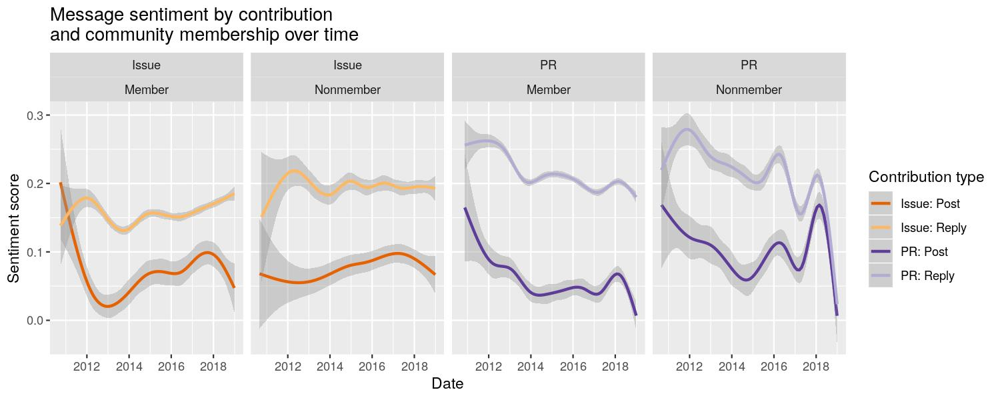

This R markdown provides the data preparation for our forthcoming manuscript
(Paxton, Varoquaux, Geiger, & Holdgraf, *in preparation*).

To run this from scratch, you will need the following files:

* `../../data/analysis_data/sentiment_frame_tickets-for_r.csv`: Contains cleaned
  **tickets**-related data and derived variables from scraped GitHub data.
* `../../data/analysis_data/sentiment_frame_comments-for_r.csv`: Contains
  cleaned **comments**-related data and derived variables from scraped GitHub
  data.
* `./utils/ossc-libraries_and_functions.r`: Loads in necessary libraries and
  creates new functions for our analyses.

**Code written by**: A. Paxton (University of Connecticut) & N. Varoquaux
(University of California, Berkeley)

**Date last modified**: 30 May 2019


***

# Preliminaries


```r
# clear everything
rm(list=ls())

# load libraries and add new functions
source('./utils/ossc-libraries_and_functions.r')

# load data
tickets_frame = read.table('../../data/analysis_data/dataset_upto2019/sentiment_frame_tickets-for_r.csv',
                          sep = ',', header=TRUE, fill=TRUE, stringsAsFactors = FALSE)
comments_frame = read.table('../../data/analysis_data/dataset_upto2019/sentiment_frame_comments-for_r.csv',
                            sep = ',', header=TRUE, fill=TRUE, stringsAsFactors = FALSE)

ticket_frame_preserve = tickets_frame
tickets_frame = ticket_frame_preserve
comment_frame_preserve = comments_frame
comments_frame = comment_frame_preserve
```

***

## Clean up dataframes

Here, we run a number of cleanup stages to ensure that we have the data we need
(and in the right format) for our models.


```r
# fix tickets dataframe
tickets_frame = tickets_frame %>% ungroup() %>%
  
  # filter out bots
  dplyr::filter(bot_flag == "False") %>%
  dplyr::select(-bot_flag) %>%
  
  # get time in seconds, read creation date properly, and specify contribution type
  dplyr::rename(open_time = open_duration) %>%
  mutate(date = as.numeric(as.Date(created_at))) %>%
  mutate(type_family = 'post') %>%
  
  # figure out author associations
  mutate(total_tickets = num_PR_created + num_issue_created) %>%
  mutate(author_group = dplyr::if_else(total_tickets < 5,
                                       'nonmember',
                                       'member')) %>%
  
  # rename variables associated with type of ticket and type of contribution
  dplyr::rename(ticket_family = type) %>%
  mutate(ticket_family = recode(ticket_family, pull_request = "pr")) %>%
  mutate(type = paste0(ticket_family,'_',type_family)) %>%
  
  # convert to factors (as needed) for proper modeling
  mutate_at(vars(first_ticket),
            as.logical) %>%
  mutate_at(vars(project,
                 author_name,
                 author_group,
                 author_association,
                 type,
                 type_family,
                 ticket_family),
            as.factor) %>%
  
  # drop old columns
  dplyr::select(-ends_with('_at'))
```


```r
# fix comments dataframe
comments_frame = comments_frame %>% ungroup() %>%
  
  # filter out bots and comments on tickets that have been filtered out (due to modification date)
  dplyr::filter(bot_flag == "False") %>%
  dplyr::select(-bot_flag) %>%
  dplyr::filter(!type == "") %>%
  
  # read creation date properly and add contribution type
  mutate(date = as.numeric(as.Date(created_at))) %>%
  mutate(type_family = 'reply') %>%
  
  # figure out author associations
  mutate(total_tickets = num_PR_created + num_issue_created) %>%
  mutate(author_group = dplyr::if_else(total_tickets < 5,
                                       'nonmember',
                                       'member')) %>%
  
  # rename variables associated with type of ticket and type of contribution
  dplyr::rename(ticket_family = type) %>%
  mutate(ticket_family = recode(ticket_family, pull_request = "pr")) %>%
  mutate(type = paste0(ticket_family,'_',type_family)) %>%
  
  # convert to factors (as needed) for proper modeling
  mutate_at(vars(project,
                 author_name,
                 author_group,
                 author_association,
                 type,
                 type_family,
                 ticket_family),
            as.factor) %>%

  # drop old columns
  dplyr::select(-ends_with('_at')) 
```

***

## Basic summary stats

Now that our data have been largely cleaned, let's take a look at some basic
patterns.


Our dataset includes 8 unique projects with a
total of 69674 unique tickets, with a
mean of 8709.25 tickets per project.

On these tickets, the dataset includes
411180 unique comments, with
51397.5 average comments per project.

In total, we have 14338 unique commenters,
14232 unique ticket-creators, and
18346 overall unique users.

***

# Data analysis

***

## Model Series 1: Sentiment analysis

### Data preparation

Before we can run Model Series 1, we need to combine `tickets_frame` and
`comments_frame` into a single dataframe.


```r
# merge tickets and comments into a single frame
sentiment_frame = tickets_frame %>%
  dplyr::bind_rows(., comments_frame) %>%
  
  # keep only select variables
  dplyr::select(project,
                date,
                contains('author'),
                first_ticket,
                contains('num_'),
                contains('ticket'),
                contains('type'),
                contains('grateful_count'),
                contains('emotion'),
                contains('open_'),
                -contains('ticket_author_')) %>%
  
  # convert to factors (as needed) for proper modeling
  mutate_at(vars(first_ticket),
            as.logical) %>%
  mutate_at(vars(project,
                 author_name,
                 author_group,
                 author_association,
                 type,
                 type_family,
                 ticket_family),
            as.factor)
```

```
## Warning in bind_rows_(x, .id): Unequal factor levels: coercing to character
```

```
## Warning in bind_rows_(x, .id): binding character and factor vector,
## coercing into character vector

## Warning in bind_rows_(x, .id): binding character and factor vector,
## coercing into character vector
```

```
## Warning in bind_rows_(x, .id): Unequal factor levels: coercing to character
```

```
## Warning in bind_rows_(x, .id): binding character and factor vector,
## coercing into character vector

## Warning in bind_rows_(x, .id): binding character and factor vector,
## coercing into character vector
```

```
## Warning in bind_rows_(x, .id): Unequal factor levels: coercing to character
```

```
## Warning in bind_rows_(x, .id): binding character and factor vector,
## coercing into character vector

## Warning in bind_rows_(x, .id): binding character and factor vector,
## coercing into character vector
```

```
## Warning in bind_rows_(x, .id): Unequal factor levels: coercing to character
```

```
## Warning in bind_rows_(x, .id): binding character and factor vector,
## coercing into character vector

## Warning in bind_rows_(x, .id): binding character and factor vector,
## coercing into character vector
```

### Model 1.1: Do different kinds of user contributions materially differ in emotion?

Now we begin the actual modeling. Our first general question is whether users'
patterns of sentiment differ materially by whether they are a member of the
community versus a nonmember of the community and by their different kinds of
possible contributions (i.e., a posted pull request, a reply to a pull request,
a posted ticket, or a reply to an ticket).


```r
compute_p_value_from_t_stats = function(t_stats){
    # From Alex -- this is the norm in Psychology, and should be more
    # conservative  than trying to estimate the number of degrees of freedoms
    # using Welch-Sattherwaite equation.
    p_values = 2*(1-pnorm(abs(t_stats)))
}

pander_clean_anova = function(model, rename_columns=TRUE,
			      pval_correction_method="BH"){
    # First, rename the functions into something sane.
    if(rename_columns){
        colnames(model) = c("sum_sq", "mean_sq", "num_df", "den_df",
			 "f_value", "p_value")
    }
    
    # Adjust p-values
    model$p_adj = stats::p.adjust(model$p_value, method=pval_correction_method)

    # Now, apply the same rounding on the p_value than on the rest
    model$p_value[model$p_value < .0001] = .0001
    model$p_value[model$p_value >= .0001] = round(model$p_value[model$p_value >= .0001],4)
    model$p_value[model$p_value >= .0005] = round(model$p_value[model$p_value >= .0005],3)
    model$p_value[model$p_value >= .25] = round(model$p_value[model$p_value >= .25],2)

    model$p_adj[model$p_adj < .0001] = .0001
    model$p_adj[model$p_adj >= .0001] = round(model$p_adj[model$p_adj >= .0001],4)
    model$p_adj[model$p_adj >= .0005] = round(model$p_adj[model$p_adj >= .0005],3)
    model$p_adj[model$p_adj >= .25] = round(model$p_adj[model$p_adj >= .25],2)

    model$sig = ' '
    model$sig[model$p_adj < .1] = '.'
    model$sig[model$p_adj < .05] = '*'
    model$sig[model$p_adj < .01] = '**'
    model$sig[model$p_adj < .001] = '***'
    return(pander(model, , split.table = Inf, style = 'rmarkdown'))
}
```


```r
#' Welch t-test
compute_t_statistics = function(means, standard_error,
				contrasts){
    all_tests = data.frame()
    for(contrast in contrasts){
	splits = unlist(strsplit(contrast, "-"))
	if(length(splits) != 2){
	    error("Dunno how to deal with this just yet") 
	}

	group1 = splits[1]
	group2 = splits[2]

        t = ((means[group1] - means[group2]) /
	     (standard_error[group1]**2 +
	      standard_error[group2]**2)**.5)
	all_tests[contrast, "t_stats"] = t
    }
    return(all_tests) 
}
```

#### Model 1.1a : the "traditional" psychology way.


```r
# do tickets and comments materially differ in emotion?
creators_v_commenters_emotion_by_project = lmer(compound_emotion ~ type * author_group  +
					        (1 | project) + (1 | author_name),
                                                data = sentiment_frame,
                                                REML = TRUE)
# print results
pander_lme(creators_v_commenters_emotion_by_project)
```


|                  &nbsp;                   | Estimate  | Std..Error |   df   | t.value |   p    | p_adj  | sig |
|:-----------------------------------------:|:---------:|:----------:|:------:|:-------:|:------:|:------:|:---:|
|              **(Intercept)**              |  0.07476  |  0.009608  |  10.1  |  7.781  | 0.0001 | 0.0001 | *** |
|            **typeissue_reply**            |   0.091   |  0.003657  | 469064 |  24.88  | 0.0001 | 0.0001 | *** |
|              **typepr_post**              | -0.003814 |  0.00439   | 470221 | -0.8688 |  0.38  |  0.38  |     |
|             **typepr_reply**              |  0.1372   |  0.003636  | 470805 |  37.72  | 0.0001 | 0.0001 | *** |
|         **author_groupnonmember**         |  0.00981  |  0.005348  | 282450 |  1.834  | 0.067  | 0.089  |  .  |
| **typeissue_reply:author_groupnonmember** |  0.02102  |  0.005266  | 466954 |  3.992  | 0.0001 | 0.0001 | *** |
|   **typepr_post:author_groupnonmember**   |  0.02551  |  0.006746  | 417727 |  3.781  | 0.0002 | 0.0002 | *** |
|  **typepr_reply:author_groupnonmember**   | -0.006035 |  0.00557   | 321617 | -1.083  |  0.28  |  0.32  |     |

#### Model 1.1b: Do different kinds of user contributions materially differ in emotion?

Projects here are random effects, but the rest of the model is similar as
before, except this allows us to do pairwise testing of elements.

##### First, are sentiments for types and groups significantly different?

First, look at whether there are differences between author group's in
sentiments.


```r
fixed_creators_v_commenters_emotion = lmer(
    compound_emotion ~ 0 + author_group + (1 | author_name) + (1 | project),
    data=sentiment_frame,
    REML=FALSE)

coefficients_and_se = data.frame(
    summary(fixed_creators_v_commenters_emotion)$coefficients)
# Clean up row.names
row_names = gsub("author_group", "", gsub("type", "", row.names(coefficients_and_se)))

means = coefficients_and_se$Estimate
names(means) = row_names

se = coefficients_and_se$Std..Error
names(se) = row_names

contrasts = c("member-nonmember")
author_groups_tests = compute_t_statistics(
    means, se,
    contrasts)
author_groups_tests[, "p_value"] = compute_p_value_from_t_stats(
    author_groups_tests$t_stats)
```


Then, look at whether there are differences in emotion between types of
tickets.


```r
fixed_types_emotion = lmer(
    compound_emotion ~ 0 + type + (1 | author_name) + (1 | project),
    data=sentiment_frame,
    REML=FALSE)

coefficients_and_se = data.frame(
    summary(fixed_types_emotion)$coefficients)
# Clean up row.names
row_names = gsub("author_group", "", gsub("type", "", row.names(coefficients_and_se)))

means = coefficients_and_se$Estimate
names(means) = row_names

se = coefficients_and_se$Std..Error
names(se) = row_names

contrasts = c("issue_post-issue_reply",
	       "pr_post-pr_reply",
	       "issue_post-pr_post",
	       "issue_reply-issue_post")

types_tests = compute_t_statistics(
    means, se,
    contrasts)

types_tests[, "p_value"] = compute_p_value_from_t_stats(types_tests$t_stats)
```


```r
author_groups_tests["contrast"] = row.names(author_groups_tests)
types_tests["contrast"] = row.names(types_tests)
all_tests = merge(author_groups_tests, types_tests, all=TRUE, sort=FALSE)
all_tests["model"] = "main terms"
```

##### Second, now test the interactions between types and author groups


```r
nelle_creators_v_commenters_emotion = lmer(
    compound_emotion ~ 0 + type:author_group + (1 | author_name) + (1 | project),
    data=sentiment_frame,
    REML=TRUE)
```


```r
# Extract all the information we need for the Weltch t test from our linear
# mixed effect model.
# We need the means of each group, the standard error and the number of
# samples in each group we are studying.

coefficients_and_se = data.frame(
    summary(nelle_creators_v_commenters_emotion)$coefficients)
# Clean up row.names
row_names = gsub("author_group", "", gsub("type", "", row.names(coefficients_and_se)))

means = coefficients_and_se$Estimate
names(means) = row_names

se = coefficients_and_se$Std..Error
names(se) = row_names

contrasts = c(
    "issue_post:member-issue_post:nonmember", 
    "issue_reply:member-issue_reply:nonmember",
    "pr_post:member-pr_post:nonmember",       
    "pr_reply:member-pr_reply:nonmember",     
    "issue_post:member-issue_reply:member",
    "issue_post:nonmember-issue_reply:nonmember",
    "pr_post:member-pr_reply:member",     
    "pr_post:nonmember-pr_reply:nonmember",    
    "issue_post:member-pr_post:member",   
    "issue_post:nonmember-pr_post:nonmember",    
    "issue_reply:member-pr_reply:member",  
    "issue_reply:nonmember-pr_reply:nonmember")

types_author_groups_tests = compute_t_statistics(
    means, se,
    contrasts)
```


```r
types_author_groups_tests[, "p_value"] = compute_p_value_from_t_stats(
    types_author_groups_tests$"t_stats")
```


```r
types_author_groups_tests["contrast"] = row.names(types_author_groups_tests)
types_author_groups_tests["model"] = "2W: Types x Author Groups"
all_tests = merge(all_tests, types_author_groups_tests, all=TRUE, sort=FALSE)
```

#### Model 1.1b : Do different kinds of user contributions differ in emotion by projects?

Now adding projects into the mix to understand how the previous analysis
varies across projects.


```r
# do tickets and comments materially differ in emotion by projects?
creators_v_commenters_emotion_by_project = lmer(compound_emotion ~ 0 + project:type:author_group  +
                                               (1 | author_name),
                                                data = sentiment_frame,
                                                REML = TRUE)
```


```r
coefficients_and_se = data.frame(
    summary(creators_v_commenters_emotion_by_project)$coefficients)
# Clean up row.names
row_names = gsub(
    "project", "", gsub(
	"author_group", "", gsub("type", "", row.names(coefficients_and_se))))

# The names scikit-learn, scikit-image and sphinx-gallery are going to cause
# problem, as they are not valid R nmames.
# Replace the "-" with a "." in those names
row_names = gsub(
    "scikit-", "scikit.", gsub(
	"sphinx-", "sphinx.", row_names))

means = coefficients_and_se$Estimate
names(means) = row_names

se = coefficients_and_se$Std..Error
names(se) = row_names

contrasts = c(
    # scikit-learn
    "scikit.learn:issue_post:member-scikit.learn:issue_post:nonmember", 
    "scikit.learn:issue_reply:member-scikit.learn:issue_reply:nonmember",
    "scikit.learn:pr_post:member-scikit.learn:pr_post:nonmember",       
    "scikit.learn:pr_reply:member-scikit.learn:pr_reply:nonmember",     
    "scikit.learn:issue_post:member-scikit.learn:issue_reply:member",
    "scikit.learn:issue_post:nonmember-scikit.learn:issue_reply:nonmember",
    "scikit.learn:pr_post:member-scikit.learn:pr_reply:member",     
    "scikit.learn:pr_post:nonmember-scikit.learn:pr_reply:nonmember",    
    "scikit.learn:issue_post:member-scikit.learn:pr_post:member",   
    "scikit.learn:issue_post:nonmember-scikit.learn:pr_post:nonmember",    
    "scikit.learn:issue_reply:member-scikit.learn:pr_reply:member",  
    "scikit.learn:issue_reply:nonmember-scikit.learn:pr_reply:nonmember",
    
    # scikit-image
    "scikit.image:issue_post:member-scikit.image:issue_post:nonmember", 
    "scikit.image:issue_reply:member-scikit.image:issue_reply:nonmember",
    "scikit.image:pr_post:member-scikit.image:pr_post:nonmember",       
    "scikit.image:pr_reply:member-scikit.image:pr_reply:nonmember",     
    "scikit.image:issue_post:member-scikit.image:issue_reply:member",
    "scikit.image:issue_post:nonmember-scikit.image:issue_reply:nonmember",
    "scikit.image:pr_post:member-scikit.image:pr_reply:member",     
    "scikit.image:pr_post:nonmember-scikit.image:pr_reply:nonmember",    
    "scikit.image:issue_post:member-scikit.image:pr_post:member",   
    "scikit.image:issue_post:nonmember-scikit.image:pr_post:nonmember",    
    "scikit.image:issue_reply:member-scikit.image:pr_reply:member",  
    "scikit.image:issue_reply:nonmember-scikit.image:pr_reply:nonmember",

    # Matplotlib
    "matplotlib:issue_post:member-matplotlib:issue_post:nonmember", 
    "matplotlib:issue_reply:member-matplotlib:issue_reply:nonmember",
    "matplotlib:pr_post:member-matplotlib:pr_post:nonmember",       
    "matplotlib:pr_reply:member-matplotlib:pr_reply:nonmember",     
    "matplotlib:issue_post:member-matplotlib:issue_reply:member",
    "matplotlib:issue_post:nonmember-matplotlib:issue_reply:nonmember",
    "matplotlib:pr_post:member-matplotlib:pr_reply:member",     
    "matplotlib:pr_post:nonmember-matplotlib:pr_reply:nonmember",    
    "matplotlib:issue_post:member-matplotlib:pr_post:member",   
    "matplotlib:issue_post:nonmember-matplotlib:pr_post:nonmember",    
    "matplotlib:issue_reply:member-matplotlib:pr_reply:member",  
    "matplotlib:issue_reply:nonmember-matplotlib:pr_reply:nonmember",

    # mayavi
    "mayavi:issue_post:member-mayavi:issue_post:nonmember", 
    "mayavi:issue_reply:member-mayavi:issue_reply:nonmember",
    "mayavi:pr_post:member-mayavi:pr_post:nonmember",       
    "mayavi:pr_reply:member-mayavi:pr_reply:nonmember",     
    "mayavi:issue_post:member-mayavi:issue_reply:member",
    "mayavi:issue_post:nonmember-mayavi:issue_reply:nonmember",
    "mayavi:pr_post:member-mayavi:pr_reply:member",     
    "mayavi:pr_post:nonmember-mayavi:pr_reply:nonmember",    
    "mayavi:issue_post:member-mayavi:pr_post:member",   
    "mayavi:issue_post:nonmember-mayavi:pr_post:nonmember",    
    "mayavi:issue_reply:member-mayavi:pr_reply:member",  
    "mayavi:issue_reply:nonmember-mayavi:pr_reply:nonmember",

    # Pandas
    "pandas:issue_post:member-pandas:issue_post:nonmember", 
    "pandas:issue_reply:member-pandas:issue_reply:nonmember",
    "pandas:pr_post:member-pandas:pr_post:nonmember",       
    "pandas:pr_reply:member-pandas:pr_reply:nonmember",     
    "pandas:issue_post:member-pandas:issue_reply:member",
    "pandas:issue_post:nonmember-pandas:issue_reply:nonmember",
    "pandas:pr_post:member-pandas:pr_reply:member",     
    "pandas:pr_post:nonmember-pandas:pr_reply:nonmember",    
    "pandas:issue_post:member-pandas:pr_post:member",   
    "pandas:issue_post:nonmember-pandas:pr_post:nonmember",    
    "pandas:issue_reply:member-pandas:pr_reply:member",  
    "pandas:issue_reply:nonmember-pandas:pr_reply:nonmember",

    # Scipy
    "scipy:issue_post:member-scipy:issue_post:nonmember", 
    "scipy:issue_reply:member-scipy:issue_reply:nonmember",
    "scipy:pr_post:member-scipy:pr_post:nonmember",       
    "scipy:pr_reply:member-scipy:pr_reply:nonmember",     
    "scipy:issue_post:member-scipy:issue_reply:member",
    "scipy:issue_post:nonmember-scipy:issue_reply:nonmember",
    "scipy:pr_post:member-scipy:pr_reply:member",     
    "scipy:pr_post:nonmember-scipy:pr_reply:nonmember",    
    "scipy:issue_post:member-scipy:pr_post:member",   
    "scipy:issue_post:nonmember-scipy:pr_post:nonmember",    
    "scipy:issue_reply:member-scipy:pr_reply:member",  
    "scipy:issue_reply:nonmember-scipy:pr_reply:nonmember",

    # Numpy
    "numpy:issue_post:member-numpy:issue_post:nonmember", 
    "numpy:issue_reply:member-numpy:issue_reply:nonmember",
    "numpy:pr_post:member-numpy:pr_post:nonmember",       
    "numpy:pr_reply:member-numpy:pr_reply:nonmember",     
    "numpy:issue_post:member-numpy:issue_reply:member",
    "numpy:issue_post:nonmember-numpy:issue_reply:nonmember",
    "numpy:pr_post:member-numpy:pr_reply:member",     
    "numpy:pr_post:nonmember-numpy:pr_reply:nonmember",    
    "numpy:issue_post:member-numpy:pr_post:member",   
    "numpy:issue_post:nonmember-numpy:pr_post:nonmember",    
    "numpy:issue_reply:member-numpy:pr_reply:member",  
    "numpy:issue_reply:nonmember-numpy:pr_reply:nonmember",

    # Sphinx-gallery
    "sphinx.gallery:issue_post:member-sphinx.gallery:issue_post:nonmember", 
    "sphinx.gallery:issue_reply:member-sphinx.gallery:issue_reply:nonmember",
    "sphinx.gallery:pr_post:member-sphinx.gallery:pr_post:nonmember",       
    "sphinx.gallery:pr_reply:member-sphinx.gallery:pr_reply:nonmember",     
    "sphinx.gallery:issue_post:member-sphinx.gallery:issue_reply:member",
    "sphinx.gallery:issue_post:nonmember-sphinx.gallery:issue_reply:nonmember",
    "sphinx.gallery:pr_post:member-sphinx.gallery:pr_reply:member",     
    "sphinx.gallery:pr_post:nonmember-sphinx.gallery:pr_reply:nonmember",    
    "sphinx.gallery:issue_post:member-sphinx.gallery:pr_post:member",   
    "sphinx.gallery:issue_post:nonmember-sphinx.gallery:pr_post:nonmember",    
    "sphinx.gallery:issue_reply:member-sphinx.gallery:pr_reply:member",  
    "sphinx.gallery:issue_reply:nonmember-sphinx.gallery:pr_reply:nonmember"
    )

project_types_author_group_tests = compute_t_statistics(
    means, se,
    contrasts)
project_types_author_group_tests[, "p_value"] = compute_p_value_from_t_stats(
    project_types_author_group_tests$t_stats) 
```


```r
project_types_author_group_tests["contrast"] = row.names(project_types_author_group_tests)
project_types_author_group_tests["model"] = "3W: Types x Author Groups x Project"

all_tests = merge(all_tests, project_types_author_group_tests, all=TRUE,
		  sort=FALSE)
```


These results are quite different from our results conducted over a smaller
dataset last year. One potential reason is that these effects may be
time-dependent. Our next model explores this possibility by adding a time term.


#### All results, corrected for the whole set of tests

```r
row.names(all_tests) = all_tests$contrast
all_tests = subset(all_tests, select=-c(contrast))
# Reorder the columns for readibility
all_tests = all_tests[c("model", "t_stats", "p_value")]
pander_clean_anova(all_tests, rename_columns=FALSE)
```


|                                    &nbsp;                                    |                model                | t_stats  | p_value | p_adj  | sig |
|:----------------------------------------------------------------------------:|:-----------------------------------:|:--------:|:-------:|:------:|:---:|
|                             **member-nonmember**                             |             main terms              |  -0.103  |  0.92   |  0.94  |     |
|                          **issue_post-issue_reply**                          |             main terms              |  -8.922  | 0.0001  | 0.0001 | *** |
|                             **pr_post-pr_reply**                             |             main terms              |  -12.02  | 0.0001  | 0.0001 | *** |
|                            **issue_post-pr_post**                            |             main terms              | -0.6242  |  0.53   |  0.61  |     |
|                          **issue_reply-issue_post**                          |             main terms              |  8.922   | 0.0001  | 0.0001 | *** |
|                  **issue_post:member-issue_post:nonmember**                  |      2W: Types x Author Groups      | -0.7446  |  0.46   |  0.56  |     |
|                 **issue_reply:member-issue_reply:nonmember**                 |      2W: Types x Author Groups      |  -2.447  |  0.014  | 0.026  |  *  |
|                     **pr_post:member-pr_post:nonmember**                     |      2W: Types x Author Groups      |  -2.664  |  0.008  | 0.015  |  *  |
|                    **pr_reply:member-pr_reply:nonmember**                    |      2W: Types x Author Groups      | -0.2967  |  0.77   |  0.82  |     |
|                   **issue_post:member-issue_reply:member**                   |      2W: Types x Author Groups      |  -6.884  | 0.0001  | 0.0001 | *** |
|                **issue_post:nonmember-issue_reply:nonmember**                |      2W: Types x Author Groups      |  -8.922  | 0.0001  | 0.0001 | *** |
|                      **pr_post:member-pr_reply:member**                      |      2W: Types x Author Groups      |  -10.82  | 0.0001  | 0.0001 | *** |
|                   **pr_post:nonmember-pr_reply:nonmember**                   |      2W: Types x Author Groups      |  -8.44   | 0.0001  | 0.0001 | *** |
|                     **issue_post:member-pr_post:member**                     |      2W: Types x Author Groups      |  0.2843  |  0.78   |  0.82  |     |
|                  **issue_post:nonmember-pr_post:nonmember**                  |      2W: Types x Author Groups      |  -1.667  |  0.096  | 0.144  |     |
|                    **issue_reply:member-pr_reply:member**                    |      2W: Types x Author Groups      |  -3.601  | 0.0003  | 0.001  | **  |
|                 **issue_reply:nonmember-pr_reply:nonmember**                 |      2W: Types x Author Groups      |  -1.528  |  0.126  | 0.183  |     |
|     **scikit.learn:issue_post:member-scikit.learn:issue_post:nonmember**     | 3W: Types x Author Groups x Project |  -1.705  |  0.088  | 0.136  |     |
|    **scikit.learn:issue_reply:member-scikit.learn:issue_reply:nonmember**    | 3W: Types x Author Groups x Project |  -3.569  | 0.0004  | 0.001  | **  |
|        **scikit.learn:pr_post:member-scikit.learn:pr_post:nonmember**        | 3W: Types x Author Groups x Project | -0.4438  |  0.66   |  0.72  |     |
|       **scikit.learn:pr_reply:member-scikit.learn:pr_reply:nonmember**       | 3W: Types x Author Groups x Project |  -1.205  |  0.228  |  0.31  |     |
|      **scikit.learn:issue_post:member-scikit.learn:issue_reply:member**      | 3W: Types x Author Groups x Project |  -8.186  | 0.0001  | 0.0001 | *** |
|   **scikit.learn:issue_post:nonmember-scikit.learn:issue_reply:nonmember**   | 3W: Types x Author Groups x Project |  -9.99   | 0.0001  | 0.0001 | *** |
|         **scikit.learn:pr_post:member-scikit.learn:pr_reply:member**         | 3W: Types x Author Groups x Project |  -11.66  | 0.0001  | 0.0001 | *** |
|      **scikit.learn:pr_post:nonmember-scikit.learn:pr_reply:nonmember**      | 3W: Types x Author Groups x Project |  -12.1   | 0.0001  | 0.0001 | *** |
|        **scikit.learn:issue_post:member-scikit.learn:pr_post:member**        | 3W: Types x Author Groups x Project |  -2.173  |  0.03   |  0.05  |  .  |
|     **scikit.learn:issue_post:nonmember-scikit.learn:pr_post:nonmember**     | 3W: Types x Author Groups x Project | -0.9724  |  0.33   |  0.41  |     |
|       **scikit.learn:issue_reply:member-scikit.learn:pr_reply:member**       | 3W: Types x Author Groups x Project |  -6.661  | 0.0001  | 0.0001 | *** |
|    **scikit.learn:issue_reply:nonmember-scikit.learn:pr_reply:nonmember**    | 3W: Types x Author Groups x Project |  -4.38   | 0.0001  | 0.0001 | *** |
|     **scikit.image:issue_post:member-scikit.image:issue_post:nonmember**     | 3W: Types x Author Groups x Project |  -1.077  |  0.28   |  0.37  |     |
|    **scikit.image:issue_reply:member-scikit.image:issue_reply:nonmember**    | 3W: Types x Author Groups x Project |  -1.01   |  0.31   |  0.4   |     |
|        **scikit.image:pr_post:member-scikit.image:pr_post:nonmember**        | 3W: Types x Author Groups x Project |  -6.835  | 0.0001  | 0.0001 | *** |
|       **scikit.image:pr_reply:member-scikit.image:pr_reply:nonmember**       | 3W: Types x Author Groups x Project |  -1.146  |  0.25   |  0.33  |     |
|      **scikit.image:issue_post:member-scikit.image:issue_reply:member**      | 3W: Types x Author Groups x Project |  -7.169  | 0.0001  | 0.0001 | *** |
|   **scikit.image:issue_post:nonmember-scikit.image:issue_reply:nonmember**   | 3W: Types x Author Groups x Project |  -6.86   | 0.0001  | 0.0001 | *** |
|         **scikit.image:pr_post:member-scikit.image:pr_reply:member**         | 3W: Types x Author Groups x Project |  -8.846  | 0.0001  | 0.0001 | *** |
|      **scikit.image:pr_post:nonmember-scikit.image:pr_reply:nonmember**      | 3W: Types x Author Groups x Project | -0.4565  |  0.65   |  0.72  |     |
|        **scikit.image:issue_post:member-scikit.image:pr_post:member**        | 3W: Types x Author Groups x Project |  -3.079  |  0.002  | 0.004  | **  |
|     **scikit.image:issue_post:nonmember-scikit.image:pr_post:nonmember**     | 3W: Types x Author Groups x Project |  -7.915  | 0.0001  | 0.0001 | *** |
|       **scikit.image:issue_reply:member-scikit.image:pr_reply:member**       | 3W: Types x Author Groups x Project |  -4.32   | 0.0001  | 0.0001 | *** |
|    **scikit.image:issue_reply:nonmember-scikit.image:pr_reply:nonmember**    | 3W: Types x Author Groups x Project |  -3.692  | 0.0002  |   0    | *** |
|       **matplotlib:issue_post:member-matplotlib:issue_post:nonmember**       | 3W: Types x Author Groups x Project | -0.7043  |  0.48   |  0.58  |     |
|      **matplotlib:issue_reply:member-matplotlib:issue_reply:nonmember**      | 3W: Types x Author Groups x Project |  -2.563  |  0.01   | 0.019  |  *  |
|          **matplotlib:pr_post:member-matplotlib:pr_post:nonmember**          | 3W: Types x Author Groups x Project | -0.9786  |  0.33   |  0.41  |     |
|         **matplotlib:pr_reply:member-matplotlib:pr_reply:nonmember**         | 3W: Types x Author Groups x Project |  -1.699  |  0.089  | 0.136  |     |
|        **matplotlib:issue_post:member-matplotlib:issue_reply:member**        | 3W: Types x Author Groups x Project |  -6.953  | 0.0001  | 0.0001 | *** |
|     **matplotlib:issue_post:nonmember-matplotlib:issue_reply:nonmember**     | 3W: Types x Author Groups x Project |  -10.36  | 0.0001  | 0.0001 | *** |
|           **matplotlib:pr_post:member-matplotlib:pr_reply:member**           | 3W: Types x Author Groups x Project |  -11.13  | 0.0001  | 0.0001 | *** |
|        **matplotlib:pr_post:nonmember-matplotlib:pr_reply:nonmember**        | 3W: Types x Author Groups x Project |  -8.753  | 0.0001  | 0.0001 | *** |
|          **matplotlib:issue_post:member-matplotlib:pr_post:member**          | 3W: Types x Author Groups x Project | -0.4167  |  0.68   |  0.73  |     |
|       **matplotlib:issue_post:nonmember-matplotlib:pr_post:nonmember**       | 3W: Types x Author Groups x Project |  -0.675  |   0.5   |  0.59  |     |
|         **matplotlib:issue_reply:member-matplotlib:pr_reply:member**         | 3W: Types x Author Groups x Project |  -3.053  |  0.002  | 0.005  | **  |
|      **matplotlib:issue_reply:nonmember-matplotlib:pr_reply:nonmember**      | 3W: Types x Author Groups x Project |  -2.211  |  0.027  | 0.046  |  *  |
|           **mayavi:issue_post:member-mayavi:issue_post:nonmember**           | 3W: Types x Author Groups x Project |  -1.568  |  0.117  | 0.172  |     |
|          **mayavi:issue_reply:member-mayavi:issue_reply:nonmember**          | 3W: Types x Author Groups x Project |  -1.36   |  0.174  |  0.24  |     |
|              **mayavi:pr_post:member-mayavi:pr_post:nonmember**              | 3W: Types x Author Groups x Project | -0.4469  |  0.66   |  0.72  |     |
|             **mayavi:pr_reply:member-mayavi:pr_reply:nonmember**             | 3W: Types x Author Groups x Project |  -2.007  |  0.045  | 0.072  |  .  |
|            **mayavi:issue_post:member-mayavi:issue_reply:member**            | 3W: Types x Author Groups x Project |  -1.934  |  0.053  | 0.084  |  .  |
|         **mayavi:issue_post:nonmember-mayavi:issue_reply:nonmember**         | 3W: Types x Author Groups x Project |  -2.961  |  0.003  | 0.006  | **  |
|               **mayavi:pr_post:member-mayavi:pr_reply:member**               | 3W: Types x Author Groups x Project |  -2.261  |  0.024  | 0.041  |  *  |
|            **mayavi:pr_post:nonmember-mayavi:pr_reply:nonmember**            | 3W: Types x Author Groups x Project |  -3.412  |  0.001  | 0.001  | **  |
|              **mayavi:issue_post:member-mayavi:pr_post:member**              | 3W: Types x Author Groups x Project | -0.06538 |  0.95   |  0.95  |     |
|           **mayavi:issue_post:nonmember-mayavi:pr_post:nonmember**           | 3W: Types x Author Groups x Project |  1.163   |  0.245  |  0.33  |     |
|             **mayavi:issue_reply:member-mayavi:pr_reply:member**             | 3W: Types x Author Groups x Project |  -0.101  |  0.92   |  0.94  |     |
|          **mayavi:issue_reply:nonmember-mayavi:pr_reply:nonmember**          | 3W: Types x Author Groups x Project |  -1.39   |  0.164  | 0.232  |     |
|           **pandas:issue_post:member-pandas:issue_post:nonmember**           | 3W: Types x Author Groups x Project | -0.6503  |  0.52   |  0.6   |     |
|          **pandas:issue_reply:member-pandas:issue_reply:nonmember**          | 3W: Types x Author Groups x Project |  -5.314  | 0.0001  | 0.0001 | *** |
|              **pandas:pr_post:member-pandas:pr_post:nonmember**              | 3W: Types x Author Groups x Project |  -4.317  | 0.0001  | 0.0001 | *** |
|             **pandas:pr_reply:member-pandas:pr_reply:nonmember**             | 3W: Types x Author Groups x Project |  3.187   |  0.001  | 0.003  | **  |
|            **pandas:issue_post:member-pandas:issue_reply:member**            | 3W: Types x Author Groups x Project |  -9.246  | 0.0001  | 0.0001 | *** |
|         **pandas:issue_post:nonmember-pandas:issue_reply:nonmember**         | 3W: Types x Author Groups x Project |  -14.88  | 0.0001  | 0.0001 | *** |
|               **pandas:pr_post:member-pandas:pr_reply:member**               | 3W: Types x Author Groups x Project |  -18.2   | 0.0001  | 0.0001 | *** |
|            **pandas:pr_post:nonmember-pandas:pr_reply:nonmember**            | 3W: Types x Author Groups x Project |  -8.191  | 0.0001  | 0.0001 | *** |
|              **pandas:issue_post:member-pandas:pr_post:member**              | 3W: Types x Author Groups x Project |  4.635   | 0.0001  | 0.0001 | *** |
|           **pandas:issue_post:nonmember-pandas:pr_post:nonmember**           | 3W: Types x Author Groups x Project |  0.4218  |  0.67   |  0.73  |     |
|             **pandas:issue_reply:member-pandas:pr_reply:member**             | 3W: Types x Author Groups x Project |  -4.423  | 0.0001  | 0.0001 | *** |
|          **pandas:issue_reply:nonmember-pandas:pr_reply:nonmember**          | 3W: Types x Author Groups x Project |  3.908   | 0.0001  | 0.0002 | *** |
|            **scipy:issue_post:member-scipy:issue_post:nonmember**            | 3W: Types x Author Groups x Project |  -2.672  |  0.008  | 0.014  |  *  |
|           **scipy:issue_reply:member-scipy:issue_reply:nonmember**           | 3W: Types x Author Groups x Project |  -5.454  | 0.0001  | 0.0001 | *** |
|               **scipy:pr_post:member-scipy:pr_post:nonmember**               | 3W: Types x Author Groups x Project |  -3.681  | 0.0002  |   0    | *** |
|              **scipy:pr_reply:member-scipy:pr_reply:nonmember**              | 3W: Types x Author Groups x Project |  -1.726  |  0.084  | 0.132  |     |
|             **scipy:issue_post:member-scipy:issue_reply:member**             | 3W: Types x Author Groups x Project |  -8.046  | 0.0001  | 0.0001 | *** |
|          **scipy:issue_post:nonmember-scipy:issue_reply:nonmember**          | 3W: Types x Author Groups x Project |  -11.32  | 0.0001  | 0.0001 | *** |
|                **scipy:pr_post:member-scipy:pr_reply:member**                | 3W: Types x Author Groups x Project |  -16.21  | 0.0001  | 0.0001 | *** |
|             **scipy:pr_post:nonmember-scipy:pr_reply:nonmember**             | 3W: Types x Author Groups x Project |  -10.24  | 0.0001  | 0.0001 | *** |
|               **scipy:issue_post:member-scipy:pr_post:member**               | 3W: Types x Author Groups x Project |  -1.618  |  0.106  | 0.157  |     |
|            **scipy:issue_post:nonmember-scipy:pr_post:nonmember**            | 3W: Types x Author Groups x Project |  -2.399  |  0.016  | 0.029  |  *  |
|              **scipy:issue_reply:member-scipy:pr_reply:member**              | 3W: Types x Author Groups x Project |  -8.956  | 0.0001  | 0.0001 | *** |
|           **scipy:issue_reply:nonmember-scipy:pr_reply:nonmember**           | 3W: Types x Author Groups x Project |  -3.987  | 0.0001  | 0.0002 | *** |
|            **numpy:issue_post:member-numpy:issue_post:nonmember**            | 3W: Types x Author Groups x Project | -0.1375  |  0.89   |  0.92  |     |
|           **numpy:issue_reply:member-numpy:issue_reply:nonmember**           | 3W: Types x Author Groups x Project |  -3.102  |  0.002  | 0.004  | **  |
|               **numpy:pr_post:member-numpy:pr_post:nonmember**               | 3W: Types x Author Groups x Project |  -0.639  |  0.52   |  0.6   |     |
|              **numpy:pr_reply:member-numpy:pr_reply:nonmember**              | 3W: Types x Author Groups x Project |  1.033   |   0.3   |  0.39  |     |
|             **numpy:issue_post:member-numpy:issue_reply:member**             | 3W: Types x Author Groups x Project |  -9.68   | 0.0001  | 0.0001 | *** |
|          **numpy:issue_post:nonmember-numpy:issue_reply:nonmember**          | 3W: Types x Author Groups x Project |  -13.32  | 0.0001  | 0.0001 | *** |
|                **numpy:pr_post:member-numpy:pr_reply:member**                | 3W: Types x Author Groups x Project |  -17.15  | 0.0001  | 0.0001 | *** |
|             **numpy:pr_post:nonmember-numpy:pr_reply:nonmember**             | 3W: Types x Author Groups x Project |  -11.22  | 0.0001  | 0.0001 | *** |
|               **numpy:issue_post:member-numpy:pr_post:member**               | 3W: Types x Author Groups x Project |  -2.07   |  0.038  | 0.063  |  .  |
|            **numpy:issue_post:nonmember-numpy:pr_post:nonmember**            | 3W: Types x Author Groups x Project |  -2.481  |  0.013  | 0.024  |  *  |
|              **numpy:issue_reply:member-numpy:pr_reply:member**              | 3W: Types x Author Groups x Project |  -10.11  | 0.0001  | 0.0001 | *** |
|           **numpy:issue_reply:nonmember-numpy:pr_reply:nonmember**           | 3W: Types x Author Groups x Project |  -4.489  | 0.0001  | 0.0001 | *** |
|   **sphinx.gallery:issue_post:member-sphinx.gallery:issue_post:nonmember**   | 3W: Types x Author Groups x Project |  1.009   |  0.31   |  0.4   |     |
|  **sphinx.gallery:issue_reply:member-sphinx.gallery:issue_reply:nonmember**  | 3W: Types x Author Groups x Project | -0.7768  |  0.44   |  0.54  |     |
|      **sphinx.gallery:pr_post:member-sphinx.gallery:pr_post:nonmember**      | 3W: Types x Author Groups x Project |  -1.362  |  0.173  |  0.24  |     |
|     **sphinx.gallery:pr_reply:member-sphinx.gallery:pr_reply:nonmember**     | 3W: Types x Author Groups x Project |  0.5691  |  0.57   |  0.64  |     |
|    **sphinx.gallery:issue_post:member-sphinx.gallery:issue_reply:member**    | 3W: Types x Author Groups x Project |  -2.998  |  0.003  | 0.005  | **  |
| **sphinx.gallery:issue_post:nonmember-sphinx.gallery:issue_reply:nonmember** | 3W: Types x Author Groups x Project |  -4.345  | 0.0001  | 0.0001 | *** |
|       **sphinx.gallery:pr_post:member-sphinx.gallery:pr_reply:member**       | 3W: Types x Author Groups x Project |  -3.34   |  0.001  | 0.002  | **  |
|    **sphinx.gallery:pr_post:nonmember-sphinx.gallery:pr_reply:nonmember**    | 3W: Types x Author Groups x Project | -0.1968  |  0.84   |  0.88  |     |
|      **sphinx.gallery:issue_post:member-sphinx.gallery:pr_post:member**      | 3W: Types x Author Groups x Project | -0.07436 |  0.94   |  0.95  |     |
|   **sphinx.gallery:issue_post:nonmember-sphinx.gallery:pr_post:nonmember**   | 3W: Types x Author Groups x Project |  -2.178  |  0.029  |  0.05  |  .  |
|     **sphinx.gallery:issue_reply:member-sphinx.gallery:pr_reply:member**     | 3W: Types x Author Groups x Project |  0.663   |  0.51   |  0.6   |     |
|  **sphinx.gallery:issue_reply:nonmember-sphinx.gallery:pr_reply:nonmember**  | 3W: Types x Author Groups x Project |  1.429   |  0.153  | 0.219  |     |

#### Plots


### Model 1.2: Do tickets and comments materially differ in emotion over time?


```r
library(splines)
# do tickets and comments materially differ in emotion over time?
creators_v_commenters_emotion_by_project_time = lmer(compound_emotion ~ project * type * author_group * ns(date) +
                                                       (1 | author_name),
                                                     data = sentiment_frame,
                                                     REML=FALSE)
# print results
pander_lme(creators_v_commenters_emotion_by_project_time)
```


|                                  &nbsp;                                  | Estimate  | Std..Error |   df   | t.value  |   p    | p_adj  | sig |
|:------------------------------------------------------------------------:|:---------:|:----------:|:------:|:--------:|:------:|:------:|:---:|
|                             **(Intercept)**                              |  0.04315  |  0.02876   | 459512 |   1.5    | 0.134  |  0.43  |     |
|                            **projectmayavi**                             |  0.1724   |   0.2916   | 480627 |  0.5912  |  0.55  |  0.8   |     |
|                             **projectnumpy**                             | -0.04867  |  0.03712   | 480633 |  -1.311  |  0.19  |  0.47  |     |
|                            **projectpandas**                             | -0.01265  |  0.03131   | 472572 | -0.4041  |  0.69  |  0.89  |     |
|                         **projectscikit-image**                          |  -0.1693  |  0.06208   | 475812 |  -2.727  | 0.006  | 0.112  |     |
|                         **projectscikit-learn**                          |  0.01441  |  0.03592   | 479425 |  0.4011  |  0.69  |  0.89  |     |
|                             **projectscipy**                             | -0.01242  |  0.05465   | 477094 | -0.2273  |  0.82  |  0.96  |     |
|                        **projectsphinx-gallery**                         |  -0.5694  |   0.2594   | 469092 |  -2.195  | 0.028  | 0.144  |     |
|                           **typeissue_reply**                            |  0.07708  |  0.02941   | 480545 |  2.621   | 0.009  | 0.112  |     |
|                             **typepr_post**                              |  0.02581  |  0.03201   | 480848 |  0.8063  |  0.42  |  0.74  |     |
|                             **typepr_reply**                             |  0.1678   |  0.02872   | 480269 |  5.844   | 0.0001 | 0.0001 | *** |
|                        **author_groupnonmember**                         |  0.0658   |  0.03609   | 433096 |  1.823   | 0.068  |  0.26  |     |
|                               **ns(date)**                               |  0.06329  |  0.05344   | 479660 |  1.184   | 0.236  |  0.53  |     |
|                    **projectmayavi:typeissue_reply**                     |  -0.1089  |   0.2985   | 471005 | -0.3648  |  0.72  |  0.89  |     |
|                     **projectnumpy:typeissue_reply**                     |  0.0593   |  0.03728   | 479544 |  1.591   | 0.112  |  0.38  |     |
|                    **projectpandas:typeissue_reply**                     |  0.03555  |  0.03194   | 480850 |  1.113   |  0.27  |  0.58  |     |
|                 **projectscikit-image:typeissue_reply**                  |  0.1581   |  0.06486   | 471361 |  2.437   | 0.015  | 0.131  |     |
|                 **projectscikit-learn:typeissue_reply**                  |  0.04959  |  0.03682   | 479703 |  1.347   | 0.178  |  0.46  |     |
|                     **projectscipy:typeissue_reply**                     |  0.04297  |  0.05642   | 473488 |  0.7617  |  0.45  |  0.74  |     |
|                **projectsphinx-gallery:typeissue_reply**                 |  0.4097   |   0.2799   | 467197 |  1.464   | 0.143  |  0.44  |     |
|                      **projectmayavi:typepr_post**                       |  -0.2157  |   0.3131   | 469377 | -0.6889  |  0.49  |  0.74  |     |
|                       **projectnumpy:typepr_post**                       |  0.02013  |  0.04369   | 477873 |  0.4606  |  0.64  |  0.85  |     |
|                      **projectpandas:typepr_post**                       | -0.004812 |  0.03697   | 480047 | -0.1301  |  0.9   |  0.97  |     |
|                   **projectscikit-image:typepr_post**                    |  0.05893  |  0.06866   | 471444 |  0.8583  |  0.39  |  0.72  |     |
|                   **projectscikit-learn:typepr_post**                    |  0.1429   |  0.04204   | 478042 |   3.4    | 0.001  | 0.029  |  *  |
|                       **projectscipy:typepr_post**                       |  0.03371  |  0.06074   | 472830 |  0.555   |  0.58  |  0.8   |     |
|                  **projectsphinx-gallery:typepr_post**                   |  0.8985   |   0.336    | 466841 |  2.674   | 0.008  | 0.112  |     |
|                      **projectmayavi:typepr_reply**                      |  -0.4095  |   0.3024   | 471029 |  -1.354  | 0.176  |  0.46  |     |
|                      **projectnumpy:typepr_reply**                       |  0.05326  |  0.03763   | 479754 |  1.415   | 0.157  |  0.44  |     |
|                      **projectpandas:typepr_reply**                      | 0.001545  |  0.03147   | 480835 |  0.0491  |  0.96  |  0.98  |     |
|                   **projectscikit-image:typepr_reply**                   |  0.2346   |  0.06252   | 471930 |  3.752   | 0.0002 | 0.011  |  *  |
|                   **projectscikit-learn:typepr_reply**                   |  0.06917  |   0.0359   | 480038 |  1.927   | 0.054  |  0.21  |     |
|                      **projectscipy:typepr_reply**                       |  0.0698   |  0.05507   | 473986 |  1.267   | 0.205  |  0.49  |     |
|                  **projectsphinx-gallery:typepr_reply**                  |  0.6199   |   0.2709   | 467978 |  2.288   | 0.022  | 0.138  |     |
|                 **projectmayavi:author_groupnonmember**                  |  -0.1961  |   0.2988   | 480842 | -0.6562  |  0.51  |  0.75  |     |
|                  **projectnumpy:author_groupnonmember**                  |  -0.049   |  0.05087   | 444034 | -0.9633  |  0.34  |  0.67  |     |
|                 **projectpandas:author_groupnonmember**                  | -0.04076  |  0.04108   | 425945 | -0.9922  |  0.32  |  0.66  |     |
|              **projectscikit-image:author_groupnonmember**               |  0.09772  |  0.08526   | 460450 |  1.146   |  0.25  |  0.56  |     |
|              **projectscikit-learn:author_groupnonmember**               |  -0.1075  |  0.04832   | 430315 |  -2.225  | 0.026  | 0.139  |     |
|                  **projectscipy:author_groupnonmember**                  | -0.05314  |  0.06835   | 462156 | -0.7774  |  0.44  |  0.74  |     |
|             **projectsphinx-gallery:author_groupnonmember**              |  0.8204   |   0.3554   | 480040 |  2.308   | 0.021  | 0.138  |     |
|                **typeissue_reply:author_groupnonmember**                 | -0.007276 |   0.0399   | 471111 | -0.1824  |  0.86  |  0.96  |     |
|                  **typepr_post:author_groupnonmember**                   | -0.03325  |   0.0461   | 453248 | -0.7212  |  0.47  |  0.74  |     |
|                  **typepr_reply:author_groupnonmember**                  | 0.003994  |  0.04086   | 408948 | 0.09775  |  0.92  |  0.97  |     |
|                        **projectmayavi:ns(date)**                        |  -0.5276  |   0.5378   | 473860 | -0.9811  |  0.33  |  0.66  |     |
|                        **projectnumpy:ns(date)**                         | 0.006793  |  0.07056   | 480199 | 0.09627  |  0.92  |  0.97  |     |
|                        **projectpandas:ns(date)**                        |  0.09059  |  0.05892   | 480553 |  1.538   | 0.124  |  0.41  |     |
|                     **projectscikit-image:ns(date)**                     |  0.2476   |   0.1152   | 472853 |   2.15   | 0.032  |  0.15  |     |
|                     **projectscikit-learn:ns(date)**                     | -0.009025 |  0.06779   | 480340 | -0.1331  |  0.89  |  0.97  |     |
|                        **projectscipy:ns(date)**                         | -0.04754  |   0.1028   | 474803 | -0.4623  |  0.64  |  0.85  |     |
|                    **projectsphinx-gallery:ns(date)**                    |  0.9402   |   0.4123   | 468330 |  2.281   | 0.023  | 0.138  |     |
|                       **typeissue_reply:ns(date)**                       |  0.01874  |  0.05516   | 480846 |  0.3398  |  0.73  |  0.9   |     |
|                         **typepr_post:ns(date)**                         | -0.04194  |  0.05943   | 480604 | -0.7057  |  0.48  |  0.74  |     |
|                        **typepr_reply:ns(date)**                         |  -0.1058  |  0.05402   | 480850 |  -1.958  |  0.05  | 0.201  |     |
|                    **author_groupnonmember:ns(date)**                    |  -0.1182  |  0.06726   | 432559 |  -1.758  | 0.079  |  0.28  |     |
|         **projectmayavi:typeissue_reply:author_groupnonmember**          | 0.008279  |   0.3089   | 474639 |  0.0268  |  0.98  |  0.98  |     |
|          **projectnumpy:typeissue_reply:author_groupnonmember**          |  0.01709  |  0.05648   | 471737 |  0.3026  |  0.76  |  0.91  |     |
|         **projectpandas:typeissue_reply:author_groupnonmember**          |  0.1162   |   0.0458   | 469817 |  2.536   | 0.011  | 0.127  |     |
|      **projectscikit-image:typeissue_reply:author_groupnonmember**       |  -0.1229  |  0.09595   | 477949 |  -1.281  |  0.2   |  0.48  |     |
|      **projectscikit-learn:typeissue_reply:author_groupnonmember**       |  0.0279   |  0.05343   | 469902 |  0.5222  |  0.6   |  0.82  |     |
|          **projectscipy:typeissue_reply:author_groupnonmember**          |  0.0418   |  0.07528   | 478051 |  0.5553  |  0.58  |  0.8   |     |
|     **projectsphinx-gallery:typeissue_reply:author_groupnonmember**      |  -0.7986  |   0.3999   | 476646 |  -1.997  | 0.046  | 0.196  |     |
|           **projectmayavi:typepr_post:author_groupnonmember**            |  0.06773  |   0.3395   | 478916 |  0.1995  |  0.84  |  0.96  |     |
|            **projectnumpy:typepr_post:author_groupnonmember**            |  0.06177  |  0.06629   | 462130 |  0.9319  |  0.35  |  0.69  |     |
|           **projectpandas:typepr_post:author_groupnonmember**            | -0.003816 |  0.05765   | 449433 | -0.06619 |  0.95  |  0.97  |     |
|        **projectscikit-image:typepr_post:author_groupnonmember**         | -0.06936  |   0.1016   | 470282 | -0.6826  |  0.5   |  0.74  |     |
|        **projectscikit-learn:typepr_post:author_groupnonmember**         |  0.02235  |  0.06233   | 454230 |  0.3585  |  0.72  |  0.89  |     |
|            **projectscipy:typepr_post:author_groupnonmember**            |  0.06189  |   0.0821   | 468551 |  0.7539  |  0.45  |  0.74  |     |
|       **projectsphinx-gallery:typepr_post:author_groupnonmember**        |   -1.08   |   0.5285   | 480795 |  -2.044  | 0.041  | 0.187  |     |
|           **projectmayavi:typepr_reply:author_groupnonmember**           |  0.3885   |   0.3211   | 479831 |   1.21   | 0.226  |  0.53  |     |
|           **projectnumpy:typepr_reply:author_groupnonmember**            | -0.004095 |  0.05731   | 428340 | -0.07146 |  0.94  |  0.97  |     |
|           **projectpandas:typepr_reply:author_groupnonmember**           |  0.08634  |  0.04877   | 384161 |   1.77   | 0.077  |  0.28  |     |
|        **projectscikit-image:typepr_reply:author_groupnonmember**        |  -0.2395  |  0.09116   | 452514 |  -2.628  | 0.009  | 0.112  |     |
|        **projectscikit-learn:typepr_reply:author_groupnonmember**        |  0.01482  |  0.05356   | 410963 |  0.2767  |  0.78  |  0.93  |     |
|           **projectscipy:typepr_reply:author_groupnonmember**            | -0.01268  |   0.0733   | 451249 |  -0.173  |  0.86  |  0.96  |     |
|       **projectsphinx-gallery:typepr_reply:author_groupnonmember**       |  -0.909   |   0.395    | 480830 |  -2.301  | 0.021  | 0.138  |     |
|                **projectmayavi:typeissue_reply:ns(date)**                |  0.2876   |   0.5525   | 470735 |  0.5205  |  0.6   |  0.82  |     |
|                **projectnumpy:typeissue_reply:ns(date)**                 | -0.06634  |  0.07184   | 478310 | -0.9234  |  0.36  |  0.69  |     |
|                **projectpandas:typeissue_reply:ns(date)**                |  -0.1045  |  0.06079   | 480392 |  -1.719  | 0.086  |  0.3   |     |
|             **projectscikit-image:typeissue_reply:ns(date)**             |  -0.1799  |   0.1208   | 470572 |  -1.49   | 0.136  |  0.43  |     |
|             **projectscikit-learn:typeissue_reply:ns(date)**             | -0.09343  |  0.07019   | 478434 |  -1.331  | 0.183  |  0.46  |     |
|                **projectscipy:typeissue_reply:ns(date)**                 | -0.007258 |   0.1063   | 472543 | -0.06826 |  0.95  |  0.97  |     |
|            **projectsphinx-gallery:typeissue_reply:ns(date)**            |  -0.5985  |   0.4433   | 466918 |  -1.35   | 0.177  |  0.46  |     |
|                  **projectmayavi:typepr_post:ns(date)**                  |  0.4103   |   0.5762   | 469243 |  0.7122  |  0.48  |  0.74  |     |
|                  **projectnumpy:typepr_post:ns(date)**                   | 0.001638  |  0.08234   | 476887 | 0.01989  |  0.98  |  0.98  |     |
|                  **projectpandas:typepr_post:ns(date)**                  | -0.09842  |  0.06902   | 479388 |  -1.426  | 0.154  |  0.44  |     |
|               **projectscikit-image:typepr_post:ns(date)**               |  0.05089  |   0.1294   | 470548 |  0.3931  |  0.69  |  0.89  |     |
|               **projectscikit-learn:typepr_post:ns(date)**               |  -0.2627  |  0.07993   | 476915 |  -3.287  | 0.001  | 0.032  |  *  |
|                  **projectscipy:typepr_post:ns(date)**                   | -0.02116  |   0.1146   | 471967 | -0.1846  |  0.85  |  0.96  |     |
|              **projectsphinx-gallery:typepr_post:ns(date)**              |  -1.436   |   0.5318   | 466570 |   -2.7   | 0.007  | 0.112  |     |
|                 **projectmayavi:typepr_reply:ns(date)**                  |  0.7948   |   0.5629   | 470549 |  1.412   | 0.158  |  0.44  |     |
|                  **projectnumpy:typepr_reply:ns(date)**                  |  0.05038  |  0.07202   | 478610 |  0.6995  |  0.48  |  0.74  |     |
|                 **projectpandas:typepr_reply:ns(date)**                  | -0.03477  |  0.05986   | 480605 | -0.5809  |  0.56  |  0.8   |     |
|              **projectscikit-image:typepr_reply:ns(date)**               |  -0.2782  |   0.1169   | 471061 |  -2.379  | 0.017  | 0.138  |     |
|              **projectscikit-learn:typepr_reply:ns(date)**               | -0.09735  |  0.06865   | 478814 |  -1.418  | 0.156  |  0.44  |     |
|                  **projectscipy:typepr_reply:ns(date)**                  |  0.03256  |   0.1042   | 473018 |  0.3126  |  0.76  |  0.91  |     |
|             **projectsphinx-gallery:typepr_reply:ns(date)**              |  -0.9627  |   0.4297   | 467596 |  -2.241  | 0.025  | 0.139  |     |
|             **projectmayavi:author_groupnonmember:ns(date)**             |  0.5428   |   0.5508   | 477696 |  0.9856  |  0.32  |  0.66  |     |
|             **projectnumpy:author_groupnonmember:ns(date)**              |  0.0787   |  0.09443   | 442680 |  0.8334  |  0.4   |  0.74  |     |
|             **projectpandas:author_groupnonmember:ns(date)**             |  0.06196  |  0.07701   | 423609 |  0.8047  |  0.42  |  0.74  |     |
|          **projectscikit-image:author_groupnonmember:ns(date)**          |  -0.1437  |   0.157    | 451158 | -0.9152  |  0.36  |  0.69  |     |
|          **projectscikit-learn:author_groupnonmember:ns(date)**          |  0.2275   |  0.09044   | 429386 |  2.516   | 0.012  | 0.127  |     |
|             **projectscipy:author_groupnonmember:ns(date)**              |  0.1732   |   0.1262   | 464023 |  1.373   |  0.17  |  0.46  |     |
|         **projectsphinx-gallery:author_groupnonmember:ns(date)**         |  -1.424   |   0.5751   | 480699 |  -2.475  | 0.013  | 0.131  |     |
|            **typeissue_reply:author_groupnonmember:ns(date)**            |  0.04182  |  0.07398   | 470589 |  0.5654  |  0.57  |  0.8   |     |
|              **typepr_post:author_groupnonmember:ns(date)**              |  0.0692   |  0.08767   | 441364 |  0.7893  |  0.43  |  0.74  |     |
|             **typepr_reply:author_groupnonmember:ns(date)**              | -0.01132  |  0.07792   | 381151 | -0.1452  |  0.88  |  0.97  |     |
|     **projectmayavi:typeissue_reply:author_groupnonmember:ns(date)**     |  -0.1248  |   0.5706   | 474800 | -0.2187  |  0.83  |  0.96  |     |
|     **projectnumpy:typeissue_reply:author_groupnonmember:ns(date)**      | -0.007668 |   0.1044   | 470483 | -0.07342 |  0.94  |  0.97  |     |
|     **projectpandas:typeissue_reply:author_groupnonmember:ns(date)**     |  -0.184   |   0.0855   | 468291 |  -2.152  | 0.031  |  0.15  |     |
|  **projectscikit-image:typeissue_reply:author_groupnonmember:ns(date)**  |  0.1891   |   0.1761   | 473403 |  1.074   |  0.28  |  0.6   |     |
|  **projectscikit-learn:typeissue_reply:author_groupnonmember:ns(date)**  | -0.06928  |   0.0994   | 468411 |  -0.697  |  0.49  |  0.74  |     |
|     **projectscipy:typeissue_reply:author_groupnonmember:ns(date)**      | -0.09579  |   0.1383   | 478074 | -0.6926  |  0.49  |  0.74  |     |
| **projectsphinx-gallery:typeissue_reply:author_groupnonmember:ns(date)** |   1.442   |   0.6447   | 476754 |  2.236   | 0.025  | 0.139  |     |
|       **projectmayavi:typepr_post:author_groupnonmember:ns(date)**       |  -0.2354  |   0.6312   | 480428 | -0.3729  |  0.71  |  0.89  |     |
|       **projectnumpy:typepr_post:author_groupnonmember:ns(date)**        |  -0.1107  |   0.1254   | 451037 | -0.8827  |  0.38  |  0.71  |     |
|       **projectpandas:typepr_post:author_groupnonmember:ns(date)**       |  0.08091  |   0.1073   | 437536 |  0.7541  |  0.45  |  0.74  |     |
|    **projectscikit-image:typepr_post:author_groupnonmember:ns(date)**    |  0.3796   |   0.1918   | 461050 |  1.979   | 0.048  | 0.197  |     |
|    **projectscikit-learn:typepr_post:author_groupnonmember:ns(date)**    | -0.05411  |   0.1183   | 447007 | -0.4575  |  0.65  |  0.85  |     |
|       **projectscipy:typepr_post:author_groupnonmember:ns(date)**        |  -0.1074  |   0.1545   | 465321 | -0.6952  |  0.49  |  0.74  |     |
|   **projectsphinx-gallery:typepr_post:author_groupnonmember:ns(date)**   |   1.985   |   0.8521   | 480489 |  2.329   |  0.02  | 0.138  |     |
|      **projectmayavi:typepr_reply:author_groupnonmember:ns(date)**       |  -0.7217  |   0.6086   | 480839 |  -1.186  | 0.236  |  0.53  |     |
|       **projectnumpy:typepr_reply:author_groupnonmember:ns(date)**       | -0.01057  |   0.1087   | 400809 | -0.09721 |  0.92  |  0.97  |     |
|      **projectpandas:typepr_reply:author_groupnonmember:ns(date)**       |  -0.1834  |  0.09178   | 365222 |  -1.998  | 0.046  | 0.196  |     |
|   **projectscikit-image:typepr_reply:author_groupnonmember:ns(date)**    |  0.4647   |   0.1705   | 436313 |  2.725   | 0.006  | 0.112  |     |
|   **projectscikit-learn:typepr_reply:author_groupnonmember:ns(date)**    |  -0.036   |   0.1018   | 393198 | -0.3535  |  0.72  |  0.89  |     |
|       **projectscipy:typepr_reply:author_groupnonmember:ns(date)**       | -0.02605  |   0.1374   | 442645 | -0.1895  |  0.85  |  0.96  |     |
|  **projectsphinx-gallery:typepr_reply:author_groupnonmember:ns(date)**   |   1.559   |   0.6433   | 480249 |  2.424   | 0.015  | 0.131  |     |

Interestingly, we see much more volatility here in the emotion dynamics
of community members relative to the community nonmembers over time, even
when we collapse across all projects.

Perhaps more interestingly, we see a difference in the affect dynamics
only in the last year: Members' tickets are becoming more positive, while
nonmembers' tickets are becoming more negative.

We'll need to do an analysis to follow up on this.





### Model 1.3: Do tickets and comments materially differ in gratitude?

First, let's take a look at a summary table of expressions of gratitude by
membership status and contribution type.


Now that we have a better idea of how the underlying data look, let's go ahead
and build our model.


```r
# do users tend to express appreciation and gratitude differently by group and content?
creators_v_commenters_gratitude_by_project = lmer(log(grateful_count + 1) ~ project * author_group * type +
                                          (1 | author_name),
                                        data=sentiment_frame)

# print results
pander_lme(creators_v_commenters_gratitude_by_project)
```


|                             &nbsp;                              |  Estimate  | Std..Error |   df   | t.value  |   p    | p_adj  | sig |
|:---------------------------------------------------------------:|:----------:|:----------:|:------:|:--------:|:------:|:------:|:---:|
|                         **(Intercept)**                         |  0.08863   |  0.005862  | 444291 |  15.12   | 0.0001 | 0.0001 | *** |
|                        **projectmayavi**                        | -0.003917  |  0.02919   | 457352 | -0.1342  |  0.89  |  0.94  |     |
|                        **projectnumpy**                         |  -0.01734  |  0.007584  | 471685 |  -2.287  | 0.022  | 0.047  |  *  |
|                        **projectpandas**                        |  -0.03051  |  0.006512  | 479882 |  -4.686  | 0.0001 | 0.0001 | *** |
|                     **projectscikit-image**                     |  -0.0568   |  0.01119   | 471033 |  -5.078  | 0.0001 | 0.0001 | *** |
|                     **projectscikit-learn**                     |  -0.03699  |  0.007514  | 477279 |  -4.923  | 0.0001 | 0.0001 | *** |
|                        **projectscipy**                         |  -0.01426  |  0.009154  | 469892 |  -1.557  | 0.119  | 0.201  |     |
|                    **projectsphinx-gallery**                    |   -0.016   |  0.02247   | 464614 | -0.7122  |  0.48  |  0.64  |     |
|                    **author_groupnonmember**                    |  -0.02029  |  0.007001  | 462933 |  -2.898  | 0.004  |  0.01  |  *  |
|                       **typeissue_reply**                       |  0.02635   |  0.005437  | 465115 |  4.847   | 0.0001 | 0.0001 | *** |
|                         **typepr_post**                         |  0.002156  |  0.005965  | 465420 |  0.3614  |  0.72  |  0.84  |     |
|                        **typepr_reply**                         |  0.05429   |  0.005365  | 465439 |  10.12   | 0.0001 | 0.0001 | *** |
|             **projectmayavi:author_groupnonmember**             |  0.08492   |  0.03139   | 453686 |  2.705   | 0.007  | 0.016  |  *  |
|             **projectnumpy:author_groupnonmember**              |  0.01072   |  0.009668  | 463527 |  1.109   |  0.27  |  0.4   |     |
|             **projectpandas:author_groupnonmember**             |  0.01443   |  0.008134  | 457385 |  1.774   | 0.076  | 0.132  |     |
|          **projectscikit-image:author_groupnonmember**          |  0.07129   |  0.01493   | 450242 |  4.775   | 0.0001 | 0.0001 | *** |
|          **projectscikit-learn:author_groupnonmember**          |  0.06597   |  0.009557  | 455969 |  6.903   | 0.0001 | 0.0001 | *** |
|             **projectscipy:author_groupnonmember**              |   0.025    |  0.01114   | 469656 |  2.245   | 0.025  | 0.051  |  .  |
|         **projectsphinx-gallery:author_groupnonmember**         |  0.06122   |  0.03161   | 476693 |  1.937   | 0.053  | 0.096  |  .  |
|                **projectmayavi:typeissue_reply**                |  0.00235   |  0.02611   | 464465 | 0.09002  |  0.93  |  0.94  |     |
|                **projectnumpy:typeissue_reply**                 | -0.008104  |  0.007422  | 464409 |  -1.092  |  0.28  |  0.4   |     |
|                **projectpandas:typeissue_reply**                |  0.01346   |  0.006108  | 465004 |  2.203   | 0.028  | 0.055  |  .  |
|             **projectscikit-image:typeissue_reply**             |  0.03363   |  0.01097   | 463549 |  3.064   | 0.002  | 0.006  | **  |
|             **projectscikit-learn:typeissue_reply**             |  0.01941   |  0.007161  | 464401 |  2.711   | 0.007  | 0.016  |  *  |
|                **projectscipy:typeissue_reply**                 | 0.0007676  |  0.009125  | 464060 | 0.08413  |  0.93  |  0.94  |     |
|            **projectsphinx-gallery:typeissue_reply**            | -0.006058  |  0.02359   | 463326 | -0.2568  |  0.8   |  0.9   |     |
|                  **projectmayavi:typepr_post**                  |  -0.03734  |  0.02876   | 463593 |  -1.298  | 0.194  |  0.3   |     |
|                  **projectnumpy:typepr_post**                   |  -0.01152  |  0.008435  | 464530 |  -1.366  | 0.172  |  0.27  |     |
|                  **projectpandas:typepr_post**                  |  0.003201  |  0.006997  | 465358 |  0.4574  |  0.65  |  0.78  |     |
|               **projectscikit-image:typepr_post**               |   0.011    |  0.01218   | 463725 |  0.9034  |  0.37  |  0.52  |     |
|               **projectscikit-learn:typepr_post**               | -0.0006066 |  0.008288  | 464595 | -0.07319 |  0.94  |  0.94  |     |
|                  **projectscipy:typepr_post**                   | -0.005792  |  0.01006   | 464203 | -0.5756  |  0.56  |  0.71  |     |
|              **projectsphinx-gallery:typepr_post**              | -0.004027  |  0.02792   | 463349 | -0.1442  |  0.88  |  0.94  |     |
|                 **projectmayavi:typepr_reply**                  |   0.1124   |  0.02656   | 463962 |   4.23   | 0.0001 | 0.0001 | *** |
|                  **projectnumpy:typepr_reply**                  |  0.02926   |  0.007403  | 464694 |  3.952   | 0.0001 | 0.0003 | *** |
|                 **projectpandas:typepr_reply**                  |  0.04734   |  0.006053  | 465432 |  7.821   | 0.0001 | 0.0001 | *** |
|              **projectscikit-image:typepr_reply**               |  0.07064   |  0.01069   | 463720 |   6.61   | 0.0001 | 0.0001 | *** |
|              **projectscikit-learn:typepr_reply**               |   0.0406   |  0.007048  | 464700 |  5.761   | 0.0001 | 0.0001 | *** |
|                  **projectscipy:typepr_reply**                  |  0.04646   |  0.00899   | 464270 |  5.168   | 0.0001 | 0.0001 | *** |
|             **projectsphinx-gallery:typepr_reply**              |  0.009267  |  0.02291   | 463463 |  0.4045  |  0.69  |  0.81  |     |
|            **author_groupnonmember:typeissue_reply**            |  0.06127   |  0.007268  | 480420 |  8.431   | 0.0001 | 0.0001 | *** |
|              **author_groupnonmember:typepr_post**              |  -0.01977  |  0.009039  | 459564 |  -2.187  | 0.029  | 0.056  |  .  |
|             **author_groupnonmember:typepr_reply**              |  0.03611   |  0.007832  | 440123 |   4.61   | 0.0001 | 0.0001 | *** |
|     **projectmayavi:author_groupnonmember:typeissue_reply**     |  -0.05637  |  0.03014   | 480265 |  -1.871  | 0.061  | 0.109  |     |
|     **projectnumpy:author_groupnonmember:typeissue_reply**      |  0.01532   |  0.01029   | 479321 |  1.489   | 0.136  | 0.224  |     |
|     **projectpandas:author_groupnonmember:typeissue_reply**     |  0.00106   |  0.008506  | 479260 |  0.1246  |  0.9   |  0.94  |     |
|  **projectscikit-image:author_groupnonmember:typeissue_reply**  |  -0.05824  |  0.01589   | 478758 |  -3.665  | 0.0002 | 0.001  | **  |
|  **projectscikit-learn:author_groupnonmember:typeissue_reply**  |  -0.06455  |  0.009942  | 477328 |  -6.493  | 0.0001 | 0.0001 | *** |
|     **projectscipy:author_groupnonmember:typeissue_reply**      |  -0.00838  |  0.01185   | 480600 |  -0.707  |  0.48  |  0.64  |     |
| **projectsphinx-gallery:author_groupnonmember:typeissue_reply** |  -0.02222  |  0.03544   | 473081 | -0.6271  |  0.53  |  0.69  |     |
|       **projectmayavi:author_groupnonmember:typepr_post**       |  -0.01351  |  0.04001   | 474470 | -0.3377  |  0.74  |  0.84  |     |
|       **projectnumpy:author_groupnonmember:typepr_post**        |  0.01066   |  0.01296   | 463837 |  0.8227  |  0.41  |  0.57  |     |
|       **projectpandas:author_groupnonmember:typepr_post**       |  0.005523  |  0.01096   | 455597 |  0.5041  |  0.61  |  0.76  |     |
|    **projectscikit-image:author_groupnonmember:typepr_post**    |  -0.02626  |  0.01875   | 463393 |  -1.401  | 0.161  |  0.26  |     |
|    **projectscikit-learn:author_groupnonmember:typepr_post**    |  -0.02844  |   0.0123   | 460824 |  -2.312  | 0.021  | 0.046  |  *  |
|       **projectscipy:author_groupnonmember:typepr_post**        |  0.001606  |  0.01427   | 470243 |  0.1125  |  0.91  |  0.94  |     |
|   **projectsphinx-gallery:author_groupnonmember:typepr_post**   |  -0.02765  |  0.04629   | 478519 | -0.5975  |  0.55  |  0.7   |     |
|      **projectmayavi:author_groupnonmember:typepr_reply**       |  -0.1128   |  0.03506   | 472213 |  -3.218  | 0.001  | 0.004  | **  |
|       **projectnumpy:author_groupnonmember:typepr_reply**       |  -0.02189  |  0.01102   | 449975 |  -1.986  | 0.047  | 0.088  |  .  |
|      **projectpandas:author_groupnonmember:typepr_reply**       |  -0.02808  |  0.009262  | 432117 |  -3.032  | 0.002  | 0.006  | **  |
|   **projectscikit-image:author_groupnonmember:typepr_reply**    |  -0.08695  |  0.01597   | 447616 |  -5.444  | 0.0001 | 0.0001 | *** |
|   **projectscikit-learn:author_groupnonmember:typepr_reply**    |  -0.07012  |  0.01042   | 439631 |  -6.729  | 0.0001 | 0.0001 | *** |
|       **projectscipy:author_groupnonmember:typepr_reply**       |  -0.04239  |  0.01227   | 460599 |  -3.455  | 0.001  | 0.002  | **  |
|  **projectsphinx-gallery:author_groupnonmember:typepr_reply**   |  -0.09623  |  0.03514   | 477556 |  -2.738  | 0.006  | 0.015  |  *  |


### Model 1.4: Do tickets and comments materially differ in gratitude over time?

**Note**: Having difficulty getting this to converge.


```r
# do users tend to express appreciation and gratitude differently by group and content?
creators_v_commenters_gratitude_time = lmer(log(grateful_count + 1) ~ project + (author_group + type) * ns(date, df=8) +
                                               (1 | author_name),
                                             data=sentiment_frame)
                                             #family=poisson)

# print results
pander_lme(creators_v_commenters_gratitude_time)
```


|                   &nbsp;                    | Estimate  | Std..Error |   df   | t.value |   p    | p_adj  | sig |
|:-------------------------------------------:|:---------:|:----------:|:------:|:-------:|:------:|:------:|:---:|
|               **(Intercept)**               |  0.07424  |  0.01589   | 478081 |  4.671  | 0.0001 | 0.0001 | *** |
|              **projectmayavi**              |  0.05131  |  0.007361  | 106539 |  6.971  | 0.0001 | 0.0001 | *** |
|              **projectnumpy**               | -0.005685 |  0.002393  | 221015 | -2.375  | 0.018  | 0.059  |  .  |
|              **projectpandas**              | -0.003797 |  0.00238   | 125897 | -1.595  | 0.111  | 0.206  |     |
|           **projectscikit-image**           | -0.005136 |  0.003454  | 236075 | -1.487  | 0.137  | 0.238  |     |
|           **projectscikit-learn**           | -0.007008 |  0.002532  | 124531 | -2.768  | 0.006  | 0.021  |  *  |
|              **projectscipy**               | 0.009305  |  0.002506  | 219340 |  3.713  | 0.0002 | 0.002  | **  |
|          **projectsphinx-gallery**          | -0.01429  |  0.005048  | 467546 | -2.832  | 0.005  |  0.02  |  *  |
|          **author_groupnonmember**          |  0.03728  |  0.009995  | 458552 |  3.73   | 0.0002 | 0.002  | **  |
|             **typeissue_reply**             |  0.02765  |  0.01728   | 478631 |   1.6   |  0.11  | 0.206  |     |
|               **typepr_post**               | -0.02606  |  0.01964   | 480599 | -1.327  | 0.184  |  0.27  |     |
|              **typepr_reply**               |   0.055   |  0.01609   | 480419 |  3.419  | 0.001  | 0.005  | **  |
|            **ns(date, df = 8)1**            | -0.01832  |  0.01451   | 480801 | -1.262  | 0.207  |  0.29  |     |
|            **ns(date, df = 8)2**            | -0.01401  |  0.01907   | 480637 | -0.7346 |  0.46  |  0.55  |     |
|            **ns(date, df = 8)3**            | -0.004744 |  0.01685   | 480604 | -0.2815 |  0.78  |  0.84  |     |
|            **ns(date, df = 8)4**            | -0.03053  |  0.01825   | 480148 | -1.673  | 0.094  | 0.196  |     |
|            **ns(date, df = 8)5**            | -0.00315  |  0.01754   | 480043 | -0.1796 |  0.86  |  0.89  |     |
|            **ns(date, df = 8)6**            | -0.01818  |  0.01258   | 475593 | -1.446  | 0.148  | 0.249  |     |
|            **ns(date, df = 8)7**            | -0.02116  |  0.03548   | 480800 | -0.5965 |  0.55  |  0.64  |     |
|            **ns(date, df = 8)8**            | 0.001346  |  0.009384  | 463233 | 0.1434  |  0.89  |  0.9   |     |
| **author_groupnonmember:ns(date, df = 8)1** | -0.01294  |  0.009589  | 431440 | -1.349  | 0.177  |  0.26  |     |
| **author_groupnonmember:ns(date, df = 8)2** | -0.01751  |   0.0123   | 416824 | -1.424  | 0.154  |  0.25  |     |
| **author_groupnonmember:ns(date, df = 8)3** | -0.02349  |  0.01101   | 410675 | -2.135  | 0.033  |  0.09  |  .  |
| **author_groupnonmember:ns(date, df = 8)4** | -0.006389 |   0.0118   | 397789 | -0.5413 |  0.59  |  0.65  |     |
| **author_groupnonmember:ns(date, df = 8)5** | -0.02683  |  0.01136   | 398856 | -2.363  | 0.018  | 0.059  |  .  |
| **author_groupnonmember:ns(date, df = 8)6** | -0.02502  |  0.008089  | 333398 | -3.093  | 0.002  | 0.012  |  *  |
| **author_groupnonmember:ns(date, df = 8)7** | -0.03246  |  0.02312   | 438111 | -1.404  |  0.16  |  0.25  |     |
| **author_groupnonmember:ns(date, df = 8)8** | -0.01897  |  0.006326  | 220662 | -2.999  | 0.003  | 0.014  |  *  |
|    **typeissue_reply:ns(date, df = 8)1**    |  0.0174   |  0.01586   | 478514 |  1.097  |  0.27  |  0.34  |     |
|      **typepr_post:ns(date, df = 8)1**      |  0.02186  |  0.01814   | 480663 |  1.205  | 0.228  |  0.29  |     |
|     **typepr_reply:ns(date, df = 8)1**      |  0.02782  |  0.01484   | 480503 |  1.875  | 0.061  | 0.144  |     |
|    **typeissue_reply:ns(date, df = 8)2**    |  0.02515  |  0.02068   | 480072 |  1.216  | 0.224  |  0.29  |     |
|      **typepr_post:ns(date, df = 8)2**      |  0.02896  |  0.02409   | 480245 |  1.202  | 0.229  |  0.29  |     |
|     **typepr_reply:ns(date, df = 8)2**      |  0.04528  |  0.01956   | 479813 |  2.315  | 0.021  | 0.063  |  .  |
|    **typeissue_reply:ns(date, df = 8)3**    |  0.0105   |  0.01832   | 479942 |  0.573  |  0.57  |  0.64  |     |
|      **typepr_post:ns(date, df = 8)3**      |  0.01945  |   0.0212   | 480169 | 0.9176  |  0.36  |  0.43  |     |
|     **typepr_reply:ns(date, df = 8)3**      |  0.03703  |  0.01728   | 479770 |  2.143  | 0.032  |  0.09  |  .  |
|    **typeissue_reply:ns(date, df = 8)4**    |  0.03987  |  0.01978   | 480570 |  2.016  | 0.044  | 0.108  |     |
|      **typepr_post:ns(date, df = 8)4**      |  0.03102  |  0.02304   | 479669 |  1.346  | 0.178  |  0.26  |     |
|     **typepr_reply:ns(date, df = 8)4**      |  0.06183  |  0.01871   | 478873 |  3.304  | 0.001  | 0.006  | **  |
|    **typeissue_reply:ns(date, df = 8)5**    |  0.02313  |  0.01903   | 480580 |  1.215  | 0.224  |  0.29  |     |
|      **typepr_post:ns(date, df = 8)5**      |  0.03656  |  0.02208   | 479597 |  1.655  | 0.098  | 0.196  |     |
|     **typepr_reply:ns(date, df = 8)5**      |  0.05303  |  0.01798   | 478663 |  2.95   | 0.003  | 0.015  |  *  |
|    **typeissue_reply:ns(date, df = 8)6**    |  0.02738  |  0.01347   | 479925 |  2.032  | 0.042  | 0.108  |     |
|      **typepr_post:ns(date, df = 8)6**      |  0.02764  |  0.01569   | 475149 |  1.761  | 0.078  | 0.177  |     |
|     **typepr_reply:ns(date, df = 8)6**      |  0.06425  |  0.01287   | 472283 |  4.993  | 0.0001 | 0.0001 | *** |
|    **typeissue_reply:ns(date, df = 8)7**    |  0.06568  |  0.03884   | 479183 |  1.691  | 0.091  | 0.196  |     |
|      **typepr_post:ns(date, df = 8)7**      |  0.06909  |  0.04472   | 480614 |  1.545  | 0.122  |  0.22  |     |
|     **typepr_reply:ns(date, df = 8)7**      |  0.1023   |  0.03641   | 480368 |  2.81   | 0.005  |  0.02  |  *  |
|    **typeissue_reply:ns(date, df = 8)8**    | 0.0001938 |  0.009747  | 470307 | 0.01988 |  0.98  |  0.98  |     |
|      **typepr_post:ns(date, df = 8)8**      | -0.002133 |  0.01178   | 467571 | -0.1811 |  0.86  |  0.89  |     |
|     **typepr_reply:ns(date, df = 8)8**      |  0.03815  |  0.009566  | 457346 |  3.987  | 0.0001 | 0.001  | **  |


```
## `geom_smooth()` using method = 'gam' and formula 'y ~ s(x, bs = "cs")'
## `geom_smooth()` using method = 'gam' and formula 'y ~ s(x, bs = "cs")'
## `geom_smooth()` using method = 'gam' and formula 'y ~ s(x, bs = "cs")'
## `geom_smooth()` using method = 'gam' and formula 'y ~ s(x, bs = "cs")'
## `geom_smooth()` using method = 'gam' and formula 'y ~ s(x, bs = "cs")'
```


## Model Series 2: Retention

Our second set of models investigates what aspects of the response to a 
newcomer's first contribution might predict their likelihood to come back
to contribute a second time.

### Data preparation

Because each ticket has multiple comments, we cannot use the standard long-form
format for the dataset, or we would lead to (uneven) duplication of tickets
based on the varying numbers of comments. As a result, we pull metrics of the
whole comment chain and use them as our measures of the community's response
to the newcomer's contribution.


```r
# aggregate ticket-level metrics for comments
aggregated_comments = comments_frame %>% ungroup() %>%
  
  # convert author group to numeric
  mutate(author_group_numeric = dplyr::if_else(author_group=='member',
                                                          1,
                                                          0)) %>%

  # create metrics for each unique ticket in each project
  dplyr::group_by(project, ticket_id) %>%
  dplyr::summarise(number_of_comments = n(),
                   comment_sentiment_mean = mean(compound_emotion, na.rm=TRUE),
                   comment_sentiment_variance = var(compound_emotion),
                   comment_sentiment_max_negative = max(negative_emotion),
                   comment_sentiment_max_positive = max(positive_emotion),
                   comment_grateful_cumulative = sum(grateful_count),
                   comment_first_response = min(date),
                   comment_member_ratio = sum(author_group_numeric)/n())
```

After we've summarized the comment threads, we next join those metrics with the
tickets dataframe in preparation for our models.


```r
# create joint dataframe
retention_frame = tickets_frame %>%
  dplyr::left_join(., aggregated_comments,
                   by=c('project', 'ticket_id')) %>%
  
  # keep only newcomers
  dplyr::filter(first_ticket == TRUE) %>%
  
  # keep only select variables
  dplyr::select(project,
                date,
                contains('author'),
                first_ticket,
                contains('num_'),
                contains('ticket'),
                contains('type'),
                contains('grateful_count'),
                contains('emotion'),
                open_time,
                contains('comment_'),
                number_of_comments,
                -contains('stamp'),
                -contains('last_comment')) %>%
  
  # read appropriate variables as logical
  mutate_at(vars(first_ticket,
                 ticket_author_last_ticket),
            as.logical) %>%
  
  # recode and rename retention variable so that it reflects continued engagement
  dplyr::rename(retained_newcomer = ticket_author_last_ticket) %>%
  mutate(retained_newcomer = dplyr::if_else(retained_newcomer==TRUE,
                                            FALSE,
                                            TRUE)) %>%
  
  # recode ticket group as two-level numeric factor
  mutate(ticket_family_numeric = dplyr::if_else(ticket_family=='issue',
                                                -.5,
                                                .5)) %>%
  
  #convert to factors (as needed) for proper modeling
  mutate_at(vars(project,
                 author_name,
                 author_group,
                 author_association,
                 type,
                 type_family,
                 ticket_family,
                 ticket_family_numeric,
                 retained_newcomer),
            as.factor)
```

### Model 2.1: How does a community's response to newcomers predict the newcomer's decision to return?


```r
# what predicts continuing retention?
retention_predictors = glm(retained_newcomer ~ 0 + ticket_family_numeric * (project +
                                                                              open_time +
                                                                              comment_sentiment_mean + 
                                                                              comment_sentiment_max_negative + 
                                                                              comment_grateful_cumulative +
                                                                              number_of_comments +
                                                                              comment_member_ratio),
                           data=retention_frame,
                           family=binomial)

# print it
summary(retention_predictors)
```

```
## 
## Call:
## glm(formula = retained_newcomer ~ 0 + ticket_family_numeric * 
##     (project + open_time + comment_sentiment_mean + comment_sentiment_max_negative + 
##         comment_grateful_cumulative + number_of_comments + comment_member_ratio), 
##     family = binomial, data = retention_frame)
## 
## Deviance Residuals: 
##     Min       1Q   Median       3Q      Max  
## -2.3637  -0.9011  -0.7574   1.3116   2.3158  
## 
## Coefficients:
##                                                                 Estimate
## ticket_family_numeric-0.5                               -0.7191918866661
## ticket_family_numeric0.5                                 0.2249607640346
## projectmayavi                                           -0.2789615884085
## projectnumpy                                            -0.5212856450315
## projectpandas                                            0.2277843261618
## projectscikit-image                                     -0.0765388841066
## projectscikit-learn                                     -0.0363185933883
## projectscipy                                            -0.4855619841680
## projectsphinx-gallery                                    0.8382561475691
## open_time                                                0.0000000021193
## comment_sentiment_mean                                   0.2884527309606
## comment_sentiment_max_negative                          -0.3462157230966
## comment_grateful_cumulative                             -0.0933062319696
## number_of_comments                                       0.0200283207430
## comment_member_ratio                                    -0.3526524132535
## ticket_family_numeric0.5:projectmayavi                   0.0608166518018
## ticket_family_numeric0.5:projectnumpy                    0.5178765704788
## ticket_family_numeric0.5:projectpandas                  -0.2709596299084
## ticket_family_numeric0.5:projectscikit-image             0.0908637343644
## ticket_family_numeric0.5:projectscikit-learn             0.1654917511694
## ticket_family_numeric0.5:projectscipy                    0.5860824449299
## ticket_family_numeric0.5:projectsphinx-gallery          -0.3791908395416
## ticket_family_numeric0.5:open_time                      -0.0000000121430
## ticket_family_numeric0.5:comment_sentiment_mean         -0.0126335960518
## ticket_family_numeric0.5:comment_sentiment_max_negative  0.3343143990187
## ticket_family_numeric0.5:comment_grateful_cumulative     0.0002422511395
## ticket_family_numeric0.5:number_of_comments              0.0111889172724
## ticket_family_numeric0.5:comment_member_ratio           -0.6141830134169
##                                                               Std. Error
## ticket_family_numeric-0.5                                0.0856242912187
## ticket_family_numeric0.5                                 0.1321081703333
## projectmayavi                                            0.1640651655562
## projectnumpy                                             0.0759970527896
## projectpandas                                            0.0598445232691
## projectscikit-image                                      0.1171309191055
## projectscikit-learn                                      0.0710311017009
## projectscipy                                             0.0793833715227
## projectsphinx-gallery                                    0.3067255534598
## open_time                                                0.0000000005242
## comment_sentiment_mean                                   0.0883630587347
## comment_sentiment_max_negative                           0.2067515409052
## comment_grateful_cumulative                              0.0231419218488
## number_of_comments                                       0.0039908931738
## comment_member_ratio                                     0.0822968041456
## ticket_family_numeric0.5:projectmayavi                   0.4111119033740
## ticket_family_numeric0.5:projectnumpy                    0.1344497304914
## ticket_family_numeric0.5:projectpandas                   0.1148387871984
## ticket_family_numeric0.5:projectscikit-image             0.1922823359237
## ticket_family_numeric0.5:projectscikit-learn             0.1210759994444
## ticket_family_numeric0.5:projectscipy                    0.1387424967809
## ticket_family_numeric0.5:projectsphinx-gallery           0.5846416212544
## ticket_family_numeric0.5:open_time                       0.0000000016131
## ticket_family_numeric0.5:comment_sentiment_mean          0.1816947765165
## ticket_family_numeric0.5:comment_sentiment_max_negative  0.3329336618170
## ticket_family_numeric0.5:comment_grateful_cumulative     0.0321769952186
## ticket_family_numeric0.5:number_of_comments              0.0061136408064
## ticket_family_numeric0.5:comment_member_ratio            0.1496992404170
##                                                         z value
## ticket_family_numeric-0.5                                -8.399
## ticket_family_numeric0.5                                  1.703
## projectmayavi                                            -1.700
## projectnumpy                                             -6.859
## projectpandas                                             3.806
## projectscikit-image                                      -0.653
## projectscikit-learn                                      -0.511
## projectscipy                                             -6.117
## projectsphinx-gallery                                     2.733
## open_time                                                 4.043
## comment_sentiment_mean                                    3.264
## comment_sentiment_max_negative                           -1.675
## comment_grateful_cumulative                              -4.032
## number_of_comments                                        5.019
## comment_member_ratio                                     -4.285
## ticket_family_numeric0.5:projectmayavi                    0.148
## ticket_family_numeric0.5:projectnumpy                     3.852
## ticket_family_numeric0.5:projectpandas                   -2.359
## ticket_family_numeric0.5:projectscikit-image              0.473
## ticket_family_numeric0.5:projectscikit-learn              1.367
## ticket_family_numeric0.5:projectscipy                     4.224
## ticket_family_numeric0.5:projectsphinx-gallery           -0.649
## ticket_family_numeric0.5:open_time                       -7.528
## ticket_family_numeric0.5:comment_sentiment_mean          -0.070
## ticket_family_numeric0.5:comment_sentiment_max_negative   1.004
## ticket_family_numeric0.5:comment_grateful_cumulative      0.008
## ticket_family_numeric0.5:number_of_comments               1.830
## ticket_family_numeric0.5:comment_member_ratio            -4.103
##                                                                     Pr(>|z|)
## ticket_family_numeric-0.5                               < 0.0000000000000002
## ticket_family_numeric0.5                                            0.088596
## projectmayavi                                                       0.089073
## projectnumpy                                              0.0000000000069205
## projectpandas                                                       0.000141
## projectscikit-image                                                 0.513468
## projectscikit-learn                                                 0.609137
## projectscipy                                              0.0000000009555021
## projectsphinx-gallery                                               0.006278
## open_time                                                 0.0000527773040476
## comment_sentiment_mean                                              0.001097
## comment_sentiment_max_negative                                      0.094023
## comment_grateful_cumulative                               0.0000553245018347
## number_of_comments                                        0.0000005207490773
## comment_member_ratio                                      0.0000182633272465
## ticket_family_numeric0.5:projectmayavi                              0.882396
## ticket_family_numeric0.5:projectnumpy                               0.000117
## ticket_family_numeric0.5:projectpandas                              0.018301
## ticket_family_numeric0.5:projectscikit-image                        0.636532
## ticket_family_numeric0.5:projectscikit-learn                        0.171675
## ticket_family_numeric0.5:projectscipy                     0.0000239742006909
## ticket_family_numeric0.5:projectsphinx-gallery                      0.516605
## ticket_family_numeric0.5:open_time                        0.0000000000000516
## ticket_family_numeric0.5:comment_sentiment_mean                     0.944566
## ticket_family_numeric0.5:comment_sentiment_max_negative             0.315308
## ticket_family_numeric0.5:comment_grateful_cumulative                0.993993
## ticket_family_numeric0.5:number_of_comments                         0.067227
## ticket_family_numeric0.5:comment_member_ratio             0.0000408215799721
##                                                            
## ticket_family_numeric-0.5                               ***
## ticket_family_numeric0.5                                .  
## projectmayavi                                           .  
## projectnumpy                                            ***
## projectpandas                                           ***
## projectscikit-image                                        
## projectscikit-learn                                        
## projectscipy                                            ***
## projectsphinx-gallery                                   ** 
## open_time                                               ***
## comment_sentiment_mean                                  ** 
## comment_sentiment_max_negative                          .  
## comment_grateful_cumulative                             ***
## number_of_comments                                      ***
## comment_member_ratio                                    ***
## ticket_family_numeric0.5:projectmayavi                     
## ticket_family_numeric0.5:projectnumpy                   ***
## ticket_family_numeric0.5:projectpandas                  *  
## ticket_family_numeric0.5:projectscikit-image               
## ticket_family_numeric0.5:projectscikit-learn               
## ticket_family_numeric0.5:projectscipy                   ***
## ticket_family_numeric0.5:projectsphinx-gallery             
## ticket_family_numeric0.5:open_time                      ***
## ticket_family_numeric0.5:comment_sentiment_mean            
## ticket_family_numeric0.5:comment_sentiment_max_negative    
## ticket_family_numeric0.5:comment_grateful_cumulative       
## ticket_family_numeric0.5:number_of_comments             .  
## ticket_family_numeric0.5:comment_member_ratio           ***
## ---
## Signif. codes:  0 '***' 0.001 '**' 0.01 '*' 0.05 '.' 0.1 ' ' 1
## 
## (Dispersion parameter for binomial family taken to be 1)
## 
##     Null deviance: 22992  on 16585  degrees of freedom
## Residual deviance: 20172  on 16557  degrees of freedom
##   (870 observations deleted due to missingness)
## AIC: 20228
## 
## Number of Fisher Scoring iterations: 4
```


***

# Future directions

Ideas:

* Do comments, generally, get more friendly or more hostile over time?
* Does the emotional valence of a contributor's first ticket predict whether
  they'll come back to make a second one?
* Are requesters more or less polite?
* Does friendliness bring people back?
* Does the number and intensity of negative and positive comments on a
  first-time contributor's ticket change whether they come back to make another
  ticket?
